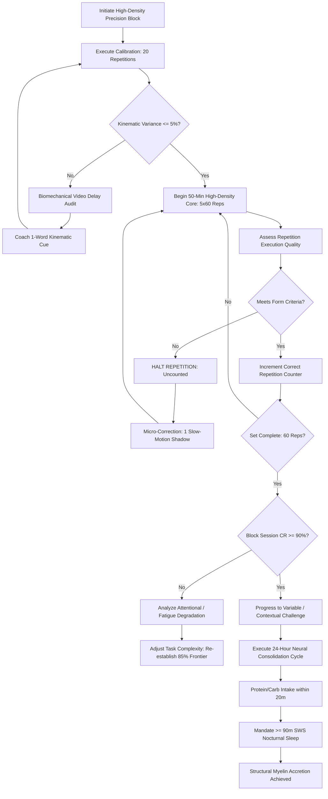

# ART-051: Neural Myelination through High-Density Precision Repetitions

> **PRO CUE:** Myelin is the electrical insulation of the nervous system. Repeating *correctly* wraps thicker myelin sheaths, producing 100x faster signal transmission while conserving neural energy. Do not practice merely for "habit"—practice for "insulation."

## 1. Executive Summary & Athletic Intent

**Myelination** is the neurobiological process in which glial cells (oligodendrocytes within the central nervous system, Schwann cells within the peripheral nervous system) wrap concentric lipid-protein sheaths around axonal pathways. This membrane specialization elevates action potential propagation velocity from **1–2 m/s in unmyelinated fibers** to **100–120 m/s in heavily myelinated pathways**. In high-performance tennis, the fundamental gap between club-level competence and elite execution is defined by the **caliber and density of myelin sheathing** enclosing task-specific motor circuits: the kinetic chain sequence of the serve, the uncoiling of the forehand unit turn, the predictive landing of the split-step, and the gaze stabilization of the quiet eye. 

This article establishes the foundational mathematical model of sports neurobiology: 

$$\Delta \text{Myelin Thickness} = \sum_{i=1}^n \left( \text{Rep}_i \times \text{Focus}_i \times \text{FeedbackQuality}_i \times \text{SleepConsolidation}_i \right)$$

It details the High-Density Precision Repetition protocol, maps out the four evolutionary phases of technical automation, and operationalizes the **24-Hour Neural Cycle** to ensure long-term synaptic stabilization.

The athletic intent encompasses three primary objectives:
1. **Demystify Myelination into a Manageable Training Metric:** Shift motor learning from vague qualitative notions of "muscle memory" into quantifiable neuro-structural adaptation.
2. **Establish Precise Density Thresholds:** Enforce minimum benchmarks of **3,000 mechanically valid repetitions per technique per year** for baseline maintenance, and **10,000+ pristine repetitions per year** to drive active myelin accretion.
3. **Institutionalize the 24-Hour Neural Cycle:** Align daytime kinematic loading with nighttime slow-wave sleep (SWS) consolidation to eliminate the myelination of pathological motor patterns.

---

## 2. Biomechanical & Neurological Foundation

### 2.1 Myelin Biophysics

| Biomechanical / Neuro Parameter | Unmyelinated Axon | Heavily Myelinated Axon (Elite) | Functional Enhancement |
| :--- | :--- | :--- | :--- |
| **Conduction Velocity** | 1–2 m/s | 100–120 m/s | **50–100x speed increase** |
| **Synaptic / Transmission Latency** | 2–5 ms | 0.1–0.5 ms | **10–20x latency reduction** |
| **Energy Consumption per Action Potential** | High (Continuous $Na^+/K^+$ pump activity along axolemma) | Low (Saltatory depolarization confined to Ranvier nodes) | **~70% metabolic energy conservation** |
| **Maximum Firing Frequency** | ~50 Hz | ~500 Hz | **10x frequency ceiling** |
| **Signal Jitter (Temporal Dispersion)** | High (Pronounced variance across repetitions) | Low (Microsecond-level temporal synchronization) | **10x higher motor reproducibility** |

**Biophysical Mechanism:** Myelin sheathing acts as an electrical insulator with high resistance and low capacitance. This structural architecture forms periodic gaps termed the **Nodes of Ranvier**, where voltage-gated sodium ($Na^+$) channels cluster at extreme densities. Instead of continuous wave propagation, action potentials travel via **saltatory conduction**, leaping rapidly from node to node. This mechanism yields a hundredfold increase in transmission speed while drastically sparing cellular adenosine triphosphate (ATP).

```
Unmyelinated Axon: Continuous Slow Conduction (~1 m/s)
[  Na+  ][  Na+  ][  Na+  ][  Na+  ][  Na+  ][  Na+  ][  Na+  ][  Na+  ]
───►───►───►───►───►───►───►───►───►───►───►───►───►───►───►───►───►───►

Myelinated Axon: Saltatory Leaping Conduction (~100 m/s)
==[Myelin]== Node 1 ==[Myelin]== Node 2 ==[Myelin]== Node 3 ==[Myelin]==
               ● ════════════════► ● ════════════════► ●
             (Leap)              (Leap)              (Leap)
```

### 2.2 The Myelination Formula

$$\Delta \text{Myelin Thickness} = \sum_{i=1}^n \left( \text{Rep}_i \times \text{Focus}_i \times \text{FeedbackQuality}_i \times \text{SleepConsolidation}_i \right)$$

Where:
- $\text{Rep}_i$: Mechanically sound repetitions executed strictly within target kinematic tolerances ($\pm 5\%$ deviation in joint angles, kinetic chain sequencing, and contact point coordinates). Flawed repetitions register as zero or introduce negative interference.
- $\text{Focus}_i$: Level of attentional absorption (*Aufmerksamkeit*; $1.0 = \text{deep external/internal target focus}$; $0.3 = \text{distracted execution}$).
- $\text{FeedbackQuality}_i$: Fidelity and latency of terminal feedback ($1.0 = \text{high-speed video} + \text{biomechanical expert cueing} + \text{kinematic tracking}$; $0.2 = \text{outcome observation only}$).
- $\text{SleepConsolidation}_i$: Architectural slow-wave sleep efficiency ($1.0 \ge 90\text{ minutes of Stage 3/4 SWS}$; $0.3 < 6\text{ hours of fragmented sleep}$).

**Empirical Annual Volume Thresholds:**
- **Skill Maintenance:** 3,000 correct repetitions / technical subsystem / year (prevents oligodendrocyte pruning and myelin retraction).
- **Active Structural Growth:** 10,000+ correct repetitions / technical subsystem / year (triggers oligodendrocyte precursor cell differentiation and de novo sheath wrapping).
- **Elite Cumulative Threshold:** 50,000–100,000 correct repetitions accumulated over a 10-year deliberate practice window (the developmental foundation of elite ball-strikers such as Jannik Sinner and Carlos Alcaraz).

### 2.3 Mu/Beta Desynchronization & Myelin Architecture (The Sinner 500 ms Signature)

Electroencephalographic (EEG) profiling of subcortical motor engrams reveals a dramatic divergence between intermediate players and elite performers:
- **Amateur / Club Level:** Cortical Mu ($\mu$, 8–13 Hz) and Beta ($\beta$, 13–30 Hz) event-related desynchronization (ERD) over the sensorimotor cortex initiates only **-150 to -200 ms** prior to ball impact. The intermediate player operates with reactive, noisy, cortical-dominant processing.
- **Elite Level (Jannik Sinner Profile):** ERD initiates at **-500 ms** prior to contact. This reflects an automated, noise-free subcortical motor engram that pre-activates the primary motor pathways half a second before impact.
- **The 300–350 ms Advance Margin:** This massive temporal advantage is enabled by hyper-myelinated **cortico-cerebellar-thalamic-cortical loops**. Signal transit through this complex feedback loop is completed in **$<10\text{ ms}$** in an elite athlete (compared to $>50\text{ ms}$ in an under-myelinated system), allowing subcortical motor systems to calculate ball trajectory, position the kinetic chain, and lock the contact geometry with zero conscious interference.

---

## 3. Step-by-Step Technical Execution

### Phase 1: The High-Density Precision Block (HDPB)

**Core Principle:** A dedicated 60–90 minute training block focused on a single stroke subsystem, maintaining high kinematic density, strict tolerance limits, and instant corrective feedback.

#### 90-Minute Block Architecture

| Micro-Phase | Duration | Activity & Focus | Repetition Density | Feedback Modality |
| :--- | :--- | :--- | :--- | :--- |
| **Neural Priming** | 10 min | Shadow swings + closed-eye visualization + low-intensity ball striking | 20 reps | Somatosensory & internal kinesthetic feel |
| **Calibration** | 10 min | Static feed to fixed target; micro-adjusting kinematic variables | 20 reps | Coach biomechanical cue + 10s video delay review |
| **High-Density Core** | 50 min | **5 sets × 60 repetitions** = 300 total technical strikes | 6 reps / minute | **Immediate:** 1-word coach cue / instant replay monitor |
| **Variable Challenge** | 15 min | Random target shifts (depth, spin, trajectory) under identical technique | 60 reps | Target outcome verification only |
| **Neural Wind-Down** | 5 min | 10 ultra-slow-motion reps + motor schema imagery | 10 reps | Internal consolidation review |

**Golden Rule of the Core Phase:**
- Every repetition **must** meet the target kinematic parameters ($\pm 5\%$ variance in joint angles, racket-head velocity, and contact height).
- Any mechanical collapse demands an **IMMEDIATE HALT**. The flawed rep is uncounted. Reset and recalibrate.
- The player records only **Correct Repetitions (CR)**. Target threshold: **$\text{CR} \ge 270/300$ ($90\%$ accuracy rate)**.

### Phase 2: Variable Practice & Contextual Interference

Motor learning science demonstrates that while blocked practice builds initial coordination, variable practice under contextual interference accelerates broad myelin consolidation and match-play transfer.

| Practice Structure | Myelin Architecture | Transfer to Match Play | Practical Tennis Example |
| :--- | :--- | :--- | :--- |
| **Blocked Practice** (e.g., 100 identical cross-court forehands) | Narrow, deep local pathway | Low to moderate | Superb execution during drills; breakdown under variable live match pressure |
| **Random Practice** (Target randomly designated across 9 court zones) | Broad, highly adaptable neural network | Very high | Stable execution across diverse tactical and spatial court positions |
| **Serial Practice** (Predictable alternating sequences: A-B-C-A-B-C) | Moderate depth, moderate breadth | Moderate | Effective transitional bridge from technical acquisition to open competition |

**Variable Myelination Protocol (1 session / week):**
- Divide the court into 9 distinct spatial zones. A ball machine or feeding coach introduces randomized spin, pace, and depth.
- The athlete must execute the exact technical mechanics into the commanded target zone.
- Target volume: 100 randomized repetitions with $\text{CR} \ge 85\%$.

### Phase 3: Deliberate Imperfection (The 85% Threshold Rule)

**Biophysical Principle:** Training at a permanent $100\%$ success rate limits neuroplastic demand. Operating at an **$85\%$ success threshold** introduces optimal error-prediction signals in the cerebellum, driving heightened oligodendrocyte response and broader myelin sheathing.

**85% Threshold Drill Progression:**
1. Establish the baseline condition where the athlete maintains $95\%$ consistency (e.g., heavy topspin forehands deep cross-court).
2. Systematically raise the difficulty (reduce target size by $30\%$, increase incoming ball speed by $15\text{ km/h}$, or demand an earlier contact point) until consistency stabilizes at exactly **$85\%$**.
3. Sustain high-density repetitions at this boundary for 20 minutes; the nervous system is forced to resolve sub-perceptual movement errors continuously.
4. Once consistency climbs past $90\%$, advance the difficulty parameters again to re-establish the $85\%$ learning frontier.

### Phase 4: The 24-Hour Neural Cycle

Myelin is synthesized biochemically and wrapped mechanically around active axons primarily during restorative **Slow-Wave Sleep (SWS)**. Training without structured sleep management negates neural adaptation.

| Time Window | Activity | Primary Neurobiological Purpose |
| :--- | :--- | :--- |
| **Morning (06:00–07:00)** | 10 min Motor Imagery + 5 min light somatic activation | Pre-activates targeted motor schemas (neural priming) |
| **On-Court Session (09:00–12:00)** | High-Density Precision Block (90 min) | Generates strong electrical signaling to trigger myelin synthesis |
| **Immediate Post-Training ($\le 20\text{ min}$)** | 30g Whey Protein isolate + 1.0g/kg carbohydrates | Provides essential amino acids and lipids for oligodendrocyte repair |
| **Midday (13:00–14:00)** | 20-min Power Nap or Non-Sleep Deep Rest (NSDR) | Mini-cycle of synaptic downscaling and early memory consolidation |
| **Late Afternoon (16:00–17:00)** | 10-min reactivation drill (slow-motion reps targeting morning flaws) | Re-engages specific neural pathways to strengthen structural engrams |
| **Evening (21:00–22:00)** | 10 min Alpha-wave meditation; screen curfew | Facilitates parasympathetic down-regulation prior to deep sleep |
| **Night (22:30–06:30)** | **8.5–9.0 hours of uninterrupted sleep ($\ge 90\text{ min}$ SWS)** | **Primary window for oligodendrocyte-driven myelin synthesis** |

---

## 4. Performance Metrics & Training Dosage

### Progression Tracking Metrics

| Biomechanical & Neural Metric | Developing | Proficient | Advanced | Elite Benchmark |
| :--- | :--- | :--- | :--- | :--- |
| **Correct Repetitions per 300-Rep Block** | $<200$ ($<67\%$) | 210–240 ($70–80\%$) | 240–270 ($80–90\%$) | **$\ge 270$ ($90\%+$)** |
| **Annual Correct Repetitions per Subsystem** | $<1,000$ | 1,000–3,000 | 3,000–10,000 | **$>10,000$** |
| **Kinematic Variance (CV%)** | $>10\%$ | 7–10% | 4–7% | **$<3\%$ (Tour-level consistency)** |
| **Mu/Beta ERD Onset Pre-Contact** | $>-100\text{ ms}$ | -100 to -200 ms | -200 to -400 ms | **$-500+\text{ ms}$ (Zero-Noise Engram)** |
| **Nocturnal Slow-Wave Sleep (SWS)** | $<60\text{ min}$ | 60–90 min | 90–120 min | **$>120\text{ min}$** |
| **24-Hour Neural Cycle Compliance** | $<50\%$ | 50–70% | 70–90% | **$100\%$** |

### Weekly Volume Allocation by Core Subsystem

| Subsystem / Stroke | Blocks / Week | CR Reps / Week | Estimated Annual CR Volume |
| :--- | :--- | :--- | :--- |
| **Serve** (First Flat/Slice + Second Kick) | 3 | 900 | 46,800 |
| **Forehand** (Cross-Court, Down-The-Line, Inside-Out) | 3 | 900 | 46,800 |
| **Backhand** (Two-Handed / One-Handed Drive & Slice) | 2 | 600 | 31,200 |
| **Return of Serve** (Aggressive Drive + Block Return) | 2 | 600 | 31,200 |
| **Net Play** (First Volley, Drop Volley, Overhead) | 1 | 300 | 15,600 |
| **TOTAL** | **11 Blocks** | **3,300 CR** | **~171,600 CR** |

---

## 5. Errors, Causes & Correction Protocols

| Observable Mechanical / Neural Error | Root Neurobiological Cause | Precision Correction Protocol |
| :--- | :--- | :--- |
| **High repetition volume with zero skill progression ("Junk Repetitions")** | Executing repetitions outside kinematic tolerance; wrapping myelin around pathological errors. | Enforce real-time video feedback; halt immediately upon kinematic deviation; tally only verified Correct Repetitions (CR). |
| **Premature cognitive fatigue and mechanical breakdown during blocks** | Disrupted 24-hour neural cycle, substrate depletion, or insufficient slow-wave sleep. | Mandate post-session protein-lipid intake; monitor nocturnal SWS via biometric sensors (Oura/Whoop); terminate session when CR drops below $80\%$. |
| **Superb drill execution collapsing into error-ridden match play** | Over-reliance on blocked practice, creating hyper-specialized but brittle neural pathways lacking contextual transfer. | Introduce mandatory weekly Variable Practice blocks with 9-zone randomized targets and open tactical constraints. |
| **Substantial technique regression following seasonal breaks or layoffs** | Natural myelin pruning and activity-dependent axonal demyelination from lack of electrical excitation. | Implement off-season maintenance dosages: minimum 50 precision shadow/ball reps per stroke subsystem weekly. |
| **Attention fragmentation during training (checking phones, chatting)** | Diminished attentional focus ($\text{Focus}_i < 0.3$), suppressing local dopamine and acetylcholine release required for neuroplasticity. | Implement an absolute device curfew on court; execute single-task 10-minute focus segments under the verbal cue: *"Insulate, do not just hit."* |

---

## 6. Diagnostic Diagram & Decision Flow



---

## 7. Video Demonstration & Technical Analysis

<div class="video-container" style="position:relative;padding-bottom:56.25%;height:0;overflow:hidden;border-radius:12px;">
  <iframe src="https://www.youtube-nocookie.com/embed/VIDEO_ID_PLACEHOLDER"
          style="position:absolute;top:0;left:0;width:100%;height:100%;border:0;"
          allow="accelerometer; autoplay; clipboard-write; encrypted-media; gyroscope; picture-in-picture"
          allowfullscreen
          title="Neural Myelination through High-Density Precision Repetitions — Biomechanical Analysis"></iframe>
</div>

*Recommended Technical Video Breakdown: Comparative high-resolution electron microscopy displaying axon caliber and myelin sheath lamellae in trained vs. untrained states; multi-channel EEG showing pre-contact Mu/Beta desynchronization onset (-500 ms elite vs. -150 ms intermediate); synchronized split-screen demonstration of high-density precision feeding with immediate audio-visual feedback.*

---

## 8. Cross-Domain Synergy & Multi-Pillar Integration

- **Subcortical Motor Automation (Pillar 2 - Neurological Mechanics):** Dense myelination along the cortico-cerebellar pathway is the mandatory biological prerequisite for the -500 ms pre-movement ERD observed in elite players. Without adequate sheath thickness, signal transmission is physically incapable of traversing the loop within the requisite temporal window.
- **The Self 1 to Self 2 Shift (Pillar 2 - Neuro-Athletics):** Structural myelination provides the neural substrate for transitioning motor control from the slow, conscious prefrontal cortex (Self 1) to the lightning-fast, automated basal ganglia and cerebellum (Self 2).
- **Sensory Gating & Corollary Discharge (Pillar 2 - Visual & Sensory Processing):** Heavily myelinated inhibitory interneurons ensure immediate transmission of efference copies (corollary discharge), suppressing internal visual blur and body motion noise during rapid rotational strikes.
- **Flow State Emergence (Pillar 2 & 4):** Automated motor engrams free up cognitive bandwidth, creating the low-noise neurological state required to enter the "Zone" or Flow State during high-leverage competition.
- **Recovery & Regeneration Architecture (Pillars 4 & 5):** Nocturnal Slow-Wave Sleep (SWS), post-exercise amino acid availability, and autonomic heart rate variability (HRV) balance form the biological triumvirate governing myelin lipid synthesis. Neglecting sleep invalidates daytime repetition volume.

---

## 9. Self-Assessment Rubric

| Assessment Dimension | Level 1: Chaotic Repetition | Level 2: Structured Drill | Level 3: Precision Density | Level 4: Myelin Mastery |
| :--- | :--- | :--- | :--- | :--- |
| **Correct Repetition Ratio (CR%)** | $<70\%$ across sessions | 70–80% verified accuracy | 80–90% verified accuracy | **$\ge 90\%$ sustained under high tempo** |
| **Annual Precision Volume** | $<1,000$ reps / subsystem | 1,000–3,000 reps | 3,000–10,000 reps | **$>10,000$ verified precision reps** |
| **Kinematic Consistency (CV%)** | Variance $>10\%$ | Variance 7–10% | Variance 4–7% | **Variance $<3\%$ (Tour-grade reproducibility)** |
| **24-Hour Cycle Discipline** | $<50\%$ compliance; poor sleep | 50–70% compliance | 70–90% compliance | **$100\%$ protocol compliance; tracked SWS** |
| **Contextual Variation Ratio** | $0\%$ (Pure blocked repetition) | $10\%$ variable situations | $30\%$ randomized tasks | **$50\%+$ contextual interference integration** |

**Diagnostic Scoring Key:**
- **5–8 Points:** Severe Myelin Leakage. High volume of unmonitored, mechanically flawed repetitions actively cementing technical dysfunction.
- **9–12 Points:** Developing Structure. Practice shows intent, but lack of sleep regulation and feedback density inhibits sheath thickening.
- **13–16 Points:** Functional Myelination. High-density precision blocks driving stable neuro-structural adaptations.
- **17–20 Points:** Elite Neural Mastery. World-class subcortical automation with sub-millisecond signal fidelity and resilient match transfer.

---

## 10. Printable Practice Card (Pocket Drill Card)

```
================================================================================
                    HIGH-DENSITY PRECISION REPETITION CARD
Session Objective: 1 Complete HDPB (90 min) | Target CR: >= 270/300 (90%) | Cycle Compliance: 100%
================================================================================

[PHASE A: MORNING PRIMING (15 MIN)]
  - 10 min: Guided motor schema visualization (tactical subsystem of the day).
  - 5 min: Light dynamic activation + band-resisted unit turns.
  * Focus Cue: "Awaken the pathway—trigger myelin synthesis."

[PHASE B: MAIN ON-COURT BLOCK (90 MIN)]
  - 10 min: Neural Warm-Up (20 reps: slow shadow swings + light hits).
  - 10 min: Calibration (20 reps: static feed, video delay validation).
  - 50 min: HIGH-DENSITY CORE (300 reps: 5 sets x 60 balls, 6 reps/min).
            * STRICT RULE: Flawed rep = HALT & RESET. Count only pristine hits.
  - 15 min: Variable Challenge (60 reps: random depth/spin/target; CR >= 85%).
  - 5 min: Neural Cool-Down (10 ultra-slow shadow strokes; somatosensory lock).
  * Focus Cue: "Only correct reps count. Stop immediately on error."

[PHASE C: AFTERNOON RECONSOLIDATION (10 MIN)]
  - Re-engage the single weakest technical link identified during morning core.
  - 10 ultra-slow-motion repetitions in front of mirror or video screen.
  * Focus Cue: "Reconsolidate the circuit—deepen the insulation."

[PHASE D: NOCTURNAL CONSOLIDATION (EVENING)]
  - 30g protein + 1.0g/kg carb immediately post-session.
  - Alpha-wave meditation / wind-down; screen curfew at 21:30.
  - Target: >= 90 minutes Slow-Wave Sleep (SWS) via wearable tracker.
  * Focus Cue: "SWS is the myelin factory. Protect it."

================================================================================
FREQUENCY: 5–6 days/week (11 blocks weekly) | GATE: CR >= 90% across 3 consecutive blocks
================================================================================
```

---

*Cross-References: ART-045, ART-048, ART-049, ART-050, ART-158, ART-184, ART-185, ART-186. Pillar II: Neurological Mechanics & Sports Neuroscience — TennisKB 200 Series.*
