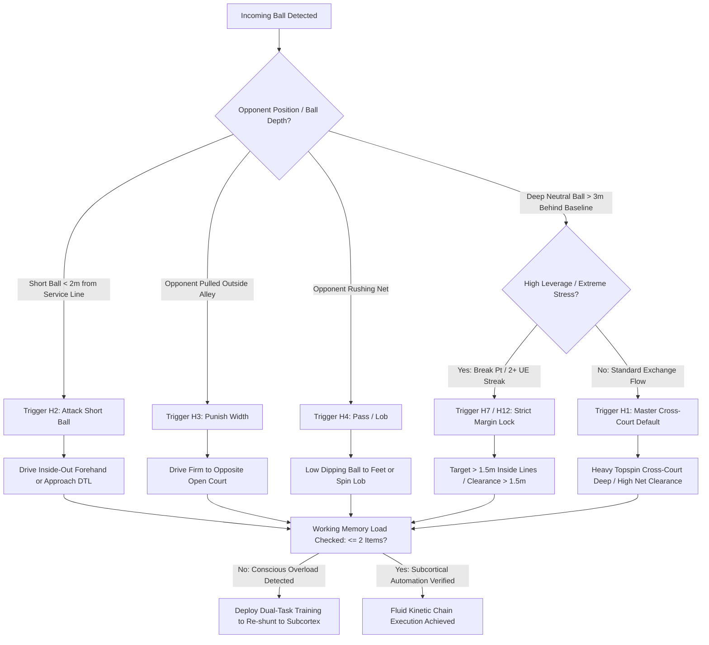

# ART-053: Cognitive Load Reduction through Automated Tactical Heuristics

> **PRO CUE:** The prefrontal cortex processes only 40–60 bits/second—far too slow for 120 mph tennis. Heuristics (automated rules of thumb) delegate tactical decisions to subcortical circuits: **100x faster, zero mental fatigue, zero choke anxiety**. Drill the "If-Then" architecture until automatic; let the subcortex run the point.

## 1. Executive Summary & Athletic Intent

**Cognitive Load** represents the volume of working memory resources within the prefrontal cortex (PFC) consumed by conscious tactical decision-making during match play: *"Should I drive cross-court or change line?", "Should I approach or stay back?", "How much spin is required?"* When cognitive demand exceeds conscious processing capacity (typically $4\text{–}7$ discrete information chunks), the motor system suffers **choking, rushed mechanics, and late contact point breakdown**.

**Automated Tactical Heuristics** are pre-compiled, conditional "If-Then" behavioral algorithms overlearned to the threshold of unconscious execution within the **basal ganglia and cerebellum**. Operating at axonal conduction velocities exceeding $100\text{ m/s}$, these subcortical circuits execute tactical selections in $<10\text{ ms}$ without drawing upon working memory bandwidth. This article establishes the neuro-computational architecture of tennis heuristics, details a core library of 12 tactical heuristics, outlines a four-phase overlearning progression from explicit decision trees to implicit automatisms, and introduces real-time cognitive load assessment metrics.

The athletic intent encompasses three primary operational objectives:
1. **Transform Tactical Decisions into Motor Reflexes:** Eliminate conscious deliberation during open rallies by pre-wiring deterministic behavioral loops.
2. **Constrain In-Point Working Memory Overhead:** Restrict conscious cognitive load during live rallies to $<2$ items per point (exclusively "Target Zone" and "Spin Rate").
3. **Institutionalize a 4-Stage Motor Progression:** Systematically advance an athlete from deliberate, explicit verbalization to autonomous subcortical execution under high competitive stress.

---

## 2. Biomechanical & Neurological Foundation

### 2.1 The Neuro-Architecture of Cognitive Load in Tennis

During high-tempo exchanges, visual inputs travel through two parallel visual streams: the **ventral stream** (conscious, object-identifying, linked to the prefrontal cortex) and the **dorsal stream** ("vision-for-action", fast, subconscious, linked directly to motor and premotor cortices).

```
[BALL INCOMING] ──► [SITUATION RECOGNITION] ──► [TACTICAL SELECTION] ──► [MOTOR EXECUTION]
                            │                            │                         │
                            ▼                            ▼                         ▼
                    [Dorsal Stream]             [PFC / Working Memory]       [Motor Cortex]
                  (Fast, Unconscious)            (Slow: 40-60 bits/s)           (Self 2)
                            │                            │                         │
                            └──────────────┬─────────────┘                         │
                                           ▼                                       │
                                [IF RELIANT ON PFC] ──► [COGNITIVE OVERLOAD]       │
                                           │                                       │
                                CHOKING / RUSHED / LATE STRIKE                     │
                                           │                                       │
                                           ▼                                       ▼
                            [SUBCORTICAL HEURISTIC] ──► [10ms DECISION] ──► [FLUID STRIKE]
```

When an athlete attempts to consciously evaluate ball trajectory, opponent position, court geometry, and tactical risk via the prefrontal cortex, the temporal bottleneck of working memory creates fatal transmission delays. By encoding these conditions as subcortical heuristics, the decision bypasses the PFC entirely, allowing the motor cortex to initiate the kinetic chain instantaneously.

### 2.2 Working Memory Capacity vs. Open Rally Demands

The human working memory system has an empirical processing ceiling of $4\text{–}7$ discrete information chunks, with conscious processing bandwidth restricted to approximately $40\text{–}60\text{ bits/s}$.

| Tactical Variable | Information Load (bits) | Prefrontal Cortex Load |
| :--- | :--- | :--- |
| **Opponent Court Position** | $\sim 3\text{ bits}$ | Consumes working memory slot |
| **Incoming Ball Trajectory & Spin** | $\sim 2\text{ bits}$ | Consumes working memory slot |
| **Scoreline / Leverage State** | $\sim 2\text{ bits}$ | Consumes working memory slot |
| **Environmental Wind / Surface Friction** | $\sim 2\text{ bits}$ | Consumes working memory slot |
| **Physical Fatigue / Heart Rate Elevation** | $\sim 2\text{ bits}$ | Consumes working memory slot |
| **TOTAL (Explicit Analytical Processing)** | **$\sim 11\text{ bits}$** | **SYSTEM OVERLOAD (Exceeds 4–7 bit capacity)** |
| **Heuristic Execution (Compiled "If-Then")** | **$0\text{ bits (Pre-compiled)}$** | **$0\text{ bits (Subcortical delegation)}$** |

**Neuro-Athletic Conclusion:** Explicit analytical decision-making during a live exchange guarantees cognitive overload, deceleration of the kinetic chain, and premature muscular co-contraction. Heuristic compilation is the sole biological mechanism capable of resolving open-court tactical demands within high-velocity temporal constraints.

### 2.3 The Core Library of 12 Tactical Heuristics

To establish subcortical dominance, an athlete must encode a deterministic hierarchy of conditional rules. The foundational library is structured below by operational priority:

| # | Heuristic Rule (If-Then Architecture) | Operational Codename | Tactical Domain | Priority Tier |
| :--- | :--- | :--- | :--- | :--- |
| **H1** | **IF** deep neutral rally ($>3\text{m}$ behind baseline) $\rightarrow$ **THEN** cross-court deep, high net margin ($>1\text{m}$). | **Cross-Court Default** | Baseline exchange ($70\%$ volume) | Priority 1 (Default) |
| **H2** | **IF** short ball lands inside baseline ($<2\text{m}$ from service line) $\rightarrow$ **THEN** attack inside-out forehand or approach down-the-line. | **Short Ball Attack** | Transition / Put-away | Priority 2 |
| **H3** | **IF** opponent pulled wide outside doubles alley $\rightarrow$ **THEN** drive firm to opposite open court corridor. | **Punish Width** | Exploiting opponent recovery | Priority 3 |
| **H4** | **IF** opponent approaches net $\rightarrow$ **THEN** low dipping ball to feet or offensive topspin lob over backhand. | **Pass / Lob Decider** | Anti-net neutralization | Priority 4 |
| **H5** | **IF** receiving wide serve in Ad court $\rightarrow$ **THEN** drive return cross-court deep into opponent's backhand. | **Return Wide Serve** | Neutralizing serve stretch | Priority 5 |
| **H6** | **IF** receiving T serve in Deuce court $\rightarrow$ **THEN** block or drive return down-the-line through center. | **Return T Serve** | Center return neutralization | Priority 6 |
| **H7** | **IF** high-leverage point ($30\text{-}40$, Break Point, Set Point) $\rightarrow$ **THEN** first serve in rate $\ge 65\%$, targeted to primary Serve+1 pattern. | **Pressure Serve Pattern** | High-leverage execution | Priority 7 |
| **H8** | **IF** heavy headwind against $\rightarrow$ **THEN** increase topspin RPM, raise net clearance, target $1.5\text{m}$ shorter of baseline. | **Wind Adaptation** | Environmental calibration | Priority 8 |
| **H9** | **IF** trailing in game ($0\text{-}30, 0\text{-}40$) $\rightarrow$ **THEN** extend rally threshold $\ge 5$ shots, raise safety margins, wait for short ball. | **Scoreboard Defense** | Scoreline stabilization | Priority 9 |
| **H10** | **IF** leading with cushion ($40\text{-}0, 40\text{-}15$) $\rightarrow$ **THEN** high-tempo first strike: aggressive wide serve + forehand to open court. | **Scoreboard Aggression** | Game closeout acceleration | Priority 10 |
| **H11** | **IF** opponent displays severe physical fatigue $\rightarrow$ **THEN** lengthen rallies, execute lateral displacement patterns, deploy drop shot. | **Fatigue Exploitation** | Physical asymmetry exploitation | Priority 11 |
| **H12** | **IF** personal unforced error streak ($\ge 2$ consecutive errors) $\rightarrow$ **THEN** execute 16-Second Reset protocol; baseline cross-court $\ge 3$ balls. | **Error Reset Protocol** | Amygdala down-regulation | Priority 12 |

**Hierarchical Execution Principle:** Priority 1 (**H1: Cross-Court Default**) serves as the master baseline attractor state. Unless conditions explicitly trigger one of the higher-priority contextual overrides (H2–H12), the motor system automatically executes H1 without conscious evaluation.

---

## 3. Step-by-Step Technical Execution

### Phase 1: Explicit Decision Tree Verbalization

**Objective:** Instill explicit declarative understanding of conditional boundaries. The athlete verbalizes the causal logic behind every tactical trigger.

- **Drill Protocol ("Voice Decision Tree"):**
  - Coach feeds variable balls under controlled tempo.
  - Prior to initiating the forward swing, the athlete must **vocalize the active heuristic**: *"H1 — Cross-court deep"* or *"H2 — Short ball attack inside-out."*
  - Coach provides immediate terminal feedback: *"Correct heuristic match"* or *"Invalid trigger; opponent was recovering, should have selected H3."*
  - **Volume:** 50 repetitions per session.
  - **Mastery Benchmark:** $50/50$ correct heuristic designations verbalized with trigger latency $<1.0\text{ s}$.

### Phase 2: Speeded Latency Compression

**Objective:** Compress decision latency from $1.0\text{ s}$ down to $<200\text{ ms}$, stripping away the verbalization layer.

- **Drill Protocol ("Rapid Fire Heuristic Feeding"):**
  - High-velocity ball machine or live coach feed alternating across 4 primary triggers: Deep Neutral, Short Ball, Wide Opponent, Opponent Net Approach.
  - Athlete acts with **zero verbalization**, focusing entirely on visual cue recognition (opponent hip orientation, ball bounce trajectory).
  - High-speed video delay monitor positioned behind the baseline to analyze decision onset latency relative to ball bounce.
  - **Volume:** 4 sets $\times$ 20 balls at match tempo.
  - **Mastery Benchmark:** $\ge 90\%$ verified correct heuristic execution under full match tempo, with decision latency confirmed $<200\text{ ms}$ via video timestamp.

### Phase 3: Dual-Task Subcortical Shunting

**Objective:** Force tactical heuristic execution out of the prefrontal cortex and into subcortical basal ganglia circuits by deliberately overloading conscious working memory with a secondary cognitive task.

- **Drill Protocol ("Cognitive Load Heuristic Striking"):**
  - Athlete engages in a live rally at standard match intensity.
  - Simultaneously, the athlete must perform a continuous working-memory task:
    - *Option A:* Serial subtraction (e.g., counting backward from 100 by 7s: 100, 93, 86, 79...).
    - *Option B:* Continuous auditory recall (reciting alternating alphabetical words or poem stanzas).
  - If the player hesitates, makes a tactical error, or breaks the counting cadence, the rally terminates immediately.
  - **Volume:** 3 sets $\times$ 20 completed rally balls.
  - **Mastery Benchmark:** 20 consecutive rally strokes with $100\%$ heuristic accuracy while maintaining unbroken mathematical calculation.

### Phase 4: Competitive Pressure & Amygdala Testing

**Objective:** Validate that automated heuristics remain locked when high sympathetic arousal and cortisol threaten prefrontal function.

- **Drill Protocol ("Heuristic Scoring Tiebreaker"):**
  - Full competitive 10-point tiebreaker played under modified scoring rules designed to incentivize process execution over outcome:
    - Heuristic executed correctly + Point Won: **$+3\text{ points}$**
    - Heuristic executed correctly + Point Lost: **$+1\text{ point}$**
    - Heuristic executed incorrectly (even if winning the point): **$-2\text{ points}$**
  - Forces the nervous system to value algorithmic tactical compliance over reckless improvisation.
  - **Mastery Benchmark:** Cumulative Heuristic Points exceed Actual Match Points by $\ge 30\%$, demonstrating complete tactical discipline under competitive stress.

---

## 4. Performance Metrics & Training Dosage

| Performance Metric | Developing | Functional Standard | Advanced | Elite Mastery |
| :--- | :--- | :--- | :--- | :--- |
| **Heuristic Accuracy (Open Rally)** | $<70\%$ | $70\text{–}85\%$ | $85\text{–}95\%$ | **$>98\%$ deterministic** |
| **Decision Latency (Video Analysis)** | $>500\text{ ms}$ | $300\text{–}500\text{ ms}$ | $150\text{–}300\text{ ms}$ | **$<100\text{ ms}$ (Subcortical reflex)** |
| **Working Memory Items / Point** | $>4\text{ items}$ | $3\text{–}4\text{ items}$ | $2\text{ items}$ | **$1\text{–}2\text{ items (Target + Spin)}$** |
| **Dual-Task Heuristic Accuracy** | $<50\%$ | $50\text{–}70\%$ | $70\text{–}90\%$ | **$>95\%$ unbroken** |
| **Pressure Heuristic Compliance** | $<50\%$ | $50\text{–}70\%$ | $70\text{–}90\%$ | **$>95\%$ compliance** |
| **Heuristic Library Breadth** | $3\text{–}4\text{ rules}$ | $6\text{–}8\text{ rules}$ | $10\text{–}12\text{ rules}$ | **Full 12 + Opponent Custom** |

### Recommended Training Dosage

- **Daily Priming (5 min):** Mental rehearsal of the 12-heuristic decision tree via visualization: linking visual trigger cue to tactical motor schema.
- **Technical Calibration (15 min):** 30 balls "Voice Decision Tree" followed immediately by 30 balls "Rapid Fire Latency Drill."
- **Neuro-Cognitive Integration (20 min):** Dual-task rally blocks ($3 \times 20$ balls) with rotated secondary cognitive loads.
- **Competitive Pressure Application (10 min):** Two simulated 10-point tiebreakers utilizing the Heuristic Scoring matrix.
- **Weekly Video Audit (10 min):** Frame-by-frame review of 20 competitive points: measure decision latency, evaluate trigger compliance, identify heuristic leaks.
- **Periodization Cadence:** 4 sessions per week. Add 1 custom opponent-specific heuristic per month based on tactical scouting data.

---

## 5. Errors, Causes & Correction Protocols

| Observable Technical / Tactical Fault | Root Neurological Cause | Biomechanical Correction Protocol |
| :--- | :--- | :--- |
| **Tactical Amnesia in Live Competition:** Player reverts to panicked, reactive ball striking during matches. | **Incomplete Overlearning:** The heuristic remains dependent on the prefrontal cortex; sympathetic arousal shuts down PFC access. | Mandate 3 consecutive weeks of Phase 3 Dual-Task drills. Do not permit competitive play until dual-task accuracy reaches $\ge 90\%$. |
| **Prolonged Decision Latency ($>500\text{ ms}$):** Player looks frozen or tentative before initiating the forward unit turn. | **Analytical Loop:** Ventral visual stream is actively analyzing multiple options instead of triggering dorsal motor circuits. | Implement Rapid Fire feed drills at $1.2\text{x}$ normal match tempo. Reduce available reaction time to force subcortical initiation. |
| **Hyper-Conservative Monotony:** Player executes H1 (cross-court) continuously, ignoring obvious short balls or open court corridors. | **Faulty Priority Triggering:** Subcortical threshold for H2/H3 is set too high; player over-relies on default safety attractor. | High-volume constraint drill: Penalize any cross-court strike when feed lands inside the service line with an immediate point deduction. |
| **Amygdala Hijack & Stroke Breakdown:** Consecutive unforced errors cause rapid collapse into wild, low-percentage shot attempts. | **Emotional Interference:** Amygdala hyperactivity overrides basal ganglia motor engrams, inducing muscle co-contraction. | Enforce H12 (Error Reset Protocol): Player must execute the full 16-Second Reset routine and hit 3 consecutive high-clearance cross-court balls. |
| **Heuristic Collision (e.g., H1 vs. H3 conflict):** Player gets caught between hitting cross-court and attacking the open court, framing the ball. | **Ambiguous Conditional Criteria:** Overlapping trigger parameters creating computational interference in premotor cortex. | Strictly enforce the Priority Table: H1 is default; H2 through H12 serve as explicit interrupts only when geometric conditions are fully met. |

---

## 6. Diagnostic Diagram & Decision Flow



---

## 7. Video Demonstration & Technical Analysis

<div class="video-container" style="position:relative;padding-bottom:56.25%;height:0;overflow:hidden;border-radius:12px;">
  <iframe src="https://www.youtube-nocookie.com/embed/VIDEO_ID_PLACEHOLDER"
          style="position:absolute;top:0;left:0;width:100%;height:100%;border:0;"
          allow="accelerometer; autoplay; clipboard-write; encrypted-media; gyroscope; picture-in-picture"
          allowfullscreen
          title="Cognitive Load Reduction through Automated Tactical Heuristics — Technical Analysis"></iframe>
</div>

*Recommended Technical Video Breakdown: Functional fMRI/EEG comparative visualizations demonstrating prefrontal cortex hypoactivation during automated heuristic execution versus high PFC hyperactivation in novice analytical play; high-speed 240 fps camera footage tracking decision onset relative to incoming ball bounce; synchronized split-screen demonstration of Phase 3 Dual-Task drill performance.*

---

## 8. Cross-Domain Synergy & Multi-Pillar Integration

- **The Inner Game & Gallwey’s Model (Pillar II - Sports Neuroscience):** Automated heuristics provide the neurobiological basis for Gallwey’s "Self 2." Self 1 represents the slow, verbal, intrusive prefrontal cortex, while Self 2 is the quiet, highly myelinated basal ganglia-cerebellar network running pre-compiled If-Then loops.
- **Predictive Spatial Awareness (Pillar II - Neural Mechanics):** Kinematic cues extracted from opponent preparatory movement (trunk rotation, grip orientation) serve as the primary **input conditions** for heuristic triggers.
- **Peripheral Vision & Dorsal Stream (Pillar II - Visual Processing):** The ambient dorsal visual system supplies real-time court geometry data directly into subcortical heuristic circuits without requiring focal foveal fixation.
- **Amygdala Down-Regulation (Pillar II & IV):** Acute competitive stress degrades conscious prefrontal computation. Automated heuristics insulate tactical decision-making against cortisol surges and sympathetic activation.
- **Data-Driven Scouting & Strategy (Pillar IV - Tactical Systems):** Advanced scouting reports translate directly into customized operational heuristics (e.g., *"IF opponent backhand slice on break point $\rightarrow$ THEN step around and attack inside-in forehand"*).
- **Structural Myelination (Pillar II - Neuro-Athletics):** Repetitive deliberate execution of heuristic circuits drives localized oligodendrocyte myelination, permanently locking rapid decision velocity into the nervous system.

---

## 9. Self-Assessment Rubric

| Assessment Dimension | Level 1: Explicit Analytical | Level 2: Emerging Heuristics | Level 3: Functional Automation | Level 4: Subcortical Mastery |
| :--- | :--- | :--- | :--- | :--- |
| **Heuristic Accuracy** | $<70\%$ compliance with rules | $70\text{–}85\%$ compliance | $85\text{–}95\%$ compliance | **$>98\%$ deterministic execution** |
| **Decision Latency** | $>500\text{ ms}$ (Noticeable freeze) | $300\text{–}500\text{ ms}$ latency | $150\text{–}300\text{ ms}$ latency | **$<100\text{ ms}$ (Immediate subcortical trigger)** |
| **Working Memory Overhead** | $>4\text{ conscious items/point}$ | $3\text{–}4\text{ items/point}$ | $2\text{ items/point}$ | **$1\text{–}2\text{ items (Target + Spin only)}$** |
| **Dual-Task Resistance** | Collapses under secondary load | $50\text{–}70\%$ accuracy | $70\text{–}90\%$ accuracy | **$>95\%$ performance under heavy load** |
| **Pressure Preservation** | Heuristics abandon under stress | $50\text{–}70\%$ rule retention | $70\text{–}90\%$ rule retention | **$>95\%$ compliance in tiebreakers** |

**Diagnostic Scoring Key:**
- **5–8 Points:** Severe Cognitive Overload. Tactical play is entirely analytical and prefrontal-dependent; prone to catastrophic choking under pressure.
- **9–12 Points:** Developing Heuristic System. Tactical rules understood declaratively, but execution remains vulnerable to cognitive fatigue and tempo spikes.
- **13–16 Points:** Functional Subcortical Delegation. Heuristics operate reliably in open rallies; minor leaks during extreme emotional arousal.
- **17–20 Points:** Elite Subcortical Automation. World-class tactical automatism with near-instantaneous decision latency and absolute competitive resilience.

---

## 10. Printable Practice Card (Pocket Drill Card)

```
================================================================================
                    AUTOMATED TACTICAL HEURISTICS DRILL CARD
Objective: Zero Conscious Tactical Load | Decision Latency: <150ms | Dual-Task CR: >=95%
================================================================================

[BLOCK A: NEURAL PRIMING (5 MIN)]
  - 5 min: Mental visualization of Core 12 Heuristics.
  - Vividly link specific visual cues (depth, opponent width) to motor response.
  * Focus Cue: "See the trigger—fire the loop."

[BLOCK B: VERBALIZATION TO SPEED (15 MIN)]
  - 10 min: Voice Decision Tree (30 reps). Loudly state heuristic BEFORE forward swing.
  - 5 min: Rapid Fire Feeding (30 reps). Zero speech. React to feed instantly.
  * Gate: Decision latency <200ms on video monitor.

[BLOCK C: DUAL-TASK OVERLOAD (15 MIN)]
  - 3 sets x 20 rally balls at match tempo.
  - Simultaneous task: Serial subtraction (Count back from 100 by 7s aloud).
  - Rule: Hesitation, counting pause, or wrong heuristic = HALT & RESET.
  * Focus Cue: "Subcortex plays the point; conscious mind counts numbers."

[BLOCK D: COMPETITIVE PRESSURE TESTING (10 MIN)]
  - Play 2 x 10-Point Tiebreakers using Heuristic Scoring:
    * Heuristic Correct + Point Won: +3 pts
    * Heuristic Correct + Point Lost: +1 pt
    * Heuristic Incorrect: -2 pts (Even if won)
  * Target: Heuristic points exceed raw game score by >= 30%.

[BLOCK E: VIDEO AUDIT (5 MIN)]
  - Review 10 live points: evaluate decision latency and trigger adherence.
================================================================================
FREQUENCY: 4x/week | PROGRESSION GATE: Dual-Task Accuracy >= 95% across 3 sessions
================================================================================
```

---

*Cross-References: ART-044, ART-045, ART-046, ART-051, ART-052, ART-140. Pillar II: Neurological Mechanics & Sports Neuroscience — TennisKB 200 Series.*
