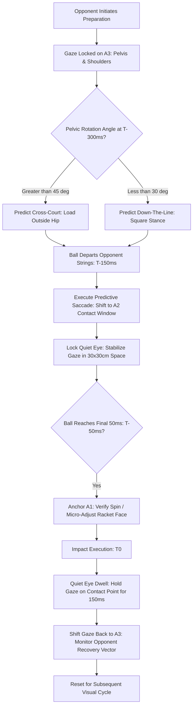

# ART-057: Visual Anchor Shifts from Ball Seams to Opponent Hip Cues

> **PRO CUE:** Do not look at where the ball *currently is*—look at where the opponent *is about to send it*. The ball seam reveals the *present*; the opponent's hip axis reveals the *future*. Shifting your visual anchor early buys precious split-second time.

## 1. Executive Summary & Athletic Intent

A **Visual Anchor** is the precise anatomical or spatial coordinates upon which the fovea centralis locks to extract decision-grade kinematic information. In high-performance tennis, gaze behavior is governed by three primary anchors:
1. **A1: Ball Seams / Logo:** High-acuity foveal fixation tracking rotation, surface texture, RPM, and terminal trajectory.
2. **A2: Contact Window / Predictive Contact Zone (PCZ):** The projected $30 \times 30\text{ cm}$ spatial interception point where Quiet Eye gaze stabilization occurs.
3. **A3: Opponent Hip-Shoulder Axis:** Parafoveal and foveal tracking of the opponent's pelvic rotation, stance loading, and shoulder tilt—the earliest kinematic indicators of shot intention.

Amateur players suffer from chronic "ball-watching," tethering their gaze exclusively to the incoming sphere (A1) across the entire trajectory. In contrast, elite ball-strikers execute a strictly choreographed **Visual Anchor Switching Timeline**, extracting macro-directional vectors from the opponent’s pelvic geometry **$150\text{–}300\text{ ms}$ earlier** than ball flight cues permit, before shifting gaze to the contact window.

The athletic intent of this article is threefold:
1. **Operationalize Anchor Switching as a Measurable Neurological Skill:** Replace vague maxims like *"keep your eye on the ball"* with a chronologically validated gaze progression.
2. **Quantify the Temporal Advantage of Pelvic Kinematics:** Demonstrate how early fixation on the opponent's hip-shoulder axis (A3) saves $150\text{–}300\text{ ms}$ in sensorimotor preparation.
3. **Deploy Dual-Anchor Conditioning Protocols:** Provide occlusion training and metronome-paced drills to automate rhythmic gaze transitions under high match tempo.

---

## 2. Biomechanical & Neurological Foundation

### 2.1 The Three Visual Anchors & Neuro-Information Extraction

Visual processing in tennis divides between the **ventral stream** (parvocellular pathway: high spatial acuity, slow conduction latency $\sim 80\text{–}100\text{ ms}$, color/detail processing) and the **dorsal stream** (magnocellular pathway: high temporal frequency, fast conduction latency $\sim 30\text{–}50\text{ ms}$, motion and spatial coordinates).

| Visual Anchor | Spatial / Anatomical Location | Information Extracted | Neural Stream & Processing Latency | Chronological Window |
| :--- | :--- | :--- | :--- | :--- |
| **A1: Ball Seams / Logo** | Central sphere surface (foveal lock) | Spin orientation (topspin/slice/flat), estimated RPM, exact post-bounce velocity vector. | Ventral stream (parvocellular); Latency: $\sim 80\text{–}100\text{ ms}$ | **$T-50\text{ ms}$ to $T+50\text{ ms}$** (Terminal impact phase) |
| **A2: Contact Window (PCZ)** | Projected $30 \times 30\text{ cm}$ interception box in front of body | Exact spatial interception coordinates, net clearance vector, racket face alignment. | Dorsal + Ventral integration; Latency: $\sim 50\text{–}80\text{ ms}$ | **$T-200\text{ ms}$ to $T+100\text{ ms}$** (Quiet Eye stabilization) |
| **A3: Opponent Hip-Shoulder Axis** | Opponent pelvis, hip rotators, and kinetic shoulder axis | **Shot trajectory (cross-court vs. DTL), stance type, kinetic loading, power ceiling, disguise.** | **Dorsal stream (magnocellular M-cells); Latency: $\sim 30\text{–}50\text{ ms}$** | **$T-500\text{ ms}$ to $T-150\text{ ms}$** (Earliest predictive phase) |

### 2.2 The Elite Anchor Switching Chronology

```
T-500ms  ──►  T-300ms  ──►  T-150ms  ──►  T-50ms  ──►  T 0 (Impact)  ──►  T+150ms
   │           │           │           │             │                 │
   ▼           ▼           ▼           ▼             ▼                 ▼
[A3: Hip-   [A3: Hip-   [A2: PCZ]   [A1: Seam]   [A2/A1 Hold]      [A3: Opponent]
 Shoulder]  Shoulder]   (Gaze Locks  (Confirm    (Quiet Eye        (Track
 Pelvic     Confirm     on Future    Spin/RPM    Contact           Recovery &
 Rotation   Direction   Contact)     Micro-adj)  Fixation)         Position)
```

**Chronological Rules of Engagement:**
- **$T-500\text{ ms}$ to $T-150\text{ ms}$ (Predictive Window):** Anchor **A3 (Hip-Shoulder Axis)**. Dorsal stream magnocellular neurons process opponent pelvic uncoiling and foot plant to initiate split-step loading and unit turn.
- **$T-150\text{ ms}$ to $T-50\text{ ms}$ (Spatial Locking Window):** Gaze executes a predictive saccade to **A2 (Contact Window / PCZ)**. Quiet Eye initiates, stabilizing retinal image before the forward swing begins.
- **$T-50\text{ ms}$ to $T+50\text{ ms}$ (Verification & Impact Window):** Gaze anchors briefly on **A1 (Seam/Logo)** to confirm bounce trajectory and spin deviations, holding stable gaze through contact ($T_0$).
- **$T+150\text{ ms}$ onward (Reset Window):** Gaze disengages from contact point and returns immediately to **A3** across the net to monitor opponent recovery geometry.

### 2.3 Temporal Advantage of the Pelvic Kinematic Cue (A3)

The human eye cannot track an incoming $120\text{ mph}$ serve or $80\text{ mph}$ baseline groundstroke via smooth pursuit once the ball enters the final $150\text{ ms}$ of flight. Therefore, anticipatory gaze must extract movement parameters before the opponent makes contact:

| Kinematic Cue (Opponent Hip-Shoulder Axis) | Extracted Tactical Data | Advance Margin vs. Seam Tracking |
| :--- | :--- | :--- |
| **Pelvic / Trunk Rotation Angle ($\theta_{\text{pelvis}}$)** | Cross-court ($\theta > 45^\circ$) vs. Down-The-Line ($\theta < 30^\circ$) | **$200\text{–}300\text{ ms}$ advance notice** |
| **Stance Width & Front-Foot Plant** | Open stance (Cross-court drive/defense) vs. Closed stance (DTL drive) | **$150\text{–}250\text{ ms}$ advance notice** |
| **Shoulder Axis Tilt & Elevation** | Topspin clearance vs. flat penetration vs. backspin slice | **$100\text{–}200\text{ ms}$ advance notice** |
| **Racket Takeback Depth (Peripheral)** | Offensive drive vs. drop shot vs. defensive lob | **$100\text{–}150\text{ ms}$ advance notice** |

**Conclusion:** Anchoring on the opponent's pelvic-shoulder mechanics buys an elite athlete between **$150\text{ ms}$ and $300\text{ ms}$ of latency buffer**, effectively doubling the available motor planning window compared to reactive ball tracking.

---

## 3. Step-by-Step Technical Execution

### Phase 1: Anchor Awareness & Kinematic Isolation

**Objective:** Differentiate between the three visual targets and eliminate unconscious, static ball-watching.

- **Drill 1: Slow-Motion Anchor Video Audit:**
  - Review 0.5x speed footage of elite baseline rallies.
  - Athlete identifies the exact timestamp of visual transitions: A3 (Opponent Hip) $\rightarrow$ A2 (Contact Window) $\rightarrow$ A1 (Impact Confirmation) $\rightarrow$ A3 (Recovery).
  - Benchmark: Map gaze coordinates across 20 consecutive rally shots with zero misidentifications.
- **Drill 2: Static Anchor Hold (Pelvic Cue Isolation):**
  - Coach stands on opposite baseline, performing varied shadow unit turns and forward hip rotations at variable speeds without releasing a ball.
  - Athlete stands at baseline, visually locked strictly onto the coach's **pelvis and shoulder plane (A3)**. Gaze at the racket or hands is strictly forbidden.
  - The athlete must immediately vocalize shot direction: *"Cross-court!"* (when hip uncoils past $45^\circ$) or *"Line!"* (when hip decelerates early $<30^\circ$).
  - **Mastery Benchmark:** $\ge 85\%$ directional prediction accuracy based purely on trunk kinematics.

### Phase 2: Rhythmic Anchor Switching

**Objective:** Build rhythmic gaze transitions timed to the metronomic cadence of ball flight.

- **Drill 3: Metronome Anchor Switching:**
  - Set metronome to $1.0\text{ Hz}$ ($1000\text{ ms}$ intervals).
    - **Beat 1:** Fixate A3 (Coach simulates pelvic turn) $\rightarrow$ Call direction.
    - **Beat 2:** Saccade to A2 (Projected contact marker on court) $\rightarrow$ Hold Quiet Eye for $300\text{ ms}$.
    - **Beat 3:** Fixate A1 (Slow ball feed) $\rightarrow$ Identify spin orientation.
    - **Beat 4:** Saccade back to A3 (Coach recovery position) $\rightarrow$ Call court quadrant.
  - Progress metronome frequency from $1.0\text{ Hz} \rightarrow 1.5\text{ Hz} \rightarrow 2.0\text{ Hz}$ ($500\text{ ms}$ intervals).
- **Drill 4: Live Ball Rhythmic Anchor Switching:**
  - Controlled cross-court rally at moderate tempo.
  - Athlete vocalizes gaze anchors in real time: *"Hips!"* (as opponent coils) $\rightarrow$ *"Window!"* (as ball crosses net) $\rightarrow$ *"Seam!"* (at bounce/strike) $\rightarrow$ *"Hips!"* (during follow-through).
  - **Mastery Benchmark:** Complete 3 sets $\times$ 30 balls maintaining perfect chronological vocalization without losing stroke mechanics.

### Phase 3: Predictive Occlusion & Deception Detection

**Objective:** Train subcortical circuits to extract intention under visual restriction and resolve tactical disguise.

- **Drill 5: Occlusion Video Training (Hip Cues Only):**
  - Project video clips of professional groundstrokes where the ball, forearm, and racket head are digitally occluded, leaving only the pelvis, trunk, and legs visible.
  - The clip cuts to black at $T-300\text{ ms}$, $T-200\text{ ms}$, and $T-100\text{ ms}$ prior to impact.
  - Athlete must indicate shot direction, depth, and spin type.
  - **Mastery Benchmark:** $\ge 80\%$ prediction accuracy at the $T-200\text{ ms}$ occlusion threshold.
- **Drill 6: Deception Detection (Resolving Kinematic Conflicts):**
  - Feeder deliberately introduces disguised variations: setting up with trunk rotation indicating a cross-court drive, then holding the racket face open for an inside-out or down-the-line placement.
  - The athlete uses A3 for primary positioning, but uses the transition to A2/A1 at $T-100\text{ ms}$ to cross-verify racket face angle.
  - Rule: *"Trunk indicates probability; Racket face confirms reality at $T-100\text{ ms}$."*

### Phase 4: Competitive Pressure Auditing

**Objective:** Prevent stress-induced tunnel vision from destroying the anchor switching sequence.

- **Drill 7: Tiebreak Anchor Audit:**
  - Play competitive 10-point tiebreakers equipped with mobile eye-tracking glasses (or evaluated via dual high-speed cameras synchronized from behind and court-side).
  - Scoring penalty: Any point where gaze fixates on A1 prior to $T-150\text{ ms}$ (premature ball-watching) incurs a $-1$ point deduction. Any point where A3 is completely skipped incurs a $-2$ point deduction.
  - **Mastery Benchmark:** $\ge 85\%$ compliance with the chronological visual sequence across full match tiebreakers.

---

## 4. Performance Metrics & Training Dosage

| Performance Metric | Developing | Functional Standard | Advanced | Elite Mastery |
| :--- | :--- | :--- | :--- | :--- |
| **A3 Visual Fixation Rate ($T-500$ to $T-150\text{ ms}$)** | $<30\%$ of rallies | $30\text{–}50\%$ | $50\text{–}75\%$ | **$>85\%$ of total points** |
| **Anchor Switching Timing Dispersion** | $>\pm 100\text{ ms}$ error | $\pm 50\text{–}100\text{ ms}$ | $\pm 20\text{–}50\text{ ms}$ | **$<\pm 20\text{ ms}$ temporal accuracy** |
| **A3 Predictive Accuracy (Occlusion at $-200\text{ ms}$)** | $<50\%$ | $50\text{–}65\%$ | $65\text{–}80\%$ | **$>85\%$ correct prediction** |
| **Premature A1 Fixation Rate ($>T-150\text{ ms}$)** | $>40\%$ of points | $20\text{–}40\%$ | $10\text{–}20\%$ | **$<5\%$ (Zero ball-watching)** |
| **Quiet Eye Duration at A2 (PCZ)** | $<100\text{ ms}$ | $100\text{–}200\text{ ms}$ | $200\text{–}300\text{ ms}$ | **$>300\text{ ms}$ gaze stability** |
| **Deception Recognition Latency** | $>350\text{ ms}$ | $250\text{–}350\text{ ms}$ | $150\text{–}250\text{ ms}$ | **$<150\text{ ms}$ rapid override** |

### Recommended Training Dosage

- **Daily Priming (5 min):** 20 trials of Static Anchor Hold A3 (calling direction from coach’s pelvic mechanics).
- **Technical Drills (15 min):** 5 minutes Metronome Anchor Switching at $1.5\text{ Hz}$, followed by 10 minutes Live Ball Rhythmic Anchor Switching.
- **Cognitive Integration (15 min):** 20 video occlusion trials followed by 10 live deception-detection feeds.
- **Pressure Simulation (10 min):** One 10-point tiebreaker with strict Anchor Audit scoring rules.
- **Weekly Volume:** 4 sessions per week. Periodic high-speed video or eye-tracking audit to measure fixation compliance.

---

## 5. Errors, Causes & Correction Protocols

| Observable Gaze Fault | Root Neurological Cause | Biomechanical & Gaze Correction Protocol |
| :--- | :--- | :--- |
| **Chronic Ball-Watching (A1 Premature Fixation):** Player stares at the ball from the moment it leaves the opponent's strings. | **Ingrained Amateur Heuristic:** Over-reliance on conscious ventral stream tracking; fear of losing spatial ball awareness. | Occlusion training: Black out the incoming ball flight in video sessions. Force the athlete to initiate movement purely from opponent hip uncoiling. |
| **Complete Absence of A3 Fixation:** Player reacts late to cross-court strikes, looking flat-footed during opponent uncoiling. | **Lack of Kinematic Literacy:** Nervous system has not mapped opponent pelvic rotation to shot geometry. | Static Anchor Hold drills for 2 weeks. Mandate the player verbalize opponent pelvic angle before moving their own feet. |
| **Delayed Anchor Transition ($A3 \rightarrow A2$ after $T-100\text{ ms}$):** Player watches opponent too long, failing to stabilize gaze at contact. | **Sluggish Saccadic Initiation:** Poor temporal coupling between oculomotor pathways and ball velocity. | Predictive saccade training (ART-055). Use audio-cued metronome switches to accelerate gaze transit velocity. |
| **Truncated Quiet Eye at A2 ($<100\text{ ms}$):** Head lifts early; eyes dart toward the opponent's court before contact is made. | **Attentional Leak / Outcome Anxiety:** Prefrontal cortex prematurely seeks result confirmation, breaking contact lock. | Quiet Eye isolation protocol (ART-041): Force gaze to hold on the empty contact space for a full $200\text{ ms}$ post-impact. |
| **Attentional Rigidity Under Match Stress:** Player locks onto one anchor permanently when the score reaches high leverage. | **Sympathetic Arousal / Tunnel Vision:** Cortisol surge constricts visual field, suppressing dorsal stream processing. | Deploy the 16-Second Reset protocol (ART-044). Take deep diaphragmatic breaths to restore wide visual sampling before point onset. |
| **Vulnerability to Disguise & Deception:** Player bites early on fake preparation and is caught off-balance. | **Premature Commitment to A3:** Athlete commits to directional movement without secondary verification at A1/A2. | Deception detection drill: Teach the dual-check heuristic—"A3 generates early split-step vector; racket head confirms at $T-100\text{ ms}$." |

---

## 6. Diagnostic Diagram & Decision Flow



---

## 7. Video Demonstration & Technical Analysis

<div class="video-container" style="position:relative;padding-bottom:56.25%;height:0;overflow:hidden;border-radius:12px;">
  <iframe src="https://www.youtube-nocookie.com/embed/VIDEO_ID_PLACEHOLDER"
          style="position:absolute;top:0;left:0;width:100%;height:100%;border:0;"
          allow="accelerometer; autoplay; clipboard-write; encrypted-media; gyroscope; picture-in-picture"
          allowfullscreen
          title="Visual Anchor Shifts from Ball Seams to Opponent Hip Cues — Technical Analysis"></iframe>
</div>

*Recommended Technical Video Breakdown: Eye-tracking heatmaps comparing elite Tour players vs. 4.0 intermediate players during baseline exchanges; high-definition kinematic breakdown demonstrating pelvic rotation angles ($\theta_{\text{pelvis}}$) and their correlation to shot direction; frame-by-frame demonstration of the $T-150\text{ ms}$ predictive saccade from opponent hip to contact window.*

---

## 8. Cross-Domain Synergy & Multi-Pillar Integration

- **Predictive Saccades (Pillar II - Oculomotor Control):** Transitioning between anchors requires rapid, ballistic eye movements (saccades exceeding $400^\circ/\text{s}$). Without high-velocity saccades, gaze transitions suffer fatal latency leaks.
- **Anticipatory Spatial Awareness (Pillar II - Neural Mechanics):** Anchor A3 provides the fundamental data feed for the 12 anticipatory tennis cues, establishing spatial vectors before ball trajectory data exists.
- **Quiet Eye Fixation (Pillar II - Motor Control):** Anchor A2 is the structural home of the Quiet Eye. Holding A2 for $>300\text{ ms}$ suppresses motor jitter and optimizes contact point geometry.
- **Sensory Gating & Corollary Discharge (Pillar II - Sports Neuroscience):** Ballistic transitions from A3 to A2 trigger corollary discharge signals that suppress internal visual blur, ensuring sharp retinal acuity upon arrival at the contact window.
- **Peripheral Vision & Ambient Processing (Pillar II - Visual Systems):** When foveal gaze is stabilized on A2, dorsal ambient vision tracks the incoming ball flight and opponent positioning in the peripheral field.
- **Automated Tactical Heuristics (Pillar II - Cognitive Systems):** Kinematic cues extracted from A3 serve as the direct conditional triggers for automated "If-Then" tactical heuristics (ART-053).
- **Fatigue & Saccadic Slowing (Pillar IV - Conditioning):** Elevated neuromuscular fatigue degrades oculomotor speed, delaying the transition from A3 to A2. Targeted vision conditioning protects gaze timing under high cardiovascular load.

---

## 9. Self-Assessment Rubric

| Assessment Dimension | Level 1: Ball-Watcher | Level 2: Contact Focused | Level 3: Predictive Transition | Level 4: Fluid Anchor Mastery |
| :--- | :--- | :--- | :--- | :--- |
| **A3 Utilization Rate** | $<30\%$ of total points | $30\text{–}50\%$ utilization | $50\text{–}75\%$ utilization | **$>85\%$ consistent A3 lock** |
| **Switch Timing Accuracy** | Errors $>\pm 100\text{ ms}$ | Errors $\pm 50\text{–}100\text{ ms}$ | Errors $\pm 20\text{–}50\text{ ms}$ | **$<\pm 20\text{ ms}$ precise synchrony** |
| **A3 Occlusion Accuracy** | $<50\%$ prediction rate | $50\text{–}65\%$ prediction rate | $65\text{–}80\%$ prediction rate | **$>85\%$ accuracy at $-200\text{ ms}$** |
| **Premature A1 Fixation** | $>40\%$ premature locks | $20\text{–}40\%$ premature locks | $10\text{–}20\%$ premature locks | **$<5\%$ (No ball-watching)** |
| **Quiet Eye at A2 Duration** | $<100\text{ ms}$ (Early head pull) | $100\text{–}200\text{ ms}$ dwell | $200\text{–}300\text{ ms}$ dwell | **$>300\text{ ms}$ rock-solid dwell** |

**Diagnostic Scoring Key:**
- **5–8 Points:** Complete Visual Dysfunction. Chronic ball-watching; player is constantly rushed and reactive, with late contact point timing.
- **9–12 Points:** Intermediate Fixation. Understands contact point stillness, but lacks the predictive A3 processing required for advanced rally tempo.
- **13–16 Points:** Functional Switching. Reliably extracts cues from opponent hips and stabilizes at contact; occasional lapses under extreme match stress.
- **17–20 Points:** Elite Visual Choreography. World-class predictive saccades and Quiet Eye stabilization, providing $200\text{–}300\text{ ms}$ of advance reaction time.

---

## 10. Printable Practice Card (Pocket Drill Card)

```
================================================================================
                    VISUAL ANCHOR SWITCHING PRACTICE CARD
Objective: Master A3->A2->A1 Gaze Timeline | A3 Utilization: >85% | QE Hold: >300ms
================================================================================

[BLOCK A: ISOLATION PRIMING (5 MIN)]
  - 20 trials: Static Anchor Hold A3.
  - Fixate strictly on coach's pelvis/trunk uncoiling.
  - Call "Cross" or "Line" immediately. No ball required.
  * Focus Cue: "Watch the hips uncoil, ignore the ball."

[BLOCK B: METRONOME SYNCHRONIZATION (10 MIN)]
  - 5 min: Metronome Anchor Switching at 1.5 Hz (660ms beats):
    Beat 1: Look A3 (Hips) -> Beat 2: Look A2 (Contact Window) ->
    Beat 3: Look A1 (Ball Seams) -> Beat 4: Look A3 (Opponent Recovery).
  * Focus Cue: "Hips -> Window -> Seam -> Hips."

[BLOCK C: LIVE RALLY CHOREOGRAPHY (15 MIN)]
  - 3 sets x 30 balls: Controlled baseline exchanges.
  - Athlete vocalizes anchor states in real time:
    "Hips!" (T-300ms) -> "Window!" (T-150ms) -> "Seam!" (T0) -> "Hips!" (T+150ms).
  * Rule: Late call or missing A3 = Rally termination.

[BLOCK D: PRESSURE TESTING & AUDIT (10 MIN)]
  - 1 x 10-Point Tiebreaker under Anchor Audit scoring:
    * Premature ball-watching (<T-150ms on A1): -1 point.
    * Skipping A3 completely: -2 points.
  * Target: Achieve >= 85% verified compliance on video audit.
================================================================================
FREQUENCY: 4x/week | PROGRESSION GATE: >= 80% accuracy on -200ms occlusion video
================================================================================
```

---

*Cross-References: ART-041, ART-044, ART-046, ART-049, ART-052, ART-053, ART-054, ART-055. Pillar II: Neurological Mechanics & Sports Neuroscience — TennisKB 200 Series.*
