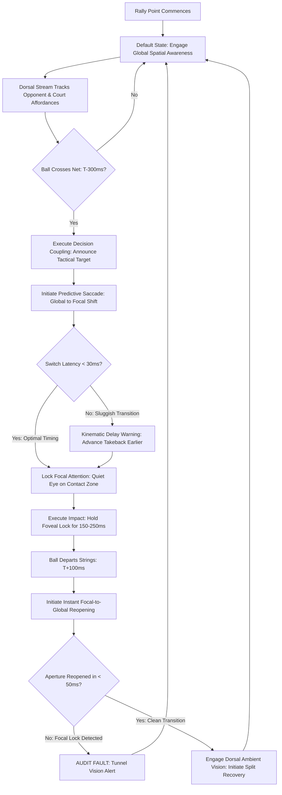

# ART-060: Focal Attention vs. Global Spatial Awareness in Rallying

> **PRO CUE:** Focal attention executes the strike; global spatial awareness governs tactical decisions. Elite athletes oscillate smoothly between them every 300 ms. Novices get trapped in focal lock, suffering catastrophic tunnel vision. Train your attentional aperture to zoom in and zoom out like an optical lens.

## 1. Executive Summary & Athletic Intent

During open baseline exchanges, the central nervous system must reconcile two fundamentally opposing visual-cognitive requirements:
1. **Focal Attention (Ventral Stream):** A high-resolution, narrow-aperture ($2^\circ$ foveal field) processing mode dedicated to **technical execution**—fine-tuning racket face angle, locking Quiet Eye fixation, and micro-adjusting contact point geometry. This mode operates under high prefrontal cognitive expense.
2. **Global Spatial Awareness (Dorsal Stream):** A wide-aperture ($180^\circ$ visual field), low-resolution, automated "vision-for-action" mode dedicated to **tactical governance**—tracking opponent recovery velocity, updating court geometry, computing open space affordances, and planning kinetic recovery routes.

Amateur players suffer from **Attentional Rigidity**, predominantly presenting as "Focal Lock"—staring fixatedly at the ball throughout the exchange. This prefrontal over-activation induces severe tunnel vision, suppresses peripheral awareness, and delays recovery footwork. Elite ball-strikers, by contrast, maintain **Global Dominance across $>80\%$ of rally time**, deploying rapid, discrete **Focal Bursts of $150\text{–}250\text{ ms}$** exclusively around the contact window before instantly reopening attentional bandwidth.

The athletic intent of this technical article is threefold:
1. **Establish Attentional Oscillation as a Quantifiable Cadence:** Define the neuro-temporal mechanics of the $300\text{–}500\text{ ms}$ attentional alternation cycle across open baseline exchanges.
2. **Validate Parallel Visual Processing:** Demonstrate how dorsal stream ambient tracking operates subconsciously even while foveal fixation is locked onto the contact window.
3. **Institutionalize "Zoom In / Zoom Out" Drill Architecture:** Provide metronomic and dual-task protocols that prevent stress-induced tunnel vision and optimize match transfer.

---

## 2. Biomechanical & Neurological Foundation

### 2.1 The Dual Attention Modes

The primate visual cortex divides information processing into distinct neuro-anatomical pathways with differing latency, capacity, and metabolic cost:

| Neurological Dimension | Focal Attention (Ventral Stream / Foveal) | Global Spatial Awareness (Dorsal Stream / Ambient) |
| :--- | :--- | :--- |
| **Primary Neural Pathways** | Primary visual cortex ($V1$) $\rightarrow$ $V4$ $\rightarrow$ Inferotemporal Cortex (IT); Frontal Eye Fields (FEF); Prefrontal Cortex (PFC). | **$V1$ $\rightarrow$ MT/V5 $\rightarrow$ Posterior Parietal Cortex (PPC)**; Superior Colliculus (SC); Subcortical motor networks. |
| **Visual Field Coverage** | Narrow foveal cone ($1^\circ\text{–}2^\circ$ center of gaze). | **Full panoramic field ($\sim 180^\circ$ horizontal peripheral field).** |
| **Spatial Resolution** | Ultra-high spatial acuity (fine textures, seams, strings). | Low spatial resolution (macro-motion, optical flow, geometric vectors). |
| **Temporal Processing Speed** | Slower conscious latency: $\sim 80\text{–}100\text{ ms}$. | **Ultra-rapid pre-attentive latency: $\sim 30\text{–}50\text{ ms}$.** |
| **Cognitive Bandwidth / Capacity** | Strictly limited ($4\text{–}7$ items in conscious working memory). | **Massive parallel computational capacity.** |
| **Metabolic Energy Cost** | High glucose expenditure; drives rapid mental fatigue. | Negligible; subcortical automation conserves neural resources. |
| **Primary Tennis Function** | **Kinematic Execution:** Quiet Eye, contact point alignment, spin modulation. | **Tactical Navigation:** Opponent position, open court affordance, recovery vector. |
| **Active Operational Window** | **$T-100\text{ ms}$ to $T+100\text{ ms}$** (Impact zone burst). | **$T-500\text{ ms}$ to $T-100\text{ ms}$ & $T+100\text{ ms}$ onward** (Rally baseline). |

### 2.2 Optimal Attentional Oscillation Across the Rally Cycle

```
OPEN RALLY CYCLE (Elite Attentional Chronology):

T-500ms  ──►  T-200ms  ──►  T-100ms  ──►  T 0 (Impact)  ──►  T+100ms  ──►  T+300ms  ──►  T+500ms
   │           │           │             │                 │           │           │
   ▼           ▼           ▼             ▼                 ▼           ▼           ▼
[GLOBAL]    [GLOBAL]    [FOCAL]       [FOCAL]           [FOCAL]     [GLOBAL]    [GLOBAL]
  100%        70%         100%          100%              100%        80%         100%
 Ambient     Ambient     Ventral       Ventral           Quiet Eye   Ambient     Ambient
 Court &     + Focal     Gaze Lock     Impact            Dwell       Recovery    Court &
 Opponent    Setup       on PCZ        Alignment         Hold        Vector      Tactics
```

**Biophysical Principles of Oscillation:**
1. **Global Baseline Dominance:** The nervous system remains in Global Awareness mode across $80\%$ of the exchange, monitoring spatial drift and reading opponent body language via the dorsal stream.
2. **The Discrete Focal Burst:** Focal attention is deployed not as a continuous state, but as a short-duration ballistic burst ($150\text{–}250\text{ ms}$) initiated approximately $100\text{ ms}$ before impact and held through ball departure.
3. **Rapid Transition Velocity:** Shifting the attentional aperture from Global to Focal must occur in $<30\text{ ms}$, while reopening the aperture from Focal back to Global must execute in $<50\text{ ms}$ to avoid recovery delays.

### 2.3 Pathological Attentional Rigidity Syndromes

When neuromuscular fatigue, anxiety, or faulty coaching cues disrupt this fluid oscillation, players succumb to three characteristic neurological pathologies:

| Rigidity Syndrome | Observable Physical Symptom | Kinematic & Tactical Breakdown | Root Neurological Etiology |
| :--- | :--- | :--- | :--- |
| **Focal Lock (Tunnel Vision)** | Staring fixatedly at the ball across the entire rally; head tracks ball over net. | Late split-steps, recovery to wrong court position, inability to punish open court space. | Prefrontal cortex hyper-activation inhibits dorsal stream PPC spatial integration. |
| **Global Drift (Visual Scatter)** | Darting eye movements; head elevates early prior to ball impact. | Off-center contact, frame shanks, inconsistent trajectory and spin generation. | Failure to engage frontal eye field gating; dorsal stream motion noise floods motor cortex. |
| **Switching Lag (Attentional Inertia)** | Sluggish transition: player hesitates before moving or freezes after striking. | Rushed backswing mechanics followed by delayed kinetic chain recovery. | Poor functional connectivity between Frontal Eye Fields and Posterior Parietal Cortex; low axonal myelination. |

---

## 3. Step-by-Step Technical Execution

### Phase 1: Attentional Mode Awareness & Decoupling

**Objective:** Isolate the conscious experience of Focal Attention from Global Spatial Awareness, training the athlete to voluntary toggle mental apertures.

- **Drill 1: Mode Labeling Under Controlled Tempo:**
  - Controlled baseline rally at $50\%$ match tempo.
  - The athlete must loudly vocalize their current attentional state in real time:
    - Call *"GLOBAL"* while tracking opponent movement, identifying target depth, and moving into position.
    - Call *"FOCAL"* at the ball bounce, locking gaze onto the contact window through impact.
    - Call *"GLOBAL"* immediately upon racket follow-through completion.
  - Coach monitors timing: flag any instance where *"FOCAL"* is called prematurely ($>300\text{ ms}$ before contact) or held post-impact.
  - **Mastery Benchmark:** 50 consecutive rally strokes with $100\%$ accurate mode vocalization.
- **Drill 2: Dual-Task Baseline Spatial Tracking:**
  - Cross-court groundstroke exchange.
  - While maintaining primary focal control over the incoming ball, the athlete must continuously track and call out the opponent's court positioning using peripheral dorsal vision: *"Deep Left"*, *"Center Neutral"*, *"Stepping In"*.
  - Rule: Eyes must never leave the ball trajectory; all opponent tracking must occur via ambient peripheral processing.
  - **Mastery Benchmark:** 20 consecutive rally balls completed without a single spatial miscall or technical mishit.

### Phase 2: Rapid "Zoom In / Zoom Out" Modulation

**Objective:** Compress attentional transition latencies down to competition-grade thresholds ($<30\text{ ms}$).

- **Drill 3: Metronome Attentional Oscillation:**
  - Set metronome to $2.0\text{ Hz}$ ($500\text{ ms}$ half-cycles).
    - **Beat 1 (500 ms - GLOBAL):** Soften gaze toward infinity; expand visual field to maximum peripheral boundaries; call out target court quadrant.
    - **Beat 2 (500 ms - FOCAL):** Snap gaze onto a fed ball; execute Quiet Eye lock at the contact zone; call out spin direction.
  - Gradually increase metronome cadence from $2.0\text{ Hz} \rightarrow 3.0\text{ Hz}$ ($333\text{ ms}$) $\rightarrow 4.0\text{ Hz}$ ($250\text{ ms}$).
- **Drill 4: Match-Tempo Rally Oscillation:**
  - High-intensity rally drill. Gaze transitions are tied directly to ball flight milestones:
    1. Opponent impact $\rightarrow$ Ball crossing net: **GLOBAL (Dorsal Tracking)**
    2. Ball crossing net $\rightarrow$ Court bounce: **TRANSITION (Predictive Saccade)**
    3. Court bounce $\rightarrow$ Racket contact ($+100\text{ ms}$): **FOCAL BURST (Quiet Eye)**
    4. Ball exit $\rightarrow$ Split-step recovery: **GLOBAL RE-EXPANSION (Court Reset)**
  - **Mastery Benchmark:** 3 sets $\times$ 30 balls maintaining smooth oscillation without focal fixation leaks.

### Phase 3: Attentional Switching Under Cognitive & Metabolic Load

**Objective:** Protect attentional switching integrity against sympathetic nervous system stress, elevated cortisol, and lactate accumulation.

- **Drill 5: Cognitive Load Oscillation Drill:**
  - Full-tempo groundstroke exchange while executing continuous serial subtraction (counting backward from 100 by 7s aloud).
  - The working memory load challenges prefrontal circuits, forcing the brain to automate the Global-to-Focal transition subcortically.
  - Failure criterion: Any disruption in counting rhythm or failure to execute the focal contact lock halts the drill.
  - **Mastery Benchmark:** 25 consecutive balls with unbroken counting and zero focal lock rigidity.
- **Drill 6: High-Lactate Oscillation Challenge:**
  - Athlete performs high-intensity anaerobic conditioning intervals (suicides, resisted lateral bounds) to drive blood lactate above $8.0\text{ mmol/L}$.
  - Immediately transition into a 20-ball live rally requiring full attentional oscillation.
  - High-speed video analysis assesses whether switch latency degrades under acidotic conditions.
  - **Mastery Benchmark:** Attentional switch latency degradation limited to $<20\text{ ms}$ compared to baseline fresh state.

### Phase 4: Tactical Decision-Global Coupling

**Objective:** Couple global spatial perception directly to automated tactical heuristics.

- **Drill 7: Affordance Read & Strike:**
  - Feeder delivers unpredictable variations: short balls, deep heavy topspin, angled balls, and net approaches.
  - During the **GLOBAL phase** ($T-300\text{ ms}$ before impact), the athlete reads court geometry and vocalizes the tactical decision (*"Attack DTL"*, *"Heavy Cross"*, *"Lob"*).
  - During the **FOCAL phase** ($T-100\text{ ms}$ to $T_0$), all conscious tactical deliberation ceases; the athlete focuses exclusively on contact point mechanics.
  - **Mastery Benchmark:** $\ge 95\%$ tactical selection accuracy with verified Quiet Eye dwell $>250\text{ ms}$.

---

## 4. Performance Metrics & Training Dosage

| Performance Metric | Developing | Functional Standard | Advanced | Elite Mastery |
| :--- | :--- | :--- | :--- | :--- |
| **Global Dominance Ratio (% Rally Time)** | $<50\%$ of time | $50\text{–}70\%$ of time | $70\text{–}85\%$ of time | **$>85\%$ open awareness** |
| **Focal Burst Duration (ms)** | $>500\text{ ms}$ (Stuck) | $300\text{–}500\text{ ms}$ | $200\text{–}300\text{ ms}$ | **$150\text{–}250\text{ ms}$ optimal** |
| **Switch Latency: Global $\rightarrow$ Focal** | $>100\text{ ms}$ | $50\text{–}100\text{ ms}$ | $30\text{–}50\text{ ms}$ | **$<30\text{ ms}$ rapid zoom** |
| **Switch Latency: Focal $\rightarrow$ Global** | $>200\text{ ms}$ | $100\text{–}200\text{ ms}$ | $50\text{–}100\text{ ms}$ | **$<50\text{ ms}$ instant reset** |
| **Dual-Task Global Accuracy** | $<60\%$ correct | $60\text{–}80\%$ correct | $80\text{–}95\%$ correct | **$>98\%$ unbroken tracking** |
| **Fatigue Resilience ($\Delta$ Switch Latency at $>8\text{ mmol/L}$)** | $>100\text{ ms}$ increase | $50\text{–}100\text{ ms}$ increase | $20\text{–}50\text{ ms}$ increase | **$<20\text{ ms}$ variance** |
| **Tactical Coupling Accuracy (Global Phase)** | $<60\%$ correct | $60\text{–}75\%$ correct | $75\text{–}90\%$ correct | **$>95\%$ optimal decisions** |

### Recommended Training Dosage

- **Daily Priming (5 min):** Mode Labeling drill during warm-up mini-tennis and light baseline rallying.
- **Technical Conditioning (15 min):** 5 minutes Metronome Oscillation ($2.0\text{–}4.0\text{ Hz}$) followed by 10 minutes Match-Tempo Rally Oscillation.
- **Neuro-Cognitive Overload (15 min):** Dual-task Cognitive Load Oscillation (10 min) paired with High-Lactate Oscillation Testing (5 min).
- **Tactical Simulation (10 min):** Competitive tiebreaker utilizing attentional auditing (penalizing tunnel vision).
- **Weekly Cadence:** 4 sessions per week. Periodic video audit analyzing head and eye stabilization timing relative to ball impact.

---

## 5. Errors, Causes & Correction Protocols

| Observable Technical / Tactical Fault | Root Neurological Cause | Biomechanical & Attentional Correction Protocol |
| :--- | :--- | :--- |
| **Chronic Tunnel Vision (Focal Lock):** Player watches ball constantly; unaware of opponent position or open court. | **PFC Over-Control:** Prefrontal cortex attempts to micromanage the rally, suppressing the dorsal visual stream. | Enforce Metronome Oscillation drills. Mandate the player keep chin elevated and verbally call out opponent position during flight. |
| **Erratic Contact & Mishits (Global Drift):** Player glances at the opponent's court prior to completing contact. | **Sensory Gating Failure:** Dorsal motion inputs are not gated out during the critical impact window; premature gaze shift. | Quiet Eye isolation protocol (ART-041): Place physical marker at contact zone; mandate holding foveal gaze $200\text{ ms}$ post-impact. |
| **Rushed Stroke Preparation:** Player initiates the backswing late and feels constantly hurried by incoming tempo. | **Sluggish Global-to-Focal Transition:** Low myelination along FEF-PPC pathways delaying predictive saccades to contact zone. | Progressive Metronome Drills: Step up speed from $2\text{ Hz}$ to $4\text{ Hz}$. Integrate predictive saccade exercises (ART-055). |
| **Stress-Induced Tunnel Vision:** Under high match leverage, the player freezes and reverts to pure focal locking. | **Amygdala Hijack:** Sympathetic arousal constricts visual field and triggers rigid prefrontal fixation. | Deploy the 16-Second Reset routine (ART-044). Utilize wide-angle panoramic gaze during the between-point recovery period. |
| **Late Recovery Footwork:** Player remains rooted to the contact spot for $300\text{–}500\text{ ms}$ after hitting. | **Delayed Focal-to-Global Reopening:** Player "admires" their shot with focal gaze, failing to disengage fovea post-impact. | Implement immediate vocal reset: Player must yell *"RESET"* and execute a dynamic recovery crossover the instant follow-through ends. |
| **Poor Shot Selection Despite Good Technique:** Player hits mechanically sound strokes directly to the waiting opponent. | **Decoupled Affordance Perception:** Global spatial data is not feeding into subcortical heuristic circuits (ART-053). | Integrate Phase 4 Tactical Coupling drills: Force verbal decision announcement during incoming ball flight at $T-300\text{ ms}$. |

---

## 6. Diagnostic Diagram & Decision Flow



---

## 7. Video Demonstration & Technical Analysis

<div class="video-container" style="position:relative;padding-bottom:56.25%;height:0;overflow:hidden;border-radius:12px;">
  <iframe src="https://www.youtube-nocookie.com/embed/VIDEO_ID_PLACEHOLDER"
          style="position:absolute;top:0;left:0;width:100%;height:100%;border:0;"
          allow="accelerometer; autoplay; clipboard-write; encrypted-media; gyroscope; picture-in-picture"
          allowfullscreen
          title="Focal Attention vs Global Spatial Awareness in Rallying — Technical Analysis"></iframe>
</div>

*Recommended Technical Video Breakdown: Synchronized dual-display illustrating fMRI functional connectivity between the ventral stream ($V4/\text{IT}$) and dorsal stream ($\text{MT}/\text{PPC}$) during live rally exchanges; mobile eye-tracking footage demonstrating the $150\text{–}250\text{ ms}$ focal burst window versus peripheral ambient tracking; comparative demonstration of novice "Focal Lock" versus elite rhythmic "Zoom In / Zoom Out" modulation.*

---

## 8. Cross-Domain Synergy & Multi-Pillar Integration

- **Quiet Eye Fixation (Pillar II - Oculomotor Control):** Focal attention reaches its apex during Quiet Eye dwell at the contact window (ART-041). Global awareness provides the spatial setup that makes Quiet Eye lock possible.
- **Predictive Saccades (Pillar II - Visual Neuroscience):** Shifting between Global and Focal states is driven by high-velocity predictive saccades that reposition the fovea with zero overshoot (ART-055).
- **Visual Anchor Shifts (Pillar II - Gaze Mechanics):** The three visual anchors (A3 Hip $\rightarrow$ A2 Window $\rightarrow$ A1 Seam) map directly onto attentional states: A3 operates under Global/Dorsal processing, while A2/A1 operate under Focal/Ventral lock (ART-057).
- **Automated Tactical Heuristics (Pillar II - Cognitive Architecture):** Global spatial awareness supplies the real-time environmental conditions required to trigger automated If-Then heuristic loops without prefrontal lag (ART-053).
- **Neuromuscular & Visual Fatigue (Pillars II & IV):** Acidosis and central fatigue degrade the attentional switching mechanism, promoting tunnel vision. Systemic conditioning protects cognitive flexibility under high cardiac stress (ART-054, ART-058).
- **Cerebellar Motor Simulation (Pillar II - Motor Control):** Mental imagery and motor schemas allow athletes to rehearse attentional zooming offline, accelerating synaptic plasticity along Frontal Eye Field circuits (ART-059).

---

## 9. Self-Assessment Rubric

| Assessment Dimension | Level 1: Focal Locked | Level 2: Unstable Drift | Level 3: Functional Oscillation | Level 4: Attentional Mastery |
| :--- | :--- | :--- | :--- | :--- |
| **Global Dominance Ratio** | $<50\%$ of rally duration | $50\text{–}70\%$ of rally duration | $70\text{–}85\%$ of rally duration | **$>85\%$ effortless awareness** |
| **Focal Burst Duration** | $>500\text{ ms}$ (Excessive gaze) | $300\text{–}500\text{ ms}$ duration | $200\text{–}300\text{ ms}$ duration | **$150\text{–}250\text{ ms}$ crisp burst** |
| **Global $\rightarrow$ Focal Latency** | $>100\text{ ms}$ (Late setup) | $50\text{–}100\text{ ms}$ latency | $30\text{–}50\text{ ms}$ latency | **$<30\text{ ms}$ instant snap** |
| **Focal $\rightarrow$ Global Latency** | $>200\text{ ms}$ (Admires shot) | $100\text{–}200\text{ ms}$ latency | $50\text{–}100\text{ ms}$ latency | **$<50\text{ ms}$ instant reset** |
| **Dual-Task Resilience** | Fails under secondary task | $60\text{–}80\%$ spatial accuracy | $80\text{–}95\%$ spatial accuracy | **$>98\%$ unbroken tracking** |

**Diagnostic Scoring Key:**
- **5–8 Points:** Severe Attentional Rigidity. Player is trapped in chronic tunnel vision; tactical decisions are delayed and unforced error rates are high.
- **9–12 Points:** Developing Modulation. Awareness of dual modes exists, but transitions are sluggish and prone to breakdown under match tempo.
- **13–16 Points:** Functional Oscillation. High-level baseline rally execution with stable gaze transitions; minor lapses occur during extreme metabolic fatigue.
- **17–20 Points:** World-Class Attentional Mastery. Effortless subcortical zooming between wide-angle spatial awareness and laser-focused contact stabilization.

---

## 10. Printable Practice Card (Pocket Drill Card)

```
================================================================================
                 ATTENTIONAL OSCILLATION (ZOOM IN / OUT) CARD
Objective: Global Dominance >85% | Focal Burst: 150-250ms | Switch Latency: <30ms
================================================================================

[BLOCK A: VOCAL MODE PRIMING (5 MIN)]
  - Controlled baseline rally at 50% tempo.
  - Loudly call attentional mode in real time:
    "GLOBAL" (Incoming ball flight) -> "FOCAL" (Bounce to impact) -> "GLOBAL" (Recovery).
  * Focus Cue: "Zoom in on contact—Zoom out on follow-through."

[BLOCK B: METRONOME ZOOM MODULATION (10 MIN)]
  - Metronome drill progression: 2.0 Hz -> 3.0 Hz -> 4.0 Hz.
    * Beat 1 (GLOBAL): Expand peripheral awareness, identify opponent court space.
    * Beat 2 (FOCAL): Foveal snap onto contact zone, execute Quiet Eye dwell.
  * Focus Cue: "Broad view to see the court; narrow view to strike the ball."

[BLOCK C: DUAL-TASK MATCH RALLY (15 MIN)]
  - 3 sets x 30 balls at match intensity.
  - Athlete simultaneously executes serial subtraction (100 minus 7 aloud).
  - Rule: Hesitation in counting or failure to lock contact = immediate drill reset.
  * Focus Cue: "Let the body zoom automatically; keep the mind occupied."

[BLOCK D: TIEBREAK AUDIT & REVIEW (10 MIN)]
  - 1 x 10-Point Tiebreaker under Attentional Penalty Rules:
    * Tunnel vision (staring at ball past follow-through): -1 point.
    * Head pull before contact completed: -1 point.
  * Target: Achieve >= 85% verified oscillation compliance on video review.
================================================================================
FREQUENCY: 4x/week | PROGRESSION GATE: Dual-task spatial accuracy >= 95% in 3 tests
================================================================================
```

---

*Cross-References: ART-041, ART-044, ART-046, ART-052, ART-053, ART-054, ART-055, ART-057, ART-058, ART-059. Pillar II: Neurological Mechanics & Sports Neuroscience — TennisKB 200 Series.*
