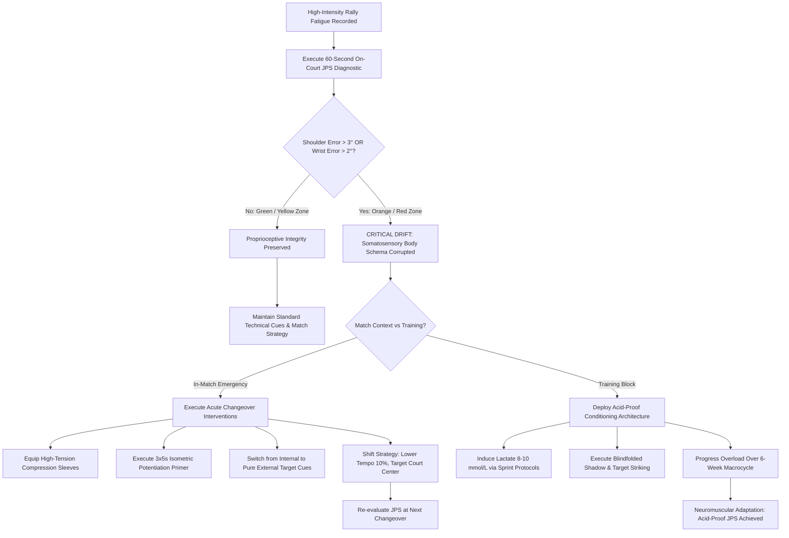

# ART-064: Proprioceptive Joint Position Sense under High Lactate

> **PRO CUE:** Lactate does not merely fatigue muscle tissue—it degrades the somatosensory body schema in the brain. The shoulder "feels" as if it is at 90° of abduction when it has actually drifted to 110°, causing a 5 cm contact point displacement. Condition your joint position sense under severe acidosis; that is how technique survives the final set.

## 1. Executive Summary & Athletic Intent

**Proprioceptive Joint Position Sense (JPS)** is the neurological capacity of the central nervous system to perceive, map, and calibrate exact three-dimensional joint angles and limb kinematics without visual confirmation. This internal body schema is mediated by primary muscle spindle Ia afferents, Golgi tendon organ (GTO) Ib fibers, and articular mechanoreceptors projecting via the dorsal column-medial lemniscus pathway and spinocerebellar tracts to the primary somatosensory cortex ($S1$) and cerebellum.

Under high metabolic stress and heavy anaerobic glycolysis—where systemic blood lactate accumulates to **$>8\text{–}10\text{ mmol/L}$**—the associated intracellular and interstitial proton accumulation ($H^+$) induces severe biochemical disruptions. Acidosis blunts muscle spindle firing rates, alters mechanoreceptor transduction thresholds, and activates nociceptive Group III/IV metabosensitive afferents. This produces **Proprioceptive Drift**: the brain perceives the hitting shoulder or wrist to be oriented along the target kinematic plane, while physical joint coordinates have degraded by several degrees. In high-velocity tennis, an unperceived angular error of just $3^\circ$ at the shoulder or $2^\circ$ at the wrist translates into a **$5\text{–}8\text{ cm}$ displacement of the contact point**, completely destabilizing racket face angle at impact.

The athletic intent of this article is threefold:
1. **Transform Proprioceptive Drift into an Objective Metric:** Quantify angular deviation thresholds under acidosis rather than treating fatigue as an ambiguous qualitative sensation.
2. **Define Critical Mechanical Red Flags:** Establish strict functional boundaries—**JPS error $>3^\circ$ (shoulder) or $>2^\circ$ (wrist)**—beyond which kinetic chain sequencing breaks down and structural injury risk spikes.
3. **Deploy "Acid-Proof Proprioception" Protocols:** Implement specialized high-lactate joint matching drills and in-match sensory micro-corrections (compression wear, isometric primers) to inoculate athletes against somatosensory drift.

---

## 2. Biomechanical & Neurological Foundation

### 2.1 The Neuro-Chemical Mechanisms of Proprioceptive Breakdown

The degradation of joint position sense during sustained, high-tempo tennis rallies is driven by five distinct neuro-physiological mechanisms:

| Neuro-Chemical Mechanism | Biophysical Process | Functional Impact on JPS & Stroke Control |
| :--- | :--- | :--- |
| **1. $H^+$ Interference with Muscle Spindles** | Intracellular acidosis and proton ($H^+$) accumulation decrease the firing sensitivity of primary Ia afferents during muscle elongation. | **Proprioceptive position error increases.** Spindle afferents fail to fire at proper frequencies, causing the brain to misjudge joint extension. |
| **2. Golgi Tendon Organ (GTO) Inhibition** | Local acidosis reduces Ib afferent sensitivity, impairing real-time feedback regarding tendon tension and kinetic load. | **Force reproduction error increases.** The athlete cannot accurately modulate muscular force during the forward acceleration phase. |
| **3. Group III/IV Afferent Sensory Noise** | Accumulation of metabolic byproducts ($H^+$, lactate anions, interstitial $K^+$, extracellular ATP) activates metabosensitive Group III/IV thin unmyelinated fibers. | **Signal-to-Noise Ratio drops.** Heavy nociceptive feedback floods the thalamus and $S1$, masking delicate proprioceptive feedback. |
| **4. Central Somatosensory Resource Diversion** | The prefrontal cortex and primary somatosensory cortex allocate significant computational bandwidth to interoceptive fatigue perception. | **Somatosensory processing latency increases.** Real-time micro-adjustments during the swing become sluggish and imprecise. |
| **5. Neuromuscular Junction (NMJ) Transmission Fatigue** | Acetylcholine (ACh) depletion and elevated acetylcholinesterase activity lower end-plate potential (EPP) amplitude across motor units. | **Kinematic variability spikes.** Identical central motor commands produce inconsistent peripheral joint displacement. |

### 2.2 Dose-Response Relationship: Blood Lactate vs. JPS Angular Error

Empirical testing reveals a direct correlation between circulating blood lactate levels and the magnitude of Mean Absolute Error (MAE) during joint position reproduction:

| Blood Lactate Level (mmol/L) | Dominant Shoulder JPS Error | Hitting Wrist JPS Error | Elbow Flexion JPS Error | Systemic Risk Zone & Mechanical Integrity |
| :--- | :--- | :--- | :--- | :--- |
| **$< 4.0\text{ mmol/L}$ (Aerobic / Rest)** | $1.2^\circ \pm 0.5^\circ$ | $0.8^\circ \pm 0.3^\circ$ | $1.0^\circ \pm 0.4^\circ$ | **Green Zone:** Pristine neuromuscular calibration; high precision. |
| **$4.0\text{–}6.0\text{ mmol/L}$ (Moderate Rally)** | $1.8^\circ \pm 0.7^\circ$ | $1.2^\circ \pm 0.5^\circ$ | $1.5^\circ \pm 0.6^\circ$ | **Yellow Zone:** Mild sensory attenuation; compensable via visual focus. |
| **$6.0\text{–}8.0\text{ mmol/L}$ (High Anaerobic)** | $2.5^\circ \pm 1.0^\circ$ | $1.8^\circ \pm 0.7^\circ$ | $2.2^\circ \pm 0.8^\circ$ | **Orange Zone:** Noticeable timing degradation; contact point spreads. |
| **$8.0\text{–}10.0\text{ mmol/L}$ (Very High / Red)** | **$3.5^\circ \pm 1.5^\circ$** | **$2.5^\circ \pm 1.0^\circ$** | **$3.0^\circ \pm 1.2^\circ$** | **RED ZONE: Biomechanical breakdown; unforced error cascade.** |
| **$> 10.0\text{ mmol/L}$ (Severe Acidosis)** | $> 5.0^\circ$ | $> 3.5^\circ$ | $> 4.0^\circ$ | **CRITICAL ZONE: Severe injury hazard; halt high-load movements.** |

*Note on Asymmetry:* Joint position sense errors are highly asymmetric. The dominant hitting shoulder and wrist experience $40\text{–}60\%$ greater sensory degradation than the non-dominant limb due to asymmetric kinetic loading and localized metabolite accumulation.

### 2.3 Biomechanical Cascades in Tennis Mechanics

When proprioceptive fidelity degrades beyond critical thresholds, kinetic chain sequencing suffers catastrophic failures:

```
[LACTATE ACCUMULATION > 8 mmol/L] ──► [GROUP III/IV METABOSENSORY NOISE]
                                                      │
                                                      ▼
[SHOULDER JPS DRIFT > 3°] ────────────────► [WRIST JPS DRIFT > 2°]
            │                                             │
            ▼                                             ▼
[Contact Point Displaced 5-8cm]               [Racket Face Angle Flips 3-5°]
            │                                             │
            └──────────────────────┬──────────────────────┘
                                   ▼
          [COMPENSATORY KINETIC CHAIN COLLAPSE: "ARM-ONLY" STRIKE]
                                   │
                                   ▼
        [MEDIAL ELBOW OVERLOAD & ROTATOR CUFF IMPINGEMENT PATHOLOGY]
```

- **Shoulder Error $>3^\circ$:** The player feels they have reached $90^\circ$ of abduction and optimal external rotation, but the arm lags behind the torso. Contact point drifts backward by $5\text{–}8\text{ cm}$, sending forehands long or into the bottom of the net tape.
- **Wrist Error $>2^\circ$:** Alterations in wrist extension/pronation control destabilize dynamic racket face loft by $3^\circ\text{–}5^\circ$, causing erratic topspin RPM and wild depth variance.
- **Kinetic Chain Sequencing Decoupling:** When the brain loses accurate somatosensory mapping of the shoulder, it decouples the legs and hips from the arm. The athlete instinctively switches to an isolated, "arm-dominant" stroke, exposing the rotator cuff and medial ulnar collateral ligament to massive shear forces.

---

## 3. Step-by-Step Technical Execution

### Protocol 1: The 60-Second On-Court JPS Diagnostic Battery

This rapid, non-invasive assessment evaluates joint position sense without laboratory blood sampling:

| Diagnostic Test | Execution Protocol | Pristine Baseline (Fresh) | Red Flag (High Lactate Acidosis) |
| :--- | :--- | :--- | :--- |
| **1. Shoulder JPS Matching** | Player closes eyes. Coach passively positions dominant arm at $90^\circ$ abduction and $90^\circ$ external rotation for 3s, then returns to side. Player actively reproduces the position. Angle measured via mobile sensor. | Mean error $<2.0^\circ$ | **Mean error $>3.0^\circ$** |
| **2. Wrist Extension JPS** | Eyes closed. Coach passively positions wrist at $30^\circ$ extension. Player reproduces position actively. | Mean error $<1.5^\circ$ | **Mean error $>2.0^\circ$** |
| **3. Elbow Flexion JPS** | Eyes closed. Player actively matches a target $90^\circ$ elbow flexion position. | Mean error $<2.0^\circ$ | **Mean error $>3.0^\circ$** |
| **4. Dynamic Finger-to-Nose** | Player touches their nose, then rapidly extends to touch the coach’s moving fingertip 5 times consecutively. | $100\%$ smooth trajectory; zero hesitation | **Misses target $\ge 1$ time; terminal tremor** |
| **5. Eyes-Closed Single-Leg Stance** | Player balances on dominant leg with eyes closed for 10 seconds. Center of pressure (COP) sway measured. | Sway area $<50\text{ cm}^2$ | **Sway area $>150\text{ cm}^2$; loss of balance** |

*Timing:* Baseline prior to warm-up $\rightarrow$ immediately following intense 4-minute rally blocks $\rightarrow$ post-set changeover.

### Protocol 2: Lactate-Proprioception Conditioning ("Acid-Proofing")

**Objective:** Force the somatosensory cortex and cerebellum to adapt to high proton ($H^+$) concentrations, training neural circuits to filter metabolic noise and preserve body schema fidelity.

```
[SYSTEMIC PRIMING & WARM-UP (10 MIN)]
                ↓
[ANAEROBIC LACTATE INDUCTION (4 MIN)]
  - 4 sets x 30s maximal shuttle sprints / resisted lateral bounds + 30s rest.
  - Elevate blood lactate into 8.0–10.0 mmol/L window (RPE 17–18, HR >90% Max).
                ↓
[IMMEDIATE HIGH-ACIDITY JPS BLOCK (5 MIN)]
  * Execute strictly within the 3–8 minute post-induction peak lactate window:
  1. 5 x Blindfolded Shadow Serves: Focus purely on feeling terminal trophy pose and contact point.
  2. 5 x Blindfolded Groundstrokes: Focus on locking wrist extension angle at contact.
  3. 10 x Target Feed Strikes: Focus exclusively on feeling racket face angle; do not look at ball landing.
  4. 2 x 20s Eyes-Closed Single-Leg Balance: Re-stabilize foot/ankle mechanoreceptors.
                ↓
[ACTIVE AEROBIC FLUSHING (3 MIN)]
  - Slow jog + diaphragmatic breathing to enhance lactate clearance.
                ↓
[REPEAT FOR 2–3 TOTAL BLOCKS PER SESSION]
```

#### 6-Week Progressive Periodization Model

| Training Phase | Blood Lactate Target | JPS Conditioning Volume | Structural Task Complexity |
| :--- | :--- | :--- | :--- |
| **Weeks 1–2 (Foundation)** | $6.0\text{–}8.0\text{ mmol/L}$ | 2 blocks per session; static shadows | Single-joint static angle reproduction |
| **Weeks 3–4 (Development)** | $8.0\text{–}10.0\text{ mmol/L}$ | 3 blocks per session; shadow + feeding | Multi-joint dynamic swings with target feel |
| **Weeks 5–6 (Match Specificity)** | $10.0\text{–}12.0\text{ mmol/L}$ | 3 blocks per session; full live rallies | Match-velocity rallies + tactical decision-making |

### Protocol 3: Real-Time In-Match Sensory Micro-Corrections

When an athlete exhibits red-flag proprioceptive drift during live competition ($>3^\circ$ shoulder, $>2^\circ$ wrist), deploy this acute emergency hierarchy:

1. **Shift Immediately to an External Focus Cue:** Internal cues (*"bend the wrist"*, *"drop the shoulder"*) accelerate error rates under fatigue. Replace with pure external environmental vectors: *"Hit the ball $1.5\text{ m}$ above the net tape"* or *"Drive spin into the deep center diamond."*
2. **Apply High-Tension Compression Sleeves:** Equip graduated compression sleeves over the hitting shoulder, elbow, or wrist during the changeover. Increased cutaneous shear and skin mechanoreceptor stimulation compensate for depressed muscle spindle afferents.
3. **Administer Isometric Potentiation Primers:** During the 90-second changeover, execute $3 \times 5\text{ s}$ maximal voluntary isometric contractions (MVIC) against an immovable resistance (e.g., pulling racket against bench frame). Post-activation potentiation temporarily enhances spindle sensitivity.
4. **Tactical Conservatism Shift:** Reduce target swing speed by $10\%$, increase spin margin, and target the large center corridor ($2\text{ m}$ inside court boundaries) until lactate clears below the $6.0\text{ mmol/L}$ threshold.

### Protocol 4: Daily Non-Fatigued Baseline Maintenance

- **Blindfolded Shadow Swings (5 min daily):** 20 forehands, 20 backhands, and 20 serves executed with eyes closed. Heightens cerebellar reliance on somatosensory muscle spindles.
- **Active Joint Matching (5 min daily):** $3 \text{ joints} \times 5 \text{ sets}$ of active angular reproduction against a digital goniometer to keep baseline error $<1.5^\circ$.
- **Mechanical Perturbation Training (5 min, 2x/week):** Band-resisted stability holds with unexpected manual perturbations to condition rapid co-contraction reflexes.

---

## 4. Performance Metrics & Training Dosage

| Somatosensory Metric | Green Zone (Optimal) | Yellow Zone (Compensating) | Orange Zone (Caution) | Red Zone (Critical Failure) |
| :--- | :--- | :--- | :--- | :--- |
| **Shoulder JPS Absolute Error** | $< 2.0^\circ$ | $2.0^\circ\text{–}3.0^\circ$ | $3.0^\circ\text{–}4.0^\circ$ | **$> 4.0^\circ$ (Severe drift)** |
| **Wrist JPS Absolute Error** | $< 1.5^\circ$ | $1.5^\circ\text{–}2.0^\circ$ | $2.0^\circ\text{–}3.0^\circ$ | **$> 3.0^\circ$ (Loft failure)** |
| **Elbow JPS Absolute Error** | $< 2.0^\circ$ | $2.0^\circ\text{–}3.0^\circ$ | $3.0^\circ\text{–}4.0^\circ$ | **$> 4.0^\circ$ (Sequence break)** |
| **Dynamic Finger-to-Nose** | $100\%$ accurate | $80\text{–}99\%$ accurate | $60\text{–}79\%$ accurate | **$< 60\%$ (Tremor/Miss)** |
| **Eyes-Closed SLS Balance Sway** | $< 50\text{ cm}^2$ | $50\text{–}100\text{ cm}^2$ | $100\text{–}150\text{ cm}^2$ | **$> 150\text{ cm}^2$ (Loss of balance)** |
| **Contact Point Variance (CV%)** | $< 3.0\%$ dispersion | $3.0\text{–}5.0\%$ dispersion | $5.0\text{–}8.0\%$ dispersion | **$> 8.0\%$ (Random dispersion)** |
| **Blood Lactate Concentration** | $< 4.0\text{ mmol/L}$ | $4.0\text{–}6.0\text{ mmol/L}$ | $6.0\text{–}8.0\text{ mmol/L}$ | **$> 8.0\text{ mmol/L}$ (Acidosis)** |

### Weekly Training Dosage

- **Lactate-JPS Conditioning:** 2 sessions per week (on non-match days), 3 high-intensity blocks per session.
- **Daily Calibration:** 10 minutes every morning (blindfolded shadow strokes + joint position matching).
- **Pre-Match Baseline Screening:** 5-minute JPS screening before match warm-up to establish baseline reference points.
- **In-Match Monitoring:** Rapid 30-second JPS spot checks during changeovers when high cardiovascular strain is recorded.

---

## 5. Errors, Causes & Correction Protocols

| Observable Mechanical Fault | Root Neurological Mechanism | Biomechanical Correction Protocol |
| :--- | :--- | :--- |
| **Progressive Contact Point Drift:** As the match extends into set 3, impact shifts $5\text{–}10\text{ cm}$ behind the body. | **Shoulder JPS Drift:** Blunted Ia spindle sensitivity causes late detection of torso rotation; arm lags behind kinetic chain. | Apply shoulder compression sleeve; deploy external focus cue (*"Drive the racket face into the forward target plane"*). |
| **Wild Trajectory & Spin Inconsistency:** Ball alternates unpredictably between deep floating balls and short balls dumped in the net. | **Wrist Extension Drift ($>2^\circ$):** Acidosis impairs fine motor units controlling carpal flexion and forearm pronation. | Utilize wrist compression band; execute changeover isometric grip squeeze against racket handle ($3 \times 5\text{ s}$). |
| **Spike in Serve Double Faults:** Toss begins drifting unpredictably; racket strikes edge of frame on slice/kick serves. | **Shoulder/Wrist JPS Drift + Stance Sway:** Combined degradation of upper extremity joint awareness and vestibular balance. | Simplify toss routine; widen baseline stance by $10\text{ cm}$; aim for large central target zone with high net clearance. |
| **Loss of Footing on Wide Reaches:** Player stumbles or fails to stabilize dynamic balance when stretched out wide. | **Lower Extremity Mechanoreceptor Fatigue:** Acidosis blunts ankle and knee spindle sensitivity, corrupting weight transfer. | Daily eyes-closed single-leg balance conditioning; enforce low center of mass upon landing. |
| **Lack of Error Awareness (Self-Correction Freeze):** Player repeatedly commits identical mechanical errors without recognizing why. | **Somatosensory Cortical Overload:** Interoceptive fatigue noise masks kinematic error detection in the brain. | Enforce the 25-Second Micro-Recovery protocol (ART-054) to clear sensory noise; reset with diaphragmatic breathing. |

---

## 6. Diagnostic Diagram & Decision Flow



---

## 7. Video Demonstration & Technical Analysis

<div class="video-container" style="position:relative;padding-bottom:56.25%;height:0;overflow:hidden;border-radius:12px;">
  <iframe src="https://www.youtube-nocookie.com/embed/VIDEO_ID_PLACEHOLDER"
          style="position:absolute;top:0;left:0;width:100%;height:100%;border:0;"
          allow="accelerometer; autoplay; clipboard-write; encrypted-media; gyroscope; picture-in-picture"
          allowfullscreen
          title="Proprioceptive Joint Position Sense under High Lactate — Technical Analysis"></iframe>
</div>

*Recommended Technical Video Breakdown: Clinical demonstration of the 60-second on-court JPS diagnostic battery utilizing digital inclinometers; split-screen high-speed camera analysis of contact point stability in a fresh athlete versus an athlete at $10.0\text{ mmol/L}$ blood lactate; electromyographic (EMG) demonstration showing sensory restoration following compression sleeve application.*

---

## 8. Cross-Domain Synergy & Multi-Pillar Integration

- **Fatigue Biomarkers & HRV (Pillar II & IV):** Elevated blood lactate correlates with autonomic sympathetic exhaustion and depressed Heart Rate Variability. JPS testing serves as a non-invasive surrogate biomarker for systemic fatigue (ART-054).
- **Self 1 vs. Self 2 & External Attentional Focus (Pillar II - Sports Psychology):** When JPS degrades, conscious attempts to "fix" joint angles (Self 1) aggravate mechanical stiffness. External target cues bypass corrupted proprioceptive loops (ART-045).
- **Sensory Gating & Group IV Noise (Pillar II - Neuro-Athletics):** Acidotic metabolites activate Group IV unmyelinated afferents, overwhelming sensory gating mechanisms in the thalamus. Mechanical skin compression acts as a counter-gating intervention (ART-049).
- **Neural Myelination & Afferent Speed (Pillar II - Motor Control):** The dorsal column pathways mediating joint position sense require dense myelin sheaths to maintain high conduction velocities under thermal and metabolic stress (ART-051).
- **Visual Anchor Shifts (Pillar II - Gaze Mechanics):** When internal joint sense degrades, the visual system must compensate by stabilizing the contact window anchor (A2) to maintain impact accuracy (ART-057).
- **Choke Management & De-escalation (Pillar II - Pressure Systems):** Severe proprioceptive drift frequently triggers acute psychological choking. Combined JPS-de-escalation routines protect technical stability in high-pressure tiebreakers (ART-056).
- **Nutritional Buffering & Recovery (Pillar V - Physiology):** Ingestion of sodium bicarbonate, beta-alanine, and magnesium enhances extracellular proton buffering capacity, directly delaying the onset of proprioceptive drift during long matches.

---

## 9. Self-Assessment Rubric

| Assessment Dimension | Level 1: Somatosensory Blind | Level 2: Intermittent Tracking | Level 3: Systematic Monitoring | Level 4: Acid-Proof Mastery |
| :--- | :--- | :--- | :--- | :--- |
| **Baseline JPS Known** | Completely unaware of angles | Shoulder JPS measured occasionally | Shoulder, wrist, and elbow JPS mapped | **Full-body bilateral JPS profile documented** |
| **In-Match JPS Auditing** | Never tested | Tested only when "feeling exhausted" | Monitored during demanding changeovers | **Instantaneous subjective sense verified objectively** |
| **Lactate-JPS Conditioning** | Zero training under fatigue | Rare, low-intensity fatiguing drills | $2\times/\text{week}$ structured progressive training | **$2\times/\text{week}$ match-tempo conditioning at $>10\text{ mmol/L}$** |
| **Intervention Utilization** | Never used compression/primers | Occasional haphazard sleeve usage | Structured changeover intervention protocol | **Personalized sensory tuning and timing optimization** |
| **Contact Point Variance** | Variance $>8\%$ (Erratic shanks) | Variance $5\text{–}8\%$ under stress | Variance $3\text{–}5\%$ sustained | **Variance $<3\%$ (Pristine contact despite acidosis)** |

**Diagnostic Scoring Key:**
- **5–8 Points:** Somatosensory Vulnerability. Highly susceptible to kinematic collapse during long matches; acute unforced error spikes in 3rd sets.
- **9–12 Points:** Developing Awareness. Recognizes mechanical drift but lacks the physiological buffering and acute correction tools to stabilize technique.
- **13–16 Points:** Functional Resilience. Employs compression and external cues effectively; maintains stroke integrity through moderate metabolic stress.
- **17–20 Points:** World-Class Acid-Proof Proprioception. Near-zero joint position drift even under extreme acidosis ($>10\text{ mmol/L}$); tour-grade consistency.

---

## 10. Printable Practice Card (Pocket Drill Card)

```
================================================================================
                    ACID-PROOF PROPRIOCEPTION DRILL CARD
Objective: Preserve JPS Error <3° (Shoulder) & <2° (Wrist) at Lactate >8 mmol/L
================================================================================

[BLOCK A: PRE-SESSION CALIBRATION (5 MIN)]
  - Execute 60-Second JPS Diagnostic:
    * Dominant Shoulder: Target <2.0° error (Eyes closed).
    * Hitting Wrist: Target <1.5° error (Eyes closed).
    * Single-Leg Stance Balance: Target <50 cm² sway (10s eyes closed).
  * Focus Cue: "Know your baseline numbers before hitting a ball."

[BLOCK B: HIGH-ACIDITY CONDITIONING (30 MIN)]
  - 3 Cycles x [4 min Anaerobic Interval -> 5 min Immediate JPS Block]:
    * Interval: 4 x 30s maximal shuttle sprints / lateral medicine ball throws.
    * Immediate JPS Drills (Execute during peak lactate window):
      1. 5 x Blindfolded Shadow Serves (Feel contact elevation).
      2. 5 x Blindfolded Forehands (Lock 30° wrist extension).
      3. 10 x Target Feeds (Feel racket face angle; do not look at ball).
      4. 2 x 20s Eyes-Closed SLS Balance.
    * 3 min Active Jogging Recovery between cycles.
  * Focus Cue: "Acid in the muscles—laser precision in the brain."

[BLOCK C: DAILY NON-FATIGUED MAINTENANCE (10 MIN)]
  - 5 min: Blindfolded Shadow Strokes (20 FH, 20 BH, 20 Serves).
  - 5 min: Active Joint Position Matching against digital goniometer.
  * Focus Cue: "Calibrate the internal body map daily."

[BLOCK D: IN-MATCH EMERGENCY PROTOCOL (CHANGEOVER)]
  - IF Contact point drifts OR JPS Error >3°:
    1. Equip compression sleeves on dominant hitting arm.
    2. Execute 3 x 5s maximal isometric pull against bench frame.
    3. Shift focus to pure external target vector ("Net clearance 1.5m").
================================================================================
FREQUENCY: 2x/week Conditioning + Daily Maintenance | GATE: JPS Error <3° at 10 mmol/L
================================================================================
```

---

*Cross-References: ART-045, ART-049, ART-051, ART-054, ART-055, ART-056, ART-057, ART-184, ART-185, ART-186. Pillar II: Neurological Mechanics & Sports Neuroscience — TennisKB 200 Series.*
