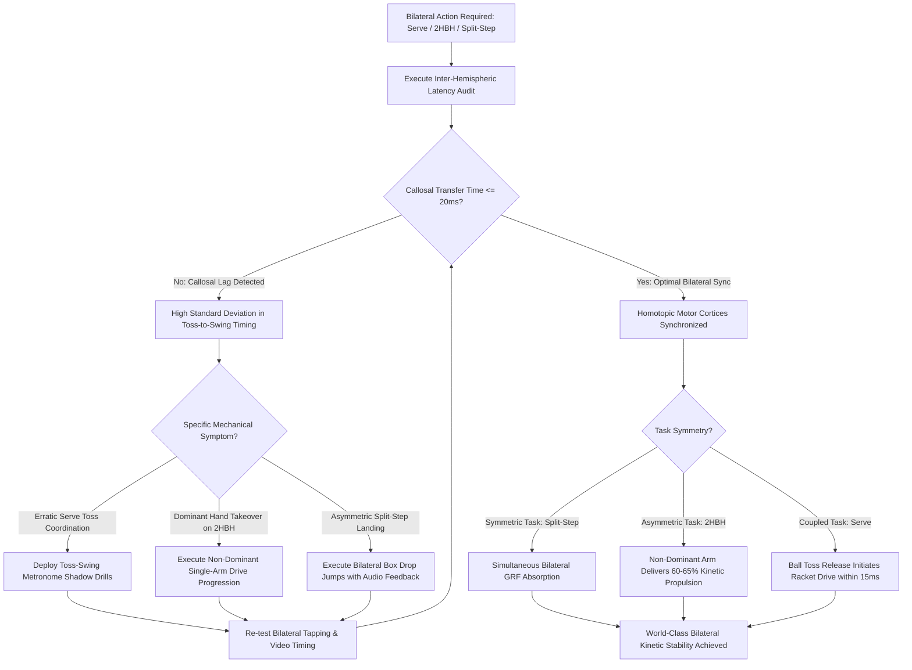

# ART-070: Inter-Hemispheric Brain Synchronization in Bilateral Movements

> **PRO CUE:** The left cerebral hemisphere governs the right hand; the right hemisphere governs the left hand. The tennis serve demands that the right-arm swing (left hemisphere) and the left-arm ball toss (right hemisphere) communicate via the corpus callosum in $<20\text{ ms}$. Train bilateral brain integration; that is how the kinetic chain and ball toss achieve bulletproof consistency.

## 1. Executive Summary & Athletic Intent

**Inter-Hemispheric Synchronization** is the neuro-computational process whereby the left and right cerebral hemispheres exchange sensorimotor data across the **corpus callosum**—a dense white matter tract comprising 200–250 million myelinated axons—to coordinate bilateral physical actions. While tennis is frequently perceived as an asymmetric, unilateral sport, its core kinematic actions are fundamentally bilateral:
1. **The Serve:** The non-dominant arm executes a precision ball toss (governed by the contralateral hemisphere) while the dominant arm executes backswing loading, external shoulder rotation, and violent acceleration (governed by the opposing hemisphere), supported by bilateral leg drive.
2. **The Two-Handed Backhand:** The non-dominant arm acts as the primary driving lever ($60\text{–}65\%$ of kinetic force) while the dominant arm guides racket plane angle ($35\text{–}40\%$).
3. **The Split-Step & Recovery:** Demands sub-millisecond temporal synchrony between both lower extremities during eccentric ground reaction force (GRF) absorption and subsequent lateral crossover drive.

When inter-hemispheric transfer degrades—due to central nervous system fatigue, stress-induced cortical inhibition, or a lack of callosal myelination—**Callosal Lag ($>30\text{ ms}$)** manifests. This lag induces severe toss-to-swing temporal dispersion on the serve, dominant-arm takeover on the two-handed backhand, and asymmetric ground reaction braking during footwork recovery.

The athletic intent of this technical article is threefold:
1. **Target the Corpus Callosum as an Adaptable Neuro-Structure:** Stimulate white matter plasticity and sheath myelination through deliberate contralateral motor overload.
2. **Quantify the $<20\text{ ms}$ Callosal Transfer Time Threshold:** Define empirical timing metrics necessary for sub-millimeter contact point stability on the serve.
3. **Institutionalize Bilateral Integration Protocols:** Deploy dual-task anti-phase tapping, asymmetric force balancing, and non-dominant stroke progressions to balance inter-hemispheric drive.

---

## 2. Biomechanical & Neurological Foundation

### 2.1 The Neurobiology of the Corpus Callosum & Callosal Transfer Time (CTT)

Communication between motor, premotor, and somatosensory cortices depends directly upon transcallosal pathways connecting homotopic (mirror-image) and heterotopic (functionally divergent) cortical zones:

| Neuro-Anatomical Parameter | Quantitative Value | Functional Significance in Tennis Mechanics |
| :--- | :--- | :--- |
| **Total Axonal Population** | $\sim 200\text{–}250\text{ million axons}$ | Connects motor and premotor cortices across hemispheres; enables coordinated bilateral limb movements. |
| **Myelin Sheath Thickness** | $0.2\text{–}0.5\ \mu\text{m}$ (Plastic) | Thicker myelin sheaths accelerate saltatory conduction, compressing callosal transmission latency. |
| **Homotopic Transfer Time (CTT)** | **$10\text{–}20\text{ ms}$ (Elite baseline)** | **Critical window:** Left-arm toss release signal must trigger right-arm swing acceleration within $<20\text{ ms}$. |
| **Heterotopic Transfer Time** | $20\text{–}40\text{ ms}$ | Governs complex cross-limb sequences (e.g., non-dominant guide to dominant wrist extension on 2HBH). |
| **Vulnerability Factors** | Fatigue, acidosis, cortisol, concussion | Degradation in callosal transfer time induces acute toss-swing desynchronization and kinetic leaks. |

### 2.2 The Serve: The Classic Inter-Hemispheric Computational Problem

```
NON-DOMINANT TOSS ARM (Left)               DOMINANT SWING ARM (Right)
             │                                         │
             ▼                                         ▼
   [Right Cerebral Cortex]                   [Left Cerebral Cortex]
             │                                         │
             ▼                                         ▼
[Right Primary Motor Cortex (M1)]         [Left Primary Motor Cortex (M1)]
             │                                         │
             └────────► [CORPUS CALLOSUM] ◄────────────┘
                         Transfer Time: 10-20ms
                                   │
                                   ▼
             [SUB-20ms TEMPORAL COUPLING MANDATE]
                                   │
                                   ▼
           [Ball Release Coordinates Linked to Trophy Pose]
                                   │
                                   ▼
           [Pristine Impact Geometry & Maximum Kinetic Drive]
```

**Biophysical Cascade of Callosal Lag:**
- If transcallosal transmission slows beyond **$30\text{ ms}$**, the spatial trajectory of the ball toss decouples from the kinetic chain of the hitting arm.
- The ball reaches the apex of flight while the hitting arm is still in early racket drop, forcing the athlete to either rush forward swing acceleration (causing rotator cuff impingement) or decelerate the swing (causing loss of serve velocity and inconsistent contact point geometry).

### 2.3 Catalog of Bilateral Movements in Tennis

| Movement Pattern | Left Hemisphere (Right Body) | Right Hemisphere (Left Body) | Inter-Hemispheric Synchrony Demand |
| :--- | :--- | :--- | :--- |
| **The Tennis Serve** | Dominant swing arm acceleration; right leg kinetic drive. | Non-dominant ball toss release; left leg balance and plant. | **Critical:** $<20\text{ ms}$ temporal latency ceiling. |
| **Two-Handed Backhand** | Dominant hand provides angle stabilization and guidance. | Non-dominant hand delivers $60\text{–}65\%$ of forward kinetic drive. | **High:** Requires precise transcallosal motor balance. |
| **Split-Step Landing** | Right lower extremity eccentric GRF loading. | Left lower extremity eccentric GRF loading. | **High:** Demands absolute bilateral simultaneity ($<10\text{ ms}$). |
| **Crossover Recovery** | Trail leg explosive ground push. | Lead leg spatial crossing and trajectory stabilization. | **Moderate:** Sequential contralateral alternating pattern. |
| **Volleys (FH / 2HBH)** | FH: Dominant arm strike control. | 2HBH: Non-dominant drive; non-hitting hand off-balance arm tracking. | **Moderate to High:** Upper body stabilizing torque balance. |
| **Overhead Smash** | Dominant hitting arm drive. | Non-hitting arm points to ball, tracking target and anchoring torso. | **High:** Non-dominant arm guides spatial triangulation. |

---

## 3. Step-by-Step Technical Execution

### Phase 1: Inter-Hemispheric Diagnostic Assessment

**Objective:** Objectively measure transcallosal communication latency and bilateral motor symmetry.

- **Test 1: Toss-Swing Temporal Dispersion:**
  - Record 20 competitive first serves using a 240 fps high-speed camera placed perpendicular to the baseline.
  - Measure the precise millisecond interval between **Ball Release from Fingers** and **Initiation of Forward Racket Drive** (movement out of trophy pose).
  - Calculate the Standard Deviation (SD) of this interval across the 20 reps.
  - **Diagnostic Standard:** $\text{SD} < 15\text{ ms}$ reflects elite callosal synchronization; $\text{SD} > 30\text{ ms}$ indicates significant callosal lag.
- **Test 2: Dual-Grip Bilateral Force Matching:**
  - The athlete grips two calibrated digital dynamometers simultaneously with eyes closed.
  - Target: Produce exactly $50\%$ of Maximum Voluntary Contraction (MVC) in both hands simultaneously.
  - Measure the **Percentage Force Discrepancy** and the **Time Lag (ms)** between hands reaching peak force.
  - **Diagnostic Standard:** Force discrepancy $<5\%$; time lag $<20\text{ ms}$.
- **Test 3: Rhythmic Bilateral Finger/Hand Tapping:**
  - Synchronize with a $2.0\text{ Hz}$ metronome ($500\text{ ms}$ intervals).
  - *Task A (In-Phase):* Tap both hands simultaneously onto sensor pads on every beat.
  - *Task B (Anti-Phase):* Alternate hands precisely on the half-beat ($250\text{ ms}$ offset).
  - **Diagnostic Standard:** In-phase asynchrony error $<10\text{ ms}$; anti-phase error $<15\text{ ms}$.

### Phase 2: Bilateral Integration Training

**Objective:** Overload transcallosal circuits with asymmetric, anti-phase coordination tasks to expand cognitive bandwidth.

- **Drill 4: Dual-Task Bilateral Coordination Matrix:**

| Drill Modality | Kinetic Execution | Progression & Overload |
| :--- | :--- | :--- |
| **In-Phase Mirror Circles** | Both hands draw symmetrical circles in the air at identical velocity and amplitude. | Accelerate metronome tempo from $1.0\text{ Hz} \rightarrow 3.0\text{ Hz}$. |
| **Anti-Phase Opposition Circles** | Hands draw circles in opposing directions (one clockwise, one counter-clockwise). | Forces transcallosal inhibitory interneurons to suppress mirror contagion. |
| **Asymmetric Force Loading** | Right hand exerts heavy isometric tension ($80\%$ MVC); left hand exerts light tap ($20\%$ MVC). | Dynamically swap force requirements between hands every 5 seconds. |
| **Sequential Motor Patterning** | Right arm executes 3-part unit turn cadence; Left hand recites or taps 4-part rhythmic sequence. | Combines cognitive and cross-limb motor programming. |

- **Drill 5: Serve-Specific Bilateral Synchronization Drills:**
  - *Drill 5A (Toss-Swing Shadow Metronome):* No ball. Metronome set to $1.0\text{ Hz}$. Beat 1 initiates the toss motion; Beat 2 triggers forward swing drive. The athlete must synchronize the kinematic transition exactly across beats. (20 reps).
  - *Drill 5B (Bilateral Rotational Medicine Ball Throw):* Athlete holds a 2–3 kg medicine ball with both hands in a trophy stance. Initiate violent hip drive; release ball explosively into a concrete wall, ensuring both hands release simultaneously. (3 sets $\times$ 8 reps).
  - *Drill 5C (Band-Resisted Contralateral Loading):* Resistance band attached to toss wrist pulling downward; secondary band attached to hitting racket arm pulling backward. Execute shadow serves against dual elastic tension. Forces both motor cortices to fire maximal coordinated neural drive. (15 reps).

### Phase 3: The 6-Week Corpus Callosum Myelination Macrocycle

**Objective:** Stimulate structural oligodendroglial myelination across callosal axons via progressive bilateral deliberate practice ($3\times/\text{week}$, 15 minutes per session).

| Training Macrocycle | Primary Neurological Focus | Prescribed Drill Architecture | Target Physiological Benchmark |
| :--- | :--- | :--- | :--- |
| **Weeks 1–2 (Symmetry)** | In-phase bilateral motor recruitment and homotopic synchronization. | In-phase mirror circles; bilateral medicine ball throws; symmetric elastic pulls. | Bilateral force matching discrepancy reduced to $<10\%$. |
| **Weeks 3–4 (Asymmetry)** | Anti-phase decoupling and transcallosal inhibition. | Anti-phase circles; asymmetric force loading ($80/20\%$ splits); dual-task tapping. | Anti-phase tapping error compressed to $<25\text{ ms}$. |
| **Weeks 5–6 (Sport Transfer)** | Kinetic chain integration into serve and 2HBH execution. | Toss-swing metronome shadow drills; live serve variability; left-arm 2HBH dominance. | Toss-swing timing standard deviation compressed to $<15\text{ ms}$. |

### Phase 4: Two-Handed Backhand Bilateral Kinetic Balancing

**Objective:** Eliminate dominant-arm dominance and establish optimal bilateral kinetic contributions on the two-handed backhand.

- **Biomechanical Gold Standard:** The non-dominant (top) hand must deliver **$60\text{–}65\%$ of forward propulsion and topspin generation**, while the dominant (bottom) hand delivers **$35\text{–}40\%$ of stabilization and face angle guidance**.
- **Diagnostic Indicator:** If the dominant arm generates $>50\%$ of kinetic force, the elbow bends excessively, creating an "inside arm pull" that collapses the swing arc and reduces depth.
- **Drill 6: The "Non-Dominant Driver" Progression:**
  1. *Step 1 (Choked Single-Arm Hits):* Athlete hits 20 baseline drives using *exclusively the non-dominant hand* (holding the racket at the top of the handle). Forces the non-dominant motor cortex to build full kinetic chain drive.
  2. *Step 2 (Light Guide Grip):* Re-introduce the dominant hand using a two-finger "loose guide" grip (thumb and index finger only). Hit 20 drives feeling $80\%$ drive from the top hand.
  3. *Step 3 (Integrated Bilateral Drive):* Re-establish full two-handed grip. Hit 30 match-tempo drives. Athlete focuses on the cue: *"Left hand drives the ball; right hand feels the angle."*

---

## 4. Performance Metrics & Training Dosage

| Performance Metric | Developing | Functional Standard | Advanced | Elite Mastery |
| :--- | :--- | :--- | :--- | :--- |
| **Toss-Swing Timing SD (High-Speed Video)** | $>30\text{ ms}$ | $20\text{–}30\text{ ms}$ | $15\text{–}20\text{ ms}$ | **$<15\text{ ms}$ rock-solid sync** |
| **Bilateral Force Matching Discrepancy** | $>15\%$ error | $10\text{–}15\%$ error | $5\text{–}10\%$ error | **$<5\%$ perfect balance** |
| **Bilateral Force Matching Onset Lag** | $>40\text{ ms}$ | $25\text{–}40\text{ ms}$ | $15\text{–}25\text{ ms}$ | **$<15\text{ ms}$ simultaneous** |
| **In-Phase Tapping Temporal Error** | $>25\text{ ms}$ | $15\text{–}25\text{ ms}$ | $10\text{–}15\text{ ms}$ | **$<10\text{ ms}$ micro-precision** |
| **Anti-Phase Tapping Temporal Error** | $>40\text{ ms}$ | $25\text{–}40\text{ ms}$ | $15\text{–}25\text{ ms}$ | **$<15\text{ ms}$ rhythmic decoupling** |
| **2HBH Kinetic Balance (Non-Dom / Dom)** | Non-Dom $<50\%$ | $50\text{–}55\%$ Non-Dom | $55\text{–}60\%$ Non-Dom | **$60\text{–}65\%$ Non-Dom drive** |
| **Serve Placement Dispersion (CV%)** | $>15\%$ target variance | $10\text{–}15\%$ variance | $5\text{–}10\%$ variance | **$<5\%$ tour-grade accuracy** |

### Recommended Weekly Training Dosage

- **Bilateral Integration Routine:** 3 sessions per week (15 min per session, integrated into dynamic warm-up or cool-down).
- **Serve Synchronization Conditioning:** 10 minutes prior to every dedicated serve practice session (Drills 5A, 5B, 5C).
- **Two-Handed Backhand Rebalancing:** 2 sessions per week (10 min per session using the Non-Dominant Driver progression).
- **Daily Maintenance Tapping:** 2 minutes every morning of in-phase and anti-phase metronomic tapping ($2.0\text{–}3.0\text{ Hz}$).

---

## 5. Errors, Causes & Correction Protocols

| Observable Mechanical Breakdown | Root Neurological Cause | Biomechanical Correction Protocol |
| :--- | :--- | :--- |
| **Erratic Serve Toss Height & Timing:** Ball toss varies wildly; swing looks rushed or disjointed across points. | **Callosal Transfer Lag ($>30\text{ ms}$):** Right and left motor cortices are desynchronized; toss release fails to trigger the swing chain. | Toss-Swing Shadow Metronome drill (Drill 5A) for 20 reps daily. Eliminate ball; calibrate auditory beat to unit turn. |
| **Dominant Arm Takeover on 2HBH:** Stroke finishes with cramped elbow; ball sprays short or pulls into doubles alley. | **Inter-Hemispheric Dominance Bias:** Dominant hemisphere fails to exert transcallosal inhibition, overriding non-dominant drive. | Execute Step 1 of Drill 6: Hit 30 balls using *exclusively the non-dominant arm* to awaken dormant contralateral motor pathways. |
| **Asymmetric Split-Step Landing:** One foot lands $50\text{–}100\text{ ms}$ ahead of the other, compromising lateral push-off. | **Bilateral Landing Desynchronization:** Asymmetric corticospinal drive to lower extremity motor pools. | Dual drop-jump landings from a 20 cm box onto force plates or auditory timing mats. Mandate simultaneous double-thud contact. |
| **Severe Serve Breakdown Under Match Stress:** As nervous tension rises, the toss flies backward and double faults spike. | **Stress-Induced Callosal Slowing:** Cortisol and sympathetic tone slow transcallosal axonal velocity. | Deploy the 25-Second Micro-Recovery (ART-061) between points. Execute bilateral isometric grip squeeze to reset callosal circuits. |
| **Subjective Feeling of "Body Disconnect":** Player reports feeling as though their left and right sides are out of rhythm. | **Callosal Fatigue / Lack of Integration:** Extended unilateral loading creates functional inter-hemispheric communication gaps. | Implement Dual-Task Bilateral Drills (Drill 4) to restore communication lines; apply bilateral cross-crawl neural activation patterns. |

---

## 6. Diagnostic Diagram & Decision Flow



---

## 7. Video Demonstration & Technical Analysis

<div class="video-container" style="position:relative;padding-bottom:56.25%;height:0;overflow:hidden;border-radius:12px;">
  <iframe src="https://www.youtube-nocookie.com/embed/VIDEO_ID_PLACEHOLDER"
          style="position:absolute;top:0;left:0;width:100%;height:100%;border:0;"
          allow="accelerometer; autoplay; clipboard-write; encrypted-media; gyroscope; picture-in-picture"
          allowfullscreen
          title="Inter-Hemispheric Brain Synchronization in Bilateral Movements — Technical Analysis"></iframe>
</div>

*Recommended Technical Video Breakdown: Diffusion Tensor Imaging (DTI) tractography visualizing white matter integrity and fractional anisotropy along the corpus callosum pre- and post-bilateral training; ultra-high-speed 1000 fps video breakdown analyzing toss release to swing initiation latency in elite ATP/WTA servers; synchronized surface EMG analysis showing the $60/40\%$ kinetic force distribution across the left and right arms during a world-class two-handed backhand.*

---

## 8. Cross-Domain Synergy & Multi-Pillar Integration

- **Neural Drive Optimization on the Serve (Pillar II - Neurological Mechanics):** The non-dominant tossing arm provides the stable spatial and kinetic platform necessary for the dominant arm to discharge maximal rate of force development (RFD) during forward acceleration (ART-069).
- **Motor Unit Recruitment & Priming (Pillar II - Motor Control):** Bilateral training activates inter-hemispheric facilitation, lowering the recruitment threshold of high-threshold motor units across both hemispheres (ART-071).
- **Auditory Priming & Reaction Velocity (Pillar II - Sensory Neuroscience):** Auditory cues processed in the temporal lobes project bilaterally to both primary motor cortices, accelerating transcallosal reaction speeds (ART-071).
- **Central & Metabolic Fatigue Resistance (Pillars II & IV):** Elevated blood lactate and central exhaustion degrade callosal axonal conduction velocity. Strategic micro-recovery routines preserve inter-hemispheric timing across 5-set matches (ART-054, ART-058, ART-061).
- **Cognitive Load & Tactical Automation (Pillar II - Cognitive Systems):** Automating bilateral physical movements reduces conscious prefrontal overhead, freeing working memory slots for tactical heuristic execution (ART-053, ART-060).
- **Non-Visual Sensory Deprivation (Pillar II - Proprioception):** Performing bilateral integration drills blindfolded forces the nervous system to coordinate transcallosal motor programs using pure somatosensory and vestibular feedback (ART-068).

---

## 9. Self-Assessment Rubric

| Assessment Dimension | Level 1: Unilateral Bias | Level 2: Emerging Bilateral | Level 3: Functional Sync | Level 4: Callosal Mastery |
| :--- | :--- | :--- | :--- | :--- |
| **Toss-Swing Timing SD** | $\text{SD} > 30\text{ ms}$ (Erratic) | $\text{SD} = 20\text{–}30\text{ ms}$ | $\text{SD} = 15\text{–}20\text{ ms}$ | **$\text{SD} < 15\text{ ms}$ (Elite consistency)** |
| **Bilateral Force Discrepancy** | $>15\%$ force variance | $10\text{–}15\%$ variance | $5\text{–}10\%$ variance | **$<5\%$ (Perfect motor balance)** |
| **In-Phase Tapping Error** | $>25\text{ ms}$ error | $15\text{–}25\text{ ms}$ error | $10\text{–}15\text{ ms}$ error | **$<10\text{ ms}$ (Microsecond precision)** |
| **Anti-Phase Tapping Error** | $>40\text{ ms}$ (Severe drift) | $25\text{–}40\text{ ms}$ error | $15\text{–}25\text{ ms}$ error | **$<15\text{ ms}$ (Decoupled mastery)** |
| **2HBH Kinetic Balance** | Non-Dom $<50\%$ (Cramped) | $50\text{–}55\%$ Non-Dom | $55\text{–}60\%$ Non-Dom | **$60\text{–}65\%$ Non-Dom drive** |

**Diagnostic Scoring Key:**
- **5–8 Points:** Severe Inter-Hemispheric Asynchrony. Player displays erratic serve mechanics, chronic toss problems, and a dominant-arm-restricted backhand.
- **9–12 Points:** Developing Bilateral System. Mechanics function adequately during low-stress exchanges, but callosal lag emerges under match pressure and fatigue.
- **13–16 Points:** Functional Inter-Hemispheric Synchrony. Stable transcallosal communication; reliable toss-swing timing and balanced two-handed backhand drive.
- **17–20 Points:** Tour-Grade Callosal Mastery. Flawless bilateral neural integration with sub-15ms transcallosal timing fidelity and complete resistance to fatigue desynchronization.

---

## 10. Printable Practice Card (Pocket Drill Card)

```
================================================================================
                 BILATERAL INTER-HEMISPHERIC SYNCHRONIZATION CARD
Objective: Toss-Swing SD <15ms | Bilateral Force Diff <5% | 2HBH Left Drive: 60-65%
================================================================================

[BLOCK A: RHYTHMIC TAPPING PRIMING (3 MIN)]
  - Metronome at 2.0 Hz (120 BPM):
    * 1 min: In-Phase Simultaneous Tapping (Target asynchrony <10ms).
    * 1 min: Anti-Phase Alternating Tapping (Target asynchrony <15ms).
  * Focus Cue: "Two hands, one brain—laser precision."

[BLOCK B: DUAL-TASK COORDINATION OVERLOAD (5 MIN)]
  - 3 sets x 30s: Asymmetric Force Loading (Right 80% MVC, Left 20% MVC).
  - 3 sets x 30s: Anti-Phase Air Circles (Opposing rotational vectors).
  * Focus Cue: "Suppress the mirror reflex—independent hemisphere control."

[BLOCK C: SERVE SYNCHRONIZATION (10 MIN)]
  - 10 reps: Toss-Swing Metronome Shadow Drills (Beat 1 toss, Beat 2 hit).
  - 10 reps: Band-Resisted Contralateral Shadow Serves.
  - 15 live serves: Focus purely on linking ball release to trophy uncoiling.
  * Focus Cue: "The toss arms the swing—release and drive."

[BLOCK D: TWO-HANDED BACKHAND REBALANCING (7 MIN)]
  - 10 balls: Non-Dominant Single-Arm Drives (Top hand only, choked grip).
  - 10 balls: Two-Finger Guide Grip (Bottom hand loose, top hand drives).
  - 20 balls: Full Match-Tempo Drives (Feel 60% left-arm forward drive).
  * Focus Cue: "Left hand drives the ball; right hand feels the angle."

[BLOCK E: VIDEO & TIMING AUDIT (5 MIN)]
  - High-speed video review: Verify Toss-Swing SD <15ms across 10 serves.
================================================================================
FREQUENCY: 3x/week Integrated + Daily Tapping (2m) | GATE: Toss-Swing SD <15ms
================================================================================
```

---

*Cross-References: ART-053, ART-054, ART-058, ART-060, ART-061, ART-068, ART-069, ART-071. Pillar II: Neurological Mechanics & Sports Neuroscience — TennisKB 200 Series.*
