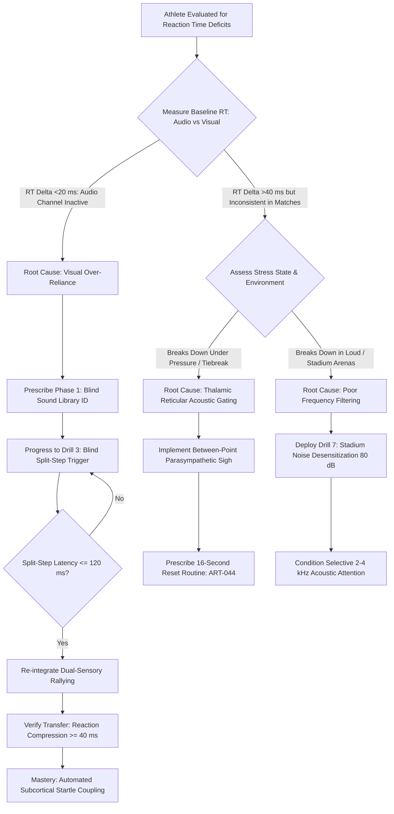

# ART-071: Reaction Time Priming via Auditory Tennis Cues

> **PRO CUE:** Sound reaches the brain **~40–60 ms** faster than light (Auditory Pathway < Visual Pathway). The acoustic "pop" of the ball striking the opponent's racket strings is a free, hardwired **start signal**. Train your auditory cortex: hearing precedes seeing.

## 1. Executive Summary & Athletic Intent

**Auditory Priming** in high-performance tennis refers to the strategic utilization of task-specific acoustic cues—string impact crack, aerodynamic ball flight hiss, court bounce reports, shoe friction squeaks, and opponent exhalations—to **pre-activate the primary motor cortex and spinal alpha-motor neuron pools** before optical wavefronts are fully transduced by the retina. 

The human auditory pathway (Cochlear hair cells $\to$ Cochlear nucleus $\to$ Inferior Colliculus $\to$ Medial Geniculate Body $\to$ Primary Auditory Cortex $\to$ Premotor/Motor Areas) transmits sensory impulses **~40 to 60 ms faster** than the retino-geniculo-striate visual pathway. On an elite 130 mph (209 km/h) serve with a total transit time of approximately 400 ms, this 60 ms differential constitutes **15% of the total available reaction window**. In practical match dynamics, this temporal margin dictates whether a player executes an effortless, balanced split-step and block return or gets jammed behind the baseline.

The athletic intent of this article is threefold:
1. **Capitalize on the Hardwired Auditory Speed Advantage:** Secure 40–60 ms of compressed reaction latency through bio-acoustic optimization rather than inefficient muscular strain.
2. **Standardize the 8-Cue Tennis Acoustic Library:** Establish an exact taxonomy of tennis-specific audio signatures and pair each signature with precise kinematic anticipatory subroutines.
3. **Operationalize Sound-Reaction Protocols:** Provide progressive blind training regimens ("Blind Split-Step", "Acoustic Directional Drive", and "Noise-Gated Filter Drills") that eradicate optical over-reliance and automate subcortical sound-motor coupling.

---

## 2. Biomechanical & Neurological Foundation

### 2.1 Auditory vs. Visual Pathway Speed

The biological latency differential between auditory and visual sensory processing is rooted in the fundamental physics of mechanotransduction versus biochemical phototransduction:

| Physiological Stage | Auditory Pathway | Visual Pathway | Latency Margin |
| :--- | :--- | :--- | :--- |
| **Sensory Transduction** | Cochlear hair cell stereocilia deflection (~1 ms) | Retinal rhodopsin phototransduction cascade (~20 ms) | **+19 ms (Auditory faster)** |
| **Brainstem Processing** | Cochlear nucleus $\to$ Superior Olive $\to$ Inferior Colliculus (~5 ms) | Lateral Geniculate Nucleus (LGN) bypass (~10 ms) | **+5 ms (Auditory faster)** |
| **Thalamic Relay** | Medial Geniculate Body (MGB) (~3 ms) | LGN $\to$ Primary Visual Cortex (V1) (~5 ms) | **+2 ms (Auditory faster)** |
| **Cortical Computation** | A1 $\to$ Premotor Cortex (~15 ms) | V1 $\to$ V5/MT (Dorsal Stream) $\to$ Premotor (~50 ms) | **+35 ms (Auditory faster)** |
| **Total Latency to Motor Cortex** | **~24 ms** | **~85 ms** | **~61 ms (Auditory advantage)** |
| **Corticospinal Transmission** | Spinal motor neuron pool (+5 ms) | Spinal motor neuron pool (+5 ms) | Equidistant |
| **Total Simple Reaction Time (SRT)** | **~140–160 ms** | **~200–250 ms** | **~60 ms overall compression** |

```
AUDITORY PATHWAY (~24 ms to Motor Cortex):
Cochlea (1 ms) ──► Brainstem/IC (5 ms) ──► MGB Thalamus (3 ms) ──► A1/Premotor (15 ms)
                                  │
                                  └──► Reticulospinal Tract (Startle, <50 ms, Pre-depolarization)

VISUAL PATHWAY (~85 ms to Motor Cortex):
Retina (20 ms) ──► LGN Thalamus (10 ms) ──► V1 (5 ms) ──► V5/MT Dorsal Stream ──► Premotor (50 ms)
```

**Biomechanical Takeaway:** Acoustic processing operates at more than triple the computational speed of visual perception. Relying solely on optical cues delays the split-step drop, forcing compensatory lunging and degraded contact point geometry.

### 2.2 The 8-Cue Tennis Acoustic Library

Elite players do not merely "hear noise"; they continuously parse an acoustic stream for kinematic signatures:

| Acoustic Cue | Frequency & Sound Signature | Extracted Information | Triggered Motor Subroutine |
| :--- | :--- | :--- | :--- |
| **C1: Impact Pop** | Sharp crack, 2.0–4.0 kHz; high transient peak | **Stroke Quality & Ball Pace:** Flat (crisp, high-amplitude crack), Topspin (dense, low-mid thud), Slice (soft friction scrape). Amplitude $\propto$ exit velocity. | Split-step unweighting initiation; Unit turn coil trigger. |
| **C2: Ball Flight Hiss** | Whispering vortex hiss; high aerodynamic friction | **Rotational Velocity (RPM):** High frequency = heavy spin; Pitch drop = stalling velocity. | Dynamic racket face angle indexing; contact height calibration. |
| **C3: Court Bounce Report** | Hard report (acrylic), muffled pad (clay), soft thud (grass) | **Surface Interaction:** Rebound speed decay %, friction coefficient, vertical bounce elevation. | Forward weight transition; final approach stride planting. |
| **C4: Opponent Exhalation / Grunt** | Guttural phonation, explosive vocal cord pulse | **Kinetic Effort & Strain:** Peak effort vs. defensive push; subtle pitch shifts indicate off-balance lunges. | Offensive court positioning; anticipating depth deficiencies. |
| **C5: Footwear Friction Squeak** | High-frequency rubber-acrylic slip/stick chirp | **Kinematic Vector:** Deceleration emergency, lateral sliding vector, change-of-direction latency. | Tactical shot placement targeting the recovery vector. |
| **C6: Racket Frame Whoosh** | Aerodynamic displacement swish | **Angular Acceleration:** Terminal swing speed, commitment to full stroke vs. last-millisecond drop disguise. | Baseline depth preparation; defensive stance drop. |
| **C7: Net Cord Glancing Clip** | High-frequency acoustic tap / deadened clip | **Trajectory Truncation:** Kinetic energy loss, rotational dissipation, sudden short-court drop. | Rapid deceleration of baseline momentum; forward sprint burst. |
| **C8: Environmental / Wind Murmur** | Ambient acoustic drift, localized gust turbulence | **Atmospheric Friction:** Cross-wind drift magnitude, tailwind ball sail potential. | Arousal regulation; expanding contact point tolerance margins. |

### 2.3 Subcortical Startle and Cortical Motor Coupling

Auditory processing drives motor output through a dual-channel architecture:

```
                          AUDITORY IMPACT POP
                                  │
         ┌────────────────────────┴────────────────────────┐
         ▼                                                 ▼
[Subcortical Fast Channel]                       [Cortical Precise Channel]
Cochlear Nucleus & Inferior Colliculus            Medial Geniculate Body (Thalamus)
         │                                                 │
         ▼                                                 ▼
[Reticulospinal Tract]                           [Primary Auditory Cortex (A1)]
Fast startle projection (<50 ms)                           │
         │                                                 ▼
         ▼                                       [Premotor & Motor Cortex (M1)]
Spinal Alpha-Motor Neurons                       Coordinated Motor Encodings (~80 ms)
Pre-depolarizes postural musculature                       │
Increases baseline extensor tone                           ▼
Ready state for explosive split-hop              [Corticospinal Pathway]
                                                 Directional Unit Turn & Footwork Execution
```

1. **Subcortical Channel (<50 ms):** The acoustic crack activates the reticulospinal startle circuit, elevating lower-extremity extensor tone and pre-depolarizing alpha-motor neurons. This primes the musculoskeletal system for instantaneous ground contact.
2. **Cortical Channel (~80 ms):** The signal traverses the auditory cortex and premotor areas to construct the definitive spatial motor plan (split-step push-off direction, racket prep angle).

---

## 3. Step-by-Step Technical Execution

### Phase 1: Acoustic Awareness & Auditory Discrimination

#### Drill 1: Blind Sound Library Classification
- **Setup:** The athlete stands in the center of the baseline with eyes closed or blindfolded. An audio playback system or a live coach positioned at the opposing baseline feeds the 8 tennis acoustic cues (C1–C8) in randomized sequence.
- **Protocol:** Upon hearing each cue, the player immediately announces the cue ID, stroke profile (e.g., *"Flat crack—deep pace"*), and executes the corresponding dry footwork prep.
- **Dosage:** 3 sets of 20 randomized audio events. 
- **KPI:** $100\%$ identification accuracy; verbal and kinematic response latency $<1.0\text{ s}$.

#### Drill 2: Live Soundscape Mapping
- **Setup:** The athlete stands in an athletic ready position with eyes closed while two hitting partners conduct a live cross-court rally across from them.
- **Protocol:** For 30 seconds, the athlete tracks the rally strictly via sound. When the coach calls *"Freeze"*, the athlete opens their eyes and points directly to the estimated current ball location and states who just struck the ball, what spin was applied, and ball trajectory.
- **Dosage:** 5 cycles of 30-second tracking.

---

### Phase 2: Sound-Reaction Coupling Protocols

#### Drill 3: The Blind Split-Step Trigger
- **Setup:** The player adopts a neutral ready stance at the baseline with eyes closed. The feeder strikes forehands from the opposing baseline.
- **Execution:** 
  1. The athlete suppresses visual anticipation entirely.
  2. The precise acoustic crack of the ball striking the feeder's strings (Cue C1) serves as the **exclusive unweighting trigger**.
  3. The player executes a vertical split-step hop immediately upon hearing the impact.
  4. The player opens their eyes at the apex of the split-step hop to visually acquire ball trajectory and execute the directional push-off.
- **Dosage:** 4 sets of 15 repetitions.
- **KPI:** Electromyographic (EMG) or high-speed video confirmation of split-step push-off initiation $\le 110\text{ ms}$ post-impact sound.

```
FEEDED STROKE:
Opponent Contact Crack ──► [Auditory Input] ──► Instantaneous Hop Unweighting (<100 ms)
                                                        │
                                                        ▼
EYES OPEN (Mid-Air): ────────────────────────► Optical Trajectory Lock ──► Directional Landing Drive
```

#### Drill 4: Sound-Cued Directional First Step
- **Setup:** Athlete closed eyes at baseline. Feeder strikes either sharply down-the-line or cross-court.
- **Execution:** Athlete relies on stereo binaural localization (inter-aural time difference $\le 10\,\mu\text{s}$) and the feeder's court squeak / ball contact angle to initiate the unit turn and the first explosive crossover or gravity step toward the ball before opening their eyes on step two.
- **Dosage:** 3 sets of 12 repetitions.
- **KPI:** First-step directional accuracy $>90\%$.

#### Drill 5: Acoustic-Primed Return of Serve
- **Setup:** Elite server on the service line or baseline delivering 1st and 2nd serves. Returner positioned at baseline with eyes shut.
- **Execution:**
  1. Acoustic trigger 1: Server's ball toss air release and knee drive sound $\to$ Returner sinks into athletic posture.
  2. Acoustic trigger 2: Server's string impact pop $\to$ Returner executes the split-step hop.
  3. Eyes open when the ball reaches mid-flight (net clearance, approximately $T+150\text{ ms}$) $\to$ Quiet Eye visual gaze locks on the ball $\to$ Dynamic block or drive return.
- **Dosage:** 30 serve repetitions.
- **KPI:** Solid center-string contact rate $>75\%$ compared to baseline visual-only conditions.

---

### Phase 3: Auditory Priming Under Cognitive & Acoustic Load

#### Drill 6: Dual-Task Acoustic Reaction Rally
- **Setup:** Standard live rally. A courtside coach or smart audio transmitter inserts randomized acoustic stimuli (whistle tone, sharp clapper, verbal directional prompt "Push", "Hold").
- **Execution:** The athlete must maintain rally tempo while instantly responding to the audio override cue (e.g., audio whistle = immediate recovery drop-step; clapper = high-lofted topspin response).
- **Dosage:** 3 sets of 10-point sequences.

#### Drill 7: Environmental Noise Desensitization
- **Setup:** High-output stadium acoustic system playing continuous ambient crowd noise, simulated gust wind, or stadium reverberations at 75–82 dB.
- **Execution:** Athlete executes live return of serve and baseline point play. They must tune out broadband noise and lock attention exclusively onto the narrow 2–4 kHz string impact frequency band.
- **Dosage:** 20 minutes under acoustic load.
- **KPI:** False-alarm split-steps $<5\%$; missed impact triggers $<5\%$.

---

## 4. Performance Metrics & Training Dosage

### 4.1 Diagnostic Performance Benchmarks

| Quantitative Metric | Level 1: Developing | Level 2: Competent | Level 3: Advanced | Level 4: Tour Elite |
| :--- | :--- | :--- | :--- | :--- |
| **Auditory Reaction Time (Pop $\to$ Split Hop)** | $>160\text{ ms}$ | 130–160 ms | 105–130 ms | **$<100\text{ ms}$** |
| **Sound Library Identification Accuracy** | $<80\%$ | 80–90% | 90–97% | **$100\%$ instant identification** |
| **Blind Split-Step Execution Consistency** | $<65\%$ | 65–80% | 80–92% | **$>95\%$** |
| **Blind Return Solid Contact Rate** | $<45\%$ | 45–60% | 60–75% | **$>80\%$** |
| **First-Step Directional Accuracy (Audio Only)** | $<70\%$ | 70–85% | 85–94% | **$>95\%$** |
| **Acoustic Noise Filter Robustness (False Alarm %)** | $>20\%$ | 10–20% | 5–10% | **$<3\%$** |
| **Total Reaction Compression (Audio + Visual vs. Visual Alone)** | $<15\text{ ms}$ | 15–30 ms | 30–45 ms | **$>50\text{ ms}$ compressed latency** |

### 4.2 Structured Weekly Training Dosage

```
┌────────────────────────────────────────────────────────────────────────┐
│                   AUDITORY PRIMING DOSAGE STRUCTURE                     │
├────────────────────────────────────────────────────────────────────────┤
│ DAILY PRE-HIT ACTIVATION (5 Min):                                      │
│ • Blind Sound Library ID (C1–C8): 3 sets x 8 cues                      │
│                                                                        │
│ TECHNICAL COURT DRILLS (15 Min - 3x/week):                             │
│ • Blind Split-Step Repetitions: 30 reps                                │
│ • Sound-Cued Directional Step 1: 25 reps                               │
│ • Blind Return of Serve Progression: 20 reps                           │
│                                                                        │
│ TACTICAL INTEGRATION (10 Min - 2x/week):                               │
│ • Dual-Task Acoustic Reaction Rally: 3 sets x 10 points                │
│                                                                        │
│ NOISE-GATED DRILLS (10 Min - 1x/week):                                 │
│ • High-decibel stadium audio noise filter sets: 15-20 live points      │
└────────────────────────────────────────────────────────────────────────┘
```

---

## 5. Errors, Causes & Correction Protocols

| Observable Biomechanical / Neural Error | Root Neurobiological Etiology | Precision Correction Protocol |
| :--- | :--- | :--- |
| **Split-step initiated late; player visibly flat-footed at ball impact** | Complete optical over-reliance; waiting for retinal image of ball flight rather than auditory impact pop. | Implement mandatory Blind Split-Step drills (Drill 3). Verbal constraint cue: *"Hop on the pop—never wait for the eye."* |
| **Acoustic 'Tunnel Deafness' during high-stress tiebreaker points** | Elevated sympathetic surge and amygdala hyper-arousal triggering Thalamic Reticular Nucleus (TRN) acoustic gating. | Deploy 16-Second Cure routine (ART-044) with two physiological sighs (double inhale, slow exhale) to restore thalamic auditory relay channels. |
| **Erroneous split-step timing triggered by spectator noise or adjacent courts** | Broad auditory band receptive field; lack of frequency tuning in primary auditory cortex (A1). | Run Noise Desensitization drills (Drill 7) utilizing narrow-band bandpass audio filters tuned specifically to the 2.5–3.5 kHz racket string impact spectrum. |
| **Failure to modulate court depth based on ball pace** | Inability to extract exit velocity metrics from acoustic impact amplitude. | Sound-to-Depth pairing drills: Coach strikes varying pace with player calling *"Deep"*, *"Neutral"*, or *"Short"* strictly from acoustic volume prior to ball crossing net. |
| **Inability to differentiate topspin from slice from the sound** | Deficient spectral discrimination between transient high-frequency snap and prolonged broad-spectrum friction hiss. | Acoustic discrimination bench drills: Expose athlete to isolated high-speed audio samples of pure flat, kick, and slice impacts until recognition reaches 100%. |

---

## 6. Diagnostic Diagram & Decision Flow



---

## 7. Video Demonstration & Technical Analysis

<div class="video-container" style="position:relative;padding-bottom:56.25%;height:0;overflow:hidden;border-radius:12px;">
  <iframe src="https://www.youtube-nocookie.com/embed/VIDEO_ID_PLACEHOLDER"
          style="position:absolute;top:0;left:0;width:100%;height:100%;border:0;"
          allow="accelerometer; autoplay; clipboard-write; encrypted-media; gyroscope; picture-in-picture"
          allowfullscreen
          title="Reaction Time Priming via Auditory Tennis Cues — Technical Biomechanical Analysis"></iframe>
</div>

*Recommended Technical Video Breakdown: Synchronized dual-channel EEG recordings contrasting visual cortex P100 wave arrival (~100 ms) against auditory brainstem evoked responses (ABR, <10 ms) and primary auditory cortex arrival (~20 ms); 240 FPS split-screen kinematics showing split-step unweighting initiated purely on string pop audio versus visual ball flight; high-resolution spectrogram analysis demonstrating the acoustic frequency signatures of flat, heavy topspin, and backspin slice impacts.*

---

## 8. Cross-Domain Synergy & Multi-Pillar Integration

- **With Reaction Time Compression (ART-069):** Auditory priming represents the most accessible biological shortcut to shaving 40–60 ms from total reaction time without requiring excessive physiological hypertrophy.
- **With Saccadic Eye Movement & Quiet Eye (ART-041, ART-055):** The acoustic impact crack provides the subcortical temporal trigger for the anticipatory saccade, directing the eyes to the future bounce location before optical pursuit commences.
- **With Split-Step Dynamic Mechanics (ART-011, ART-083):** Coupling split-step unweighting to the opponent's impact sound anchors ground contact timing directly to ball launch physics, eliminating the guesswork of visual flight tracking.
- **With Inter-Hemispheric Bilateral Transfer (ART-070):** Acoustic signals radiate bilaterally through the olivary complexes, pre-activating motor cortex structures in both cerebral hemispheres simultaneously.
- **With Ecological Affordance Perception (ART-067):** Sound cues C1 (impact pop) and C2 (hiss) instantly broadcast the energetic affordance of the incoming shot (*"Attackable short ball"* vs. *"Heavy neutralizing drive"*).
- **With Working Memory & Cognitive Offloading (ART-053, ART-060):** Diverting initial ball-detection processing to the auditory system frees prefrontal cortical bandwidth for downstream tactical decision-making.
- **With Stress & Cortisol Regulation (ART-054, ART-072):** High acute stress induces auditory exclusion via sympathetic hyper-activation. Managing cortisol buffering prevents functional deafness during high-leverage points.

---

## 9. Self-Assessment Rubric

| Diagnostic Checkpoint | Level 1: Visual Dominant | Level 2: Acoustic Aware | Level 3: Sound-Coupled | Level 4: Auditory Master |
| :--- | :--- | :--- | :--- | :--- |
| **Auditory Split Latency** | $>160\text{ ms}$; delayed hop | 130–160 ms; inconsistent | 105–130 ms; reliable hop | **$<100\text{ ms}$; explosive unweighting** |
| **Blind Sound Recognition** | $<80\%$ accuracy | 80–90% accuracy | 90–97% accuracy | **$100\%$ instant classification** |
| **Blind Split Accuracy** | $<65\%$ timing accuracy | 65–80% timing accuracy | 80–92% timing accuracy | **$>95\%$ perfect synchronization** |
| **Blind Return Solid Contact** | $<45\%$ centered hits | 45–60% centered hits | 60–75% centered hits | **$>80\%$ clean sweet-spot strikes** |
| **Noise Gating Robustness** | Distracted by any noise ($>20\%$ error) | Sensitive to loud bursts (10–20%) | Reliable in noise (5–10%) | **Immune to stadium noise ($<3\%$ error)** |

**Scoring Interpretation:**
- **5–8 Points:** Severe Visual Trapping. The player operates exclusively in the slow visual domain, constantly running out of time on fast surfaces.
- **9–12 Points:** Developing Auditory Awareness. Basic perception exists, but motor circuits remain coupled primarily to optical feedback.
- **13–16 Points:** Functional Acoustic Integration. Sound consistently triggers split-step timing and initial movement vectors.
- **17–20 Points:** Tour-Grade Auditory Mastery. Seamless subcortical auditory-motor reflexes producing world-class reaction speeds.

---

## 10. Printable Practice Card (Pocket Drill Card)

```
┌────────────────────────────────────────────────────────────────────────┐
│             AUDITORY PRIMING & REACTION DRILL CARD                     │
│ Target: Auditory RT <110 ms | Blind Split >95% | Noise Rejection <3%   │
├────────────────────────────────────────────────────────────────────────┤
│ PHASE A: ACOUSTIC CALIBRATION (5 MIN)                                  │
│ • Blind Sound Library ID: 8 Cues x 3 cycles with eyes closed           │
│ • Focus: Name cue + call stroke pace + dry shadow step                 │
│ • Cue: "Ear is the radar; eye is the camera. Sound leads the dance."   │
├────────────────────────────────────────────────────────────────────────┤
│ PHASE B: MOTOR COUPLING CORE (15 MIN)                                  │
│ • Blind Split-Step Trigger: 30 reps (Hop instantly on impact pop)      │
│ • Sound-Cued Directional Step 1: 20 reps (Audio cues cross vs line)    │
│ • Blind Return Progression: 15 reps (Eyes open only at mid-flight)     │
│ • Cue: "Crack = Pop the feet. Do not wait to see the ball."            │
├────────────────────────────────────────────────────────────────────────┤
│ PHASE C: DUAL-TASK & STRESS INTEGRATION (10 MIN)                       │
│ • Live Cross-Court Rally with Random Audio Command Injections          │
│ • 80 dB Stadium Noise or Music Playback Point Play                     │
│ • Cue: "Filter the roar—isolate the 3 kHz string snap."                │
├────────────────────────────────────────────────────────────────────────┤
│ PHASE D: BIOMETRIC AUDIT (5 MIN)                                       │
│ • Log Video Split-Step Delay from Sound Contact                        │
│ • Gate: 3 consecutive sessions with Auditory RT <115 ms                │
└────────────────────────────────────────────────────────────────────────┘
```

---

*Cross-References: ART-011, ART-041, ART-044, ART-053, ART-055, ART-060, ART-067, ART-069, ART-070, ART-072, ART-083. Pillar II: Neurological Mechanics & Sports Neuroscience — TennisKB 200 Series.*
