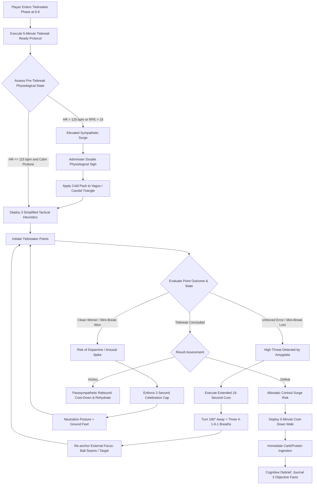

# ART-072: Stress Resilience and Cortisol Buffering during Tiebreakers

> **PRO CUE:** A tiebreaker is a 10–15 minute **acute neuroendocrine stress test**. Surging cortisol induces prefrontal cortex (PFC) hypofrontality $\to$ working memory collapse $\to$ tactical decision breakdown. Buffering cortisol keeps the executive brain online. Stress inoculation training builds permanent competitive immunity.

## 1. Executive Summary & Athletic Intent

**Stress Resilience** in high-performance tennis is defined as the physiological and neurobiological capacity to sustain precision motor execution and optimal tactical decision-making under severe neuroendocrine strain. The **tiebreaker** represents the ultimate acute stress crucible: sudden-death scoring leverage, intense spectator pressure, cumulative muscular fatigue, and the imminent prospect of winning or losing an entire set within a 10-to-15 minute window.

Under such conditions, the **Hypothalamic-Pituitary-Adrenal (HPA) axis** triggers a massive release of glucocorticoids, driving salivary cortisol concentrations above **$500\text{ nmol/L}$**. Unbuffered cortisol at these levels induces three catastrophic failure modes:
1. **Prefrontal Cortex (PFC) Hypofrontality:** Glucocorticoids saturate low-affinity glucocorticoid receptors (GRs) in the dorsolateral prefrontal cortex, shutting down working memory, degrading inhibitory impulse control, and paralyzing split-second tactical calculations.
2. **Amygdala Hyper-Reactivity:** The emotional salience network becomes hypersensitive, amplifying threat perception, generating internal catastrophizing, and triggering autonomic panic.
3. **Motor Engram Degradation:** Excessive beta-adrenergic stimulation and corticospinal disruption manifest as peripheral muscle tremor, grip over-tension, loss of kinetic chain fluid sequencing, and erratic contact point geometry.

The athletic intent of this article is threefold:
1. **Convert Stress into an Objective, Quantifiable Variable:** Map salivary cortisol concentrations, heart rate recovery dynamics, and the Testosterone-to-Cortisol (T/C) ratio to specific neuro-behavioral tipping points.
2. **Establish a 3-Tier Cortisol Buffering Architecture:** Deploy Chronic (lifestyle resilience), Acute (pre-tiebreak priming), and Real-Time (between-point vagal resets) interventions to shield the prefrontal cortex from glucocorticoid flooding.
3. **Operationalize Stress Inoculation Training (SIT):** Deliver the Pressure Tiebreak Simulation curriculum to inoculate athletes against match-ending choking.

---

## 2. Biomechanical & Neurological Foundation

### 2.1 Cortisol & HPA Axis Dynamics Across Match Phases

Cortisol secretion follows a distinct trajectory throughout a competitive match, culminating in an acute endocrine spike during tiebreakers:

| Match Phase | Salivary Cortisol Range | HPA Axis State | Neuro-Motor & Cognitive State |
| :--- | :--- | :--- | :--- |
| **Baseline (Pre-Match Rest)** | 5–15 nmol/L | Quiescent baseline | PFC fully operational; baseline motor schemas automated |
| **Standard Match Play (Sets 1–2)** | 50–150 nmol/L | Adaptive HPA activation | Optimal arousal (Yerkes-Dodson peak); heightened focus |
| **High-Leverage Games (Break / Set Points)** | 150–300 nmol/L | Elevated HPA drive | Incipient PFC strain; increased working memory friction |
| **TIEBREAKER (10–15 Minute Window)** | **300–600+ nmol/L** | **Maximal HPA surge; CRH flood** | **PFC Hypofrontality; severe choking vulnerability** |
| **Post-Tiebreak (Victory)** | Rapid decline (30–60 min) | HPA negative feedback recovery | Parasympathetic rebound; dopamine release |
| **Post-Tiebreak (Defeat)** | Prolonged elevation (60–180 min) | Allostatic overload; impaired feedback | Rumination; sustained catabolic breakdown |

```
STRESSOR (Tiebreak Scoreline / Set Point Down)
       │
       ▼
[Hypothalamus] ──► Corticotropin-Releasing Hormone (CRH)
       │
       ▼
[Anterior Pituitary] ──► Adrenocorticotropic Hormone (ACTH)
       │
       ▼
[Adrenal Cortex] ──► Systemic CORTISOL Flood (>500 nmol/L)
       │
       ├─────────────────────────────────┐
       ▼                                 ▼
[Prefrontal Cortex (PFC)]        [Spinal Alpha Motor Pools]
GR Saturation ──► Hypofrontality  Beta-Adrenergic Overdrive
- Working memory collapses        - Fine-motor tremor
- Tactical decision paralysis     - Racket grip over-clamping
- Reversion to primitive habits   - Contact timing jitter
```

### 2.2 Cortisol "Choke Point" Zones

To prevent catastrophic performance collapses, coaches and players must recognize the biological zones of stress tolerance:

| Physiological Zone | Salivary Cortisol | Cognitive & Motor Profile | Tactical Intervention Protocol |
| :--- | :--- | :--- | :--- |
| **GREEN (Optimal Zone)** | $<200\text{ nmol/L}$ | High executive function; fluid kinetic chain; balanced autonomic state | Maintain established routines; execute primary match plan. |
| **YELLOW (Strain Zone)** | 200–350 nmol/L | Mild attentional narrowing; slight working memory latency | Deploy 25s Micro-Recovery (ART-061) with 4-1-6-1 vagal breathing. |
| **ORANGE (Vulnerable Zone)** | 350–500 nmol/L | Emerging hypofrontality; internal chatter; slight forearm rigidity | Extend between-point routine; offload PFC onto simple heuristics (ART-053). |
| **RED (CHOKE ZONE)** | **$>500\text{ nmol/L}$** | **PFC shutdown; peripheral tremor; tactical paralysis; panic** | **EMERGENCY RESET: Double 16-Second Cure, 100% external focus, primitive targets.** |

### 2.3 The Testosterone-to-Cortisol (T/C) Ratio as a Biomarker of Resilience

The systemic balance between anabolic (testosterone) and catabolic (cortisol) signaling dictates an athlete's endocrine buffering capacity:

$$\text{T/C Ratio} = \frac{\text{Free Testosterone (nmol/L)}}{\text{Cortisol (nmol/L)}}$$

- **High Anabolic Buffer ($\text{T/C} > 0.35\text{ Male} \,/\, > 0.25\text{ Female}$):** Testosterone competitively antagonizes cortisol at cytosolic androgen/glucocorticoid receptors, mitigating stress-induced muscle catabolism and blunting amygdala hyper-excitability.
- **Homeostatic Equilibrium ($\text{T/C} = 0.20\text{–}0.35 \,/\, 0.15\text{–}0.25$):** Normal training resilience; standard recovery capacity.
- **Catabolic Danger ($\text{T/C} < 0.20 \,/\, < 0.15$):** Chronic overtraining, psychological exhaustion, or systemic burnout. In this depleted state, the athlete possesses zero biological buffer against tiebreaker stress spikes.

---

## 3. Step-by-Step Technical Execution

### Phase 1: Chronic Lifestyle Buffering (Baseline Resilience)

Building systemic glucocorticoid resistance requires foundational lifestyle engineering across four non-negotiable pillars:

| Pillar | Quantitative Target | Precision Intervention |
| :--- | :--- | :--- |
| **1. Sleep Architecture** | 8.0–9.0 hours/night; $>90\%$ sleep efficiency; $>90\text{ min}$ SWS | Strict circadian alignment; 18°C bedroom temperature; blue-light lockout 60 min pre-bed; 20-min midday nap. |
| **2. Neuro-Endocrine Nutrition** | Carbs: 8–10 g/kg/day; Protein: 2.0 g/kg/day; Omega-3: 3.0 g EPA/DHA daily | Sustained intra-match carbohydrate feeding (preventing hypoglycemia-triggered cortisol release); Adaptogens: Ashwagandha KSM-66 (600 mg/day), Rhodiola Rosea (400 mg/day). |
| **3. Periodized Training Load** | Acute-to-Chronic Workload Ratio (ACWR): 0.8–1.3 | Strict tapering; mandatory 5-day deload following every 3 consecutive tournament weeks. |
| **4. Parasympathetic Conditioning** | Resting HRV (rMSSD) $>75\text{ ms}$; daily parasympathetic practice | 10 minutes of daily heart-rate-variability biofeedback resonance breathing (0.1 Hz / 6 breaths/min); 2 hours/week nature immersion. |

---

### Phase 2: Acute Pre-Tiebreak Buffering ("Tiebreak Ready" 5-Minute Changeover)

During the changeover immediately preceding a tiebreaker (at 6–6 in standard sets), execute this 5-minute neuro-reset protocol:

```
┌────────────────────────────────────────────────────────────────────────┐
│                   5-MINUTE "TIEBREAK READY" PROTOCOL                   │
├────────────────────────────────────────────────────────────────────────┤
│ MINUTE 1: SOMATIC POSTURE RESET                                        │
│ • Sit upright; chin level; chest open; palms facing upward (power pose) │
│ • Prevents postural collapse that feeds proprioceptive panic to amygdala│
│ • Execute two 4-1-6-1 Vagal Reset Breaths (ART-061)                    │
│                                                                        │
│ MINUTE 2: COGNITIVE HEURISTIC OFFLOADING                               │
│ • PFC is losing computational bandwidth. DO NOT PLAN COMPLEX COMBOS    │
│ • Select EXACTLY THREE rules:                                          │
│   - Rule 1 (Serve): "Drive 1st serve flat to the T; kick 2nd to body"  │
│   - Rule 2 (Rally): "Heavy cross-court depth until ball lands short"   │
│   - Rule 3 (Short Ball): "Drive inside-in forehand to open corner"     │
│                                                                        │
│ MINUTE 3: MOTOR & SENSORY PRIMING                                      │
│ • Stand up; execute 2 full shadow-serve rituals with fluid ball-toss   │
│ • Execute 2 shadow return split-and-block movements                    │
│ • Sensation target: Relaxed grip pressure (3/10)                       │
│                                                                        │
│ MINUTE 4: EMOTIONAL REFRAMING & CUE ANCHORING                          │
│ • Cognitive reframe: "A tiebreaker is an opportunity, not a threat"    │
│ • Lock in single-word anchor cue: "TRUST" or "BREATHE"                 │
│                                                                        │
│ MINUTE 5: BIOMETRIC CLEARANCE                                          │
│ • Sip 150 ml cold electrolyte/carb beverage (lowers core temp)        │
│ • Target HR <115 bpm before stepping to the baseline                   │
└────────────────────────────────────────────────────────────────────────┘
```

---

### Phase 3: Real-Time In-Tiebreak Buffering (25-Second Point Transitions)

During the high-voltage environment of a tiebreaker, execute targeted between-point interventions:

| Point Scenario | Real-Time Endocrine Intervention | Somatosensory & Tactical Cue |
| :--- | :--- | :--- |
| **Following an Unforced Error or Double Fault** | **Extended 16-Second Reset:** Turn 180° away from opponent for 5s; execute three 4-1-6-1 vagal breath cycles (inhale 4s, hold 1s, exhale 6s, hold 1s); state 1 constructive technical cue. | *"Drop the shoulders; exhale the error. Next ball, clean contact."* |
| **Following a High-Emotion Winning Point** | **Contain Euphoria:** Suppress excessive prolonged celebrating; fist pump must be brief ($<2\text{ s}$). Prevent sympathetic heart-rate spikes that disrupt fine-motor calibration. | *"Stay level. Ground the feet. Next point."* |
| **High-Leverage Scorelines (5–5, 6–6, Match Point)** | **Double Physiological Sigh:** Two consecutive deep nasal inhales followed by one prolonged, unforced mouth exhale; lock eyes exclusively on an external focal target (ball seams, baseline). | *"Target + Spin. Let the body swing."* |
| **Tiebreak 6-Point Changeover (Switch Ends)** | **Full 90-Second Restoration:** Ice towel to carotid triangle/vagus nerve; rapid carbohydrate ingestion (gel); four 4-1-6-1 breath cycles; visualize the next two serve/return patterns. | *"Cool the core; fuel the brain. 2 points at a time."* |

---

### Phase 4: Stress Inoculation Training (SIT Protocol)

To build genuine neurobiological immunity, simulate tiebreaker pressure under controlled, progressive conditions:

```
PRESSURE TIEBREAK SIMULATION CURRICULUM
Format: Standard 10-Point Match Tiebreaker (first to 10 by 2)

Stressor Escalation Hierarchy:
- Phase 1 (Weeks 1–2): Baseline Scoring (No added artificial stressors; establish baseline Tiebreak Stress Score).
- Phase 2 (Weeks 3–4): Environmental Acoustic Load (Loud crowd cheers/jeers through courtside speakers).
- Phase 3 (Weeks 5–6): Penalty Stakes (Double fault = -2 points; unforced error on short ball = 10 push-ups on court).
- Phase 4 (Weeks 7–8): Public Scrutiny & Monetary/Status Stakes (Live video streaming to team peers + wager constraint).

Diagnostic Tiebreak Stress Score (TSS) Calculation:
$$TSS = \text{Technical Score} (40\%) + \text{Tactical Compliance} (30\%) + \text{HR Recovery} (20\%) + \text{Body Language} (10\%)$$
```

---

## 4. Performance Metrics & Training Dosage

### 4.1 Diagnostic Performance Benchmarks

| Quantitative Metric | Level 1: Choke-Prone | Level 2: Stress-Sensitive | Level 3: Stress-Resilient | Level 4: Tiebreak Master |
| :--- | :--- | :--- | :--- | :--- |
| **Career Tiebreaker Win Rate** | $<40\%$ | 40–50% | 50–60% | **$>62\%$ (Tour Elite)** |
| **Post-Tiebreak Salivary Cortisol** | $>500\text{ nmol/L}$ | 350–500 nmol/L | 200–350 nmol/L | **$<200\text{ nmol/L}$** |
| **25-Second HR Recovery Drop** | $<10\text{ bpm}$ | 10–15 bpm | 15–22 bpm | **$>22\text{ bpm drop}$** |
| **Unforced Error Rate in Tiebreakers** | $>18\%$ | 12–18% | 6–12% | **$<5\%$** |
| **1st Serve Percentage in Tiebreakers** | $<50\%$ | 50–60% | 60–70% | **$>72\%$** |
| **Heuristic Tactical Compliance** | $<50\%$ | 50–70% | 70–88% | **$>90\%$ strict execution** |
| **Body Language Composite Score (1–10)** | $<5.0$ (Slumping) | 5.0–7.0 | 7.0–8.5 | **$9.0–10.0$ (Alpha dominance)** |
| **Morning Baseline T/C Ratio** | $<0.15$ | 0.15–0.25 | 0.25–0.35 | **$>0.35$** |

### 4.2 Weekly Periodized Dosage Schedule

```
┌────────────────────────────────────────────────────────────────────────┐
│                   STRESS RESILIENCE TRAINING DOSAGE                    │
├────────────────────────────────────────────────────────────────────────┤
│ DAILY CHRONIC BUFFERING:                                               │
│ • HRV biofeedback breathwork: 10 min morning resonance (0.1 Hz)       │
│ • Ashwagandha KSM-66: 600 mg with evening meal                         │
│ • Sleep architecture adherence: 8.5h target window                     │
│                                                                        │
│ ACUTE TIEBREAK PROTOCOL PRACTICE (Every Practice Match):               │
│ • Mandatory 5-min "Tiebreak Ready" sequence at 6–6                     │
│ • Application of 25s vagal breathing between every single point        │
│                                                                        │
│ PRESSURE TIEBREAK SIMULATION (1x / Week):                               │
│ • 3 consecutive 10-point simulation tiebreakers under escalating stress│
│ • Pre- and post-tiebreak heart rate, RPE, and TSS audit                │
│                                                                        │
│ POST-TIEBREAK ALLOREGULATION (Immediately Post-Match):                 │
│ • 5-min parasympathetic walking cool-down                              │
│ • 40g carbohydrate + 25g whey protein ingestion (blunts cortisol surge)│
└────────────────────────────────────────────────────────────────────────┘
```

---

## 5. Errors, Causes & Correction Protocols

| Observable Mechanical / Neural Error | Root Neuroendocrine Cause | Precision Correction Protocol |
| :--- | :--- | :--- |
| **Double fault spike or serving timidly into the net during tiebreakers** | Cortisol flooding the PFC, disabling access to high-velocity motor programs; autonomic freezing. | Implement the "Target + Spin" external focus protocol; shift to high-percentage heavy kick/slice serves targeting large court sectors; execute two physical bounces with prolonged exhale before toss. |
| **Tactical panic: rushing the net wildly or attempting low-percentage winners** | PFC hypofrontality leading to executive decision failure and hyperactive amygdala threat avoidance. | Restrict decision-making to the pre-established 3-Heuristic card (ART-053). Verbal rule: *"No winners attempted outside the baseline—drive deep to big targets."* |
| **Severe hand tremor, excessive grip tension, and shanked groundstrokes** | Elevated beta-adrenergic epinephrine release causing motor unit desynchronization and involuntary muscle clenching. | Execute a 5-second maximum-effort isometric grip squeeze on the racket throat during the changeover, followed by a total release to induce post-isometric muscular relaxation (ART-069). |
| **Catastrophic negative self-talk and defeatist body language after dropping a mini-break** | Unchecked Amygdala Hijack and Default Mode Network (DMN) rumination cycle. | Physical somatic pattern interrupt: slap thigh lightly, look up at the highest stadium light, and recite the 3-word reset: *"Breathe. Reset. Next."* |
| **Inability to lower heart rate between points; feeling chronically suffocated** | Sympathetic lock and parasympathetic withdrawal driven by rapid shallow breathing. | Deploy the Double Physiological Sigh (two short inhales, one long extended exhale) followed immediately by pressing an ice towel against the carotid triangle for 5 seconds. |
| **Crushing tiebreaker defeat destroys performance in subsequent sets** | Sustained glucocorticoid elevation; failure of HPA negative feedback shutoff leading to allostatic collapse. | Post-Set Resensitization Protocol: 3-minute brisk baseline walk, 500 ml cold electrolyte beverage, and writing down 3 objective tactical observations to re-engage the prefrontal cortex. |

---

## 6. Diagnostic Diagram & Decision Flow



---

## 7. Video Demonstration & Technical Analysis

<div class="video-container" style="position:relative;padding-bottom:56.25%;height:0;overflow:hidden;border-radius:12px;">
  <iframe src="https://www.youtube-nocookie.com/embed/VIDEO_ID_PLACEHOLDER"
          style="position:absolute;top:0;left:0;width:100%;height:100%;border:0;"
          allow="accelerometer; autoplay; clipboard-write; encrypted-media; gyroscope; picture-in-picture"
          allowfullscreen
          title="Stress Resilience and Cortisol Buffering during Tiebreakers — Technical Biomechanical Analysis"></iframe>
</div>

*Recommended Technical Video Breakdown: Synchronized split-screen showing real-time salivary cortisol curves and autonomic HRV spectrograms in choke-prone vs. resilient athletes during high-stakes tiebreakers; functional near-infrared spectroscopy (fNIRS) visualization demonstrating prefrontal cortex oxygenation loss during stress-induced hypofrontality; 240 FPS kinematic capture of forearm muscle tremor and grip force over-clamping on match point; step-by-step masterclass demonstrating the 5-minute "Tiebreak Ready" changeover sequence.*

---

## 8. Cross-Domain Synergy & Multi-Pillar Integration

- **With Amygdala Hijack Mitigation (ART-044):** The tiebreaker is the primary match trigger for acute amygdala hijacking. The 16-Second Cure acts as the rapid emergency brake halting the stress cascade before it triggers total PFC hypofrontality.
- **With Micro-Recovery Architecture (ART-061):** The 25-second between-point routine serves as the front-line vehicle for acute vagal nerve stimulation and real-time cortisol clearance.
- **With Cognitive Load Reduction & Tactical Heuristics (ART-053):** When surging cortisol impairs prefrontal working memory, automated heuristics (e.g., Wardlaw Directionals) provide bulletproof tactical directives requiring zero conscious deliberation.
- **With Executive Function Maintenance under High Lactate (ART-077):** Tiebreakers at the end of grueling sets combine high peripheral lactate with peak cortisol. Preserving executive function requires dual-substrate management (glucose + oxygenation).
- **With Motor Unit Synchronization & Tremor Control (ART-069):** Beta-adrenergic stress spikes induce motor unit firing desynchronization. Brief isometric priming restores neuromuscular calibration.
- **With Endocrine Adaptation & Recovery Foundations (ART-184, ART-185, ART-186):** Systemic lifestyle resilience—nocturnal slow-wave sleep, optimal T/C ratios, and adaptogenic nutritional buffering—provides the mandatory biological bedrock that makes on-court psychological techniques effective.

---

## 9. Self-Assessment Rubric

| Diagnostic Checkpoint | Level 1: Choke-Prone | Level 2: Stress-Sensitive | Level 3: Stress-Resilient | Level 4: Tiebreak Master |
| :--- | :--- | :--- | :--- | :--- |
| **Tiebreaker Win Ratio** | $<40\%$ set tiebreak record | 40–50% win rate | 50–60% win rate | **$>62\%$ elite clutch record** |
| **Stress Symptom Control** | Severe tremor; hyperventilating | Noticeable tightness; rushed tempo | Controlled breathing; steady hands | **Rock-solid mechanics; calm pulse** |
| **25-Second HR Recovery** | HR remains elevated ($<10\text{ bpm drop}$) | 10–15 bpm drop | 15–22 bpm drop | **$>22\text{ bpm drop}$ every point** |
| **Unforced Error Rate** | Frequent unforced collapses ($>18\%$) | Errors increase under pressure (12–18%) | Solid baseline errors (6–12%) | **Ironclad consistency ($<5\%$)** |
| **Tactical Discipline** | Abandons game plan; wild gambling | Hesitant; second-guessing choices | Adheres to simple patterns | **Executes 3 heuristics flawlessly** |
| **Postural Dominance** | Slumping shoulders; head down | Inconsistent body language | Positive, upright carriage | **Continuous alpha posture (10/10)** |

**Diagnostic Scoring Key:**
- **6–10 Points:** Acute Choking Vulnerability. Severe HPA axis over-reactivity; mandatory stress inoculation training and vagal reset conditioning required.
- **11–15 Points:** Stress-Sensitive Competitor. Functionally sound during standard games, but susceptible to PFC degradation when scorelines tighten.
- **16–20 Points:** Stress-Resilient Performer. Reliable cortisol buffering protocols; executes sound tactical tennis under pressure.
- **21–24 Points:** Tour-Caliber Tiebreak Master. Elite neuroendocrine control; thrives in high-leverage crucibles through automated subcortical execution.

---

## 10. Printable Practice Card (Pocket Drill Card)

```
┌────────────────────────────────────────────────────────────────────────┐
│             POCKET DRILL CARD: TIEBREAK CORTISOL BUFFER                │
│ Target: Win Rate >60% | 25s HR Drop >20 bpm | Heuristic Compliance >90% │
├────────────────────────────────────────────────────────────────────────┤
│ PHASE A: PRE-TIEBREAK "READY" SEQUENCE (5 MIN AT 6–6)                  │
│ • Sit tall, chest open, palms up (Power Pose).                         │
│ • 2 cycles of 4-1-6-1 Vagal Breathing (inhale 4s, hold 1s, exhale 6s). │
│ • Review 3 Heuristic Rules: (1) Serve target, (2) Depth, (3) Attack.   │
│ • Prime Motor Shadow: 2 serves, 2 returns with 3/10 grip pressure.     │
│ • Cue: "A tiebreaker is an opportunity—trust the process."             │
├────────────────────────────────────────────────────────────────────────┤
│ PHASE B: REAL-TIME IN-TIEBREAK BUFFER (25 SECONDS)                     │
│ • After Error: Turn away 5s ──► 3 slow vagal breaths ──► 1 cue reset.  │
│ • Critical Points (5-5, 6-6): Double Physiological Sigh before stance. │
│ • Changeover (at 6 points): Ice towel to neck + sip carb electrolyte.  │
│ • Cue: "Breathe. Target + Spin. Clear the mind."                       │
├────────────────────────────────────────────────────────────────────────┤
│ PHASE C: PRESSURE SIMULATION DRILL (WEEKLY)                            │
│ • 3 x 10-Point Tiebreakers under penalty stakes and crowd noise.       │
│ • Track Tiebreak Stress Score (TSS): Errors, HR drop, Body Language.   │
├────────────────────────────────────────────────────────────────────────┤
│ PHASE D: POST-MATCH ALLOREGULATION                                     │
│ • 5-min walk ──► Ingest 30g protein + 60g carb ──► Journal 3 facts.    │
│ • Gate: 5 consecutive simulation tiebreakers with TSS > 85%.           │
└────────────────────────────────────────────────────────────────────────┘
```

---

*Cross-References: ART-044, ART-053, ART-060, ART-061, ART-069, ART-077, ART-184, ART-185, ART-186. Pillar II: Neurological Mechanics & Sports Neuroscience — TennisKB 200 Series.*
