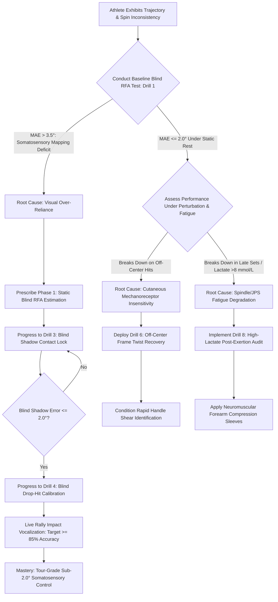

# ART-073: Somatosensory Feedback and Racket Face Angle Awareness

> **PRO CUE:** Racket Face Angle (RFA) at the instant of impact dictates **90% of ball launch direction and 80% of spin characteristics**. Ball-string dwell time is a fleeting **~4 ms**—far too fast for visual tracking. You cannot visually watch your stringbed at contact; you must **feel and control it** purely through somatosensory channels. Training your "RFA Sense" is the biological prerequisite for pinpoint ball placement.

## 1. Executive Summary & Athletic Intent

**Somatosensory Feedback** encompasses afferent neural signals streaming from muscle spindles, Golgi tendon organs (GTOs), joint capsule mechanoreceptors, and cutaneous tactile sensors across the fingers, palm, wrist, forearm, and shoulder. This system delivers **sub-millisecond, real-time spatial awareness of the Racket Face Angle (RFA)** entirely independent of visual input.

During a tennis impact, the ball remains compressed against the strings for approximately **3.5 to 4.5 ms**. The human visual pathway requires upwards of **100 ms** to process optical stimuli and transmit corrective commands down the corticospinal tract. Consequently, mid-collision optical correction is physiologically impossible. Shot outcome is dictated entirely by a combination of:
1. **Feedforward Motor Modeling:** Cerebellar pre-programming of the racket path and face orientation prior to impact ($T-150\text{ ms} \to \text{Impact}$).
2. **Somatosensory Proprioceptive Registration:** Microsecond afferent feedback from palmar mechanoreceptors and forearm spindles registering collision dynamics, torsional twist, and terminal face orientation.

An RFA deviation of merely **$1.0^\circ$** at impact alters horizontal launch trajectory by **$\sim 3.0^\circ$** and modulates Magnus topspin output by **$200\text{–}300\text{ RPM}$**. An RFA error exceeding **$5.0^\circ$** results in unforced errors, erratic depth dispersion, and frame shanks.

The athletic intent of this article is threefold:
1. **Demystify RFA Perception into a Trainable Proprioceptive Skill:** Move beyond vague notions of "touch" and "hand talent" to isolate the somatosensory receptors governing racket face orientation.
2. **Establish Strict Biomechanical Accuracy Tolerances:** Define the Mean Absolute Error (MAE) threshold of **$<2.0^\circ$** as the dividing line between amateur volatility and tour-level consistency.
3. **Operationalize the Blind RFA Calibration Protocol:** Deploy progressive sensory-deprivation training regimens that suppress visual compensation and hardwire somatosensory awareness into the primary somatosensory cortex (S1).

---

## 2. Biomechanical & Neurological Foundation

### 2.1 Biomechanical Determinants of RFA at Impact

RFA at the collision point is a multi-segmental summation of kinetic links across the upper extremity:

| Kinematic Subsystem | Contribution % | Active Adjustment Window | Correctable at Impact? |
| :--- | :--- | :--- | :--- |
| **Grip Architecture & Palmar Contact Pattern** | 30% | Pre-impact setup ($T-500\text{ ms}$) | **No** (Mechanically locked feedforward preset) |
| **Wrist Joint Alignment (Flex / Ext / Dev)** | 25% | $T-100\text{ ms} \to \text{Impact}$ | **Yes** (Spindle-mediated micro-adjustments) |
| **Forearm Pronation / Supination** | 20% | $T-50\text{ ms} \to \text{Impact}$ | **Yes** (Dynamic motor unit rate coding) |
| **Glenohumeral Internal / External Rotation** | 15% | $T-150\text{ ms} \to \text{Impact}$ | **Yes** (Kinetic chain proximal sequencing) |
| **Racket Frame Torsional Twist (Off-Center Strike)** | 10% | Impact window (3.5–4.5 ms) | **No** (Governed by polar moment of inertia $I_{zz}$) |

```
TOTAL RFA CONTROL DYNAMICS:
[Feedforward Pre-Impact Planning: ~80%] ──► Grip Preset (30%) + Arm Sequencing (50%)
                                                   │
                                                   ▼
[Terminal Somatosensory Feedback: ~20%] ──► Palmar Shear + Spindle Stretch (Afferent Lock)
```

**Biomechanical Takeaway:** While 80% of RFA is pre-programmed, the final 20% of rotational stability depends entirely on the player's somatosensory awareness to detect micro-deviations and calibrate future motor engrams.

### 2.2 Somatosensory Receptor Pathways Governing RFA

Five specialized receptor populations converge to generate internal racket face awareness:

| Receptor Class | Anatomical Locus | Transduced RFA Information | Afferent Latency |
| :--- | :--- | :--- | :--- |
| **Muscle Spindles (Group Ia & II)** | Wrist Extensor Carpi Ulnaris (ECU), Flexor Carpi Radialis (FCR), Pronator Teres | Dynamic wrist extension angle, forearm angular pronation velocity | **~20 ms (Ia fast)** |
| **Golgi Tendon Organs (GTO, Group Ib)** | Musculotendinous junctions of wrist and forearm flexors | Ball-stringbed impact force, collision resistance, structural load | **~30 ms** |
| **Joint Capsule Mechanoreceptors (Ruffini)** | Radiocarpal and distal radioulnar joint capsules | Extreme joint angle limits, static joint position sense (JPS) | **~25 ms** |
| **Cutaneous Mechanoreceptors (FA-I / SA-I)** | Glabrous skin of palmar surface and digits (thenar eminence) | Racket handle torque, shear friction, off-center torsional twist | **~15 ms (Meissner FA-I)** |
| **Vestibular / Cervical Proprioceptors** | Cervical facet joints and semicircular canals | Spatial orientation of head and upper torso relative to court horizon | **~10 ms** |

```
                       RECEPTOR AFFERENT CASCADE
  Muscle Spindles (Ia)   GTOs (Ib)   Cutaneous FA-I   Joint Ruffini
           │                │              │                │
           └────────────────┴──────┬───────┴────────────────┘
                                   │
                                   ▼
              [Dorsal Column-Medial Lemniscal Pathway]
                                   │
                                   ▼
             [Primary Somatosensory Cortex (S1 / Area 3a/3b)]
                     (Palmar & Hand Homunculus Map)
                                   │
                                   ▼
                   [Posterior Parietal Cortex (PPC)]
                 (Sensorimotor Integration: Area 5/7)
                                   │
                                   ▼
                    [Dorsal Premotor Cortex (PMd)]
              (Forward Model Comparison vs Efference Copy)
                                   │
                                   ▼
                   [Primary Motor Cortex (M1)]
                  (Micro-Adjusted Downstream Drive)
```

### 2.3 RFA Quantitative Accuracy Thresholds & Trajectory Impact

Minor variations in racket face angle produce exponential deviations downcourt:

| RFA Error from Target | Downcourt Trajectory Outcome | Spin Variance ($\Delta \text{RPM}$) | Competitive Proficiency Level |
| :--- | :--- | :--- | :--- |
| **$<1.0^\circ$** | Surgical target precision ($\pm 15\text{ cm}$ landing window) | $<\pm 50\text{ RPM}$ | **ATP / WTA Tour Elite** |
| **$1.0\text{–}2.0^\circ$** | Controlled depth and directional consistency | $\pm 100\text{–}200\text{ RPM}$ | **Division 1 / Challenger Pro** |
| **$2.0\text{–}3.0^\circ$** | Noticeable depth leakage; minor unforced errors | $\pm 300\text{–}500\text{ RPM}$ | **Advanced Club Competitor** |
| **$3.0\text{–}5.0^\circ$** | High error rate; balls sailing deep or dumping into net | $\pm 600\text{–}900\text{ RPM}$ | **Intermediate Amateur** |
| **$>5.0^\circ$** | Complete trajectory collapse; frame shanks and sprays | Severe spin loss ($>1000\text{ RPM}$) | **Beginner / Severe Neuromuscular Fatigue** |

$$\text{Downcourt Dispersion Distance} \approx L_{\text{court}} \times \tan(3 \times \Delta \text{RFA})$$

---

## 3. Step-by-Step Technical Execution

### Phase 1: Baseline RFA Proprioceptive Assessment

#### Drill 1: Static Blind RFA Angle Estimation
- **Setup:** The player sits or stands comfortably with eyes closed or blindfolded, holding their racket in their standard grip.
- **Protocol:** A coach or testing partner manually rotates the player's racket head to six predetermined angles: $-10^\circ$ (closed), $-5^\circ$, $0^\circ$ (perpendicular/neutral), $+5^\circ$, $+10^\circ$, and $+15^\circ$ (open).
- **Execution:** Relying purely on palmar cutaneous cues and wrist joint receptors, the athlete verbally estimates the exact face angle in degrees.
- **Dosage:** 3 cycles of 6 randomized angles (18 total estimations).
- **KPI:** Mean Absolute Error ($\text{MAE}$) calculated via:
  $$\text{MAE} = \frac{1}{n}\sum_{i=1}^n |\theta_{\text{estimated}} - \theta_{\text{actual}}| < 2.0^\circ$$

#### Drill 2: Terminal Impact Vocalization Call
- **Setup:** Live ball feed from opposing baseline.
- **Protocol:** The athlete executes standard groundstrokes. **Immediately upon ball collision**, before following through or tracking ball flight, the athlete loudly calls out their estimated RFA (e.g., *"Closed 4°"* or *"Open 2°"*).
- **Verification:** High-speed camera (240+ FPS) or racket butt-cap inertial sensor logs actual impact angle.
- **Target:** $\ge 80\%$ of verbal calls within $\pm 2.0^\circ$ of sensor ground truth.

---

### Phase 2: Blind RFA Somatosensory Calibration

#### Drill 3: Blind Shadow Contact Lock
- **Setup:** Athlete stands on baseline with eyes closed.
- **Execution:**
  1. Initiate an unhurried, full kinetic chain shadow stroke.
  2. Abruptly freeze the racket at the predicted forward strike window (40 cm in front of the lead hip).
  3. Hold isometrically for 3.0 seconds, actively focusing attention on the skin stretch of the thenar eminence and the tendon tension of the forearm.
  4. Announce the frozen RFA.
  5. The coach verifies the angle using a digital protractor/inclinometer aligned against the stringbed.
- **Dosage:** 4 sets of 5 target angles (Closed 5°, Neutral 0°, Open 5°, Open 10°, Open 15°).

#### Drill 4: Blind Drop-Hit Collision Calibration
- **Setup:** Athlete closes eyes at baseline. The coach drops a ball into the player's ideal forward hitting zone.
- **Execution:**
  1. The athlete tracks ball drop acoustic cues (release $\to$ bounce report).
  2. Swing through contact using purely internal somatosensory references.
  3. Call the estimated RFA immediately upon hearing string collision.
  4. The athlete must keep their eyes closed until the vocal call is finished.
- **Dosage:** 3 sets of 15 repetitions.
- **KPI:** $\ge 85\%$ accuracy within $\pm 2.0^\circ$.

#### Drill 5: Palmar Grip Pressure Mapping
- **Setup:** Athlete holds racket with eyes closed.
- **Protocol:** Systematic transitions between Continental (index knuckle on bevel 2), Eastern (bevel 3), and Semi-Western (bevel 4).
- **Sensory Focus:** Map how each grip alteration shifts the baseline resting RFA bias (e.g., Semi-Western naturally produces a $15\text{–}20^\circ$ downward/closed tilt at natural wrist rest). Calibrate hand relaxation pressure to exactly 3/10 on the subjective squeeze scale to maximize cutaneous mechanoreceptor sensitivity.

---

### Phase 3: Perturbation Adaptation & Torsional Detection

#### Drill 6: Off-Center Frame Twist Recovery
- **Setup:** Coach feeds balls deliberately aimed at the extreme perimeter of the stringbed (toe, heel, upper tip).
- **Execution:** Upon collision, the athlete must instantly categorize the torsional twist:
  - **Tip/Toe Collision:** Induces handle supination (racket face forced open).
  - **Heel/Throat Collision:** Induces handle pronation (racket face forced shut).
  - The athlete must identify the twist direction and estimate the angular deflection before the ball crosses the net.
- **Dosage:** 20 repetitions.
- **KPI:** $100\%$ directional detection accuracy; RFA estimation error $<3.0^\circ$.

#### Drill 7: Optical Occlusion at Kinetic Slot (T-200 ms Shutoff)
- **Setup:** Live rally. Coach strikes varying spin types (heavy topspin, sharp slice, dead flat).
- **Execution:**
  1. Athlete visually tracks incoming ball trajectory through court bounce.
  2. At approximately $T-200\text{ ms}$ (racket slot drop), the athlete **shuts their eyes**.
  3. The stroke and contact execution are performed purely on feedforward somatosensory models.
  4. Athlete calls out the required micro-adjustment: *"Closed 3° for topspin"* or *"Opened 4° for slice"*.
- **Dosage:** 20 live rally balls.

---

### Phase 4: High-Lactate & Fatigue Resistance

#### Drill 8: Post-Exertion RFA Stress Audit
- **Protocol:** Immediately following an intense anaerobic interval block (on-court suicides or ball-machine sprints producing blood lactate $>8.0\text{ mmol/L}$), administer Drills 1 and 4.
- **Evaluation:** Compare fatigue MAE to fresh baseline. An error increase $\le 1.0^\circ$ confirms high neuro-somatosensory fatigue resistance.

---

## 4. Performance Metrics & Training Dosage

### 4.1 Diagnostic Performance Benchmarks

| Quantitative Metric | Level 1: Visual Trapped | Level 2: Emerging | Level 3: Functional | Level 4: Tour Mastery |
| :--- | :--- | :--- | :--- | :--- |
| **Blind RFA Estimation (MAE)** | $>5.0^\circ$ | 3.5–5.0° | 2.0–3.5° | **$<2.0^\circ$ (Tour Elite)** |
| **Terminal Impact Vocalization Accuracy ($\pm 2^\circ$)** | $<50\%$ | 50–70% | 70–88% | **$>90\%$ verified calls** |
| **Off-Center Frame Twist Detection** | $<60\%$ accuracy | 60–80% | 80–95% | **$100\%$ instantaneous detection** |
| **Occluded Contact Execution Rate (Drill 7)** | $<45\%$ | 45–65% | 65–80% | **$>85\%$ clean center strikes** |
| **High-Lactate Proprioceptive Drift ($\Delta \text{MAE}$)** | $>3.5^\circ$ degradation | 2.0–3.5° | 1.0–2.0° | **$<1.0^\circ$ drift under fatigue** |
| **Rally Topspin Coefficient of Variation ($\text{CV}\%$)** | $>10\%$ | 7–10% | 4–7% | **$<3.0\%$ (Surgical spin consistency)** |

### 4.2 Structured Weekly Training Dosage

```
┌────────────────────────────────────────────────────────────────────────┐
│                   SOMATOSENSORY RFA TRAINING DOSAGE                    │
├────────────────────────────────────────────────────────────────────────┤
│ DAILY TECHNICAL WARM-UP (5 Min):                                       │
│ • Blind Shadow Contact Lock: 5 target angles x 2 reps (10 reps total)  │
│ • Palmar Grip Pressure Calibration (Maintain 3/10 grip index)          │
│                                                                        │
│ DEDICATED SENSORY CALIBRATION (15 Min - 3x/week):                      │
│ • Blind Drop-Hit Collision Drilling: 30 reps                           │
│ • Off-Center Frame Twist Detection: 15 reps                            │
│ • Optical Occlusion at Kinetic Slot (T-200 ms): 15 reps                │
│                                                                        │
│ RALLY INTEGRATION (10 Min - 2x/week):                                  │
│ • Live Groundstroke Impact Calling: 20 random spot-check points        │
│                                                                        │
│ FATIGUE TOLERANCE AUDIT (Post-Intensity Session - 1x/week):            │
│ • 10 Blind Drop-Hits immediately following anaerobic conditioning      │
└────────────────────────────────────────────────────────────────────────┘
```

---

## 5. Errors, Causes & Correction Protocols

| Observable Mechanical / Trajectory Error | Root Neurobiological Etiology | Precision Correction Protocol |
| :--- | :--- | :--- |
| **Unpredictable groundstroke trajectory; erratic spray deep or into net** | Lack of somatosensory cortical mapping; athlete relies on delayed optical feedback to correct racket face. | Mandate Blind Drop-Hit drills (Drill 4). Enforce the verbal constraint: *"Feel the face through the palm, do not chase it with the eye."* |
| **Inconsistent topspin production (alternating flat drives and thin shanks)** | Dynamic RFA variance at impact exceeding $\pm 4.0^\circ$; variable wrist flexion angle. | Execute Blind Shadow Contact Locks (Drill 3) with a digital inclinometer; lock thenar eminence firmness against handle bevel. |
| **Shanked off-center hits cause total loss of stroke control** | Cutaneous mechanoreceptors failing to transduce handle shear torque; lack of compensatory grip stability. | Off-Center Perturbation drills (Drill 6); practice identifying whether stringbed collision occurred above or below the horizontal centerline. |
| **Severe technical collapse under high physical fatigue (Set 3)** | Elevated systemic lactate and extracellular $H^+$ ions impairing muscle spindle intrafusal sensitivity and JPS. | Implement Post-Exertion RFA Audits (Drill 8); integrate forearm ischemic preconditioning; wear targeted neuromuscular compression sleeves. |
| **Extreme downward face angle (closed) on crucial high-pressure points** | Sympathetic surge causing excessive grip over-clamping ($>7/10$ pressure), freezing forearm pronator muscles in a closed position. | 16-Second Reset routine (ART-044); active somatic cue: *"Soften the fingers to 3/10; let the stringbed breathe."* |
| **Player unable to feel differences between racket grip bevels** | Cutaneous mechanoreceptor desensitization due to worn overgrips or thick callous accumulation. | Replace overgrips every 3–4 sets; conduct palmar desensitization brushing prior to stepping on court. |

---

## 6. Diagnostic Diagram & Decision Flow



---

## 7. Video Demonstration & Technical Analysis

<div class="video-container" style="position:relative;padding-bottom:56.25%;height:0;overflow:hidden;border-radius:12px;">
  <iframe src="https://www.youtube-nocookie.com/embed/VIDEO_ID_PLACEHOLDER"
          style="position:absolute;top:0;left:0;width:100%;height:100%;border:0;"
          allow="accelerometer; autoplay; clipboard-write; encrypted-media; gyroscope; picture-in-picture"
          allowfullscreen
          title="Somatosensory Feedback and Racket Face Angle Awareness — Technical Biomechanical Analysis"></iframe>
</div>

*Recommended Technical Video Breakdown: 1,000 FPS ultra-high-speed camera capture of the ball-string interaction showing 4 ms dwell dynamics correlated with high-density palmar pressure sensor arrays; surface electromyography (sEMG) of the extensor carpi ulnaris and pronator teres demonstrating dynamic rate coding during RFA adjustments; functional MRI neuroimaging comparing primary somatosensory cortex (S1) activation in visual-dependent vs. somatosensory-calibrated performers.*

---

## 8. Cross-Domain Synergy & Multi-Pillar Integration

- **With Joint Position Sense under Fatigue (ART-058):** RFA awareness represents the tennis-specific operationalization of wrist and forearm JPS. Mitigating peripheral lactate buildup directly shields spindle sensitivity.
- **With Motor Imagery & Internal Models (ART-059):** Visualizing the tactile sensation of racket face angles activates the same somatosensory-motor networks used during physical execution, reinforcing cerebellar forward internal models.
- **With Quiet Eye & Gaze Fixation (ART-041, ART-055):** Anchoring gaze on the contact zone does not allow the player to see the face; rather, it stabilizes the head and cervical vestibular apparatus, establishing a rock-solid spatial reference frame for somatosensory tracking.
- **With Elimination of Conscious Override (ART-074):** Consciously trying to visually control the racket face guarantees late, rigid mechanics. Relinquishing control to subcortical somatosensory pathways automates surgical precision.
- **With Ecological Affordance Perception (ART-067):** Recognizing shot affordances instantly sets the required feedforward RFA: offensive put-aways demand a forward-closing face, while emergency defensive stabs require an open orientation.
- **With Stress & Grip Clamping (ART-054, ART-072):** High cortisol and acute match stress induce excessive grip clamping, desensitizing palmar cutaneous receptors and freezing dynamic RFA micro-adjustments.

---

## 9. Self-Assessment Rubric

| Diagnostic Checkpoint | Level 1: Visual Dependent | Level 2: Somatosensory Emerging | Level 3: RFA Functional | Level 4: RFA Master |
| :--- | :--- | :--- | :--- | :--- |
| **Static Blind RFA MAE** | $>5.0^\circ$ error | 3.5–5.0° error | 2.0–3.5° error | **$<2.0^\circ$ tour-level precision** |
| **Impact Vocalization Accuracy** | $<50\%$ calls correct | 50–70% correct | 70–88% correct | **$>90\%$ calls within $\pm 2.0^\circ$** |
| **Torsional Twist Detection** | Cannot identify twist ($<60\%$) | Identifies major mis-hits | Quick detection (80–95%) | **$100\%$ instant directional recognition** |
| **Occluded Strike Execution** | Misses ball completely ($<45\%$) | Makes erratic contact | Clean contact (65–80%) | **$>85\%$ solid sweet-spot strikes** |
| **Fatigue Resilience ($\Delta \text{MAE}$)** | Error jumps $>3.5^\circ$ | Error increases 2.0–3.5° | Controlled drift (1.0–2.0°) | **Impervious to fatigue ($<1.0^\circ$ drift)** |

**Scoring Interpretation:**
- **5–8 Points:** Severe Visual Trapping. Racket orientation is entirely divorced from somatic perception; severe unforced error risk.
- **9–12 Points:** Developing Somatosensory Awareness. Basic proprioception exists during static feeds, but breaks down under dynamic rally conditions.
- **13–16 Points:** Functional RFA Calibration. Reliable proprioceptive sense allows for rapid in-match micro-adjustments.
- **17–20 Points:** Tour-Caliber Somatosensory Mastery. Sub-degree racket face awareness operating automatically through subcortical networks.

---

## 10. Printable Practice Card (Pocket Drill Card)

```
┌────────────────────────────────────────────────────────────────────────┐
│             POCKET DRILL CARD: SOMATOSENSORY RFA AWARENESS             │
│ Target: Blind MAE <2.0° | Impact Call >90% | Twist Detection 100%       │
├────────────────────────────────────────────────────────────────────────┤
│ PHASE A: SENSORY ACTIVATION & CALIBRATION (5 MIN)                      │
│ • Blind Shadow Contact Lock: 5 target angles (-5° to +15°) x 2 reps.   │
│ • Freeze 3s at strike window ──► Feel palmar stretch ──► Verify angle. │
│ • Cue: "Close the eyes. The palm knows where the strings point."        │
├────────────────────────────────────────────────────────────────────────┤
│ PHASE B: BLIND COLLISION REPS (15 MIN)                                 │
│ • 20 Blind Drop-Hits: Drop ──► Swing ──► Call RFA before opening eyes. │
│ • 15 Off-Center Perturbations: Detect handle twist (toe vs. heel).     │
│ • Target: >= 85% of verbal calls within +/- 2.0° of sensor reality.    │
│ • Cue: "Hit — Feel — Call. Never look for the face."                   │
├────────────────────────────────────────────────────────────────────────┤
│ PHASE C: DYNAMIC OCCLUSION & RALLY INTEGRATION (10 MIN)                │
│ • Rally groundstrokes: Eyes shut at kinetic slot (T-200 ms).           │
│ • Call dynamic RFA adjustment upon collision.                          │
│ • Cue: "Read spin with the eye; shape the trajectory with the hand."   │
├────────────────────────────────────────────────────────────────────────┤
│ PHASE D: HIGH-INTENSITY SENSORY AUDIT (5 MIN)                          │
│ • 10 Blind Drop-Hits immediately post-sprint workout.                  │
│ • Gate: 3 consecutive sessions with MAE < 2.0° and Twist ID = 100%.    │
└────────────────────────────────────────────────────────────────────────┘
```

---

*Cross-References: ART-041, ART-054, ART-055, ART-058, ART-059, ART-067, ART-069, ART-072, ART-074. Pillar II: Neurological Mechanics & Sports Neuroscience — TennisKB 200 Series.*
