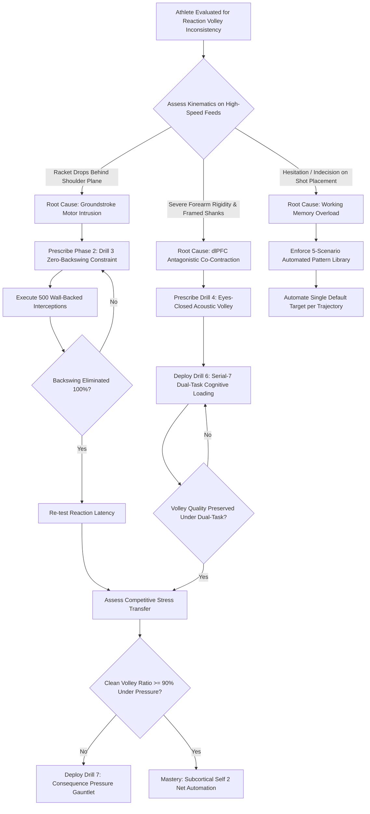

# ART-074: Conscious Override Elimination in Reaction Volleys

> **PRO CUE:** A reaction volley is a pure **subcortical reflex circuit** ($<150\text{ ms}$). Conscious prefrontal deliberation requires $300\text{–}500\text{ ms}$—any cortical intrusion guarantees **delayed preparation, antagonistic muscle co-contraction, and framed shanks**. Do not think; intercept and redirect. Train Self 2: actively silence the conscious prefrontal cortex to unleash automated net reflexes.

## 1. Executive Summary & Athletic Intent

**Conscious Override** is the neuro-motor pathology wherein the **Dorsolateral Prefrontal Cortex (dlPFC / Self 1)** intrudes upon and disrupts automated, subcortical motor engrams governed by the **Cerebellum, Basal Ganglia, and Brainstem Reticular Formation (Self 2)** during severe time-constrained exchanges.

In rapid net exchanges, an opponent's passing shot or baseline drive launched from 10 meters away at 120–140 km/h reaches the net player in **$250\text{–}300\text{ ms}$**. The biological timeline reveals a stark dichotomy:
- **Subcortical Visuomotor & Acoustic Reflex Loop:** Transits the tectospinal and reticulospinal pathways to trigger split-step unweighting, unit-turn framing, and racket positioning within **$100\text{–}150\text{ ms}$**.
- **Conscious Prefrontal Analytical Loop:** Traverses the ventral visual stream, working memory buffers, and executive decision networks, requiring **$300\text{–}500\text{ ms}$** before transmitting a voluntary motor command.

When the conscious mind attempts to deliberate (*"Should I punch down the line or drop it cross-court?"*), this processing delay directly overlaps the impact window. The resulting corticospinal command collides with the subcortical engram, triggering **antagonistic co-contraction (simultaneous flexor/extensor muscle clenching)**, an involuntary hitch in the swing path, and high-frequency shanking.

The athletic intent of this article is threefold:
1. **Delineate the Strict "No-Conscious Zone":** Establish the temporal window from **$T-200\text{ ms}$ to $T+100\text{ ms}$** surrounding contact as an absolute prefrontal blackout zone.
2. **Operationalize Top-Down Inhibitory Control:** Train the Right Inferior Frontal Gyrus (rIFG) and pre-supplementary motor area (pre-SMA) to actively suppress analytical chatter.
3. **Deploy Constraint-Led & Dual-Task Regimens:** Enforce Zero-Backswing constraints, Eyes-Closed acoustic triggers, and concurrent cognitive loading to forcibly bypass cortical processing and hardwire tour-grade reaction volleys.

---

## 2. Biomechanical & Neurological Foundation

### 2.1 Timeline: Subcortical Reflex vs. Conscious Deliberation

The fundamental processing paths for incoming visual stimuli diverge into two separate neurological streams:

```
STIMULUS: OPPONENT IMPACT (T = 0 ms)
       │
       ▼
[Retinal Photoreceptors] ──► [LGN Thalamus] ──► [Primary Visual Cortex (V1)]
       │
       ├───────────────────────────────────────────────────────┐
       ▼ (Dorsal "Where / How" Stream)                         ▼ (Ventral "What" Stream)
[Middle Temporal Area (MT / V5)]                        [Inferotemporal Cortex (IT)]
Motion vector & speed computation (~40 ms)               Object identification (~100 ms)
       │                                                       │
       ▼                                                       ▼
[Posterior Parietal Cortex (PPC)]                       [Dorsolateral PFC (dlPFC)]
Spatial transformation & motor priming (~70 ms)          Conscious evaluation & choice (~200 ms)
       │                                                       │
       ▼                                                       ▼
[Subcortical Engine: Cerebellum & Basal Ganglia]        [Premotor / Supplementary Motor Area]
Pre-programmed motor program selection (~110 ms)         Deliberate motor programming (~320 ms)
       │                                                       │
       ▼                                                       ▼
[Brainstem / Reticulospinal & Corticospinal Tracts]     [Corticospinal Motor Command]
Rapid, fluid strike execution                           LATE, OVER-THOUGHT EXECUTION
TOTAL TIME: ~120–150 ms                                 TOTAL TIME: ~350–500 ms
[SUBCORTICAL REFLEX: CLEAN IMPACT]                      [CONSCIOUS OVERRIDE: FRAMED ERROR]
```

**The "No-Conscious Zone":** Between $T-200\text{ ms}$ (the moment the opponent's shot trajectory is established) and $T+100\text{ ms}$ (post-impact follow-through), any conscious prefrontal intervention causes mechanical chaos. The conscious mind must be relegated to tactical briefing *between points*, never during ball transit.

### 2.2 Biomechanical & Clinical Signs of Conscious Override

When the prefrontal cortex overrides automated motor programs, distinct kinematic symptoms appear:

| Observable Diagnostic Sign | Biomechanical Presentation | Root Neurobiological Mechanism |
| :--- | :--- | :--- |
| **"Late Preparation / Frozen Feet"** | Split-step unweighting occurs after ball crosses net; racket dropped late. | PFC computational delay ($>300\text{ ms}$) holding back subcortical initiation. |
| **"Antagonistic Co-Contraction"** | Rigid forearm; white-knuckle grip pressure ($>8/10$); zero stringbed compliance. | Simultaneous activation of forearm flexors and extensors driven by conscious panic commands. |
| **"Late Backswing Hitch"** | Racket head is drawn backward behind the shoulder plane right before impact. | Conscious habit of trying to "generate power" like a baseline groundstroke. |
| **"Framed Shank / Double-Hit"** | Ball clips frame edge; sudden mid-swing racket face angle (RFA) flutter. | Last-millisecond prefrontal micro-correction overriding cerebellar feedforward trajectory. |
| **"Placement Paralysis"** | Hesitant push into the net or wildly wide; indecision on court target. | Working memory overload attempting multi-choice evaluation under extreme time constraints. |
| **"Audible Self-Talk at Impact"** | Player mutters *"Punch!"*, *"Watch it!"*, or grunts in self-rebuke mid-stroke. | Left-hemisphere Broca's area interference contaminating bilateral motor planning. |

### 2.3 Top-Down Inhibitory Control: The Paradox of Prefrontal Self-Silencing

Silencing conscious thought is not a passive absence of effort; it is an **active, energy-consuming neurological inhibition**:
- **Right Inferior Frontal Gyrus (rIFG):** The cortical "brake" that actively suppresses internal verbalization and analytical second-guessing.
- **Pre-Supplementary Motor Area (pre-SMA):** Inhibits unwanted voluntary motor plans to allow subcortical pattern generators to command the limbs.
- **Attentional Externalization:** Focusing attention strictly outward (e.g., locking gaze on ball seams or listening for impact acoustic pop) consumes cognitive bandwidth, physically preventing the prefrontal cortex from generating internal analytical interference.

---

## 3. Step-by-Step Technical Execution

### Phase 1: Override Detection & Self-Diagnostic Awareness

#### Drill 1: Vocalized Thought Ejection Protocol
- **Setup:** Feeder positioned 4 meters away with a basket of balls or using a high-velocity ball machine firing drives at 80–100 km/h.
- **Protocol:** The athlete reacts and volleys. **At the precise instant of impact**, the athlete loudly states their internal cognitive status:
  - If mind was silent: shout *"BLANK"* or *"CLEAN"*.
  - If conscious thought occurred (*"Go cross"*, *"Don't miss"*, *"Firm wrist"*): shout *"OVERRIDE"*.
- **Dosage:** 3 sets of 20 rapid-fire feeds.
- **KPI:** Achieve $>90\%$ verified "Clean" trials across 60 balls.

#### Drill 2: High-Speed Kinematic Video Breakdown
- **Setup:** 240 FPS camera aligned down the baseline and perpendicular to the net player.
- **Audit Criteria:** Inspect the video for the classic "Override Signature":
  1. Did the racket move backward past the lead shoulder plane?
  2. Did the wrist flex or extend right before impact?
  3. Was the follow-through abbreviated and rigid?
- Any positive check confirms cortical interference requiring constraint-led remediation.

---

### Phase 2: Subcortical Volley Conditioning (Constraint-Led Regimens)

#### Drill 3: The Zero-Backswing Physical Constraint
- **Setup:** Athlete stands in an athletic ready position 1.5 meters from the net. A physical boundary (a tennis fence, court screen, or wall) is positioned directly behind their back (within 10 cm of their heels).
- **Execution:**
  1. Feeder fires high-speed drives directly at the athlete.
  2. The athlete is physically blocked from taking any backswing.
  3. The racket is positioned out in front in the forward strike window. The volley is executed purely via **forward body mass transfer, shoulder anchoring, and isometric wrist stability**.
- **Dosage:** 4 sets of 15 repetitions.
- **Pro Cue:** *"The racket waits in front—never hunt backward."*

```
ZERO-BACKSWING GEOMETRY:
[Physical Wall / Barrier] ──► [Athlete Posture] ──► [Racket Held 30 cm Out Front]
     (Backswing Banned)                                     │
                                                            ▼
                                                [Direct Forward Punch: 5 cm Linear Travel]
```

#### Drill 4: Eyes-Closed Acoustic Reflex Volley
- **Setup:** Athlete stands at the net with eyes closed. Feeder positioned at opposing baseline or mid-court.
- **Execution:**
  1. The athlete eliminates optical processing entirely.
  2. The acoustic "POP" of the feeder's stroke (ART-071) serves as the instantaneous split-step and punch trigger.
  3. The athlete executes the forward block toward the acoustic center of the court.
  4. The athlete opens their eyes **strictly after** ball separation from their strings.
- **Dosage:** 3 sets of 12 balls.
- **Neurological Effect:** Totally severs the ventral visual-PFC loop, forcing the nervous system to rely exclusively on subcortical auditory-somatosensory pathways.

#### Drill 5: Metronome Rhythmic Entrainment
- **Setup:** Acoustic metronome calibrated to 3.5 Hz (285 ms intervals).
- **Execution:** Feeder rhythms balls exactly on beat 1. Athlete must execute contact exactly on beat 2.
- **Cognitive Impact:** Externalizing the timing window to an auditory oscillator bypasses internal executive deliberation, forcing subcortical cerebellar rhythm generators to take command.
- **Dosage:** 30 consecutive synchronized repetitions.

---

### Phase 3: Cognitive Loading & Prefrontal Occupation

To prevent the conscious mind from meddling in motor execution, intentionally saturate its working memory capacity with an unrelated cognitive task:

#### Drill 6: Dual-Task Cognitive Volley
- **Setup:** High-tempo reaction volley exchange at the net.
- **Execution:** While executing reaction volleys against high-speed feeds, the athlete must simultaneously perform complex mental arithmetic:
  - **Option A (Serial Subtraction):** Count backward from 100 by 7s aloud with each strike (100, 93, 86, 79...).
  - **Option B (Phonological Scrambling):** Recite the alphabet backward or name alternating capital cities.
- **Neurological Target:** Working memory in the dlPFC is 100% occupied by the arithmetic task, leaving **zero available bandwidth** to consciously override the volley.
- **KPI:** Volley mechanical consistency, sweet-spot accuracy, and placement depth must suffer $<10\%$ degradation compared to single-task conditions.

#### Drill 7: Consequence Pressure Volley Challenge
- **Setup:** 10-ball sudden-death volley gauntlet.
- **Rules:** Clean target hit = $+1$ point; Frame or missed target = $-2$ points; Unforced net error = 15 push-ups immediately.
- **Cognitive Rule:** Athlete is allowed **only one single-word external cue** prior to the feed: *"TARGET"*, *"BLOCK"*, or *"PUNCH"*. Any internal analytical self-talk triggers immediate forfeit of the point.

---

### Phase 4: Self 2 Automated Tactical Volley Library

Pre-program five mandatory subcortical responses to eliminate tactical second-guessing:

| Scenario / Trajectory | Self 2 Automated Engram (Pre-Programmed) | Conscious Override Failure Trap |
| :--- | :--- | :--- |
| **High-Pace Body Jammer** | Tuck dominant elbow into ribcage; punch racket throat forward; absorb pace. | *"Should I hit a forehand or backhand?"* $\to$ Jammed frame. |
| **Shoelace Low Volley** | Drop center of mass via deep knee flexion; open face $10^\circ$; lift with legs. | *"Don't dump it in the net!"* $\to$ Rushed wrist flick. |
| **Shoulder-Height Floater** | Step across lead leg; lock wrist isometrically; drive linear punch down and deep. | *"Smash or volley?"* $\to$ Decelerated swing stall. |
| **Wide Passing Shot Stab** | Dynamic lateral crossover; extend racket arm as a rigid lever; redirect angle. | *"Can I reach it?"* $\to$ Hesitant late reach. |
| **Rapid Reflex Net Firefight** | Keep head immobile; anchor eyes on contact zone; let hands mirror incoming ball. | *"Where is he standing?"* $\to$ Complete whiff. |

---

## 4. Performance Metrics & Training Dosage

### 4.1 Diagnostic Performance Benchmarks

| Quantitative Metric | Level 1: Override Trapped | Level 2: Conscious Leakage | Level 3: Subcortical Functional | Level 4: Self 2 Tour Mastery |
| :--- | :--- | :--- | :--- | :--- |
| **Clean Volley Ratio (Zero Override)** | $<50\%$ verified clean | 50–70% clean | 70–88% clean | **$>95\%$ automated execution** |
| **Reaction Latency (Impact $\to$ Punch)** | $>200\text{ ms}$ | 160–200 ms | 125–160 ms | **$<120\text{ ms}$ (Tour Elite)** |
| **Zero-Backswing Mechanical Compliance** | $<60\%$ compliance | 60–80% compliance | 80–95% compliance | **$100\%$ rock-solid forward slot** |
| **Eyes-Closed Acoustic Volley Accuracy** | $<40\%$ solid contact | 40–60% solid contact | 60–80% solid contact | **$>85\%$ centered sweet-spot strikes** |
| **Dual-Task Cognitive Performance Drop** | $>30\%$ quality loss | 20–30% quality loss | 10–20% quality loss | **$<5\%$ quality variance** |
| **Internal Verbal Self-Talk Frequency** | $>35\%$ of points | 20–35% of points | 5–20% of points | **$<3\%$ (Complete internal silence)** |

### 4.2 Structured Weekly Training Dosage

```
┌────────────────────────────────────────────────────────────────────────┐
│               SUBCORTICAL REACTION VOLLEY DOSAGE MATRIX                │
├────────────────────────────────────────────────────────────────────────┤
│ DAILY NEURAL PRIMING (5 Min):                                          │
│ • Zero-Backswing Shadow Framing against Wall: 30 reps                   │
│ • Verbal Thought Ejection Check (Confirm "Blank Mind" state)           │
│                                                                        │
│ TECHNICAL REACTIVE BLOCKS (20 Min - 3x/week):                          │
│ • High-Speed Rapid Volley Feeds (80-100 km/h, 4m distance): 40 reps   │
│ • Eyes-Closed Acoustic Trigger Volleys: 20 reps                        │
│ • Metronome Rhythmic Synchronizations (3.5 Hz): 30 reps                │
│                                                                        │
│ COGNITIVE LOAD & PRESSURE GAUNTLET (15 Min - 2x/week):                 │
│ • Serial-7 Subtraction Dual-Task Volleys: 3 sets x 15 reps             │
│ • 10-Ball Sudden-Death Consequence Volley Gauntlet: 2 cycles          │
│                                                                        │
│ COMPETITIVE TRANSFER (15 Min - 2x/week):                               │
│ • Fast Reflex Net-to-Net Firefight Doubles Drills                     │
└────────────────────────────────────────────────────────────────────────┘
```

---

## 5. Errors, Causes & Correction Protocols

| Observable Biomechanical Error | Root Neuro-Cognitive Etiology | Precision Correction Protocol |
| :--- | :--- | :--- |
| **Racket takes a looping backswing behind the torso at the net** | Groundstroke habit regression; prefrontal cortex attempting to generate active muscular acceleration. | Enforce Drill 3 (Wall-backed zero-backswing constraint) for 500+ reps until backswing motor program is completely overwritten. |
| **Rigid, clutched grip; framed shanks and zero touch on drop volleys** | Prefrontal stress panic triggering simultaneous agonist-antagonist co-contraction. | Eyes-Closed Acoustic Volley (Drill 4); enforce a subjective grip pressure index of 3/10; practice catching balls on strings without bounce. |
| **Motor freezing; athlete unable to move feet when ball is hit directly at them** | Amygdala-dlPFC threat response producing autonomic immobilization. | Implement the 16-Second Cure (ART-044); anchor on external somatic cue: *"Sink hips, hands forward."* |
| **Indecision on target selection; missing routine floaters into the net** | Prefrontal working memory overload from evaluating multiple tactical options mid-flight. | Restrict player to the 5-Pattern Tactical Library (Section 3, Phase 4); automate one non-negotiable target per ball height. |
| **Persistent negative verbal self-talk (*"Watch the ball! Don't miss!"*)** | Left-hemisphere Broca's area analytical interference contaminating motor output. | Deploy Serial-7 Dual-Task drills (Drill 6); occupy the verbal loop with counting or singing to liberate subcortical execution. |
| **Superb volley form during calm drills collapsing under tournament pressure** | State-dependent learning deficit; motor engrams trained without neuroendocrine stress transfer poorly. | Integrate progressive Stress Inoculation Training (Drill 7) with physiological consequences and public accountability. |

---

## 6. Diagnostic Diagram & Decision Flow



---

## 7. Video Demonstration & Technical Analysis

<div class="video-container" style="position:relative;padding-bottom:56.25%;height:0;overflow:hidden;border-radius:12px;">
  <iframe src="https://www.youtube-nocookie.com/embed/VIDEO_ID_PLACEHOLDER"
          style="position:absolute;top:0;left:0;width:100%;height:100%;border:0;"
          allow="accelerometer; autoplay; clipboard-write; encrypted-media; gyroscope; picture-in-picture"
          allowfullscreen
          title="Conscious Override Elimination in Reaction Volleys — Technical Biomechanical Analysis"></iframe>
</div>

*Recommended Technical Video Breakdown: High-density multi-channel EEG contrasting frontal theta/beta power (reflecting prefrontal cognitive load) during conscious override vs. occipital-parietal alpha synchronization during subcortical flow states; 240 FPS high-speed split-screen kinematics showing subcortical compact blocking (~110 ms response) versus conscious delayed lunging (~320 ms response); surface electromyography (sEMG) demonstrating agonist-antagonist co-contraction eradication during Dual-Task training.*

---

## 8. Cross-Domain Synergy & Multi-Pillar Integration

- **With Self 1 vs. Self 2 Motor Mechanics (ART-045):** Reaction volley execution is the quintessential laboratory for silencing Self 1. The conscious mind designs the game plan between points; Self 2 executes without interference during points.
- **With Auditory Priming & Startle Reflexes (ART-071):** The acoustic "pop" of the ball departing the opponent's racket acts as the direct subcortical trigger for split-step unweighting, bypassing the slow visual-cortical loop.
- **With Somatosensory RFA Awareness (ART-073):** Stabilizing the racket face at net relies entirely on feedforward somatosensory models and palmar cutaneous mechanoreceptors, rendering visual checks obsolete.
- **With Quiet Eye & Gaze Fixation (ART-041, ART-055):** On reaction volleys, Quiet Eye gaze locks firmly on the forward contact zone rather than attempting impossible optical tracking, stabilizing the head and subcortical coordination.
- **With Cognitive Load Reduction & Tactical Heuristics (ART-053, ART-060):** Pre-programmed tactical heuristics offload prefrontal working memory, preventing mid-rally decision paralysis.
- **With Stress Resilience & Cortisol Management (ART-072):** Severe match stress causes amygdala hyper-arousal, which can trigger conscious freezing or panic overrides. Stress inoculation protocols build resilience against neuroendocrine hijacking.
- **With Inter-Hemispheric Brain Synchronization (ART-070):** Rapid switching between forehand and backhand volleys demands microsecond transcallosal communication; conscious verbal interference severely disrupts this bilateral coordination.

---

## 9. Self-Assessment Rubric

| Diagnostic Checkpoint | Level 1: Override Trapped | Level 2: Conscious Leakage | Level 3: Subcortical Functional | Level 4: Self 2 Master |
| :--- | :--- | :--- | :--- | :--- |
| **Clean Volley Ratio** | $<50\%$ clean; constant hesitation | 50–70% clean hits | 70–88% clean hits | **$>95\%$ pure subcortical reflexes** |
| **Reaction Latency** | Slow, lunging ($>200\text{ ms}$) | Sluggish ($160\text{–}200\text{ ms}$) | Crisp ($125\text{–}160\text{ ms}$) | **Explosive ($<120\text{ ms}$)** |
| **Zero-Backswing Form** | Drops racket back constantly | Occasional backswing hitch | Racket stays in forward plane | **$100\%$ disciplined forward slot** |
| **Dual-Task Stability** | Mechanics fall apart ($>30\%$ loss) | Noticeable accuracy drop | Minor variance (10–20%) | **Impervious to cognitive load ($<5\%$)** |
| **Acoustic Reflex Strike** | Misses ball completely ($<40\%$) | Irregular contact (40–60%) | Solid contact (60–80%) | **$>85\%$ clean sweet-spot strikes** |
| **Internal Mental State** | Noisy chatter, self-rebuke | Frequent conscious thinking | Quiet mind with minor lapses | **Total silence; pure flow state** |

**Diagnostic Scoring Key:**
- **6–10 Points:** Acute Conscious Paralysis. Severe prefrontal override; complete kinetic breakdown at the net; mandatory zero-backswing and acoustic retraining required.
- **11–15 Points:** Transitional Stage. Basic reflexes present during predictable feeds, but collapses into overthinking under match pressure.
- **16–20 Points:** Subcortical Functional. Reliable reflex execution; occasional conscious intrusions on high floating balls.
- **21–24 Points:** Tour-Caliber Self 2 Master. Complete automation; lightning-fast reflexes operating independently of cognitive load.

---

## 10. Printable Practice Card (Pocket Drill Card)

```
┌────────────────────────────────────────────────────────────────────────┐
│             POCKET DRILL CARD: SUBCORTICAL REACTION VOLLEYS            │
│ Target: Clean Volleys >90% | RT <130 ms | Dual-Task Degradation <5%    │
├────────────────────────────────────────────────────────────────────────┤
│ PHASE A: CONSTRAINT-LED CALIBRATION (5 MIN)                            │
│ • Stand 1.5m from net with physical barrier behind back (no backswing).│
│ • 20 Rapid feeds: Punch forward mass transfer only.                    │
│ • Cue: "The racket waits in front. Never hunt backward."               │
├────────────────────────────────────────────────────────────────────────┤
│ PHASE B: SUBCORTICAL REFLEX CORE (15 MIN)                              │
│ • 15 Eyes-Closed Acoustic Volleys: Split and punch purely on pop sound.│
│ • 20 Metronome Synchronizations: Strike exactly on 3.5 Hz beat.        │
│ • Target: Clean sweet-spot contact rate >= 80%.                        │
│ • Cue: "Ear leads, body moves. Zero thinking."                         │
├────────────────────────────────────────────────────────────────────────┤
│ PHASE C: COGNITIVE LOADING & PRESSURE (10 MIN)                         │
│ • 20 Volleys while serial-subtracting 7s aloud (100, 93, 86...).      │
│ • 10 Sudden-Death Pressure Volleys (miss = penalty push-ups).          │
│ • Cue: "Brain is busy counting—hands are free to strike."               │
├────────────────────────────────────────────────────────────────────────┤
│ PHASE D: SELF-DIAGNOSTIC AUDIT (5 MIN)                                 │
│ • Log Video Clean Volley % and Verbal Thought Status (Blank vs. Talk). │
│ • Gate: 3 consecutive gauntlets with Clean Volleys >90% & Self-Talk <5%│
└────────────────────────────────────────────────────────────────────────┘
```

---

*Cross-References: ART-041, ART-044, ART-045, ART-053, ART-055, ART-060, ART-070, ART-071, ART-072, ART-073. Pillar II: Neurological Mechanics & Sports Neuroscience — TennisKB 200 Series.*
