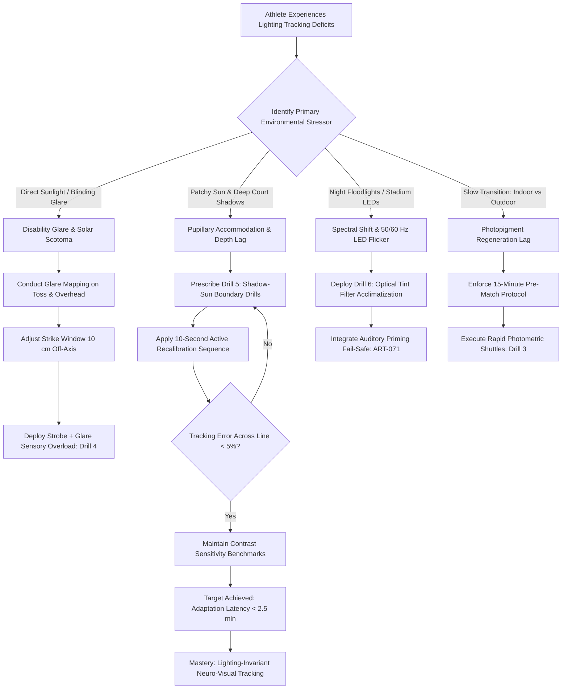

# ART-075: Neuro-Visual Tracking under Stadium Lighting Variations

> **PRO CUE:** Radical shifts in stadium illumination induce retinal adaptation lag, directly degrading dynamic visual acuity and reaction time. Training your **Light Adaptation Speed** stabilizes smooth pursuit tracking, saccadic accuracy, and Quiet Eye duration across blinding sun, deep court shadows, and high-frequency stadium LEDs. Never wait passively for your eyes to adjust—actively calibrate your neuro-visual apparatus.

## 1. Executive Summary & Athletic Intent

**Neuro-Visual Tracking** under stadium lighting variations represents the specialized capacity of the visuomotor system to maintain **gaze fixation stability, saccadic precision, smooth pursuit gain, and Quiet Eye (QE) duration** across radical photometric fluctuations. Competitive tennis players encounter extreme lighting environments: transitions between indoor and outdoor venues, blazing midday sunlight coupled with razor-sharp court shadows, night play under metal halide or 50/60 Hz LED illumination, and direct disability glare on high serve tosses.

Naturally, the human eye requires **5 to 10 minutes** for cone photoreceptor light adaptation and **20 to 45 minutes** for full rod dark adaptation. When entering a match uncalibrated, players experience an initial **10-to-15 game visual lag** characterized by reduced contrast sensitivity, misjudged ball velocity, depth perception distortion, and delayed split-step initiation. 

Through targeted neuro-visual conditioning, the speed of retinal photopigment regeneration, horizontal cell contrast gain control, and the pupillary light reflex can be systematically accelerated.

The athletic intent of this article is threefold:
1. **Transform Visual Adaptation into a Trainable Athletic Skill:** Shift light adaptation from a passive physiological inconvenience into an actively conditioned neuro-ophthalmological asset.
2. **Compress Adaptation Latency to $<3.0\text{ Minutes}$:** Train the visual cortex and retina to recalibrate contrast gain and pupillary aperture rapidly during abrupt environmental transitions.
3. **Deploy the "Strobe, Glare & Spectral Adaptation" Framework:** Deliver multi-stressor sensory training protocols that force the brain to optimize visual processing and elevate somatosensory fail-safes under compromised optical conditions.

---

## 2. Biomechanical & Neurological Foundation

### 2.1 Neurophysiology of Retinal Light & Dark Adaptation

The eye adjusts to ambient luminance through four distinct physiological mechanisms:

| Adaptation Mechanism | Natural Time Course | Primary Cellular Mechanism | Direct Tennis Consequence |
| :--- | :--- | :--- | :--- |
| **Light Adaptation (Dark $\to$ Bright)** | 5–10 min (Cones) / 30–45 min (Rods) | Massive photopigment bleaching; intracellular $Ca^{2+}$ feedback; neural gain reduction | Moving from shaded clubhouse to bright outdoor court: severe glare, washed-out contrast, temporary blindness on serve toss. |
| **Dark Adaptation (Bright $\to$ Dim)** | $<1\text{ min}$ (Cones) / 10–20 min (Rods) | Rhodopsin and iodopsin photopigment resynthesis; membrane hyperpolarization | Transitioning from bright sun into indoor courts: perceived ball acceleration, diminished depth of field. |
| **Pupillary Light Reflex (PLR)** | 200–500 ms | Iris sphincter (parasympathetic) vs. dilator (sympathetic) constriction | Shifting from sunny baseline to shaded forecourt: transient optical blur as pupil adjusts aperture and depth of field. |
| **Contrast Gain Control** | 100–500 ms | Retinal horizontal and amacrine cell lateral inhibition; Primary Visual Cortex (V1) layer 4B gain | Passing clouds or uneven court shadows: sudden 40–60% drop in ball seam detection and spin read. |

```
RETINAL ADAPTATION TIMELINE:
[Photons Strike Retina] ──► Photopigment Bleaching / Regeneration (Rhodopsin / Iodopsin)
                                      │
                                      ▼
[Retinal Horizontal Cells] ──► Contrast Gain Control (100–500 ms)
                                      │
                                      ▼
[Edinger-Westphal Nucleus] ──► Pupillary Light Reflex (200–500 ms)
                                      │
                                      ▼
[Primary Visual Cortex (V1)] ──► Spatial Frequency Tuning & Depth Perception Recovery
                                      │
                                      ▼
[Frontal Eye Fields & SC] ──► Accurate Saccades & Smooth Pursuit Restored
```

### 2.2 Biomechanical Impact on Tennis-Specific Tracking

Adverse stadium lighting directly impairs core oculomotor subroutines:

| Lighting Phenomenon | Affected Visual Subsystem | Biomechanical & Technical Error |
| :--- | :--- | :--- |
| **Disability Glare / Direct Solar Vector** | Contrast sensitivity drops by 40–60%; retinal straylight scatter | Overhead smash and serve toss lost in solar glare; delayed racket drop; frame shanks. |
| **Patchy Sun / Deep Stadium Shadow** | Pupil expands/contracts rapidly; optical depth of field fluctuates | Inaccurate estimation of incoming ball speed and bounce depth; jammed contact point. |
| **50/60 Hz LED Stadium Flicker** | High-frequency temporal contrast sensitivity degradation | Subtle stroboscopic "ghosting" of ball flight; inconsistent contact timing on fast returns. |
| **Low-CRI Metal Halide / Night Floodlights** | Poor Color Rendering Index (CRI $<75$); narrow spectral distribution | Optic yellow ball blends into court background; inability to read seam rotation and spin RPM. |
| **Sudden Indoor-to-Outdoor Venue Switches** | Uncalibrated photopigments; optical accommodation lag | Elevated unforced error count across the first 4–6 games of a match. |

### 2.3 Visual Performance Metrics Across Adaptation Phases

| Oculomotor & Perceptual Metric | Baseline (Optimal Light) | Uncalibrated Transition (0–10 min) | Naturally Adapted (10–30 min) | Conditioned Target (Trained) |
| :--- | :--- | :--- | :--- | :--- |
| **Dynamic Visual Acuity (DVA)** | 20/15 | 20/35 | 20/20 | **20/20 within 2.0 min** |
| **Contrast Sensitivity (1.5 cpd)** | 100% | 40–60% | 80% | **$>90\%$ within 3.0 min** |
| **Saccadic Endpoint Accuracy** | $<0.5^\circ$ error | $1.5\text{–}2.5^\circ$ hypometria | $<0.5^\circ$ error | **$<0.5^\circ$ within 1.0 min** |
| **Smooth Pursuit Gain** | 0.95 | 0.70–0.78 (catch-up saccades) | 0.90 | **$>0.92$ within 2.0 min** |
| **Quiet Eye (QE) Duration** | 300 ms | 140 ms (premature gaze shift) | 260 ms | **$>270\text{ ms}$ within 3.0 min** |
| **Visuomotor Reaction Time (RT)** | 180 ms | 260 ms | 205 ms | **$<195\text{ ms}$ within 2.0 min** |

---

## 3. Step-by-Step Technical Execution

### Phase 1: Photometric Baseline & Glare Tolerance Assessment

#### Drill 1: The Rapid Lux Transition Trial
- **Setup:** The athlete moves from an indoor lounge or locker room (300 lux) directly onto an outdoor hard court in full midday sun (40,000–60,000 lux).
- **Measurement Protocol:** Using a digital contrast chart and an on-court visual target array, measure:
  1. Time required to achieve $90\%$ baseline contrast sensitivity.
  2. Time required to read ball rotation seams at 15 meters.
  3. Time required to restore Quiet Eye duration $>250\text{ ms}$.
- **Baseline Benchmark:** Unconditioned athletes require 8–15 minutes; conditioned target is $<3.0\text{ minutes}$.

#### Drill 2: Glare Disability Threshold Test
- **Setup:** Athlete tracks tennis balls fired by a ball machine while a portable 10,000-lumen directional spotlight is positioned adjacent to the feeder trajectory (simulating a direct solar flare or stadium light tower).
- **Evaluation:** Measure the maximum lumen intensity the athlete can tolerate before tracking error (framing or late contact) exceeds $20\%$.

---

### Phase 2: Active Photometric Adaptation Regimens

#### Drill 3: The Rapid Photometric Court Transition Drill
- **Setup:** Access to adjacent bright (outdoor full sun or 3,000-lux stadium court) and dim (indoor court or deep shaded canopy, 300 lux) playing environments.
- **Execution:**
  1. Execute a high-intensity 2-minute rally block on the Bright Court.
  2. On the coach's whistle, sprint immediately to the Dim Court and initiate rallying within 10 seconds.
  3. During the 10-second transition sprint, execute the **Active Neuro-Visual Recalibration Sequence**:
     - *Step 1 (Blink Activation):* Three rapid, forceful blinks to stimulate lacrimal tear film distribution across the cornea.
     - *Step 2 (Autonomic Exhale):* One deep physiological sigh to trigger parasympathetic pupil stabilization.
     - *Step 3 (Target Lock):* 3-second hard fixation on the opposing baseline white line to reset spatial contrast reference.
  4. Rally for 2 minutes on the Dim Court; repeat cycle 4 times.
- **KPI:** Stroke consistency drop $<10\%$ during the initial 30 seconds following each transition.

```
THE 10-SECOND ACTIVE RECALIBRATION SEQUENCE:
[Court Transition Whistle] ──► 3 Forceful Blinks (Tear Film Reset)
                                      │
                                      ▼
                               1 Deep Vagal Sigh (Pupil Stabilization)
                                      │
                                      ▼
                               3-Second Gaze Lock on Baseline White Line
                                      │
                                      ▼
                       [Instantaneous Rally Resumption]
```

#### Drill 4: Stroboscopic + Glare Sensory Overload
- **Setup:** Athlete wears stroboscopic training eyewear calibrated to 5 Hz (flicker rate) while facing high-intensity directional halogen spotlights set at a $45^\circ$ angle to the ball trajectory.
- **Execution:**
  1. Engage in live volley firefights and baseline groundstroke exchanges under dual sensory degradation (intermittent optical occlusion + intense directional glare).
  2. The brain is forced to extract minimal visual cues from sparse retinal frames while suppressing glare noise, rapidly up-weighting auditory and somatosensory tracking fail-safes.
- **Dosage:** 3 sets of 5-minute blocks.
- **Post-Drill Transfer:** Remove glasses and extinguish glare lights; immediately hit 20 regulation balls. The visual system experiences profound perceptual expansion ("hyper-acuity").

#### Drill 5: Shadow-Sun Boundary Precision Striking
- **Setup:** Select a court bisected by a hard shadow line (e.g., late afternoon stadium shadow running diagonally across the service boxes).
- **Execution:** Feeder alternates drives crossing from the bright zone into the shadow zone. The athlete must track the ball as it traverses the photometric boundary:
  - In the sun: Gaze focuses on ball seams with narrowed pupillary aperture.
  - Crossing into shadow: Athlete consciously maintains smooth pursuit without blinking or dropping Quiet Eye fixation.
- **Dosage:** 4 sets of 15 repetitions.

---

### Phase 3: Spectral Adaptation & Night Lighting Optimization

#### Drill 6: Optical Tint Filter Acclimatization
- **Setup:** Train with specialized optical lens filters:
  - **High-Contrast Amber/Orange:** Blocks short-wave blue light; enhances optic yellow ball contrast against green/blue court surfaces.
  - **Neutral Gray:** Diminishes total lux while maintaining true color spectrum.
  - **Clear Antireflective:** For night stadium play under flickering LEDs.
- **Protocol:** Rotate through each tint in 10-minute rally blocks to build neural invariance across spectral shifts.

#### Drill 7: Night Stadium Simulation Protocol
- **Setup:** Evening session under artificial floodlights (metal halide or LED, 1,500–2,500 lux).
- **Execution:** Alternate between standard tennis balls and high-visibility Optic Yellow match balls under varying drill speeds. Target: Match-play shot speed, spin recognition, and contact consistency must achieve $\ge 95\%$ of daytime baselines.

---

### Phase 4: Tour-Grade Pre-Match Lighting Calibration Protocol

Execute this mandatory 15-minute protocol immediately prior to entering competition:

```
┌────────────────────────────────────────────────────────────────────────┐
│             PRE-MATCH 15-MINUTE LIGHT CALIBRATION PROTOCOL             │
├────────────────────────────────────────────────────────────────────────┤
│ T-60 MIN: ENVIRONMENTAL AUDIT                                          │
│ • Arrive on match court; observe sun azimuth, light towers, shadows.   │
│                                                                        │
│ T-15 MIN: PUPILLARY & ACCOMMODATIVE PRIMING                            │
│ • 2 minutes: Far-Near Optical Shifts:                                  │
│   - Fixate on far stadium roof horizon for 5 seconds.                  │
│   - Instantly snap gaze to racket butt-cap logo for 5 seconds.         │
│   - Repeat 10 cycles to prime ciliary muscle and pupillary reflex.     │
│                                                                        │
│ T-10 MIN: RETINAL CONTRAST CALIBRATION                                 │
│ • Hit 10 serves, 10 returns, and 20 groundstrokes:                     │
│   - Actively call out ball seam orientation aloud upon flight tracking.│
│   - Calibrate depth perception against background stadium signage.     │
│                                                                        │
│ T-5 MIN: SOLAR & TOWER GLARE MAPPING                                   │
│ • Stand on baseline and identify exact toss angles that intersect sun  │
│   or light towers; calibrate ball toss placement 10 cm left/right to   │
│   bypass the direct glare blind spot.                                  │
└────────────────────────────────────────────────────────────────────────┘
```

---

## 4. Performance Metrics & Training Dosage

### 4.1 Diagnostic Performance Benchmarks

| Quantitative Metric | Level 1: Light Dependent | Level 2: Slow Adapter | Level 3: Advanced Adapter | Level 4: Tour Elite Master |
| :--- | :--- | :--- | :--- | :--- |
| **Indoor $\leftrightarrow$ Outdoor Adaptation Latency** | $>15\text{ min}$ | 8–15 min | 3–8 min | **$<2.5\text{ min}$** |
| **Disability Glare Threshold** | $<5,000\text{ lux}$ | 5,000–12,000 lux | 12,000–20,000 lux | **$>22,000\text{ lux}$** |
| **Transition Performance Drop (First 2 Games)** | $>25\%$ accuracy drop | 15–25% drop | 8–15% drop | **$<5\%$ performance variance** |
| **Night vs. Day Performance Ratio** | $<75\%$ consistency | 75–85% | 85–92% | **$>95\%$ parity** |
| **Shadow-Sun Boundary Saccadic Error** | $>2.5^\circ$ hypometria | 1.5–2.5° | 0.8–1.5° | **$<0.5^\circ$ locked tracking** |
| **Post-Transition Quiet Eye Recovery Time** | $>10\text{ min}$ | 5–10 min | 2–5 min | **$<1.0\text{ min}$** |

### 4.2 Structured Weekly Training Dosage

```
┌────────────────────────────────────────────────────────────────────────┐
│               NEURO-VISUAL LIGHTING DOSAGE STRUCTURE                   │
├────────────────────────────────────────────────────────────────────────┤
│ DAILY PRE-HIT ACTIVATION (5 Min):                                      │
│ • Far-Near Accommodative Saccades: 10 cycles (Horizon ──► Racket logo) │
│ • Active Recalibration Drills (3 rapid blinks + 1 vagal breath)        │
│                                                                        │
│ DEDICATED PHOTOMETRIC TRAINING (15 Min - 2x/week):                     │
│ • Rapid Court Transitions (Bright ──► Dim): 4 cycles                   │
│ • Shadow-Sun Boundary Tracking Drills: 30 feeds                        │
│                                                                        │
│ SENSORY OVERLOAD CONDITIONING (10 Min - 1x/week):                       │
│ • Stroboscopic (5 Hz) + Directional Glare Spotlight Volleys: 3 sets    │
│                                                                        │
│ SPECTRAL OPTIMIZATION (20 Min - 1x/week):                              │
│ • Tinted Filter Comparison Rally or Night Stadium Match Simulation     │
│                                                                        │
│ PRE-COMPETITION CALIBRATION:                                           │
│ • Full 15-Minute Protocol executed before every competitive match      │
└────────────────────────────────────────────────────────────────────────┘
```

---

## 5. Errors, Causes & Correction Protocols

| Observable Mechanical / Tactical Error | Root Neuro-Ophthalmic Cause | Precision Correction Protocol |
| :--- | :--- | :--- |
| **Complete breakdown across the first 4 games after moving outdoors** | Retinal photopigment bleaching lag; uncalibrated pupil and contrast sensitivity. | Mandate the 15-Minute Pre-Match Calibration Protocol (Section 3, Phase 4); arrive on court 60 min early. |
| **Shanking overhead smashes and losing ball flight in the sun** | Disability glare inducing retinal straylight scatter; temporary scotoma (blind spot). | Execute Glare Mapping; shift serve/smash contact geometry 10 cm off the solar vector; wear polarized performance eyewear or high-crown visor. |
| **Mishits and late swings as ball crosses the stadium shadow line** | Sudden luminance drop causing abrupt pupillary dilation, transiently distorting optical depth of field. | Shadow-Sun Boundary Precision Drills (Drill 5); anchor gaze on incoming trajectory; verbalize spin read early. |
| **Timing jitter and perceived ball "teleporting" under stadium floodlights** | Low-frequency (50/60 Hz) LED temporal flicker interfering with retinal motion sensors (MT/V5). | Stroboscopic overload drills (Drill 4); build temporal flicker tolerance; rely heavily on auditory impact triggers (ART-071). |
| **Inability to judge ball spin and depth during night matches** | Restricted lighting spectrum (low CRI) flattening retinal contrast and depth cues. | Train with high-contrast amber/yellow optical tints (Drill 6); practice with optic high-vis balls under floodlights. |
| **Erratic tracking and eye strain during overcast/partly cloudy days** | Fluctuating cloud cover causing continuous contrast gain shifts in retinal horizontal cells. | Implement Active Recalibration between changeovers: 3 blinks + 5-second baseline fixation lock. |

---

## 6. Diagnostic Diagram & Decision Flow



---

## 7. Video Demonstration & Technical Analysis

<div class="video-container" style="position:relative;padding-bottom:56.25%;height:0;overflow:hidden;border-radius:12px;">
  <iframe src="https://www.youtube-nocookie.com/embed/VIDEO_ID_PLACEHOLDER"
          style="position:absolute;top:0;left:0;width:100%;height:100%;border:0;"
          allow="accelerometer; autoplay; clipboard-write; encrypted-media; gyroscope; picture-in-picture"
          allowfullscreen
          title="Neuro-Visual Tracking under Stadium Lighting Variations — Technical Biomechanical Analysis"></iframe>
</div>

*Recommended Technical Video Breakdown: Infrared pupillometry tracking curves recording real-time pupillary constrictive latency during sudden lux transitions; contrast sensitivity spatial frequency curves under 50,000 lux solar illumination versus 300 lux indoor lighting; mobile eye-tracking footage illustrating Quiet Eye duration and saccadic accuracy decay as the ball crosses a razor-sharp shadow-sun stadium boundary; step-by-step masterclass demonstrating the 10-second active recalibration protocol.*

---

## 8. Cross-Domain Synergy & Multi-Pillar Integration

- **With Saccadic Eye Movements & Quiet Eye (ART-041, ART-055):** Rapid lighting adaptation protects the neurological integrity of the Quiet Eye. Preserving contrast sensitivity ensures the fovea locks onto the contact zone without tracking jitter.
- **With Stroboscopic Sensory Training (ART-068):** Stroboscopic conditioning acts as visual resistance training. Overcoming artificial optical noise equips the nervous system to thrive in low-CRI, flickering night stadiums.
- **With Auditory Priming as a Visual Fail-Safe (ART-071):** Under blinding solar glare or stadium shadow washouts, visual certainty plummets. The acoustic impact pop serves as the ultimate subcortical backup trigger for split-step timing.
- **With Ecological Affordance Perception (ART-067):** Degraded lighting obscures subtle cues in opponent shoulder coil and racket angles; training visual gain preserves affordance extraction under adverse conditions.
- **With Neuromuscular Fatigue & Pupillary Latency (ART-054, ART-058):** Central fatigue and lactic acidosis degrade autonomic nervous function, slowing the pupillary light reflex. Micro-recovery routines preserve visual responsiveness late in matches.
- **With Cognitive Flexibility in Tactical Shifts (ART-076):** Lighting transitions are major environmental perturbations. Fluidly adjusting shot heights, margins, and target zones across sunny vs. shaded court sectors demands high cognitive flexibility.

---

## 9. Self-Assessment Rubric

| Diagnostic Checkpoint | Level 1: Light Fragile | Level 2: Slow Adapter | Level 3: Competent Adapter | Level 4: Tour Elite Master |
| :--- | :--- | :--- | :--- | :--- |
| **Adaptation Speed (Indoor $\leftrightarrow$ Sun)** | $>15\text{ min}$ to feel normal | 8–15 min | 3–8 min | **$<2.5\text{ min}$ instant lock** |
| **Glare Tolerance** | Whiffs under bright lights | Frequent mishits ($>20\%$) | Reliable under glare ($<10\%$) | **Impervious to solar/tower glare** |
| **Shadow-Sun Tracking** | Misses ball trajectory ($>20\%$) | Hesitant, jerky swings | Consistent contact ($85\text{–}95\%$) | **Flawless seam tracking ($>95\%$)** |
| **Night Play Parity** | Night win rate $<40\%$ | Noticeable timing lag | High night competence | **$>95\%$ parity with daytime play** |
| **Pre-Match Calibration Routine** | No routine; walks on blind | Casual warm-up | Basic 5-min prep | **Executes 15-min protocol 100%** |

**Diagnostic Scoring Key:**
- **5–8 Points:** Severe Photometric Vulnerability. Performance is held hostage by environmental lighting; immediate implementation of adaptation protocols required.
- **9–12 Points:** Developing Adaptation. Functionally sound in stable daylight, but breaks down under stadium floodlights or shifting court shadows.
- **13–16 Points:** Competent Performer. Fast retinal recalibration; occasional visual errors on extreme glare angles.
- **17–20 Points:** Tour-Grade Lighting Mastery. Total optical immunity across blinding noon sun, deep shadows, and low-CRI night environments.

---

## 10. Printable Practice Card (Pocket Drill Card)

```
┌────────────────────────────────────────────────────────────────────────┐
│             POCKET DRILL CARD: NEURO-VISUAL LIGHTING TRACKING          │
│ Target: Adaptation Latency <2.5 min | Night Parity >95% | Glare OK     │
├────────────────────────────────────────────────────────────────────────┤
│ PHASE A: PRE-MATCH OPTICAL WARM-UP (15 MIN)                            │
│ • Far-Near Saccades: 10 cycles (5s horizon ──► 5s racket logo).        │
│ • Glare Mapping: Identify toss intersections with sun/light towers.    │
│ • Contrast Calibration: 20 hits calling out ball seams aloud.          │
│ • Cue: "Wake the lens. Calibrate the aperture."                        │
├────────────────────────────────────────────────────────────────────────┤
│ PHASE B: RAPID PHOTOMETRIC SHUTTLE (20 MIN)                            │
│ • 4 cycles: 2 min Bright Court (Sun/LED) ──► 2 min Dim Court (Shade). │
│ • 10-second transition: 3 rapid blinks ──► 1 vagal sigh ──► 5s lock.   │
│ • Target: Performance variance <5% across venue changes.               │
│ • Cue: "Blink — Breathe — Lock — Strike."                              │
├────────────────────────────────────────────────────────────────────────┤
│ PHASE C: SENSORY OVERLOAD CONDITIONING (10 MIN)                        │
│ • 10 min Volleys under Strobe (5 Hz) + Directional 10,000-lux Glare.   │
│ • Remove glasses ──► Hit 15 regulation balls (perceptual expansion).   │
│ • Cue: "Silence the noise. Track the seams."                           │
├────────────────────────────────────────────────────────────────────────┤
│ PHASE D: LIGHTING-INVARIANCE AUDIT (5 MIN)                             │
│ • Log Dynamic Visual Acuity recovery time and Night vs. Day win ratio. │
│ • Gate: 3 consecutive matches with zero transition lag games.          │
└────────────────────────────────────────────────────────────────────────┘
```

---

*Cross-References: ART-041, ART-054, ART-055, ART-058, ART-067, ART-068, ART-071, ART-076. Pillar II: Neurological Mechanics & Sports Neuroscience — TennisKB 200 Series.*
