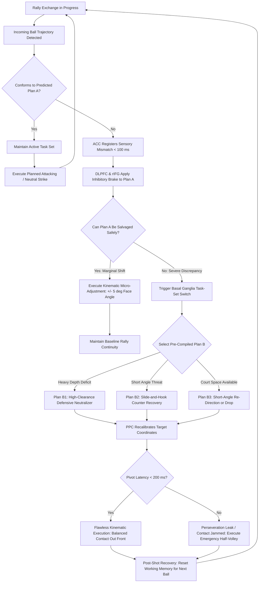

# ART-076: Cognitive Flexibility in Mid-Point Strategy Pivots

> **PRO CUE:** A tennis point never unfolds according to a scripted rehearsal. When Plan A collapses on the third shot, you must execute **Plan B immediately**. Cognitive flexibility is the capacity to switch operational task sets in under 200 ms. Train your "Pivot Speed" so you never get cognitively paralyzed in live ball exchanges.

---

## 1. Executive Summary & Athletic Intent

**Cognitive Flexibility** is the neuro-executive capacity to rapidly, dynamically, and accurately switch operational cognitive rule representations (**task sets**) when the competitive landscape changes abruptly. In high-performance tennis, a point might open with a predetermined attacking blueprint: *"Wide slice serve followed by a heavy inside-out forehand into the open court."* However, if the opponent executes an unanticipated lunging block return deep down the middle, the athlete must execute an **instant mid-point pivot**: shifting from an aggressive attacking posture into *"Deep defensive counter-lift and spatial neutral reset."* 

To execute this transition without leaking court position or committing an unforced error, the central nervous system must orchestrate three rapid subcortical and cortical events: **inhibit the obsolete motor plan, activate the alternative motor program, and update kinematic parameters**—all within a strict window of $<500\text{ ms}$ between incoming and outgoing ball trajectories. This article deconstructs the neurobiology of cognitive flexibility (engaging the dorsolateral prefrontal cortex, anterior cingulate cortex, and basal ganglia), defines the critical threshold of **Pivot Latency ($<200\text{ ms}$)**, establishes tennis-specific task-switching protocols, and details an analytical diagnostic matrix for eliminating cognitive rigidity.

The athletic intent of this master protocol focuses on three operational objectives:
1. **Define Mid-Point Pivoting as a Hard-Deadline Task Switch:** Frame tactical adaptability not as passive reflective thinking, but as high-velocity executive task-switching operating against unforgiving temporal constraints.
2. **Compress Behavioral Switch Cost:** Provide systemic training progressions designed to drive cognitive switch cost down from an amateur latency of $>300\text{ ms}$ to an elite standard of $<100\text{ ms}$ with less than $5\%$ degradation in shot accuracy.
3. **Operationalize Constraint-Led Pivot Drills:** Implement high-density, unpredictable court-feeding environments that compel continuous motor-cognitive repatterning under realistic match stress and metabolic fatigue.

---

## 2. Biomechanical & Neurological Foundation

### 2.1 The Neural Circuitry of Cognitive Flexibility

The execution of a mid-point tactical transition relies on a tightly synchronized loop between prefrontal executive structures, conflict monitoring hubs, and subcortical gating circuits:

| Neuroanatomical Structure | Primary Neurological Role | Operational Latency | Specific Tennis Context |
| :--- | :--- | :--- | :--- |
| **Dorsolateral Prefrontal Cortex (DLPFC)** | Working memory maintenance; active task-set representation | Continuous baseline | Holds Plan A: *"Drive heavy topspin into opponent backhand corner."* |
| **Anterior Cingulate Cortex (ACC)** | Conflict monitoring; discrepancy detection between predicted and observed sensory input | $\sim 100\text{ ms}$ post-stimulus | Detects mismatch: *"Opponent return trajectory is 1.5 m deeper than expected!"* |
| **Posterior Parietal Cortex (PPC)** | Attentional reorienting; dynamic updating of spatial coordinate frames | $\sim 50\text{ ms}$ post-detection | Reallocates spatial attention: Shifts focus from attack window to deep baseline recovery. |
| **Basal Ganglia (Striatum & GPi)** | Motor program gating; selective inhibition of old engram and release of new plan | $\sim 150\text{ ms}$ | Closes striatal gate on attack drive; opens gate for high-clearance topspin roll. |
| **Thalamus (Mediodorsal Nucleus)** | Information routing; filtering irrelevant environmental and emotional noise | $\sim 20\text{ ms}$ | Dampens ambient distraction (crowd noise, scoreboard score, acute fatigue). |

```
STIMULUS: Opponent executes unexpected deep skidding slice
   │
   ▼
[Anterior Cingulate Cortex (ACC)] ──► Detects Conflict (Predicted vs. Actual trajectory) [~100 ms]
   │
   ▼
[DLPFC & Inferior Frontal Gyrus] ──► Active Inhibition: Arrests Plan A (Attacking Drive) [~150 ms]
   │
   ▼
[Basal Ganglia Striato-Thalamic Loop] ──► Task-Set Gating: Selects & Releases Plan B (Defensive Arc) [~150 ms]
   │
   ▼
[Posterior Parietal Cortex (PPC)] ──► Spatial & Kinematic Reorientation to Target Zone [~50 ms]
   │
   ▼
MOTOR EXECUTION: Descending corticospinal command shifts kinetic chain to lift trajectory
   │
   └──► TOTAL PIVOT LATENCY: Elite < 200–300 ms  |  Novice > 600 ms
```

### 2.2 Mid-Point Pivot Timeline & Switch Cost Biophysics

**Switch Cost** represents the physiological and behavioral tax incurred when the neural architecture is forced to transition between distinct cognitive task sets rather than maintaining a repetitive routine:
- $\text{Switch Cost} = \text{Reaction Time}_{\text{Switch}} - \text{Reaction Time}_{\text{Stay}}$
- In unconditioned players, Switch Cost manifests as a **$300\text{–}500\text{ ms}$ delay** accompanied by a $>20\%$ surge in unforced errors (framing the ball, late contact, or decelerating through impact).
- In elite performers, neuroplastic myelination of fronto-striatal pathways compresses this Switch Cost to **$<100\text{ ms}$**, with minimal accuracy degradation ($<5\%$).

```
SHOT 1: Wide Slice Serve (Plan A active: Attack next short ball)
  │
  ▼
SHOT 2: Opponent stretches, chips sharp angle cross-court (UNANTICIPATED TRAJECTORY)
  │
  ├──► ACC conflict detection: Sensory mismatch registered ..................... [T + 100 ms]
  ├──► DLPFC / IFG: Rapid inhibitory brake applied to baseline drive ............. [T + 150 ms]
  ├──► Basal Ganglia: Rapid retrieval and gating of sliding counter-slice ....... [T + 200 ms]
  └──► PPC: Recalibration of center of mass and contact spatial gate ........... [T + 250 ms]
  │
  ▼
SHOT 3: Low sliding slice cross-court executed with stabilized racket face
  │
  └──► TOTAL PIVOT LATENCY: ~250 ms (Player remains balanced, on-time, and organized)
```

### 2.3 In-Match Tennis Pivot Taxonomy

Tactical flexibility in modern tennis manifests across five distinct operational domains:

| Pivot Category | Operational Trigger | Task-Set Shift ($\text{Plan A} \to \text{Plan B}$) | Practical Match Play Scenario |
| :--- | :--- | :--- | :--- |
| **Tactical Pivot** | Sudden opponent behavioral or positioning shift | Offense $\to$ Defense or Defense $\to$ Counter-Punch | Serve+1 attack fails to penetrate; immediately reset to neutral heavy cross-court rally. |
| **Technical Pivot** | Unanticipated ball trajectory, skid, or spin anomaly | Heavy Topspin Drive $\to$ Short-Lever Slice / Block | Preparing for normal topspin bounce; ball skids off tape, forcing emergency reflex half-volley. |
| **Spatial Pivot** | Abrupt shift in court geometry and spatial boundaries | Deep Baseline Stance $\to$ Transition Approach $\to$ Net Gate | Opponent ball falls short inside no-man's land; sprint forward and convert rally into drive volley. |
| **Temporal Pivot** | Alteration of available preparatory time window | Rhythm Rally $\to$ Acute Time Deficit Emergency | Opponent rips a flat ball off the rise; preparation loop must instantly abbreviate by $50\%$. |
| **Emotional / Momentum Pivot** | Severe momentum swing or high-stress pressure point | Over-Aggressive / Frustrated $\to$ Disciplined Tactical Protocol | Serving at 4–1, dropping to 4–4; execute 16-Second Cure reset and enforce zero-error targets. |

---

## 3. Step-by-Step Technical Execution

### Phase 1: Pivot Awareness & Baseline Calibration

The objective of Phase 1 is to isolate the player's cognitive switch cost and instill metacognitive recognition of when a tactical pivot is mandatory.

#### Drill 1: Video Pivot Detection & Schema Tagging
1. The athlete reviews high-tempo match footage from a first-person or elevated behind-the-baseline perspective.
2. The coach pauses the video frame unpredictably at ball contact of the opponent's strike.
3. The athlete must verbally announce within $500\text{ ms}$: (a) Current active task set, (b) Whether an immediate pivot is required ("Stay" vs. "Pivot"), and (c) The precise target category of the new task set (Tactical, Technical, Spatial, or Temporal).
4. **Target Benchmark:** $100\%$ detection accuracy across 30 randomized clips with verbal latency $<400\text{ ms}$.

#### Drill 2: Neuro-Cognitive Switch Cost Profiling
1. Conduct court-side reaction trials using a tablet or computerized task-switching interface.
2. Present alternating visual stimuli requiring rule switches (e.g., Target Direction based on Color vs. Target Spin based on Shape).
3. Record baseline reaction time on non-switch trials ($\text{RT}_{\text{Stay}}$) versus switch trials ($\text{RT}_{\text{Switch}}$).
4. Calculate baseline Switch Cost. **Target Benchmark:** Achieve baseline switch latency $<150\text{ ms}$ before progressing to on-court kinematic drills.

---

### Phase 2: Forced Pivot Training (Constraint-Led Ball Feeding)

Phase 2 transitions cognitive switching onto the physical court, binding fronto-striatal task-set selection to kinetic chain execution.

#### Drill 3: Randomized Affordance Pattern Feeding
1. The ball machine or coach feeds balls in randomized sequences across four non-negotiable operational affordances:
   - *Affordance 1:* Short, high-sitting floater (Immediate inside-out drive attack).
   - *Affordance 2:* Heavy, deep skidding ball pinning the baseline (Defensive high-margin roll).
   - *Affordance 3:* Extreme wide angle pulling player off the doubles alley (Sliding recovery hook).
   - *Affordance 4:* Fast body-jamming flat strike (Compact short-lever block).
2. The coach enforces a hard constraint: No single affordance pattern may be fed more than twice consecutively, preventing predictive motor planning.
3. The athlete must call out the affordance before the ball crosses the net plane and execute the correct technical mechanical package.
4. **Volume:** 4 sets $\times$ 20 balls; rest 60 seconds between sets.

#### Drill 4: Mid-Rally Auditory Cue Switching
1. Engage in an open-tempo cross-court rally between the athlete and a high-level partner or coach.
2. At random intervals (every 2 to 4 strokes), precisely as the partner makes contact, the coach sounds an auditory cue:
   - *"ATTACK!"* $\to$ Player must immediately redirect down-the-line with aggressive tempo.
   - *"DEFEND!"* $\to$ Player must instantly lift ball 2 meters over the net into the deep middle third.
   - *"DROP!"* $\to$ Player must feather an angled drop shot.
3. Quantify **Pivot Latency**: The elapsed duration between auditory command onset and the execution of the preparatory unit turn.
4. **Target Benchmark:** Consistent unit turn initiation in $<200\text{ ms}$ post-cue.

#### Drill 5: Dual-Task Working Memory Pivot Loading
1. Conduct live baseline point-play while the athlete performs a continuous secondary cognitive task: serial-7 subtraction (counting backward from 100 by 7s) or a live auditory 2-back protocol.
2. In the midst of the rally, the coach calls out sudden tactical pivots (*"Approach!"* or *"Reset!"*).
3. The athlete must successfully execute the mechanical switch while maintaining flawless accuracy on the cognitive task.
4. This trains prefrontal capacity to handle unexpected tactical shifts even when working memory bandwidth is heavily taxed.

---

### Phase 3: Pressure Inoculation & Match-Play Pivoting

#### Drill 6: Scoreboard Constraint-Led Match Play
1. Play competitive match games under artificially injected tactical constraints that mandate abrupt strategy shifts based on game score:
   - *Score Scenario A (Ahead 40–15):* Mandate high-risk 1st-strike play (Plan A). If the opponent returns deep, enforce an immediate switch to a 20-ball grinder mentality (Plan B).
   - *Score Scenario B (Down 15–40):* Enforce a strict "Zero Unforced Error" constraint requiring deep center-third targeting.
   - *Score Scenario C (Deuce):* Enforce aggressive net approach off any ball landing inside the service line.
2. Video review evaluates adherence to the assigned task set under high heart-rate conditions ($>160\text{ BPM}$).

#### Drill 7: The Momentum-Break Tactical Pivot
1. Simulate high-leverage match scenarios where the opponent has captured 3 to 4 consecutive games or points.
2. The athlete is mandated to execute a radical structural pivot within the first two points of the subsequent game:
   - Shift return position from 1.5 meters behind baseline to 0.5 meters inside baseline (Chip-and-charge).
   - Alter rally tempo from heavy topspin looping to low skidding slice trajectories.
   - Shift serve targeting from dominant T-serves to high-body jam patterns.
3. **Success Metric:** Successful disruption of opponent rhythm and termination of negative momentum run within 2 games.

---

## 4. Performance Metrics & Training Dosage

| Performance Metric | Developing | Proficient | Advanced | Elite (ATP / WTA Tour) |
| :--- | :--- | :--- | :--- | :--- |
| **Pivot Latency (Cue $\to$ Motor Turn)** | $>500\text{ ms}$ | 300–500 ms | 200–300 ms | **$<200\text{ ms}$** |
| **Laboratory Switch Cost ($\Delta \text{RT}$)** | $>300\text{ ms}$ | 200–300 ms | 100–200 ms | **$<100\text{ ms}$** |
| **Pivot Accuracy (Correct Plan Selection)** | $<60\%$ | 60–75% | 75–90% | **$>95\%$** |
| **Dual-Task Performance Degradation** | $>30\%$ drop | 20–30% drop | 10–20% drop | **$<5\%$ drop** |
| **Forced Pivot Compliance (Random Feed)** | $<50\%$ | 50–70% | 70–85% | **$>90\%$** |
| **Momentum Break Conversion Rate** | $<30\%$ | 30–50% | 50–70% | **$>75\%$** |
| **Emotional Pivot Reset Time (16s Cure)** | $>30\text{ s}$ | 20–30 s | 15–20 s | **$<15\text{ s}$** |

### Weekly Periodized Training Dosage

- **Daily Neuro-Cognitive Calibration (5–10 Min):** 100 computerized task-switching trials to monitor baseline neurological fatigue and track longitudinal switch costs.
- **On-Court Forced Pivot Blocks ($3\times/\text{week}$, 25 Min):** 60 randomized pattern feeds followed by 30 mid-rally cue-switch exchanges.
- **Dual-Task Cognitive-Motor Loading ($2\times/\text{week}$, 20 Min):** 20 high-intensity rally points executed with concurrent working memory interference.
- **Scoreboard Simulation & Pressure Inoculation ($1\times/\text{week}$, 30 Min):** Match-play sets with dynamic score-contingent pivot rules and momentum-break constraints.

---

## 5. Errors, Causes & Correction Protocols

| Observable Tactical / Mechanical Defect | Root Neurobiological Etiology | Precision Correction Protocol |
| :--- | :--- | :--- |
| **"Plan A collapses $\to$ Complete paralysis; player freezes or dumps ball into net."** | Deficient Plan B motor library; extreme DLPFC cognitive rigidity; absent pre-compiled task sets. | Build a structured **10-Scenario Pivot Playbook**; execute daily forced-pivot blocked drills until Plan B retrieval is subcortical. |
| **"Perseveration Error: Continues attacking even after opponent hits a neutralizing deep ball."** | Inhibitory failure in right inferior frontal gyrus (rIFG); inability to arrest an initiated motor engram. | Implement **Stroop / Go-NoGo court conditioning**; cue player to verbalize the incoming ball height before commencing backswing. |
| **"Erratic shot selection under high score pressure (hero shots at 30–40)."** | Amygdala hijack triggering acute prefrontal hypofrontality; working memory collapse. | Enforce the **16-Second Cure routine**; restrict critical-point decision architecture to pre-committed 2-choice tactical heuristics. |
| **"Technical breakdown during pivot (shanking or decelerating on defensive slice)."** | Delayed motor program updating in the cerebellum and basal ganglia; kinematic coordination mismatch. | Execute **Multi-Spin Transition feeds** (e.g., alternating heavy topspin $\to$ underspin $\to$ flat drive on consecutive balls). |
| **"Performance crashes under dual-task cognitive loading."** | Subcortical motor engrams not fully automated, drawing excessively on shared DLPFC attentional resources. | Step-down progression: Master kinematic technique under zero cognitive load, then reintroduce low-tier counting tasks progressively. |
| **"Stubborn tactical dogmatism ('I only play my game regardless of conditions')."** | Extreme psychological rigidity and high cognitive switch cost. | Enforce **Adversarial Constraint Drills**: Play practice sets where dominant forehand inside-out winner is penalized as an error. |

---

## 6. Diagnostic Diagram & Decision Flow



---

## 7. Video Demonstration & Technical Analysis

<div class="video-container" style="position:relative;padding-bottom:56.25%;height:0;overflow:hidden;border-radius:12px;">
  <iframe src="https://www.youtube-nocookie.com/embed/VIDEO_ID_PLACEHOLDER"
          style="position:absolute;top:0;left:0;width:100%;height:100%;border:0;"
          allow="accelerometer; autoplay; clipboard-write; encrypted-media; gyroscope; picture-in-picture"
          allowfullscreen
          title="Cognitive Flexibility in Mid-Point Strategy Pivots — Technical Analysis"></iframe>
</div>

*Recommended High-Resolution Video Analysis Protocols:*
1. **fMRI / EEG Correlates of Motor Task Switching:** Visualizing DLPFC, ACC, and basal ganglia activation patterns during unexpected tactical perturbations.
2. **High-Speed Split-Screen Kinematic Analysis (240 FPS):** Measuring the precise millisecond elapsed between opponent ball deflection and the defender's primary unit turn shift in elite versus collegiate competitors.
3. **Dual-Camera Live Match Deconstruction:** Analyzing historical Grand Slam momentum shifts (e.g., Novak Djokovic vs. Rafael Nadal), tracking how rapid tactical pivots on serve-plus-one patterns dismantled entrenched baseline dominance.

---

## 8. Cross-Domain Synergy & Multi-Pillar Integration

- **Integration with Automated Tactical Heuristics (Article 053):** Tactical heuristics serve as **pre-compiled Plan B algorithms**. When Plan A fails, an automated rule (*"IF pushed 2 meters behind baseline, THEN return high through center third"*) executes instantly without burdening executive working memory.
- **Integration with Executive Function Maintenance (Article 077):** Cognitive flexibility is a foundational component of prefrontal executive function. Protecting prefrontal glucose and neurotransmitter reserves in the 4th and 5th sets directly preserves mid-point pivot speed.
- **Integration with Ecological Affordance Perception (Article 067):** Tactical pivots are triggered by rapid visual attunement to shifting affordances. When an attacking affordance vanishes, the perceptual system must instantly pick up the emergent defensive or counter-punching affordance.
- **Integration with Attentional Focus Oscillation (Article 060):** Shifting between task sets demands a rapid transition from narrow focal attention (tracking the ball) to broad spatial awareness (scanning opponent court positioning) and back to focal contact gating.
- **Integration with Motor Imagery (Article 059):** Elite competitors utilize offline mental rehearsal to simulate thousands of *"Plan A failure $\to$ immediate Plan B transition"* sequences, pre-insulating synaptic pathways for high-speed retrieval under match pressure.
- **Integration with Stress Resilience & Cortisol Buffering (Article 072):** Unchecked cortisol surges degrade prefrontal synaptic transmission, inducing cognitive rigidity. Effective autonomic regulation preserves the neural flexibility required for mid-match adaptability.

---

## 9. Self-Assessment Rubric

| Assessment Dimension | Level 1: Rigid Dogmatism | Level 2: Delayed Pivot | Level 3: Functional Adaptability | Level 4: Fluid Mastery (Pro Tour) |
| :--- | :--- | :--- | :--- | :--- |
| **Pivot Latency (Stimulus $\to$ Turn)** | $>500\text{ ms}$; completely caught off-guard | 300–500 ms; visible hesitation and late strike | 200–300 ms; smooth transition into balance | **$<200\text{ ms}$; subcortical, instantaneous transition** |
| **Laboratory Switch Cost** | $>300\text{ ms}$ delay with $>20\%$ error spike | 200–300 ms with moderate error increase | 100–200 ms with $<10\%$ error degradation | **$<100\text{ ms}$ with negligible ($<5\%$) performance drop** |
| **Tactical Alternative Library** | Single plan only; no conceptualized Plan B | Vague secondary plans; slow retrieval | Clear Plan B & C for common match situations | **Extensive, automated library across all 5 pivot types** |
| **Performance Under Cognitive Load** | Complete mechanical collapse ($>30\%$ UE) | $20\text{–}30\%$ unforced error degradation | $10\text{–}20\%$ degradation under dual-task | **$<5\%$ variance; fully automated motor execution** |
| **In-Match Momentum Reversal** | Powerless against negative tactical runs | Occasional lucky reversal; reactive | Capable of deliberate tactical shifts | **Calculated, clinical momentum breaks executed in $<2$ games** |

**Diagnostic Scoring Key:**
- **5–8 Points:** Severe Cognitive Rigidity. High vulnerability to opponent pattern disruption; urgent requirement for basic constraint-led training.
- **9–12 Points:** Developing Flexibility. Functional under low-pressure conditions; collapses into perseveration errors when fatigued or stressed.
- **13–16 Points:** High Functional Adaptability. Resilient tactical switching with controlled switch costs in standard tournament play.
- **17–20 Points:** World-Class Tactical Mastery. Fluid, lightning-fast cognitive flexibility capable of out-maneuvering elite opposition across all conditions.

---

## 10. Printable Practice Card (Pocket Drill Card)

```
┌────────────────────────────────────────────────────────────────────────┐
│             POCKET DRILL CARD: COGNITIVE FLEXIBILITY ENGINE             │
│ Target: Pivot Latency < 200 ms | Switch Cost < 100 ms | Accuracy > 90% │
├────────────────────────────────────────────────────────────────────────┤
│ BLOCK A: Cognitive Calibration & Priming (5 Min)                       │
│ • Tablet Task-Switching Trials: 100 reps (Color/Shape paradigm)         │
│ • Video Schema Tagging: 15 clips of unexpected opponent redirections   │
│ • Focus Cue: "Detect conflict fast — Inhibit Plan A — Release Plan B"  │
├────────────────────────────────────────────────────────────────────────┤
│ BLOCK B: Forced Constraint Pattern Feeding (20 Min)                    │
│ • Randomized 4-Affordance Feeding: 4 sets × 20 balls (No repeat >2)    │
│ • Verbal Affordance Call: Shout "Attack / Defend / Block" on release    │
│ • Focus Cue: "Read ball early — Commit to the new shape instantly"     │
├────────────────────────────────────────────────────────────────────────┤
│ BLOCK C: Live-Rally Cue Switching & Dual-Task (15 Min)                 │
│ • Cross-Court Rally + Random Coach Cue ("ATTACK!" / "DEFEND!")         │
│ • Serial-7 Subtraction / 2-Back Live Point Play: 15 points             │
│ • Focus Cue: "Quiet mind — Subcortical shift — Flawless contact"       │
├────────────────────────────────────────────────────────────────────────┤
│ BLOCK D: Performance Audit & Match Inoculation (5 Min)                 │
│ • Momentum Break Simulation: 2 games starting 15–40 down               │
│ • Log Metrics: Pivot Latency, Unforced Error %, Compliance Rate        │
│ • Benchmark Target: Zero perseveration errors; latency < 200 ms        │
└────────────────────────────────────────────────────────────────────────┘
```

---

*Cross-References: Articles 044, 053, 059, 060, 067, 072, 077. Pillar II: Neuro-Athletic Performance & Technical Biomechanics — TennisKB 200 Master Series.*
