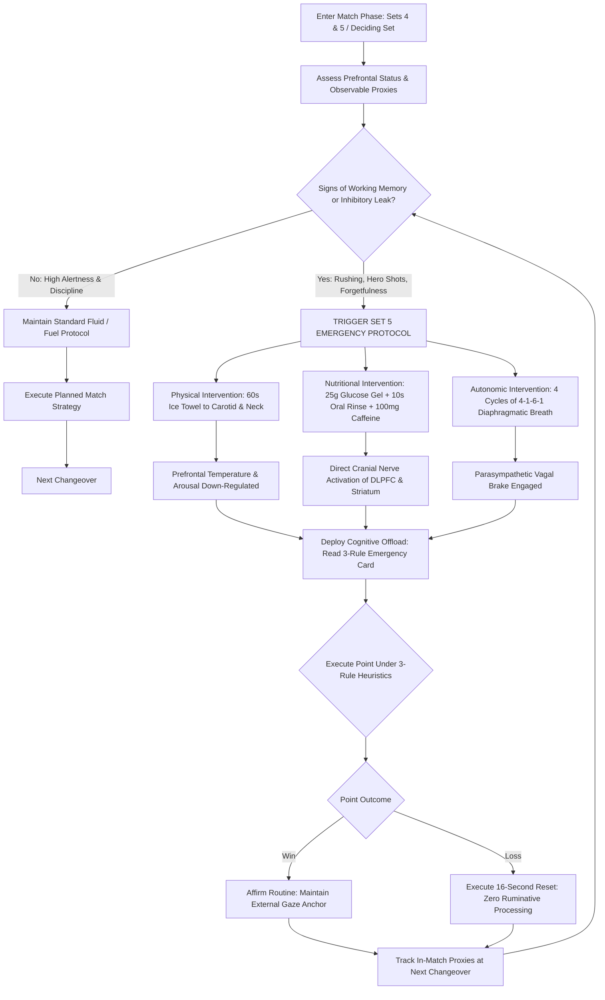

# ART-077: Executive Function Maintenance into 5th Set Conditions

> **PRO CUE:** The 5th set is an unyielding **Executive Function (EF) stress test** spanning 3 to 5 hours of severe systemic load. When the prefrontal cortex exhausts its metabolic fuel, working memory collapses, inhibitory control fails, and shot selection degenerates into panic. True champions train "EF Endurance." Championship tennis is won not merely by physical stamina, but by sustained prefrontal bandwidth.

---

## 1. Executive Summary & Athletic Intent

**Executive Function (EF)** comprises the suite of top-down cognitive control processes orchestrated by the **Dorsolateral Prefrontal Cortex (DLPFC)** and associated fronto-striatal networks: (1) **Working Memory** (holding, updating, and manipulating tactical information), (2) **Inhibitory Control** (suppressing impulsive motor actions and emotional outbursts), (3) **Cognitive Flexibility** (rapidly switching tactical task sets), (4) **Planning and Strategic Decision-Making** (selecting optimal risk-reward shot trajectories), and (5) **Attentional Control** (focusing on high-yield environmental cues while filtering noise). 

In a grueling 5-set Grand Slam encounter lasting 3 to 5 hours, prefrontal fatigue inevitably accumulates. The biological drivers of this decline include **systemic and cerebral glucose depletion**, central **dopamine and norepinephrine exhaustion**, **elevated systemic cortisol**, progressive **adenosine accumulation**, and impaired clearance of neuro-metabolic byproducts. **Executive Function Degradation** is the primary culprit behind late-match collapses: an exponential surge in unforced errors, catastrophic shot selection under pressure, loss of opponent pattern tracking, and emotional unraveling. This article establishes the biological framework of **EF Endurance**, maps the degradation timeline into the **"EF Critical Zone"**, prescribes a multi-tiered **"EF Fueling + Cognitive Conditioning + Prefrontal Protection"** protocol, and delivers a diagnostic matrix for neutralizing mental breakdown in deciding sets.

The athletic intent of this master protocol focuses on three operational goals:
1. **Transform Executive Function into a Trainable Endurance Capacity:** Shift cognitive training from abstract mental toughness platitudes into quantifiable neuro-metabolic endurance that resists central fatigue over 4+ hours.
2. **Identify and Buffer the "EF Critical Zone":** Pinpoint the exact transition windows—initiating in Set 3–4 ($90\text{–}135\text{ min}$) and culminating in Set 5 ($180\text{–}240+\text{ min}$)—where prefrontal failure occurs, deploying timely neuro-nutritional and behavioral countermeasures.
3. **Institutionalize the 3-Rule Prefrontal Offloading Protocol:** Equip competitors with acute cognitive offloading heuristics and sensory resetting routines that shield working memory during high-leverage championship tiebreaks.

---

## 2. Biomechanical & Neurological Foundation

### 2.1 The Five EF Pillars & Tennis Operational Mapping

| EF Component | Key Neuroanatomical Hubs | Operational Tennis Function | Observable Late-Match Degradation Signs |
| :--- | :--- | :--- | :--- |
| **1. Working Memory (WM)** | DLPFC, Ventrolateral PFC (VLPFC) | Tracking opponent serve/return patterns, current scoreline, wind direction, tactical rules | Forgetting opponent serving patterns; losing track of the score; abandoning tactical blueprints. |
| **2. Inhibitory Control** | Right Inferior Frontal Gyrus (rIFG), Pre-SMA | Suppressing impulsive swings, checking emotional reactions, resisting low-percentage "hero shots" | Rushing between points; pulling the trigger prematurely on low-percentage winners; racket abuse. |
| **3. Cognitive Flexibility** | DLPFC, Anterior Cingulate Cortex (ACC), Striatum | Executing mid-point Plan A $\to$ Plan B pivots; adapting mechanics to dead balls or court wear | Tactical dogmatism; perseverating on failing patterns; freezing when ball trajectory is perturbed. |
| **4. Planning & Decision-Making** | DLPFC, Orbitofrontal Cortex (OFC) | Calculating optimal shot placement, serve targeting distribution, return depth depth-over-pace | Reactive rather than proactive shot selection; hitting into opponent's strike zone; passive floating balls. |
| **5. Attentional Control** | DLPFC, Frontal Eye Fields (FEF), PPC | Sustaining Quiet Eye gaze fixation; gating out crowd noise, scoreboard pressure, and muscle burning | Wandering eye gaze during ball toss; distraction by line calls; fixating on physical fatigue. |

### 2.2 EF Degradation Match Timeline

As match duration surpasses the 3-hour mark, prefrontal bandwidth undergoes a non-linear decay:

```
SET 1 (0–45 min)     SET 2 (45–90 min)    SET 3 (90–135 min)   SET 4 (135–180 min)  SET 5 (180–240+ min)
       │                    │                    │                    │                    │
       ▼                    ▼                    ▼                    ▼                    ▼
   [EF 100%]           [EF 90–95%]          [EF 80–85%]          [EF 70–75%]          [EF 50–65%]
 Optimal State        Mild WM Strain       WM Errors Emerge    Inhibitory Leaks      CRITICAL ZONE
PFC: Glucose High    Dopamine: -10%       Dopamine: -25%       Cortisol Surge       Severe Hypoglycemia
WM: 7 ± 2 chunks     WM: 6 ± 2 chunks     WM: 4–5 chunks       WM: 3–4 chunks       WM: 2–3 chunks
Inhibit: Flawless    Inhibit: Stable      Inhibit: Minor slips Inhibit: Vulnerable  Inhibit: COLLAPSED
Flex: Ultra-fast     Flex: Normal         Flex: Delayed        Flex: Rigid          Flex: FROZEN
```

### 2.3 Neurochemical Dynamics of Long Matches

The progressive deterioration of prefrontal processing is governed by neurochemical depletion and neuroendocrine stress cascades:

| Neurotransmitter / Substrate | Long-Match Physiological Shift | Functional Impact on Executive Function | Evidence-Based Countermeasure |
| :--- | :--- | :--- | :--- |
| **Cerebral Glucose** | Decreases by $20\text{–}30\%$ in Set 5 | DLPFC has extreme glucose sensitivity; hypoglycemia instantly triggers executive collapse | Peri-match carbohydrate intake ($30\text{–}60\text{ g/h}$); 10-second oral glucose mouth rinse. |
| **Dopamine (DA)** | Decreases by $25\text{–}40\%$ in late match | Impairs working memory gating, motivation, and task-set switching in striato-frontal loops | L-Tyrosine ($1\text{–}2\text{ g}$ pre-match); targeted caffeine supplementation ($3\text{–}6\text{ mg/kg}$). |
| **Norepinephrine (NE)** | Depletion followed by chaotic stress surges | Disrupts the Yerkes-Dodson arousal curve, causing tunnel vision or attentional scattering | Phased adaptogens (Rhodiola Rosea); paced vagal breathing ($4\text{-}1\text{-}6\text{-}1$ cadence). |
| **Acetylcholine (ACh)** | Systemic depletion due to high motor drive | Reduces cortical signal-to-noise ratio, perceptual processing speed, and sensory gating | Choline donors (Alpha-GPC $300\text{–}600\text{ mg}$ or Citicoline) pre-match and at Set 3 changeover. |
| **Adenosine** | Exponential accumulation from ATP breakdown | Binds to prefrontal $A_1/A_{2A}$ receptors, inducing central sleepiness and cognitive sluggishness | Caffeine titration (Adenosine receptor antagonist: $100\text{ mg}$ booster at Set 4 changeover). |
| **Cortisol** | Massive elevation via chronic HPA activation | Acute excess impairs hippocampal retrieval and induces dendritic retraction in the prefrontal cortex | Pre-competition Ashwagandha KSM-66 ($600\text{ mg}$ daily); somatic down-regulation between games. |

---

## 3. Step-by-Step Technical Execution

### Phase 1: EF Baseline Calibration & In-Match Proxies

#### Drill 1: Comprehensive Neuro-Cognitive Baseline Battery
1. **Working Memory Assessment:** Perform computerized $N\text{-back}$ (2-back accuracy and response time) and forward/backward Digit Span testing in a rested, non-fatigued state.
2. **Inhibitory Control Assessment:** Execute computerized Color-Word Stroop tests and Go/No-Go paradigms to establish baseline inhibitory error rates ($<3\%$) and reaction latency.
3. **Cognitive Flexibility & Decision Assessment:** Conduct Trail Making Tests (B minus A latency) and rapid tennis tactical scenario decision trees.
4. **Longitudinal Re-testing:** Repeat this mini-battery following high-volume training sessions and after competitive matches to map the individual's specific cognitive fatigue decay curve.

#### Drill 2: On-Court In-Match EF Proxy Audit
Coaches and performance analysts should monitor five observable on-court behavioral proxies during tournament play:

| EF Component | On-Court Behavioral Diagnostic Test | Critical Warning Threshold |
| :--- | :--- | :--- |
| **Working Memory** | Interrogate athlete during changeover: *"What was their 1st-serve location on the last 3 ad-court points?"* | Inability to recall accurately indicates immediate working memory failure. |
| **Inhibitory Control** | Track frequency of unforced errors committed within the first 3 strokes of a rally, or premature drop-shots. | $>3$ premature "hero shots" or unforced errors per set signals inhibitory breakdown. |
| **Cognitive Flexibility** | Monitor compliance to assigned tactical pivots when opponent changes strategy. | Failure to adjust positioning or spin after 2 consecutive lost points signals cognitive freeze. |
| **Decision-Making** | Evaluate shot selection quality on balls received inside the service box (attack vs. float). | $>25\%$ sub-optimal shot choices indicates prefrontal decision fatigue. |
| **Attentional Control** | Observe adherence to the 16-Second between-point routine (racket adjustment, breath pacing, eye scan). | Skipping routine checkpoints $>2$ times per game signals severe attentional drift. |

---

### Phase 2: Targeted EF Fueling Protocol

To sustain prefrontal metabolism across 5 sets, implement a strictly timed nutritional and pharmacological schedule:

#### The Match Nutrition Timeline
- **T Minus 3 Hours (Pre-Match Meal):** Low-glycemic complex carbohydrates ($2\text{–}3\text{ g/kg}$) combined with lean protein ($0.5\text{ g/kg}$) to saturate hepatic glycogen stores and ensure stable blood glucose release.
- **T Minus 60 Minutes (Neural Priming):** Rapid-absorbing light carbohydrate ($1\text{ g/kg}$), Caffeine ($3\text{–}6\text{ mg/kg}$), and L-Tyrosine ($1\text{–}2\text{ g}$) to elevate dopamine and norepinephrine precursors.
- **Sets 1 & 2 (Changeover Hydration):** Ingest $20\text{–}25\text{ g}$ of cyclic dextrin/maltodextrin carbohydrate gel with balanced electrolytes ($300\text{ mg}$ sodium, $100\text{ mg}$ potassium) every alternating changeover.
- **Set 3 (The Critical Window):** Administer a **10-Second Glucose Mouth Rinse** using an $8\text{–}10\%$ carbohydrate solution (swish and spit). Oral cavity carbohydrate receptors directly activate the DLPFC and ventral striatum via cranial nerve pathways, boosting executive alertness within seconds without gastric burden.
- **Sets 4 & 5 (Championship Top-Up):** Administer $25\text{ g}$ carbohydrate gel, $5\text{ g}$ Branched-Chain Amino Acids (BCAA—to compete with free tryptophan across the blood-brain barrier and delay central fatigue), and a secondary **$100\text{ mg}$ caffeine booster**.

#### Evidence-Based Supplementation Protocol

| Ergogenic Aid | Clinical Dosage | Administration Timing | Scientific Mechanism & Evidence Tier |
| :--- | :--- | :--- | :--- |
| **Caffeine Anhydrous** | $3\text{–}6\text{ mg/kg}$ | 60 min pre-match $+ 100\text{ mg}$ Set 4 | **Tier A (Strong):** Antagonizes adenosine receptors; preserves motor unit firing frequency. |
| **Creatine Monohydrate** | $5\text{ g}$ daily | Daily continuous loading | **Tier A (Strong):** Elevates cerebral phosphocreatine reserves; buffers prefrontal ATP depletion. |
| **Beta-Alanine** | $3.2\text{–}6.4\text{ g}$ daily | Daily split dosing | **Tier B (Moderate):** Elevates muscle and neuronal carnosine; buffers cellular acidosis. |
| **L-Tyrosine** | $1\text{–}2\text{ g}$ | 60 min pre-match | **Tier B (Moderate):** Catecholamine precursor; sustains dopamine synthesis under acute cognitive stress. |
| **Alpha-GPC / Citicoline**| $300\text{–}600\text{ mg}$ | Pre-match + Set 3 changeover | **Tier B (Moderate):** Phospholipid choline donor; enhances acetylcholine synthesis and release. |
| **Rhodiola Rosea (3% Rosavins)**| $200\text{–}400\text{ mg}$ | Daily + Pre-match | **Tier B (Moderate):** Modulates monoamine turnover; suppresses central perception of exhaustion. |
| **Ashwagandha (KSM-66)**| $600\text{ mg}$ daily | Evening post-training | **Tier A (Strong):** Down-regulates resting salivary cortisol; accelerates systemic recovery. |

---

### Phase 3: Cognitive-Motor Endurance Conditioning

#### Drill 3: Extended Cognitive-Motor Stress Session
1. Execute a simulated 3.5- to 4-hour technical and tactical training session replicating 5-set Grand Slam demands.
2. At every simulated changeover (every 2 games), the athlete must immediately sit down and complete a **30-second rapid-fire cognitive tablet challenge**:
   - 10 trials of an auditory 2-back test.
   - 10 trials of an incongruent Stroop test.
   - 10 trials of a task-switching reaction challenge.
3. Record technical on-court errors alongside cognitive accuracy scores across each hour block.
4. **Target Benchmark:** Maintain cognitive accuracy degradation under $15\%$ from Hour 1 to Hour 4.

#### Drill 4: Dual-Task Motor-Cognitive Rally Endurance
1. Engage in high-tempo, 60- to 90-minute sustained rally play against live balls or high-end ball machines.
2. Concurrently overlay continuous cognitive load: the player must wear an auditory earpiece receiving randomized number streams, performing live serial mental arithmetic or responding to auditory Stroop cues (*"High"* vs. *"Low"* pitch commands) while executing rally patterns.
3. Quantify shot precision, depth, and unforced error rates over the full 90 minutes.

#### Drill 5: Prefrontal Protection & Cognitive Offloading
Train the athlete to offload DLPFC processing during live points by transitioning control to automated subcortical mechanisms:
- **Heuristic Offloading (Article 053):** Compress complex strategic deliberations into maximum 3 binary decision heuristics (*"IF opponent is behind baseline, THEN hit heavy deep middle"*).
- **External Focus Anchoring (Article 045):** Direct attention exclusively to the external flight of the ball and target seam rotation rather than internal kinematic mechanics.
- **Between-Point Ritual Automation (Article 047):** Automate the 4-stage recovery ritual (Disengage $\to$ Recover $\to$ Prepare $\to$ Execute) to permit transient prefrontal de-activation between points.

---

### Phase 4: The Set 5 Championship Protocol

Upon entering the 5th set or a deciding match tiebreak, immediately initiate this synchronized protocol:

```
IMMEDIATE CHANGEOVER ACTIONS (Prior to Game 1 of Set 5):
1. NUTRITION: Ingest 25 g Glucose Gel + 100 mg Caffeine + 5 g BCAA + 300 mg Electrolytes.
2. PHYSICAL: Apply ice towel to carotid triangle, face, and back of neck for 60 seconds (Vagal stimulation & Prefrontal cooling).
3. NEURO-RESPIRATORY: Execute four cycles of 4-1-6-1 diaphragmatic reset breathing (Inhale 4s, Hold 1s, Exhale 6s, Hold 1s).
4. STRATEGIC OFFLOAD: Read the "3-RULE EMERGENCY CARD" written on racket handle or forearm:
   • Rule 1: First Serve Percentage > 70% (Target Body / T only).
   • Rule 2: Deep Middle Returns (Zero unforced errors on return).
   • Rule 3: Rally > 4 Shots (Attack only short balls inside the service line).
5. PSYCHOLOGICAL REFRAME: "The 5th set is an opportunity. The opponent's prefrontal cortex is starving. The player who protects their executive bandwidth takes the trophy."
```

**In-Set Execution (Every Changeover during Set 5):**
- Administer a 10-second glucose mouth rinse (do not swallow).
- Execute two cycles of $4\text{-}1\text{-}6\text{-}1$ breathing.
- Verbally re-affirm compliance with the 3 emergency rules.
- Maintain an upright somatic posture: spine extended, head elevated, chest expanded.

---

## 4. Performance Metrics & Training Dosage

| Performance Metric | Developing | Proficient | Advanced | Elite (Grand Slam Champion) |
| :--- | :--- | :--- | :--- | :--- |
| **Cognitive Battery Drop (Set 1 $\to$ 4)** | $>30\%$ error increase | 20–30% drop | 10–20% drop | **$<10\%$ error increase** |
| **Working Memory In-Match Accuracy** | $<50\%$ pattern recall | 50–70% recall | 70–85% recall | **$>90\%$ flawless tactical recall** |
| **Inhibitory Error Rate (UE in Set 5)** | $>15\%$ total shots | 10–15% | 5–10% | **$<5\%$ unforced error rate** |
| **Late-Match Decision Quality** | $<50\%$ optimal choices | 50–65% | 65–80% | **$>85\%$ optimal shot selection** |
| **Glycemic Stability (Blood Glucose)** | Swings $>40\text{ mg/dL}$ | 30–40 mg/dL | 20–30 mg/dL | **Variability $<20\text{ mg/dL}$** |
| **Cognitive-Motor 4h Session Drop** | $>25\%$ performance drop| 15–25% drop | 10–15% drop | **$<10\%$ degradation at 4 hours** |
| **Deciding 5th-Set Comeback Win %** | $<20\%$ conversion | 20–35% | 35–50% | **$>50\%$ win rate in 5-setters** |

### Weekly Periodized Training Dosage

- **Cognitive Baseline Testing:** Full laboratory battery performed $1\times/\text{month}$; mini-battery executed post-match weekly during competition blocks.
- **Extended Cognitive-Motor Session ($1\times/\text{every 2 weeks}$):** 3.5- to 4-hour high-volume tennis simulation with integrated 30-second changeover cognitive stress tests.
- **Dual-Task Rally Conditioning ($1\times/\text{week}$, 60–90 Min):** High-tempo groundstroke exchanges under concurrent auditory working memory load.
- **Fueling Protocol Adherence:** $100\%$ compliance during all training matches exceeding 2 hours and during official tournament play.
- **Systemic Neuro-Supplementation:** Continuous chronic daily baseline (Creatine, Ashwagandha) combined with acute match-day dosing (Caffeine, Tyrosine, Alpha-GPC).

---

## 5. Errors, Causes & Correction Protocols

| Observable Tactical / Behavioral Defect | Root Neurochemical / Cognitive Cause | Precision Correction Protocol |
| :--- | :--- | :--- |
| **"Set 3–4: Forgets opponent patterns; repeatedly plays into their strength."** | Severe working memory depletion driven by prefrontal glycogen depletion and dopamine exhaustion. | Deploy Heuristic Offloading (reduce tactics to 3 binary rules); execute 10s glucose mouth rinse; take $100\text{ mg}$ caffeine booster. |
| **"Set 4–5: Wild hero shots and unforced error spikes on routine balls."** | Breakdown of inhibitory control in the right IFG due to elevated cortisol and central fatigue. | Execute 16-Second Cure reset between points; adopt external target focus; enforce a hard rule: *"Hit zero balls within 1 meter of lines."* |
| **"Set 5: Complete cognitive freeze; unable to adapt to changed conditions."** | Severe prefrontal hypofrontality causing complete loss of cognitive flexibility. | Re-read the physical 3-Rule Card on the racket handle; execute two vagal down-regulating breaths; visualize immediate Plan B. |
| **"Late-match attentional scattering; easily distracted by crowd or wind."** | Attentional control failure linked to norepinephrine dysregulation in the locus coeruleus. | Re-establish strict eye-tracking routines; focus on ball seams at ball toss; deploy ice towel to face during changeover. |
| **"Poor shot selection on attackable balls (hitting flat when push was needed)."** | Orbitofrontal cortex and DLPFC glucose exhaustion impairing probabilistic risk calculation. | Pre-commit to a simplified decision tree (maximum 2 predetermined options); eliminate improvisation in pressure moments. |
| **"Post-match severe brain fog, headache, and inability to recount match details."** | Excessive accumulation of prefrontal metabolic waste and adenosine combined with systemic dehydration. | Ingest $3:1$ carbohydrate-to-protein liquid recovery formula within 30 min; enforce 9 hours of sleep; maintain chronic creatine intake. |

---

## 6. Diagnostic Diagram & Decision Flow



---

## 7. Video Demonstration & Technical Analysis

<div class="video-container" style="position:relative;padding-bottom:56.25%;height:0;overflow:hidden;border-radius:12px;">
  <iframe src="https://www.youtube-nocookie.com/embed/VIDEO_ID_PLACEHOLDER"
          style="position:absolute;top:0;left:0;width:100%;height:100%;border:0;"
          allow="accelerometer; autoplay; clipboard-write; encrypted-media; gyroscope; picture-in-picture"
          allowfullscreen
          title="Executive Function Maintenance into 5th Set Conditions — Technical Analysis"></iframe>
</div>

*Recommended High-Resolution Video Analysis Protocols:*
1. **fMRI Match Timeline Simulation:** Visualizing glucose uptake and oxygenation decay in the prefrontal cortex during simulated multi-hour competitive loading.
2. **On-Screen Cognitive Testing Demonstration:** Split-screen display showing collegiate and tour-level athletes performing the 30-second changeover cognitive mini-battery under heart rates exceeding $170\text{ BPM}$.
3. **Oral Carbohydrate Rinse fMRI Verification:** Highlighting immediate post-rinse neural activation patterns in the prefrontal cortex and primary motor cortex within 15 seconds of administration.
4. **Historical Grand Slam 5th-Set Deconstruction:** Analyzing historical marathon finals (e.g., Australian Open 2012 Djokovic vs. Nadal), examining how somatic routines and simplified tactical execution insulated the winner against cognitive collapse.

---

## 8. Cross-Domain Synergy & Multi-Pillar Integration

- **Integration with Cognitive Flexibility (Article 076):** Maintaining executive function is the non-negotiable prerequisite for cognitive flexibility. When prefrontal networks degrade, the player loses the ability to execute tactical pivots, becoming rigidly trapped in failing patterns.
- **Integration with Automated Tactical Heuristics (Article 053):** Heuristic decision rules serve as the primary **executive offloading shield**. Reducing tactical calculations to 3 pre-compiled rules keeps working memory load below 3 chunks, insulating the brain against late-match collapse.
- **Integration with Stress Resilience & Cortisol Buffering (Article 072):** Chronic cortisol elevation actively causes prefrontal dendritic retraction and suppresses hippocampal memory retrieval. Implementing somatic down-regulation directly preserves executive function integrity.
- **Integration with Lactate Tolerance & Metabolic Buffering (Articles 054, 058):** Systemic acidosis and high circulating lactate generate afferent metabolic feedback that induces prefrontal fatigue. Physical conditioning serves as the baseline buffer protecting cognitive clarity.
- **Integration with Sleep Architecture & Glymphatic Clearance (Articles 184–186):** Nocturnal slow-wave sleep and glymphatic clearance are mandatory for clearing adenosine and toxic metabolic byproducts from the prefrontal cortex. Without deep recovery sleep, 5th-set executive endurance cannot be sustained.
- **Integration with Motor Imagery (Article 059):** Pre-match and between-set motor imagery relies on subcortical cerebellar and basal ganglia simulations, preserving valuable prefrontal glucose reserves during tactical preparation.
- **Integration with Central Neural Drive (Article 069):** Late-match drops in serve velocity and explosive movement originate from central fatigue (depletion of central dopamine, norepinephrine, and acetylcholine). Executive fueling directly sustains descending motor unit firing rates.
- **Integration with Between-Point Micro-Recovery (Article 061):** The structured 25-second between-point protocol provides acute metabolic micro-breaks that allow prefrontal ATP and neurotransmitter replenishment throughout extended matches.

---

## 9. Self-Assessment Rubric

| Assessment Dimension | Level 1: Early Collapse | Level 2: Mid-Match Decay | Level 3: Resilient Endurance | Level 4: Grand Slam Master |
| :--- | :--- | :--- | :--- | :--- |
| **Cognitive Battery Drop (S1 $\to$ S4)** | $>30\%$ error spike; severe mental fog | 20–30% accuracy decline | 10–20% decline; functional | **$<10\%$ error variance; razor sharp** |
| **5th-Set Working Memory Recall** | $<50\%$ accuracy; completely disoriented | 50–70% recall; misses details | 70–85% tactical recall | **$>90\%$ flawless recall of opponent tendencies** |
| **Inhibitory Discipline (UE Rate)** | $>15\%$ unforced error spike in Set 5 | 10–15% unforced errors | 5–10% error rate | **$<5\%$ error rate; ironclad discipline** |
| **Decision-Making Quality** | $<50\%$ optimal shot choices | 50–65% optimal selection | 65–80% optimal selection | **$>85\%$ optimal choices under maximum stress** |
| **Glycemic Stability** | Severe crashes ($>40\text{ mg/dL}$ swings)| $30\text{–}40\text{ mg/dL}$ fluctuations | $20\text{–}30\text{ mg/dL}$ stability | **Stable variability $<20\text{ mg/dL}$** |
| **Deciding Set Win Rate** | $<20\%$ conversion in 5th sets | 20–35% win rate | 35–50% win rate | **$>50\%$ historical win rate in deciding sets** |

**Diagnostic Scoring Key:**
- **6–12 Points:** Severe Executive Fragility. High risk of mid-match mental collapse; mandatory implementation of the baseline fueling and cognitive offloading protocols.
- **13–18 Points:** Vulnerable Under Extended Load. Capable of winning short matches; consistently breaks down when matches extend past 2.5 hours.
- **19–24 Points:** High Executive Resilience. Robust prefrontal stamina capable of sustaining disciplined tactical tennis through 4 sets.
- **25–30 Points:** Elite Executive Mastery. Tour-level neurological conditioning, precision fueling, and cognitive offloading that dominates marathon 5-set encounters.

---

## 10. Printable Practice Card (Pocket Drill Card)

```
┌────────────────────────────────────────────────────────────────────────┐
│           POCKET DRILL CARD: EXECUTIVE FUNCTION ENDURANCE              │
│ Target: 4h EF Drop < 10% | Set 5 UE Rate < 5% | Glucose Variance < 20 │
├────────────────────────────────────────────────────────────────────────┤
│ BLOCK A: Baseline Cognitive Calibration (10 Min)                       │
│ • Tablet Mini-Battery: N-back 2-back, Stroop, Task-Switching (30 reps) │
│ • Record Resting Pre-Session Accuracy & Latency Benchmarks             │
│ • Focus Cue: "Calibrate your mental engine — Know your baseline numbers"│
├────────────────────────────────────────────────────────────────────────┤
│ BLOCK B: High-Volume Cognitive-Motor Simulation (3 to 4 Hours)        │
│ • Competitive Tennis Match Simulation: Live points across 4–5 sets     │
│ • Changeover Mini-Challenge: 30s tablet cognitive test every 2 games   │
│ • Focus Cue: "Compete — Test — Refuel — Repeat with zero mental drift"  │
├────────────────────────────────────────────────────────────────────────┤
│ BLOCK C: Peri-Match Neuro-Fueling Protocol (Every Changeover)          │
│ • Sets 1–2: 25g Carbohydrate Gel + Balanced Electrolytes               │
│ • Set 3: 10s Oral Glucose Mouth Rinse (Swish and spit)                 │
│ • Sets 4–5: 25g Gel + 5g BCAA + 100mg Caffeine Booster                 │
│ • Focus Cue: "Fuel the prefrontal cortex — Never let the brain starve" │
├────────────────────────────────────────────────────────────────────────┤
│ BLOCK D: Post-Session Audit & Recovery Integration (10 Min)            │
│ • Immediate Post-Session EF Retest: Log percentage decline from rest   │
│ • Ingest 3:1 Carb/Protein Shake; apply 60s cold water face wash        │
│ • Pass Benchmark: Cognitive drop < 15%; unforced error rate stable     │
└────────────────────────────────────────────────────────────────────────┘
```

---

*Cross-References: Articles 044, 045, 047, 053, 054, 058, 059, 061, 072, 076, 184–186. Pillar II: Neuro-Athletic Performance & Technical Biomechanics — TennisKB 200 Master Series.*
