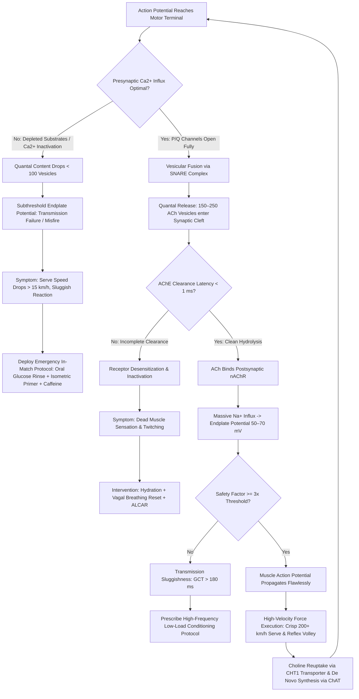

# ART-078: Neuromuscular Junction Efficiency and Acetylcholine Dynamics

> **PRO CUE:** Neural commands from the motor cortex must cross the **Neuromuscular Junction (NMJ)** to generate physical racket force. Acetylcholine (ACh) is the electrochemical "key" that unlocks postsynaptic sodium channels to ignite muscular action potentials. Under prolonged competitive load, ACh stores deplete, postsynaptic receptors desensitize, and quantal content plummets. Conditioning NMJ transmission efficiency ensures your serve velocity and explosive first-step reaction do not deteriorate across five sets.

---

## 1. Executive Summary & Athletic Intent

The **Neuromuscular Junction (NMJ)** is the specialized chemical synapse that connects the terminal branch of an alpha motor neuron to the motor endplate of an individual skeletal muscle fiber. The transmission cascade follows an exact sequence: arriving motor action potentials open voltage-gated calcium ($Ca^{2+}$) channels $\to$ presynaptic vesicles fuse to release **Acetylcholine (ACh)** into the synaptic cleft $\to$ ACh binds to nicotinic acetylcholine receptors (nAChR) on the post-junctional folds $\to$ inward sodium ($Na^+$) flux generates an **Endplate Potential (EPP)** $\to$ exceeding the electrical threshold triggers a muscle action potential that drives cross-bridge cycling and force generation. 

**NMJ Transmission Efficiency** is defined by three physiological pillars:
1. **Transmission Reliability (Safety Factor):** The magnitude by which the generated EPP exceeds the threshold required to fire a muscle action potential ($EPP / V_{\text{threshold}}$), normally operating at a robust $3\text{–}5\times$ margin.
2. **Synaptic Speed:** The latency between presynaptic axon depolarization and cross-bridge force onset ($<1.5\text{ ms}$).
3. **Fatigue Resistance:** The ability to sustain high-frequency vesicle recycling and release (**quantal content**) across hours of intermittent maximal contractions.

In championship tennis, serving repeatedly above $200\text{ km/h}$, reacting to net volleys within $<150\text{ ms}$, and sprinting laterally through a 4-hour match severely stresses the neuromuscular junction. When transmission fails, central motor drive cannot reach the contractile proteins, resulting in severe power loss, sluggish footwork, and erratic shot control. This article details the biophysics of the NMJ, maps the molecular dynamics of acetylcholine synthesis, release, and clearance, establishes evidence-based protocols for **High-Frequency Low-Load NMJ Conditioning**, outlines targeted neuro-nutritional supplementation, and delivers a clinical diagnostic matrix for eliminating peripheral transmission leaks.

The athletic intent of this master protocol focuses on three operational goals:
1. **Target the Neuromuscular Junction as a Distinct Trainable Subsystem:** Move beyond muscular hypertrophy to isolate the synaptic transmission boundary as the critical determinant of explosive force preservation.
2. **Optimize Acetylcholine Cycle Dynamics:** Balance presynaptic choline uptake (via CHT1 transporters), choline acetyltransferase (ChAT) synthesis, and acetylcholinesterase (AChE) clearance to prevent both transmission failure and receptor desensitization.
3. **Institutionalize High-Frequency Resistance & In-Match Priming:** Deploy low-load, rapid-cycling isometric protocols alongside oral nutrient strategies to maintain the transmission Safety Factor ($>3\times$) through the 5th set.

---

## 2. Biomechanical & Neurological Foundation

### 2.1 NMJ Structural & Functional Architecture

| Structural Component | Physiological Architecture | Functional Tennis Impact |
| :--- | :--- | :--- |
| **Motor Neuron Terminal** | Unmyelinated presynaptic bouton housing $300,000+$ synaptic vesicles (quantal size $\approx 5,000\text{–}10,000$ ACh molecules/vesicle) | Determines **Quantal Content ($m$)**; sets the maximal amplitude of the Endplate Potential. |
| **Active Zones** | Protein complexes (Bassoon, Piccolo, RIM) organizing clusters of P/Q-type voltage-gated $Ca^{2+}$ channels | Governs the probability of vesicular fusion upon action potential arrival; controls rapid rate coding. |
| **Synaptic Cleft** | Narrow extracellular gap ($50\text{–}100\text{ nm}$) anchored with high-density Acetylcholinesterase (AChE) | AChE hydrolyzes ACh in $<1\text{ ms}$, terminating depolarization and enabling rapid subsequent firing without tetanus. |
| **Motor Endplate** | Postsynaptic junctional folds densely packed with nAChRs ($\sim 10,000/\mu\text{m}^2$) aligned with active zones | Translates chemical transmitter binding into massive local $Na^+$ influx; establishes the Safety Factor. |
| **Perisynaptic Schwann Cells (PSCs)** | Glial caps covering the NMJ terminal, expressing receptors for ATP and ACh | Senses synaptic activity, modulates local transmission gain, and directs structural remodeling post-fatigue. |

### 2.2 The Acetylcholine Cycle Dynamics

The synaptic transmission sequence at the NMJ occurs within a sub-two-millisecond operational window:

```
MOTOR ACTION POTENTIAL ARRIVES AT TERMINAL BOUTON
       │
       ▼
[1. CALCIUM INFLUX] ──► P/Q-type Voltage-Gated Ca2+ channels open; local microdomains reach >100 µM Ca2+
       │
       ▼
[2. VESICLE FUSION] ──► Synaptotagmin senses Ca2+; SNARE complex (VAMP/Syntaxin/SNAP-25) zippers
       │                 Quantal Content (m) = 50–300 vesicles released per single nerve impulse
       │
       ▼
[3. ACh DIFFUSION] ───► Acetylcholine diffuses across the 50–100 nm synaptic cleft in < 0.2 ms
       │
       ▼
[4. RECEPTOR GATING] ─► 2 ACh molecules bind per nAChR; non-selective cation channel opens
       │                 Inward Na+ current generates Endplate Potential (EPP = 50–70 mV)
       │                 Safety Factor = EPP / Threshold (~3–5x excess voltage)
       │
       ▼
[5. ACh HYDROLYSIS] ──► Acetylcholinesterase (AChE) hydrolyzes ACh into Choline + Acetate in < 1 ms
       │                 High-affinity Choline Transporter 1 (CHT1) reuptakes choline presynaptically
       │                 Choline Acetyltransferase (ChAT) synthesizes de novo ACh from Acetyl-CoA
       │
       ▼
[6. RECOVERY & RESET] ─► Clathrin-mediated endocytosis / "Kiss-and-Run" vesicle recycling restores pool
```

### 2.3 Mechanisms of Neuromuscular Junction Fatigue

Peripheral transmission failure during extended tennis competition originates from distinct presynaptic, cleft, and postsynaptic breakdowns:

| Failure Mechanism | Biophysical Etiology | Clinical / Match Onset Timeline | Tennis Functional Consequence |
| :--- | :--- | :--- | :--- |
| **1. Quantal Content Decline** | Inactivation of presynaptic $Ca^{2+}$ channels; temporary depletion of readily releasable vesicle pool | Early in high-frequency bursts ($>50\text{ Hz}$, $30\text{–}60\text{ s}$) | EPP amplitude plummets; voltage fails to reach threshold; sudden loss of initial serve velocity. |
| **2. Postsynaptic Desensitization** | Prolonged exposure to high ACh concentrations shifts nAChR into an inactive closed state | Sustained high-intensity rallies ($>8$ aggressive strokes) | Muscles feel "unresponsive"; muscle fibers drop out of recruitment despite high central effort. |
| **3. Presynaptic Choline Exhaustion** | Rate of ACh release exceeds the capacity of CHT1 transporters to scavenge and re-synthesize ACh | Middle to late match ($>90\text{–}120\text{ min}$) | Quantal size shrinks; progressive downward drift in average ball speed and ground reaction force. |
| **4. Mitochondrial ATP Depletion** | Terminal mitochondrial glycogen depletion impairs proton pumps responsible for loading ACh into vesicles | Late match ($>2.5\text{–}3.5\text{ hours}$) | Vesicle recycling slows; complete transmission failure on high-velocity explosive movements. |
| **5. Inflammatory Cytokine Interference**| Circulating TNF-$\alpha$, IL-6, and reactive oxygen species alter presynaptic protein configuration | Tournament multi-match fatigue / Overtraining | Chronic motor unit drop-out; elevated muscle twitch jitter; systemic loss of crisp ball striking. |

### 2.4 Tennis-Specific NMJ Biomarkers & Metrics

| Physiological Metric | Biophysical Meaning | Rested Baseline | Fatigued Unconditioned | Elite Target (Trained) |
| :--- | :--- | :--- | :--- | :--- |
| **Transmission Safety Factor** | $\text{EPP Amplitude} / \text{Firing Threshold}$ | $4.0\text{–}5.0\times$ | $1.5\text{–}2.0\times$ (near failure) | **$\ge 3.0\times$ sustained under fatigue** |
| **Quantal Content ($m$)** | Number of vesicles released per impulse | $150\text{–}250$ | $50\text{–}100$ | **$\ge 150$ at 4th set match point** |
| **EPP Rise Time ($10\text{–}90\%$)**| Rate of postsynaptic membrane depolarization | $<0.5\text{ ms}$ | $>1.0\text{ ms}$ | **$<0.7\text{ ms}$ under high lactate** |
| **Paired-Pulse Ratio (PPR at 50 ms)**| Degree of presynaptic facilitation vs. depression | Facilitation ($1.5\text{–}2.0\times$)| Severe Depression ($<1.0\times$)| **Maintains Facilitation ($>1.3\times$)**|
| **Force Output CV% ($20$ reps)** | Consistency of maximal rapid motor unit recruitment| $<5\%$ variance | $>12\%$ variance | **$<5\%$ variance across 20 trials** |

---

## 3. Step-by-Step Technical Execution

### Phase 1: NMJ Assessment & Functional Testing

#### Drill 1: High-Frequency Fatigue Index Test
1. Utilize an isokinetic dynamometer or specialized load-cell strain gauge linked to high-speed data acquisition.
2. Establish baseline Maximum Voluntary Contraction (MVC) in a tennis-specific movement (e.g., isometric internal shoulder rotation or dominant leg extension).
3. Execute a **Rapid-Repeat Isometric Protocol**: 1 maximal contraction every 2 seconds for 30 consecutive repetitions (or apply $50\text{ Hz}$ neuromuscular electrical stimulation for 30 seconds if laboratory equipment is available).
4. Calculate the **NMJ Fatigue Index**: $\text{Force at Repetition 30} / \text{Initial Peak MVC} \times 100$.
5. **Target Benchmark:** Maintain $>70\%$ of initial force production across the full 30-repetition protocol.

#### Drill 2: Doublet / Triplet Twitch Potentiation Testing
1. Deliver transcutaneous electrical stimulation over the motor nerve trunk (e.g., femoral nerve or musculocutaneous nerve): single pulse (twitch) followed by a paired doublet ($10\text{ ms}$ inter-pulse interval).
2. Measure the **Doublet-to-Twitch Peak Force Ratio**.
3. A ratio of $>1.8$ reflects healthy presynaptic $Ca^{2+}$ accumulation and robust NMJ facilitation.
4. A ratio of $<1.3$ signals acute NMJ depression and impaired vesicle release probability.

#### Drill 3: Reaction Time & Rapid Force Output Variability
1. Perform 20 consecutive explosive reactive touches using randomized visual lights (Blazepod) positioned on a dual-force plate system.
2. Measure response time variability alongside peak rate of force development (RFD).
3. High variance in peak force ($\text{CV} > 10\%$) with stable response time confirms peripheral NMJ transmission fluctuation rather than central processing delays.

---

### Phase 2: Targeted NMJ Conditioning Protocols

The objective of NMJ conditioning is to stimulate high motor neuron firing frequencies ($50\text{–}100\text{ Hz}$) to induce presynaptic structural adaptations (expansion of active zones, increased vesicular storage) while minimizing deep metabolic and contractile exhaustion.

#### Drill 4: High-Frequency Low-Load Isometric Cycling
1. Select the four primary kinetic chain muscle complexes critical to tennis stroke production:
   - **Rotator Cuff:** External/Internal rotators at 90° abduction.
   - **Forearm & Wrist:** Extensor carpi radialis and flexor carpi ulnaris.
   - **Triceps Brachii:** Elbow extension lock-out for serve terminal snap.
   - **Triceps Surae (Calf Complex):** Plantar flexion for vertical leg drive.
2. Fasten a low-load elastic band or rigid strap, applying approximately $20\text{–}30\%$ of MVC.
3. Perform **Rapid On/Off Cycling**: $100\text{ ms}$ maximal impulse contraction followed by $100\text{ ms}$ complete relaxation for a continuous 60-second block ($300$ rapid contractions per set).
4. **Volume:** 3 sets $\times$ 60 seconds per muscle group; $3\times/\text{week}$.
5. This upgrades vesicular docking machinery and enhances CHT1 transporter expression without inducing structural muscle fiber damage.

#### Drill 5: Reactive Plyometric NMJ Transmission
1. Execute **Drop Jumps from a $30\text{–}40\text{ cm}$ box** onto a contact grid or dual force plate.
2. Constraint: The athlete must achieve an explosive vertical rebound with an absolute **Ground Contact Time (GCT) of $<140\text{ ms}$** and a Reactive Strength Index (RSI) $>2.2$.
3. Concurrently execute medicine ball reactive wall strikes ($2\text{ kg}$ ball caught and repelled within $<150\text{ ms}$).
4. **Volume:** 5 sets $\times$ 3 reps; full 3-minute passive neurological rest between sets.
5. This demands lightning-fast spinal alpha motor neuron recruitment and pristine NMJ transmission fidelity.

#### Drill 6: Complex Contrast Contrast (PAP-NMJ Conditioning)
1. Heavy Neural Priming Set: Perform a heavy multi-joint lift (e.g., trap-bar deadlift or heavy push press at $85\%$ 1RM for 3 repetitions).
2. Passive Rest Window: Exactly 3 to 4 minutes to allow contractile fatigue to dissipate while Post-Activation Potentiation (PAP) remains peaked.
3. Explosive Contrast Strike: Execute 6 to 8 maximal-velocity tennis medicine ball rotational throws or simulated high-speed serves with an over-weighted training racket ($+50\text{ g}$).
4. Mechanism: PAP elevates myosin light-chain phosphorylation and presynaptic $Ca^{2+}$ sensitivity, expanding quantal content and allowing the athlete to train at supranormal neurological outputs.

---

### Phase 3: Acetylcholine Nutritional Support Protocol

Synthesizing and clearing acetylcholine at tour-level speeds requires targeted substrate availability:

| Nutrient Substrate | Neurological / NMJ Mechanism | Clinical Ergogenic Dosage | Administration Window |
| :--- | :--- | :--- | :--- |
| **Alpha-GPC (L-alpha-glycerylphosphorylcholine)** | Highly bioavailable choline donor that crosses blood-brain barrier; directly fuels presynaptic ChAT synthesis | $300\text{–}600\text{ mg}$ | 60 min pre-match; repeated at Set 3 changeover |
| **Citicoline (CDP-Choline)** | Elevates acetylcholine synthesis while supporting neuronal membrane and Schwann cell phospholipid integrity | $250\text{–}500\text{ mg}$ | Daily morning intake during tournament weeks |
| **Acetyl-L-Carnitine (ALCAR)** | Donates acetyl groups for Acetyl-CoA synthesis in terminal mitochondria; protects nerve endings from oxidative decay | $500\text{–}1,000\text{ mg}$ | Daily with breakfast $+ 500\text{ mg}$ pre-match |
| **Huperzine A** | Highly selective, reversible Acetylcholinesterase (AChE) inhibitor; extends active lifetime of synaptic ACh | $50\text{–}100\text{ mcg}$ *(use conservatively)* | 60 min pre-match *(avoid chronic continuous use)* |
| **Vitamin B5 (Pantothenic Acid)** | Essential cofactor in Coenzyme A synthesis, the rate-limiting substrate for Acetyl-CoA production | $500\text{–}1,000\text{ mg}$ | Daily continuous baseline |
| **Magnesium Threonate / Glycinate** | Regulates presynaptic P/Q-type $Ca^{2+}$ channel kinetics, preventing intracellular calcium toxicity | $300\text{–}400\text{ mg}$ elemental | Evening post-match / post-training |
| **Omega-3 Fatty Acids (High DHA)** | Enhances lipid raft fluidity at the motor endplate, optimizing nAChR clustering and stability | $2,000\text{–}3,000\text{ mg}$ DHA/EPA | Daily continuous baseline |

---

### Phase 4: In-Match NMJ Protection Architecture

| In-Match Intervention | Execution Window | Biological Mechanism & Performance Outcome |
| :--- | :--- | :--- |
| **Isometric Changeover Primers** | Every changeover during Sets 3, 4, 5 | Execute $3 \times 5\text{ s}$ submaximal ($60\%$ MVC) isometric grip and calf activations against the chair. Maintains post-activation potentiation and keeps presynaptic $Ca^{2+}$ primed. |
| **Graduated Compression Sleeves** | Continuous throughout match | Enhances mechanical feedback and muscle spindle sensitivity, elevating spinal excitability and reducing transmission jitter. |
| **Carbohydrate Mouth Rinse (10s)** | Set 3, 4, and 5 changeovers | Triggers cephalic-phase oral receptors, stimulating descending motor cortex drive to sustain high-frequency motor unit recruitment. |
| **Targeted Caffeine Micro-Dosing** | Set 4 changeover ($100\text{ mg}$) | Antagonizes presynaptic adenosine $A_1$ receptors on motor terminals, facilitating vesicular acetylcholine release. |
| **Vagal Reset Breathing ($4\text{-}1\text{-}6\text{-}1$)** | All changeovers | Accelerates systemic metabolic byproduct clearance, preventing interstitial acidosis from inhibiting postsynaptic receptor kinetics. |

---

## 4. Performance Metrics & Training Dosage

| Performance Metric | Developing | Proficient | Advanced | Elite (ATP / WTA Pro) |
| :--- | :--- | :--- | :--- | :--- |
| **High-Frequency Fatigue Index (30s)** | $<50\%$ force maintained| 50–65% | 65–75% | **$>75\%$ sustained force** |
| **Doublet-to-Twitch Ratio** | $<1.3$ (depression) | 1.3–1.6 | 1.6–1.8 | **$>1.8$ (potent facilitation)** |
| **Force Output Consistency (CV% 20 reps)**| $>10\%$ variance | 7–10% | 5–7% | **$<5\%$ variance (robotic consistency)**|
| **Drop Jump Ground Contact Time (30cm)** | $>200\text{ ms}$ | 160–200 ms | 130–160 ms | **$<130\text{ ms}$ (explosive transmission)** |
| **Serve Speed Retention (Set 1 $\to$ 5)** | $>15\%$ velocity loss | 10–15% loss | 5–10% loss | **$<5\%$ drop in 1st serve velocity** |
| **Reaction Volley Contact Quality** | High shanking under load | Inconsistent pop | Crisp under medium pace | **100% clean sweet-spot impact** |

### Weekly Periodized Training Dosage

- **High-Frequency Low-Load Blocks ($3\times/\text{week}$, 15 Min):** 3 sets of 60s cycling across cuff, wrist, triceps, and calves.
- **Reactive Plyometric Transmission ($2\times/\text{week}$, 20 Min):** Depth jumps and reactive medicine ball complexes focusing on sub-140 ms contact times.
- **Complex Contrast Conditioning ($1\times/\text{week}$, 25 Min):** 4 pairs of heavy strength to explosive contrast movements.
- **Acetylcholine Substrate Nutrition:** Daily chronic foundational supplementation (B5, ALCAR, Omega-3) combined with acute peri-match choline donor administration.
- **In-Match Priming:** Mandatory execution of isometric primers and neuro-nutritional changeover routines across all multi-set match play.

---

## 5. Errors, Causes & Correction Protocols

| Observable Mechanical Defect | Root NMJ / Neurochemical Cause | Prescriptive Correction Protocol |
| :--- | :--- | :--- |
| **"First serve velocity drops by $>15\text{ km/h}$ in Sets 3 and 4 despite high exertion."** | Presynaptic quantal content collapse and vesicular acetylcholine depletion in shoulder internal rotators. | Implement High-Frequency Low-Load cuff conditioning; administer Alpha-GPC ($600\text{ mg}$) pre-match; perform changeover isometric primers. |
| **"Volleys feel sluggish and lack pop; player frames fast passing shots."** | Delayed NMJ transmission speed ($>1.5\text{ ms}$ synaptic latency); postsynaptic desensitization. | Prescribe Reactive Depth Jump conditioning; apply 10s oral carbohydrate rinse; take $100\text{ mg}$ caffeine booster. |
| **"Inconsistent ball trajectory; shots alternate wildly between heavy and floating."** | High NMJ force transmission variability ($\text{CV} > 10\%$) due to fluctuating quantal release. | Conduct 20-repetition rapid force consistency trials; supplement with Magnesium Glycinate to stabilize $Ca^{2+}$ channel gating. |
| **"Muscles feel heavy and 'dead' without acute soreness (loss of explosive burst)."** | Combined central fatigue and presynaptic acetylcholine synthesis failure. | Ingest BCAA + Choline donor + Carbohydrate electrolyte beverage; execute 60s ice towel neck cooling to reset autonomic tone. |
| **"Severe muscle cramping or uncontrollable fasciculations (twitching) late in match."** | Acetylcholine accumulation from impaired AChE activity combined with intracellular electrolyte and choline imbalances. | Rebalance hydration with high-potassium/magnesium electrolytes; ingest post-match ALCAR ($1,000\text{ mg}$); verify choline intake. |
| **"Sluggish footwork deceleration on wide defensive recovery steps."** | Impaired eccentric motor unit recruitment driven by eccentric NMJ mechanical micro-trauma. | Integrate heavy eccentric contrast loading with rapid isometric contractions into mesocycle physical training. |

---

## 6. Diagnostic Diagram & Decision Flow



---

## 7. Video Demonstration & Technical Analysis

<div class="video-container" style="position:relative;padding-bottom:56.25%;height:0;overflow:hidden;border-radius:12px;">
  <iframe src="https://www.youtube-nocookie.com/embed/VIDEO_ID_PLACEHOLDER"
          style="position:absolute;top:0;left:0;width:100%;height:100%;border:0;"
          allow="accelerometer; autoplay; clipboard-write; encrypted-media; gyroscope; picture-in-picture"
          allowfullscreen
          title="Neuromuscular Junction Efficiency and Acetylcholine Dynamics — Technical Analysis"></iframe>
</div>

*Recommended High-Resolution Video Analysis Protocols:*
1. **High-Density Surface Electromyography (HD-sEMG):** Tracking motor unit firing rates, conduction velocity, and neuromuscular transmission stability across consecutive 120 mph serves.
2. **Doublet Twitch Force-Time Traces:** Displaying synchronized oscilloscope readouts of rested vs. fatigued NMJ facilitation and depression curves.
3. **Molecular 3D Animation of the Acetylcholine Cycle:** Visualizing vesicle docking, quantal release, nAChR channel gating, and high-speed AChE cleavage.
4. **On-Court High-Speed Kinematics (240 FPS):** Correlating ground contact times and racket acceleration curves in elite performers executing drop jumps and live serve-plus-one combinations.

---

## 8. Cross-Domain Synergy & Multi-Pillar Integration

- **Integration with Central Neural Drive (Article 069):** Central neural drive represents the descending command generated by motor cortex pyramidal neurons; the NMJ is the **final common pathway**. Even maximal central effort is completely wasted if the peripheral synaptic junction suffers transmission failure.
- **Integration with Proprioception & Joint Position Sense (Article 058):** When NMJ transmission degrades in extrafusal muscle fibers, gamma-motor neuron drive to muscle spindles becomes asynchronous, generating distorted proprioceptive feedback and degrading racket face angle awareness.
- **Integration with Neurological Fatigue Monitoring (Article 054):** NMJ transmission failure constitutes the primary **peripheral component** of neuromuscular exhaustion. Combining central HRV tracking with peripheral twitch force diagnostics provides a 360-degree map of athlete readiness.
- **Integration with Executive Function Maintenance (Article 077):** Systemic acetylcholine acts not only as a peripheral motor transmitter but also as a vital **central neuromodulator** governing cortical plasticity, attention, and sensory gating. Preserving choline reserves simultaneously shields prefrontal executive bandwidth and peripheral power output.
- **Integration with Between-Point Micro-Recovery (Article 061):** The 25-second inter-point rest interval provides the critical physiological window required for CHT1 transporters to scavenge choline and terminal mitochondria to replenish ATP reserves for vesicular re-uptake.
- **Integration with Stroboscopic & Sensory Priming (Article 068):** Visual restriction protocols upweight proprioceptive feedback loops, enhancing spinal reflex excitability and priming the NMJ for explosive rate coding.

---

## 9. Self-Assessment Rubric

| Assessment Dimension | Level 1: Synaptic Fragility | Level 2: Developing Capacity | Level 3: High Efficiency | Level 4: World-Class Mastery |
| :--- | :--- | :--- | :--- | :--- |
| **High-Frequency Fatigue Index**| $<50\%$ force maintained at 30s | 50–65% retention | 65–75% retention | **$>75\%$ force sustained across 30 reps**|
| **Doublet-to-Twitch Facilitation**| $<1.3$ (severe depression) | 1.3–1.6 (moderate) | 1.6–1.8 (good) | **$>1.8$ (exceptional facilitation)** |
| **Force Output Consistency** | Variance $>10\%$; erratic | Variance 7–10% | Variance 5–7% | **Variance $<5\%$ (precision motor control)**|
| **Drop Jump Ground Contact Time**| $>200\text{ ms}$; sluggish push | 160–200 ms | 130–160 ms | **$<130\text{ ms}$; instant elastic snap** |
| **5th-Set Serve Speed Retention**| Velocity drops $>15\text{ km/h}$ | Drops 10–15 km/h | Drops 5–10 km/h | **Velocity loss $<5\text{ km/h}$ across 5 sets**|

**Diagnostic Scoring Key:**
- **5–8 Points:** Severe Neuromuscular Leakage. Premature peripheral transmission failure; immediate requirement for foundational high-frequency low-load conditioning and choline support.
- **9–12 Points:** Developing Transmission Capacity. Adequate for 2-set matches; vulnerable to rapid motor drop-out in extended 3- or 5-set encounters.
- **13–16 Points:** High Synaptic Resilience. Robust NMJ transmission with minimal force variability under standard tournament conditions.
- **17–20 Points:** Tour-Level Neuromuscular Mastery. Pristine transmission safety factor, instant vesicular recycling, and unwavering explosive power through championship points.

---

## 10. Printable Practice Card (Pocket Drill Card)

```
┌────────────────────────────────────────────────────────────────────────┐
│             POCKET DRILL CARD: NMJ TRANSMISSION & ACh ENGINE           │
│ Target: Fatigue Index > 70% | Doublet Ratio > 1.8 | GCT < 130 ms       │
├────────────────────────────────────────────────────────────────────────┤
│ BLOCK A: Rapid Isometric Cycling Activation (5 Min)                    │
│ • Cuff, Wrist, Triceps, Calf: 20% MVC, 100ms ON / 100ms OFF × 60s      │
│ • Volume: 1 set of 300 micro-pulses per complex                        │
│ • Focus Cue: "Lightning fast — Feather light — Rapid synaptic pulsing" │
├────────────────────────────────────────────────────────────────────────┤
│ BLOCK B: Reactive Plyometric Transmission (15 Min)                     │
│ • Drop Jump from 30cm Box: 5 sets × 3 reps (Target GCT < 130 ms)       │
│ • Reactive Medball Rotational Slams (2kg): 3 sets × 5 reps             │
│ • Focus Cue: "Violent floor contact — Instant recoil — Maximum RFD"    │
├────────────────────────────────────────────────────────────────────────┤
│ BLOCK C: Contrast Neural Potentiation (10 Min)                         │
│ • Heavy Push Press (85% 1RM × 3) $\to$ 3 Min Rest $\to$ Over-Speed Serve │
│ • Trap-Bar Pull (85% 1RM × 3) $\to$ 3 Min Rest $\to$ Explosive Jump    │
│ • Focus Cue: "Heavy load primes the gate — Explosive hit rips through" │
├────────────────────────────────────────────────────────────────────────┤
│ BLOCK D: In-Match Nutrition & Recovery Audit (5 Min)                   │
│ • Changeover Primer: 3 × 5s submaximal isometric calf/grip squeezes    │
│ • Nutrients: 300mg Alpha-GPC at Set 3; 100mg Caffeine at Set 4         │
│ • Pass Benchmark: Serve speed drops < 5 km/h from Set 1 to Set 5       │
└────────────────────────────────────────────────────────────────────────┘
```

---

*Cross-References: Articles 054, 058, 061, 068, 069, 077. Pillar II: Neuro-Athletic Performance & Technical Biomechanics — TennisKB 200 Master Series.*
