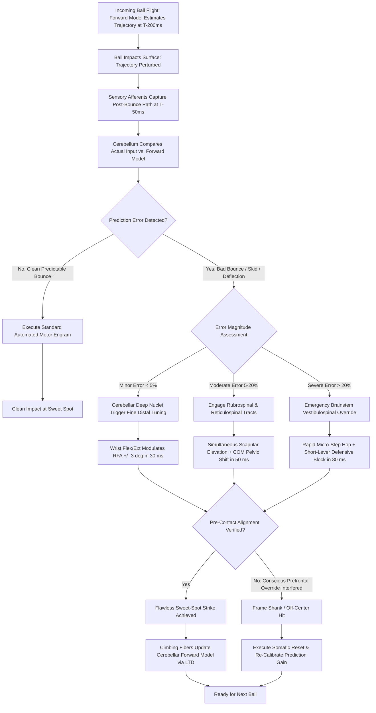

# ART-079: Subconscious Micro-Adjustments in Unpredictable Bounces

> **PRO CUE:** The ball takes an unexpected 5 cm bad bounce off a court imperfection $\to$ your body must adapt before your conscious mind even realizes what occurred. **Subcortical predictive control** (Cerebellum + Basal Ganglia + Brainstem) calculates and executes motor corrections in **$<100\text{ ms}$**. Conscious prefrontal intervention takes 300 ms—far too late. Train the "Micro-Adjustment Reflex" to guarantee sweet-spot contact on any irregular surface.

---

## 1. Executive Summary & Athletic Intent

**Subconscious Micro-Adjustments** are automated, subcortical kinematic modifications occurring within the crucial **$50\text{–}150\text{ ms}$ pre-contact window** when a tennis ball's trajectory deviates unexpectedly due to court cracks, uneven clay, painted lines, sudden wind gusts, or opponent spin anomalies. Rather than relying on slow cortical deliberation, the central nervous system deploys an internal **Cerebellar Forward Model** that continuously projects predicted ball trajectories. 

When the ball bounces, real-time multisensory afferents (visual capture via the MT/V5-parietal stream, proprioceptive spindle feedback from the ankle and neck, and vestibular balance inputs) are instantly compared against the internal prediction. The resulting **Sensory Prediction Error** triggers rapid subcortical motor corrections routed through the deep cerebellar nuclei, brainstem reticulospinal tracts, and vestibulospinal pathways directly to spinal motor neurons. These rapid commands modulate the **Racket Face Angle ($\pm 2\text{–}5^\circ$)**, **Contact Point ($\pm 3\text{–}5\text{ cm}$)**, **Center of Mass (COM)**, and **Foot Placement** without conscious cognitive interference. This article deconstructs the neurobiology of micro-adjustments, establishes the critical threshold of **Correction Latency ($<50\text{ ms}$)**, prescribes **Chaos Bounce Training** protocols, and delivers a diagnostic matrix for eliminating mechanical rigidity on erratic surfaces.

The athletic intent of this master protocol focuses on three operational goals:
1. **Frame Micro-Adjustments as a Subcortical Reflex:** Shift the paradigm away from late, conscious corrections toward fully automated cerebellar-brainstem adaptations operating beneath conscious awareness.
2. **Optimize Cerebellar Prediction Error Processing:** Calibrate synaptic plasticity (long-term depression and potentiation at parallel fiber-Purkinje cell synapses) to dynamically scale corrective gain without over-compensating.
3. **Institutionalize Chaos Bounce Conditioning:** Expose the motor system to high-density, unpredictable court perturbations (simulated cracks, irregular line bounces, and unpredictable spin variations) to build indestructible contact consistency.

---

## 2. Biomechanical & Neurological Foundation

### 2.1 The Micro-Adjustment Neural Circuit

The speed of ball flight in modern tennis makes conscious visual correction during the bounce-to-contact phase physiologically impossible. The entire micro-adjustment cascade must be handled by subcortical feedback loops:

```
BALL BOUNCES (Actual Trajectory Perturbation Occurs)
       │
       ▼
[MULTISENSORY AFFERENTS] ──► Visual (Retina → MT/V5 → PPC) [~50 ms]
                           + Proprioceptive (Muscle Spindles → Dorsal Column → Cerebellum)
                           + Vestibular (Semicircular Canals → Vestibular Nuclei)
       │
       ▼
[CEREBELLUM: CORTEX & DEEP NUCLEI] ◄─── [INTERNAL FORWARD MODEL] (Predicted Trajectory at T-200ms)
       │
       │  COMPUTES PREDICTION ERROR = Actual Afferent State - Expected Internal State [T - 40ms]
       │
       ▼
[SUBCORTICAL MOTOR COMMAND] ──► Reticulospinal & Vestibulospinal Tracts bypass primary motor cortex [T - 30ms]
       │
       ▼
[SPINAL MOTOR NEURONS] ───────► Distal Micro-Adjustments Executed [T - 20ms to Impact]:
                                 • Wrist Flexion / Extension: Adjusts RFA ± 3–5°
                                 • Trunk Angle & Scapula: Shifts Contact Point ± 3–5 cm
                                 • Hip & Foot Micro-Step: Stabilizes Center of Mass
       │
       ▼
BALL IMPACT AT SWEET SPOT [T = 0 ms]
       │
       └──► CONSCIOUS AWARENESS (DLPFC / Primary Somatosensory Cortex): Registers at T + 100 ms
```

**Critical Timing Milestones:**
- **Forward Model Trajectory Projection:** $T - 200\text{ ms}$ (prior to bounce).
- **Sensory Prediction Error Registration:** $T - 40\text{ ms}$ (post-bounce).
- **Subcortical Corrective Impulse:** $T - 30\text{ ms}$ (descending through brainstem).
- **Mechanical Kinematic Execution:** $T - 20\text{ ms} \to \text{Impact}$ ($10\text{–}20\text{ ms}$ window).
- **Conscious Cognitive Realization:** $T + 100\text{ ms}$ (*"The ball took a weird hop!"* occurs 100 ms after the ball has already departed the strings).

### 2.2 Taxonomy of In-Flight Tennis Micro-Adjustments

| Micro-Adjustment Modality | Operational Perturbation Trigger | Kinematic Correction Mechanism | Neural Latency | Practical Match Scenario |
| :--- | :--- | :--- | :--- | :--- |
| **Racket Face Angle (RFA)** | Ball bounces lower or higher than expected off the clay | Distal wrist micro-flexion/extension ($\pm 3\text{–}5^\circ$) | $30\text{–}50\text{ ms}$ | Skidding slice stays low; wrist extends $4^\circ$ to prevent dumping into the net. |
| **Contact Point (CP) Window** | Ball checks up or shoots forward unpredictably | Scapular elevation, elbow flexion, or trunk lean ($\pm 3\text{–}5\text{ cm}$) | $40\text{–}60\text{ ms}$ | Heavy kick serve hangs in the air; player leans forward $4\text{ cm}$ to meet the ball out front. |
| **Center of Mass (COM) Shift**| Lateral deflection off a taped court line | Abrupt pelvic displacement ($\pm 2\text{–}4\text{ cm}$) via adductor recruitment | $50\text{–}80\text{ ms}$ | Ball strikes edge of white line and skips wide; lead hip instantly drops to preserve balance. |
| **Footwork Micro-Step** | Ball pushes into the body unexpectedly | Rapid $2\text{–}5\text{ cm}$ adjustment hop via ankle plantar flexors | $60\text{–}100\text{ ms}$ | Deep topspin drives unexpectedly into player's chest; rapid micro-step back creates swing space. |
| **Swing Path Curvature** | Severe spin deviation (extreme kick vs. flat skidding ball) | Rapid shoulder rotation adjustment altering vertical brush angle ($\pm 5^\circ$) | $50\text{–}80\text{ ms}$ | Unexpected side-spin kicker; racket path alters from linear drive to acute vertical wipe. |

### 2.3 Prediction Error Computation & Cerebellar Plasticity

The cerebellum updates internal motor models through climbing fiber error signals that induce synaptic plasticity at parallel fiber–Purkinje cell connections:

| Prediction Error Magnitude | Cerebellar Neurological Response | Motor Adaptation Pathway | Learning Rate & Calibration |
| :--- | :--- | :--- | :--- |
| **Small ($\Delta < 5\%$ variance)** | Real-time online adjustment via deep cerebellar nuclei; Long-Term Depression (LTD) | Sub-millimeter mechanical tuning; zero disruption to kinetic chain | **Instantaneous:** Corrected on a single repetition. |
| **Medium ($\Delta = 5\text{–}20\%$)** | Trial-by-trial gain adjustment; shifting internal forward model parameters | Re-calibration of unit turn depth and contact point geometry | **Rapid:** 3 to 5 trials required to recalibrate to conditions. |
| **Large ($\Delta > 20\%$ variance)** | Model restructuring via climbing fiber Long-Term Potentiation (LTP); emergency brainstem override | Coarse reticulospinal stabilization; ugly, defensive slap/block | **Deliberate:** 50 to 100 trials under variable constraint conditions. |

---

## 3. Step-by-Step Technical Execution

### Phase 1: Micro-Adjustment Awareness & Prediction Error Calibration

#### Drill 1: High-Speed Video Micro-Analysis
1. Record high-tempo baseline rallies on unpredictable surfaces (e.g., worn clay, artificial turf, or hard courts with surface seams) using a $240+\text{ FPS}$ high-speed camera.
2. Isolate sequences where erratic bounces occurred.
3. Review footage frame-by-frame with the athlete: Identify the exact frame of the bounce, the frame where the racket face angle altered, and the frame of contact.
4. Establish conscious understanding of the body's autonomous capability: demonstrate to the athlete that their wrist and trunk adjusted before they had time to consciously react.
5. **Target Benchmark:** Athlete correctly detects and explains their own micro-adjustment mechanics across $>80\%$ of reviewed clips.

#### Drill 2: Blind Prediction Error Calibration
1. The athlete assumes a standard baseline rally stance. The coach feeds a randomized sequence of balls: $80\%$ standard consistent bounces and $20\%$ engineered erratic bounces (using worn, high-pressure, or partially deflated balls).
2. The athlete is given zero advance warning of ball type.
3. Immediately following each shot, the athlete must verbally state: *"Normal"* or *"Adjusted"*, identifying whether the adjustment was executed via RFA, Contact Point, or Footwork.
4. **Target Benchmark:** $>90\%$ detection accuracy with $>80\%$ precision in identifying the adjustment modality.

---

### Phase 2: Chaos Bounce Training Protocols

Exposing the nervous system to deliberate, controlled environmental chaos builds deep cerebellar resilience:

| Perturbation Modality | Mechanical Court Setup | Feeding Ratio | Technical Training Focus |
| :--- | :--- | :--- | :--- |
| **Line & Crack Simulation** | Lay strips of raised athletic tape or thin rubber cords randomly around the bounce zone | $20\%$ of feeds strike tape | Rapid Racket Face Angle (RFA) micro-tuning ($30\text{–}50\text{ ms}$). |
| **Irregular Ball Pressure** | Mix standard balls with de-pressurized, dead, or super-bouncy balls in the ball machine hopper | $20\%$ random distribution | Vertical contact point shifts; trunk lean adjustments. |
| **Surface Friction Variation**| Lightly mist isolated patches of the court with water or fine sand | $10\%$ unpredictable encounters | Center of mass stabilization; micro-steps and ankle stiffness. |
| **High-Velocity Wind Stress** | Position industrial velocity fans along the court perimeter to generate variable cross-drafts | $15\%$ flight perturbations | Continuous swing path curvature and timing recalibration. |
| **Hidden Spin Variation** | Coach disguises feed by using identical preparation for heavy slice, flat drive, and sidespin | $15\%$ random feeds | Multi-modal adjustment integrating trunk, feet, and wrist. |

#### Drill 3: The 30-Minute Chaos Bounce Rally Block
1. Engage in an open 30-minute cross-court rally featuring mixed perturbations (tape on court, mixed balls, and masked spins).
2. Non-negotiable Constraint: The athlete is forbidden from halting play, complaining, or resetting when a bad bounce occurs. They must **play through the perturbation** at all costs.
3. **KPI Benchmark:** Maintain rally continuity $>85\%$ (no unforced errors resulting directly from court perturbations) across 100 consecutive exchanges.

#### Drill 4: Reactive Gaze-Opening Bounce Drill
1. The athlete stands at the baseline with eyes closed in an athletic ready position.
2. The coach drops or feeds a ball from a height of $1.5\text{–}2.0\text{ meters}$, creating variable bounce angles.
3. The coach shouts *"OPEN!"* precisely as the ball impacts the court surface.
4. The athlete must snap their eyes open, visually lock onto the post-bounce trajectory, execute the necessary subcortical micro-adjustments, and strike a clean groundstroke.
5. **Target Benchmark:** Achieve clean sweet-spot contact on $>80\%$ of trials.

---

### Phase 3: Cerebellar Forward Model Optimization

#### Drill 5: Occlusion Bounce Trajectory Prediction
1. Utilize computerized video training or on-court liquid-crystal strobe goggles programmed to occlude vision.
2. Set visual occlusion to occur at **$T - 50\text{ ms}$ (immediately post-bounce, $50\text{ ms}$ prior to impact)**.
3. The athlete must complete the stroke in total blindness based solely on the pre-bounce trajectory and the initial $20\text{ ms}$ post-bounce visual capture.
4. Provide immediate auditory feedback on impact accuracy and contact point displacement.
5. **Target Benchmark:** Achieve clean sweet-spot contact on $>75\%$ of occluded strikes.

#### Drill 6: Variable Spin Blind-to-Open Adjustment
1. The coach feeds randomized spins: heavy topspin, skidding underspin, extreme kick, and floating flat drives.
2. The athlete closes their eyes during ball flight, opening them at $T - 100\text{ ms}$ (right as the ball hits the court).
3. The athlete must execute an emergency micro-adjustment across racket angle, trunk position, and footwork.
4. **Target Benchmark:** Contact point coefficient of variation ($\text{CV}$) $<5\%$ across all four spin varieties.

---

### Phase 4: Micro-Adjustments Under High Fatigue & Stress

#### Drill 7: Post-Fatigue Chaos Bounce Challenge
1. Immediately following a high-intensity lactate conditioning block (blood lactate $>8\text{ mmol/L}$, heart rate $>175\text{ BPM}$).
2. The athlete steps directly onto the perturbed court for a 15-minute Chaos Bounce simulation (Drill 3).
3. Measure mechanical performance degradation: compare correction latency, unforced error rate, and rally continuity against the rested baseline.
4. **Target Benchmark:** Limit performance degradation to $<15\%$ of fresh baseline scores.

#### Drill 8: High-Pressure Perturbation Tiebreak
1. Play a 10-point championship tiebreak where $20\%$ of balls produce artificial surface perturbations.
2. Penalty Structure: An unforced error directly following a bad bounce costs $-2$ points; a successfully executed winner off a bad bounce awards $+2$ points.
3. Inoculates the athlete against emotional frustration, training the brainstem and cerebellum to operate smoothly under high cortisol conditions.

---

## 4. Performance Metrics & Training Dosage

| Performance Metric | Developing | Proficient | Advanced | Elite (ATP / WTA Tour) |
| :--- | :--- | :--- | :--- | :--- |
| **Micro-Adjustment Detection Rate** | $<60\%$ | 60–75% | 75–90% | **$>95\%$ detection** |
| **Correction Latency (High-Speed Video)**| $>150\text{ ms}$ | 100–150 ms | 50–100 ms | **$<50\text{ ms}$ (pure subcortical)** |
| **Chaos Bounce Rally Continuity** | $<70\%$ | 70–85% | 85–95% | **$>98\%$ continuity** |
| **Occlusion Prediction Accuracy (T-50ms)**| $<50\%$ | 50–65% | 65–80% | **$>85\%$ accurate contact** |
| **Contact Point CV% Across Multi-Spins** | $>8\%$ variance | 5–8% | 3–5% | **$<3\%$ variance (flawless tracking)** |
| **Post-Fatigue Performance Drop** | $>30\%$ drop | 20–30% drop | 10–20% drop | **$<10\%$ degradation** |
| **Pressure Perturbation Conversion** | $<50\%$ | 50–65% | 65–80% | **$>85\%$ positive point conversion** |

### Weekly Periodized Training Dosage

- **Chaos Bounce Rally Conditioning ($2\times/\text{week}$, 30 Min):** High-density live hitting featuring surface tape, uneven balls, and disguised feeds.
- **Occlusion Bounce Training ($1\times/\text{week}$, 15 Min):** Stroboscopic or video occlusion drills refining the $50\text{ ms}$ post-bounce prediction window.
- **Blind-to-Open Spin Adjustment ($1\times/\text{week}$, 20 balls):** Acute reactionary training sharpening subcortical rate coding.
- **Fatigue & Pressure Inoculation ($1\times/\text{every 2 weeks}$, 20 Min):** Post-HIIT perturbation tiebreaks with strict score penalties.
- **Daily Micro-Review (5 Min):** Review high-speed training footage to reinforce cerebellar prediction error awareness.

---

## 5. Errors, Causes & Correction Protocols

| Observable Mechanical Defect | Root Neurological / Biomechanical Cause | Precision Correction Protocol |
| :--- | :--- | :--- |
| **"Ball takes a bad bounce $\to$ Complete whiff or catastrophic frame shank."** | Deficient internal forward model; sluggish cerebellar error computation ($>150\text{ ms}$ latency). | Prescribe Occlusion Bounce training; double weekly volume of Chaos Bounce drills; eliminate predictable basket feeding. |
| **"Over-correction on bad bounces: Player wildly over-swings, hitting fences."** | Excessive cerebellar gain; imbalance in parallel fiber-Purkinje cell LTD/LTP synaptic weighting. | Implement Graded Perturbation feeds (transitioning from minor $2\text{ cm}$ hops to $10\text{ cm}$ hops); enforce external target focus cue: *"Soft hands, firm center."* |
| **"Player only adjusts with the wrist, leaving feet completely frozen."** | Incomplete micro-adjustment motor library; failure to engage reticulospinal postural tracts. | Enforce Full-Body Chaos Drills: Player must verbalize a footwork adjustment on every strike; mandate active micro-hopping between shots. |
| **"Under physical fatigue, adjustment latency skyrockets, leading to error clusters."** | Cerebellar metabolic fatigue; elevated proprioceptive noise from acidic extrafusal muscle fibers. | Integrate Lactate-JPS conditioning (Article 058); execute 25s between-point micro-recovery routines (Article 061). |
| **"Player freezes emotionally when a bad bounce occurs during pressure points."** | Amygdala activation triggering descending brainstem freezing; prefrontal cortical interference blocking reflexes. | Deploy the 16-Second Cure routine (Article 044); execute pressure tiebreaks with perturbation penalties; cue: *"Embrace the chaos."* |
| **"Multiple bad bounces in a row cause total mechanical collapse and frustration."** | Buffer overflow in cerebellar working memory; accumulation of uncorrected prediction errors. | Enforce immediate somatic reset: 2 vagal exhalations ($4\text{-}1\text{-}6\text{-}1$); cue: *"New point, clean model."* |

---

## 6. Diagnostic Diagram & Decision Flow



---

## 7. Video Demonstration & Technical Analysis

<div class="video-container" style="position:relative;padding-bottom:56.25%;height:0;overflow:hidden;border-radius:12px;">
  <iframe src="https://www.youtube-nocookie.com/embed/VIDEO_ID_PLACEHOLDER"
          style="position:absolute;top:0;left:0;width:100%;height:100%;border:0;"
          allow="accelerometer; autoplay; clipboard-write; encrypted-media; gyroscope; picture-in-picture"
          allowfullscreen
          title="Subconscious Micro-Adjustments in Unpredictable Bounces — Technical Analysis"></iframe>
</div>

*Recommended High-Resolution Video Analysis Protocols:*
1. **High-Speed 240+ FPS Freeze-Frame Tracking:** Measuring distal wrist kinematics and center of mass shifts from ball bounce ($T-100\text{ ms}$) to impact ($T=0\text{ ms}$) during irregular surface strikes.
2. **Cerebellar fMRI Prediction Error Simulation:** 3D animated visualization of climbing fiber discharges and Purkinje cell firing rate shifts during unexpected sensory discrepancies.
3. **On-Court Chaos Bounce Setup Demonstration:** Visual walkthrough demonstrating proper placement of perturbation tape, randomized hopper mixing, and industrial wind fan setups.
4. **Tour-Level Case Studies (Rafael Nadal & Carlos Alcaraz on Red Clay):** Detailed biomechanical breakdown showing how elite clay-court champions execute micro-adjustments on erratic sliding bounces without decelerating racket head speed.

---

## 8. Cross-Domain Synergy & Multi-Pillar Integration

- **Integration with the Cerebellar Forward Model (Articles 051, 059):** Subconscious micro-adjustments represent the **online execution of the cerebellar forward model**. Mental imagery (Article 059) trains the internal forward model offline, pre-insulating pathways for high-speed discrepancy resolution.
- **Integration with Proprioception & Joint Position Sense (Article 058):** Muscle spindle and Golgi tendon organ feedback are the **critical sensory inputs** required to compute prediction errors. Elevated proprioceptive noise directly corrupts micro-adjustment accuracy.
- **Integration with Quiet Eye & Saccadic Gaze Control (Articles 041, 055):** Sustaining a stable Quiet Eye gaze fixation through the ball bounce provides the **clean visual capture window** necessary for MT/V5 motion processing to detect trajectory deviations.
- **Integration with Ecological Affordance Perception (Article 067):** An erratic bounce represents an immediate **affordance perturbation**. The perceptual system must instantly abandon an attacking drive affordance and latch onto an emergent defensive scooping or short-lever blocking affordance.
- **Integration with Cognitive Flexibility (Article 076):** Micro-adjustments operate as **sub-second motor pivots** occurring at the subcortical level, functioning as the kinematic equivalent of high-level tactical switching.
- **Integration with Neuromuscular Junction Efficiency (Article 078):** Executing rapid corrective motor bursts within $<50\text{ ms}$ demands pristine NMJ transmission fidelity. Peripheral synaptic fatigue directly impairs the speed of corrective wrist and ankle contractions.
- **Integration with Elimination of Conscious Override (Article 074):** Conscious prefrontal override is the **mortal enemy of micro-adjustments**. If the prefrontal cortex attempts to consciously steer the racket face, the 300 ms processing delay guarantees an error.

---

## 9. Self-Assessment Rubric

| Assessment Dimension | Level 1: Rigid Fragility | Level 2: Slow Compensation | Level 3: Functional Reflex | Level 4: Subconscious Mastery |
| :--- | :--- | :--- | :--- | :--- |
| **Correction Latency (High-Speed Video)**| $>150\text{ ms}$; late and clumsy | 100–150 ms; visible hitch | 50–100 ms; smooth compensation | **$<50\text{ ms}$; imperceptible subcortical reflex** |
| **Perturbation Detection Accuracy** | $<60\%$ detection rate | 60–75% detection | 75–90% detection | **$>95\%$ accurate real-time detection** |
| **Chaos Bounce Rally Continuity** | $<70\%$ ball retention | 70–85% retention | 85–95% retention | **$>98\%$ sustained rally continuity** |
| **Occlusion Prediction Accuracy (T-50ms)**| $<50\%$ sweet-spot hits | 50–65% clean hits | 65–80% clean hits | **$>85\%$ sweet-spot impact under blindness** |
| **Contact Point Consistency Across Spins**| Variance $>8\%$; erratic | Variance 5–8% | Variance 3–5% | **Variance $<3\%$ (flawless spatial lock)** |
| **Post-Fatigue Adaptation Retention** | Performance drops $>30\%$ | 20–30% drop under fatigue | 10–20% drop | **$<10\%$ degradation under high lactate** |

**Diagnostic Scoring Key:**
- **6–12 Points:** Severe Mechanical Rigidity. Player is hyper-vulnerable to surface irregularities and spin variations; urgent requirement for Chaos Bounce integration.
- **13–18 Points:** Developing Reflexive Capacity. Functional on pristine indoor hard courts; consistently breaks down on uneven clay or windy outdoor conditions.
- **19–24 Points:** High Subconscious Resilience. Fluid adaptability across diverse court surfaces with minimal performance loss.
- **25–30 Points:** Tour-Level Cerebellar Mastery. Lightning-fast subcortical error correction; effortless sweet-spot ball striking on any surface under championship pressure.

---

## 10. Printable Practice Card (Pocket Drill Card)

```
┌────────────────────────────────────────────────────────────────────────┐
│             POCKET DRILL CARD: SUBCONSCIOUS MICRO-ADJUSTMENTS          │
│ Target: Latency < 50 ms | Chaos Continuity > 95% | Occlusion Acc > 80% │
├────────────────────────────────────────────────────────────────────────┤
│ BLOCK A: Occlusion Trajectory Priming (5 Min)                          │
│ • Strobe / Occlusion Prediction: 20 balls occluded at T-50ms           │
│ • Verbalize incoming height/spin trajectory; verify contact point      │
│ • Focus Cue: "Project the flight — Trust the forward model — Strike"   │
├────────────────────────────────────────────────────────────────────────┤
│ BLOCK B: High-Density Chaos Bounce Rally (20 Min)                      │
│ • 30-Minute Baseline Rally with 5 Perturbations (Tape, dead balls, wind)│
│ • Hard Rule: Zero stops, zero excuses; play through all bad hops       │
│ • Focus Cue: "Expect the unexpected — Fluid hands — Dynamic feet"      │
├────────────────────────────────────────────────────────────────────────┤
│ BLOCK C: Blind-to-Open Reactive Feeds (15 Min)                         │
│ • 20 Disguised Feeds: Eyes closed at flight, snap open at bounce       │
│ • 10 Reactive High-Drop Feeds: "OPEN!" cue on floor strike             │
│ • Focus Cue: "Instant visual capture — Subcortical reflex — Pop"       │
├────────────────────────────────────────────────────────────────────────┤
│ BLOCK D: Performance Audit & Video Review (5 Min)                      │
│ • Video Review: Log correction latency and sweet-spot contact %        │
│ • Retest contact consistency under elevated heart rate (>160 BPM)      │
│ • Benchmark Target: Continuity > 95%; latency < 50 ms                  │
└────────────────────────────────────────────────────────────────────────┘
```

---

*Cross-References: Articles 041, 051, 055, 058, 059, 067, 074, 076, 078. Pillar II: Neuro-Athletic Performance & Technical Biomechanics — TennisKB 200 Master Series.*
