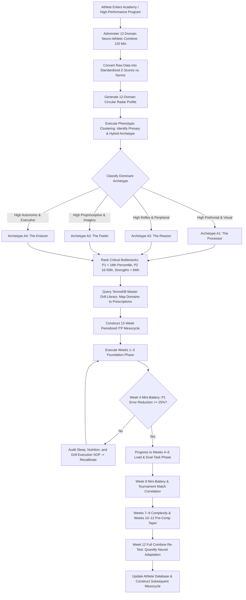

# ART-080: Neuro-Athletic Profiling for Individualized Coaching Design

> **PRO CUE:** No two athletes possess identical neurological wiring. Standardized "one-size-fits-all" training regimens squander world-class potential. A **Neuro-Athletic Profile** maps the athlete's cognitive, sensory, and motor architecture, elevating high-performance tennis coaching into **precision sports science**. Test $\to$ Profile $\to$ Prescribe $\to$ Track.

---

## 1. Executive Summary & Athletic Intent

**Neuro-Athletic Profiling** is the rigorous methodology of measuring, analyzing, and synthesizing multimodal neural, cognitive, and sensorimotor biomarkers to construct an **Individualized Neurological Profile** for each competitor. Rather than forcing athletes into rigid, homogeneous technical dogmas, this profile generates an **Individualized Training Program (ITP)** built upon four operational tenets: (1) **Strengths Amplification** (maximizing unique sensory-motor advantages), (2) **Critical Bottleneck Elimination** (identifying and resolving limiting neurological links), (3) **Weakness Compensation** (designing compensatory biomechanical and tactical workarounds), and (4) **Periodization Alignment** (harmonizing neurological load with physical training cycles).

This capstone master article formalizes the **12-Domain Neuro-Athletic Assessment Battery**, establishes the mathematical **Clustering Algorithm for 4 Athletic Archetypes**, outlines the step-by-step **ITP Periodization Workflow**, and provides a multi-tiered tracking matrix. Spanning the entire scope of Pillar II (Sports Neurology & Technical Mechanics), this framework connects foundational neurobiology directly to court-level player development.

The athletic intent of this master protocol focuses on three operational goals:
1. **Transition from Template Coaching to Precision Data-Driven Design:** Replace subjective intuition with quantified neuro-cognitive metrics, treating each tennis athlete as a distinct bio-computational system.
2. **Classify and Leverage the 4 Core Neuro-Athletic Archetypes:** Categorize competitors into data-backed phenotypes—*The Processor*, *The Reactor*, *The Feeler*, and *The Endurer*—to prescribe targeted tactical and biomechanical interventions.
3. **Operationalize the 90- to 120-Minute Combine Protocol:** Deliver a feasible, reproducible diagnostic testing battery combining laboratory-grade precision with accessible court-side apparatus.

---

## 2. Biomechanical & Neurological Foundation

### 2.1 The 12-Domain Neuro-Athletic Assessment Battery

The comprehensive profile evaluates twelve independent yet interacting neurological domains governing tennis execution:

| Domain | Primary Standardized Test | Core Biomarkers & Metrics | Duration | Recommended Testing Apparatus |
| :--- | :--- | :--- | :--- | :--- |
| **D1: Visual Processing** | Dynamic Visual Acuity (DVA), Saccadic Latency, Smooth Pursuit Gain, Quiet Eye Duration | DVA ($\text{logMAR}$), Saccade latency ($\text{ms}$), SP gain ($0\text{–}1.0$), QE duration ($\text{ms}$) | 15 min | High-speed eye-tracking glasses / Strobe goggles / DVA charts |
| **D2: Reaction & Timing** | Simple & Choice Reaction Time (Visual/Auditory), Coincidence Anticipation | Simple RT ($\text{ms}$), Choice RT ($\text{ms}$), Anticipation timing error ($\text{ms}$) | 10 min | Wireless reaction pods (Blazepod) / Bassin Anticipation Timer |
| **D3: Attentional Control** | Focal-to-Global Attentional Switching, Dual-Task Interference, Stroop Inhibitory Control | Switch latency ($\text{ms}$), Dual-task cost ($\%$), Stroop interference score | 10 min | Tablet cognitive software / Dual-task live tracking |
| **D4: Cognitive Flexibility** | Fronto-Striatal Task-Switching Paradigm, On-Court Tactical Pivot Latency | Switch cost ($\Delta \text{RT}$), Pivot latency ($\text{ms}$), Heuristic compliance ($\%$) | 10 min | Computerized task-switching battery / On-court cue feeds |
| **D5: Executive Function** | Working Memory ($N\text{-back}$), Tower of London Planning, Pressure Decision Quality | 2-back accuracy ($\%$), Planning efficiency, Shot selection accuracy under load | 10 min | Standardized neuropsychological testing software |
| **D6: Motor Imagery (MI)** | Vividness of Visual Imagery (VVIQ-2), PETTLEP Temporal Congruency, MI Latency | VVIQ score, Mental chronometry ratio ($\text{Actual} / \text{Imagined}$), Controllability | 10 min | Kinesthetic questionnaires / Chronometric video verification |
| **D7: Proprioception / JPS** | Joint Position Sense (Shoulder, Elbow, Wrist, Ankle), Force Output Reproduction | Angular JPS absolute error ($^\circ$), Force reproduction error ($\%$) | 10 min | Digital goniometer / Isokinetic load-cell dynamometer |
| **D8: Inter-Hemispheric Sync**| Bilateral Force Matching, Bimanual Rhythmic Tapping, Toss-Swing Coupling | Force asymmetry ($\%$), Phase-shift asynchrony ($\text{ms}$), Toss-to-swing SD | 10 min | Dual load cells / High-speed kinematics (240 FPS) |
| **D9: NMJ & Peripheral Drive** | High-Frequency Fatigue Index, Doublet-to-Twitch Facilitation, Drop Jump GCT | Fatigue index ($\%$), Facilitation ratio ($>1.8$), Ground contact time ($\text{ms}$) | 10 min | Contact grid mat / Dual force plates / Peripheral stimulator |
| **D10: Autonomic / Stress** | Resting Heart Rate Variability (HRV), Salivary Cortisol, Vagal Recovery Rate | rMSSD ($\text{ms}$), Salivary Cortisol ($\mu\text{g/dL}$), $16\text{s}$ Heart-rate drop | 5 min | Polar H10 / Oura Ring / Rapid saliva cortisol test kit |
| **D11: Sleep & Recovery** | Pittsburgh Sleep Quality Index (PSQI), Slow-Wave Sleep Duration, Morning Readiness | PSQI score, Nocturnal SWS ($\text{min}$), Resting morning HRV readiness | 5 min | Clinical sleep questionnaires / Wearable biometric sensors |
| **D12: Biomechanical Signature**| 5-Phase Kinetic Chain Sequencing, 3D Racket Trajectory, Contact Consistency | Segment angular velocity ($\text{deg/s}$), Face angle variance ($^\circ$), Sweet-spot CV% | 15 min | Multi-camera motion capture / Radar / High-speed video |

**Total Assessment Duration:** Approximately $110\text{–}120\text{ minutes}$ (ideally administered across two 60-minute blocks).

### 2.2 The Four Neuro-Athletic Archetypes

Clustering analysis of elite and developmental competitors reveals four recurring neuro-athletic phenotypes:

| Archetype | Distinctive Neurological Signature | Elite Competitive Strengths | Primary Limiting Bottlenecks | Tailored Training Prescription Priority |
| :--- | :--- | :--- | :--- | :--- |
| **A1: "The Processor"** | Hyper-developed Prefrontal & Visual Systems (High D1, D3, D4, D5) | Exceptional tactical anticipation, flawless pattern recognition, extended Quiet Eye, optimal decision quality | Subordinate proprioception, fragile NMJ endurance under fatigue, elevated cortisol sensitivity (Low D7, D9, D10) | **Body-First Protocol:** Heavy proprioceptive calibration, high-frequency NMJ conditioning, somatic stress inoculation, sleep regulation. |
| **A2: "The Reactor"** | Explosive Peripheral & Reflex Drive (High D2, D8, D9) | Blistering reaction time, explosive first-step burst, massive serve velocity, reflex volley dominance | Tunnel vision, impulsive shot selection, slow tactical task-switching, high dual-task degradation (Low D1, D3, D4, D5) | **Brain-First Protocol:** Visual stroboscopic tracking, cognitive flexibility drills, rule-based heuristics, 5th-set executive conditioning. |
| **A3: "The Feeler"** | Superior Somatosensory & Internal Imagery Loops (High D6, D7, D8) | Tour-grade touch and disguise, micro-adjustment mastery, precise racket face angle control, low injury rates | Sluggish auditory reaction, hesitation on aggressive attacking balls, decision paralysis under pressure (Low D1, D2, D5) | **Speed-First Protocol:** Auditory reaction priming, compressed-latency feeds, forced-pace decision trees, aggressive attacking constraints. |
| **A4: "The Endurer"** | Ironclad Autonomic & Executive Stamina (High D5, D10, D11) | Indestructible late-match focus, rapid between-point recovery, resilient comeback mentality, unwavering discipline | Deficient explosive rate of force development, lower top-end serve speed, predictable shot shapes (Low D2, D9, D12) | **Power-First Protocol:** Central neural drive potentiators, reactive plyometrics, complex contrast training, angular velocity expansion. |

*Note on Hybrid Phenotypes:* Pure archetypes are rare; the vast majority of competitive athletes present as **Hybrid Profiles** (e.g., *Processor-Endurer* like Novak Djokovic, or *Reactor-Feeler* like Carlos Alcaraz). Individual prescriptions are dictated by the underlying 12-domain radar chart.

### 2.3 The Profile-to-Prescription Algorithm

```
INPUT: Raw data from 12-Domain Assessment Battery
   │
   ▼
[Z-SCORE STANDARDIZATION] ──► Normalize against age, sex, and competitive-level normative database
   │                           Z = (Individual Score - Population Mean) / Population SD
   │
   ▼
[CLUSTER ANALYSIS] ────────► K-Means / Cosine Similarity mapping to 4 Archetype centroids
   │                           Identify Primary Archetype + Secondary Hybrid Traits
   │
   ▼
[BOTTLENECK IDENTIFICATION] ─► Rank all 12 domains:
                               • Priority 1 (Critical Bottleneck): Z-score < -1.0 (< 16th percentile)
                               • Priority 2 (Secondary Weakness):  Z-score -1.0 to 0.0 (16th–50th percentile)
                               • Strengths (Competitive Weapons):  Z-score > +1.0 (> 84th percentile)
   │
   ▼
[PRESCRIPTION GENERATION] ──► Select targeted evidence-based protocols from TennisKB Master Library:
                               • Priority 1 Domains: Prescribe 3 specific drills (3x/week high dosage)
                               • Priority 2 Domains: Prescribe 2 specific drills (2x/week maintenance dosage)
                               • Strengths: Prescribe 1 advanced complexity drill (1x/week amplification)
   │
   ▼
OUTPUT: 12-Week Individualized Training Program (ITP) Mesocycle
```

---

## 3. Step-by-Step Technical Execution

### Phase 1: Assessment Execution Protocol (The Neuro-Athletic Combine)

Conduct the battery across two dedicated 60-minute blocks separated by a mandatory 24-hour rest window:

#### Session 1: Cognitive, Sensory & Visual Combine (60 Min - Lab / Quiet Court)
1. **D1 Visual Processing (15 Min):** Assess DVA using dynamic tumbling-E charts $\to$ measure saccadic latency using reactive light gates $\to$ capture Quiet Eye duration during live serve returns via wearable eye-tracking.
2. **D2 Reaction & Timing (10 Min):** Measure simple and 4-choice visual/auditory reaction time $\to$ test coincidence anticipation on high-speed ball flight.
3. **D3 Attentional Control (10 Min):** Administer computerized Flanker and Stroop tests $\to$ test focal-to-global switching speed using dual-frequency metronomes.
4. **D4 Cognitive Flexibility (10 Min):** Execute computerized task-switching trials $\to$ conduct on-court cue-switch baseline trials to measure tactical pivot latency.
5. **D5 Executive Function (10 Min):** Administer 2-back working memory tests and computerized tactical scenario decision challenges.
6. **D6 Motor Imagery (5 Min):** Complete the VVIQ-2 questionnaire $\to$ conduct mental chronometry timing tests (imagined vs. actual stroke duration).

#### Session 2: Somatosensory, Peripheral & Biomechanical Combine (60 Min - Gym / On-Court)
1. **D7 Proprioception (10 Min):** Test blind joint position sense at 45°, 90°, and 120° shoulder abduction using a digital goniometer $\to$ evaluate force reproduction on a handgrip dynamometer.
2. **D8 Inter-Hemispheric Synchronization (10 Min):** Measure bilateral grip matching accuracy $\to$ record high-speed video to calculate toss-to-swing temporal standard deviation.
3. **D9 NMJ & Peripheral Drive (10 Min):** Perform the 30-second high-frequency fatigue index test on an isokinetic dynamometer $\to$ measure ground contact time (GCT) on a 30 cm drop jump.
4. **D10 Autonomic & Stress (5 Min):** Record 5-minute seated resting HRV (rMSSD) $\to$ collect baseline resting saliva sample for cortisol quantification.
5. **D11 Sleep & Recovery (5 Min):** Evaluate the 30-day PSQI sleep profile and review 7-day wearable biometric data (SWS duration, resting heart rate).
6. **D12 Biomechanical Signature (15 Min):** Record 10 maximal flat serves, 10 heavy topspin forehands, and 10 backhands using 240 FPS multi-angle cameras and Doppler radar to quantify kinematic sequencing and face angle variance.

---

### Phase 2: Profile Analysis & Bottleneck Identification

#### Step 1: Normative Z-Score Conversion
Normalize all recorded metrics against the international tennis normative database:
$$Z_i = \frac{X_i - \mu_i}{\sigma_i}$$
Where $X_i$ is the athlete's raw score, $\mu_i$ is the competitive peer-group mean, and $\sigma_i$ is the standard deviation.

#### Step 2: 12-Domain Radar Plotting
Plot all twelve $Z$-scores on a circular radar graph. Visual inspection instantly isolates structural strengths (protruding peaks) from critical vulnerabilities (deep inward valleys).

#### Step 3: Priority Ranking Matrix
Structure the athlete's neurological hierarchy into actionable tiers:

| Diagnostic Rank | Identified Neurological Domain | Standardized Z-Score | Population Percentile | Coaching Prescription Tier |
| :--- | :--- | :--- | :--- | :--- |
| **Rank 1 (Primary)** | D7: Proprioception / JPS | $-1.85$ | $3.2\%$ | **Priority 1: Critical Emergency** |
| **Rank 2 (Secondary)** | D10: Autonomic Regulation | $-1.40$ | $8.1\%$ | **Priority 1: Critical Emergency** |
| **Rank 3 (Tertiary)** | D4: Cognitive Flexibility | $-0.75$ | $22.6\%$ | **Priority 2: High Improvement** |
| **...** | ... | ... | ... | ... |
| **Rank 12 (Peak)** | D2: Reaction & Timing | $+1.90$ | $97.1\%$ | **Elite Strength: Weapon Amplification** |

---

### Phase 3: Individualized Training Program (ITP) Architecture

Structure the 12-week mesocycle around the athlete's diagnostic profile:

| Mesocycle Phase | Timeline | Priority 1 Focus ($3\times/\text{week}$) | Priority 2 Focus ($2\times/\text{week}$) | Strength Weaponization ($1\times/\text{week}$) | Match Integration ($1\times/\text{week}$) |
| :--- | :--- | :--- | :--- | :--- | :--- |
| **Weeks 1–3: Foundation** | Base Loading | Fundamental neurological drills (low speed, high precision) | Foundational exercises | Baseline maintenance volume | Low-stress scenario play |
| **Weeks 4–6: Load Build** | High Density | Increase repetition density and introduce mild dual-task load | Elevate drill tempo | Introduce complex variability | Pressure scoring situations |
| **Weeks 7–9: Complexity** | Acute Stress | High contextual interference under elevated heart rate | Full dual-task loading | Maximum velocity execution | Full simulated tournament sets |
| **Weeks 10–12: Peak/Transfer**| Pre-Comp Taper | Match-specific constraint play; rapid neurological priming | Maintenance micro-dosing | Peak weaponization drills | Official tournament competition |

#### Concrete Case Study: Prescribing for "The Processor" (Bottlenecks in D7 & D10)
- **Athlete Profile:** Elite tactical vision and pattern reading ($D1, D5 = +1.8$), but experiences late-match contact inconsistency ($D7 = -1.85$) and chokes under high emotional stress ($D10 = -1.40$).
- **Prescription:**
  - *Priority 1A (D7 Proprioception - Article 058):* 15 minutes of Blind Shadow Swings, Joint-Angle Matching, and Perturbation Resistance Bands $3\times/\text{week}$.
  - *Priority 1B (D10 Autonomic Regulation - Articles 061 & 072):* Daily 10-minute resonant breathing ($4\text{-}1\text{-}6\text{-}1$), strict implementation of the 25-second between-point routine, and evening Ashwagandha supplementation.
  - *Priority 2 (D4 Flexibility - Article 076):* On-court forced pivot drills $2\times/\text{week}$ (20 minutes).
  - *Strength Maintenance (D2 Reaction - Article 071):* 15 minutes weekly of auditory reaction compression drills.

---

### Phase 4: Longitudinal Tracking & Re-Assessment Framework

To ensure continuous neuro-adaptation without plateaus, implement a three-tiered re-testing schedule:

```
WEEK 0: Comprehensive 12-Domain Neuro-Athletic Combine (Baseline Profile Established)
   │
   ▼
WEEKS 1–3: ITP Phase 1 Execution + Weekly Micro-KPI Tracking
   │
   ▼
WEEK 4: MINI-BATTERY RE-ASSESSMENT (Priority 1 & 2 Domains Only - 20 Min)
   └──► Evaluation: Did P1 metrics improve by >= 25%? 
        • Yes: Progress to Phase 2 Load.
        • No: Recalibrate drill volume, sensory feedback fidelity, and sleep compliance.
   │
   ▼
WEEKS 5–7: ITP Phase 2 Execution + Weekly Micro-KPI Tracking
   │
   ▼
WEEK 8: MINI-BATTERY RE-ASSESSMENT + Tennis Match Metric Correlation
   └──► Evaluation: Is training transferring to lower match unforced errors and higher 1st-serve %?
   │
   ▼
WEEKS 9–11: ITP Phase 3 Peak Execution
   │
   ▼
WEEK 12: COMPREHENSIVE 12-DOMAIN COMBINE RE-TEST
   └──► Full Radar Chart Overlay: Verify closure of valleys and growth of peaks -> Construct Next Mesocycle ITP.
```

---

## 4. Performance Metrics & Training Dosage

| Performance Metric | Developing | Proficient | Advanced | Elite (Tour High-Performance) |
| :--- | :--- | :--- | :--- | :--- |
| **Assessment Reliability (Test-Retest ICC)**| $<0.70$ | $0.70\text{–}0.80$ | $0.80\text{–}0.90$ | **$>0.90$ (clinical precision)** |
| **12-Week Bottleneck Closure Rate** | $<20\%$ improvement | $20\text{–}35\%$ gain | $35\text{–}50\%$ gain | **$>50\%$ error reduction in P1** |
| **Strength Domain Retention** | Regresses $>10\%$ | Regresses $5\text{–}10\%$ | Maintained ($\pm 5\%$) | **Improves $>5\%$ alongside P1 fix** |
| **Match Performance Transfer (UE / Win %)**| Zero measurable shift| $5\text{–}10\%$ improvement | $10\text{–}20\%$ improvement | **$>20\%$ reduction in unforced errors**|
| **Archetype Classification Stability** | Erratic ($<70\%$) | $70\text{–}80\%$ stability | $80\text{–}90\%$ stability | **$>90\%$ consistent phenotypic signature**|
| **Athlete ITP Protocol Adherence** | $<70\%$ compliance | $70\text{–}85\%$ compliance | $85\text{–}95\%$ compliance | **$>95\%$ complete protocol completion**|

### Weekly Periodized Training Dosage

- **Total Athletic Commitment:** 16 to 22 hours weekly (integrating on-court tennis, physical conditioning, neuro-athletic drills, and recovery).
- **Dedicated Neuro-Athletic Training:** 5 to 7 hours weekly distributed into focused micro-doses:
  - *Priority 1 Interventions:* 3 hours weekly ($3 \times 60\text{ min}$ or $6 \times 30\text{ min}$ blocks).
  - *Priority 2 Interventions:* 2 hours weekly ($2 \times 60\text{ min}$ or $4 \times 30\text{ min}$ blocks).
  - *Strength Weaponization:* 1 hour weekly.
  - *Match Integration & Pressure Transfer:* 1 hour weekly.
- **Diagnostic Testing Overhead:** Exactly 2 hours every 12 weeks for the full combine, plus 20 minutes at Week 4 and Week 8 for mini-audits.

---

## 5. Errors, Causes & Correction Protocols

| Observable Coaching Defect | Root Methodological Cause | Precision Correction Protocol |
| :--- | :--- | :--- |
| **"Test results show extreme session-to-session variance (unreliable data)."** | Unstandardized testing environment; testing while acutely fatigued; uncalibrated apparatus. | Enforce rigid Standard Operating Procedures (SOP); mandate testing at identical times of day; require 24h rest prior to Combine. |
| **"Assigned Archetype does not match the player's real on-court behavior."** | Inappropriate normative database comparison (e.g., comparing juniors against ATP tour data); test anxiety bias. | Recalibrate norms against age- and level-matched peers; combine quantitative testing with match video audit by high-performance staff. |
| **"12-week ITP shows zero improvement in tournament match outcomes."** | Faulty bottleneck diagnosis; training isolated laboratory skills that fail to integrate into kinematic chain. | Re-evaluate bottleneck rankings; ensure all neuro drills immediately bridge into live-ball striking within the same training unit. |
| **"Athlete suffers cognitive burnout or refuses to comply with ITP drills."** | Prescribed dosage is excessive; drills are monotonous; failure to explain the neurological rationale. | Micro-dose interventions into 15-minute high-energy blocks; gamify training metrics; educate the athlete on their brain profile. |
| **"Coach continues giving identical verbal technical cues to all four archetypes."** | Coach knowledge gap; inability to adapt communication style to the athlete's cognitive archetype. | Adapt coaching pedagogy: provide tactical analytics to *The Processor*, external targets to *The Reactor*, kinesthetic feel cues to *The Feeler*. |
| **"Re-assessment reveals that working on weaknesses caused primary weapons to deteriorate."** | Complete omission of Strength Maintenance blocks during the mesocycle. | Enforce the mandatory 1x/week Strength Weaponization block; never drop maintenance volume below minimum effective thresholds. |

---

## 6. Diagnostic Diagram & Decision Flow



---

## 7. Video Demonstration & Technical Analysis

<div class="video-container" style="position:relative;padding-bottom:56.25%;height:0;overflow:hidden;border-radius:12px;">
  <iframe src="https://www.youtube-nocookie.com/embed/VIDEO_ID_PLACEHOLDER"
          style="position:absolute;top:0;left:0;width:100%;height:100%;border:0;"
          allow="accelerometer; autoplay; clipboard-write; encrypted-media; gyroscope; picture-in-picture"
          allowfullscreen
          title="Neuro-Athletic Profiling for Individualized Coaching Design — Technical Analysis"></iframe>
</div>

*Recommended High-Resolution Video Analysis Protocols:*
1. **Interactive 12-Domain Radar Profile Animation:** Demonstrating the dynamic transformation of an athlete's profile from unconditioned baseline to post-12-week intervention.
2. **The 90-Minute Combine in Practice:** Step-by-step walkthrough displaying rapid transitions between cognitive tablet stations, reactive light boards, and on-court biomechanical motion capture.
3. **Comparative Case Study of Two Elite Archetypes:** Split-screen breakdown contrasting the preparation, eye-tracking gaze fixation, and kinematic release of a classic *Processor* (e.g., Daniil Medvedev) versus a classic *Reactor* (e.g., Nick Kyrgios).
4. **Coaching Communication Adaptation Masterclass:** Demonstrating how high-performance coaches modify their tone, cue frequency, and technical instructions when addressing different archetypes on court.

---

## 8. Cross-Domain Synergy & Multi-Pillar Integration

- **Integration with the TennisKB Master Library (Articles 034–079):** The entire catalogue of Pillar II functions as the **direct prescriptive drill library** for this profiling framework. Once a bottleneck domain is identified, the coach queries the exact corresponding module:
  - *Visual Processing Bottlenecks (D1):* Articles 041, 055, 075.
  - *Reaction & Auditory Priming (D2):* Articles 069, 071.
  - *Attentional & Dual-Task Control (D3):* Articles 045, 060.
  - *Cognitive Flexibility (D4):* Article 076.
  - *Executive Function & Heuristics (D5):* Articles 053, 077.
  - *Motor Imagery & Mental Schemas (D6):* Article 059.
  - *Proprioception & Joint Position Sense (D7):* Articles 058, 073.
  - *Bilateral & Inter-Hemispheric Sync (D8):* Article 070.
  - *NMJ Efficiency & Rate Coding (D9):* Article 078.
  - *Autonomic & Cortisol Regulation (D10):* Articles 044, 061, 072.
  - *Sleep Architecture & Consolidation (D11):* Articles 051, 184–186.
  - *Kinematic Chain Biomechanics (D12):* Articles 081–120.
- **Integration with Deliberate Practice Theory:** Neuro-Athletic Profiling operationalizes deliberate practice by identifying the exact stretch zone where an athlete's neural circuits fail, delivering instantaneous feedback and high repetition density.
- **Integration with Modern Sports Technology:** Integrates wearable biometric sensors, virtual reality (VR) tracking, stroboscopic optics, and computerized neuropsychological batteries into a unified coaching workflow.
- **Pillar II Capstone Note:** This article marks the official conclusion of **Pillar II: Sports Neurology & Technical Mechanics (Articles 034–080)**, bridging sensory-cognitive science directly into the mechanical stroke production master series of **Pillar III (Articles 081–120)**.

---

## 9. Self-Assessment Rubric

*This rubric is calibrated for Head Coaches, Academy Directors, and High-Performance Sports Scientists:*

| Assessment Dimension | Level 1: One-Size-Fits-All | Level 2: Emerging Profiler | Level 3: Data-Informed Academy | Level 4: Precision Neuro-Coaching |
| :--- | :--- | :--- | :--- | :--- |
| **Diagnostic Battery Scope** | No neuro testing; physical fitness only | Ad-hoc testing of 3–5 isolated traits | Structured 8–10 domain battery | **Full standardized 12-domain combine battery** |
| **Normative Benchmarking** | None; purely subjective observation | Compared against vague club standards | Compared against regional peer groups | **Standardized Z-scores vs. international pro norms** |
| **Archetype Identification** | Ignores individuality; enforces 1 model | Subjective labeling of player styles | Algorithmic archetype classification | **Validated cluster profiling with hybrid mapping** |
| **Prescription Precision** | Generic coaching drills for all players | Minor individual tweaks to drills | Priority-based (P1/P2) drill selection | **Algorithmic ITP mapped directly to library drills** |
| **Longitudinal Tracking** | No tracking; outcome-based (win/loss) | Occasional informal progress review | Monthly testing of key metrics | **Weekly micro-KPIs + Weeks 4, 8, 12 re-assessment** |
| **Coaching Pedagogy Flexibility**| Rigid single communication style | Tries to explain things differently | Adapts cues to player personality | **Precision cueing calibrated to cognitive archetype** |

**Diagnostic Scoring Key:**
- **6–12 Points:** Traditional Dogmatic Coaching. High risk of athlete plateaus, chronic injuries, and dropouts; urgent requirement for baseline diagnostic adoption.
- **13–18 Points:** Developing Analytical Practice. Good intentions, but lacks the standardized testing rigor required for elite development.
- **19–24 Points:** High-Performance Data-Informed Academy. Robust athlete profiling driving personalized development across national-level competitors.
- **25–30 Points:** Tour-Level Precision Neuro-Coaching. World-class individualization, algorithmic prescription, and seamless cross-domain integration producing Grand Slam champions.

---

## 10. Printable Practice Card (Pocket Drill Card)

```
┌────────────────────────────────────────────────────────────────────────┐
│             COACH'S POCKET CARD: NEURO-ATHLETIC PROFILING ITP          │
│ Target: 12-Week P1 Closure > 50% | Weapon Retention > 100% | Adherence > 95% │
├────────────────────────────────────────────────────────────────────────┤
│ WEEK 0: The Comprehensive Combine (120 Min)                           │
│ • Administer Sessions 1 & 2 (Domains D1 to D12)                        │
│ • Calculate Standardized Z-Scores vs. Tennis Normative Database        │
│ • Classify Archetype: Processor / Reactor / Feeler / Endurer / Hybrid  │
│ • Rank Bottlenecks: Identify Priority 1, Priority 2, and Strengths     │
├────────────────────────────────────────────────────────────────────────┤
│ WEEKS 1–3: Foundation Phase Execution                                  │
│ • Prescribe 3 Drills for P1 Domains (3x/week high-density dosage)      │
│ • Prescribe 2 Drills for P2 Domains (2x/week maintenance dosage)       │
│ • Prescribe 1 Weaponization Drill for Strengths (1x/week)              │
│ • Checkpoint: Ensure 100% athlete understanding of their brain profile │
├────────────────────────────────────────────────────────────────────────┤
│ WEEK 4: Mini-Battery Re-Assessment (20 Min)                            │
│ • Retest Priority 1 & 2 Domains only                                   │
│ • Milestone Benchmark: Verify >= 25% reduction in P1 error metrics     │
│ • Recalibrate drill volume, sensory constraints, or sleep recovery    │
├────────────────────────────────────────────────────────────────────────┤
│ WEEKS 5–8: Load, Dual-Task & Complexity Phase                          │
│ • Introduce cognitive-motor interference and elevated heart-rate stress│
│ • Week 8 Audit: Correlate neurological gains with live match metrics   │
├────────────────────────────────────────────────────────────────────────┤
│ WEEKS 9–12: Pre-Competition Taper & Full Combine Re-Test               │
│ • Week 12: Re-run Full 12-Domain Battery; plot overlay radar chart     │
│ • Pass Gate: P1 improvement > 35%; match unforced error drop > 10%     │
└────────────────────────────────────────────────────────────────────────┘
```

---

*Cross-References: Direct prescriptive integration across Articles 034 through 079. Official Conclusion of Pillar II: Sports Neurology & Technical Mechanics — TennisKB 200 Master Series.*
