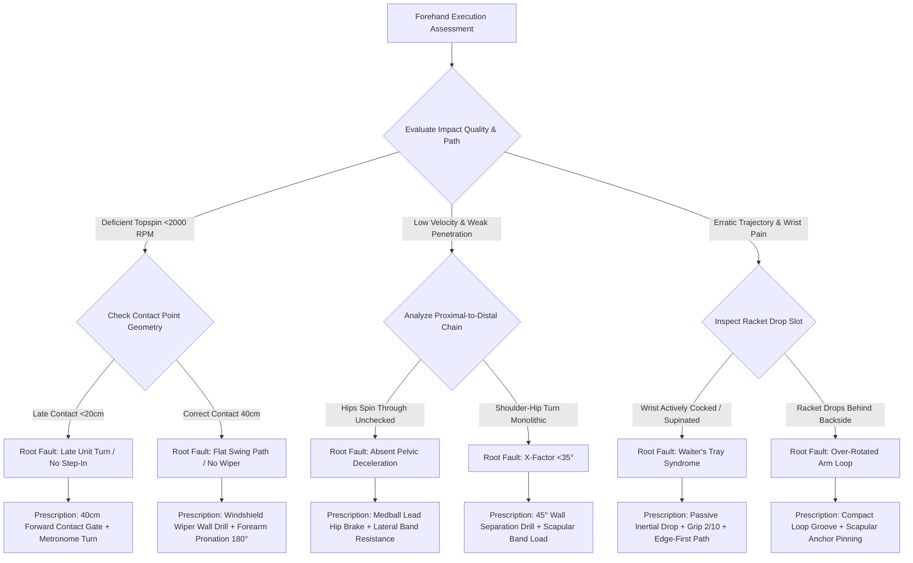

# Article 081: Modern Forehand: Unit Turn and Kinetic Loading

> **PRO CUE:** Modern Forehand = **5-Phase Rotational Engine**. Unit Turn 45-55° = core spring loading. Passive Lag Drop = let gravity do the work. Pelvic deceleration (Hip brake) = transfer rotational kinetic energy into racket linear velocity. Contact 40cm out in front of the lead hip = optimal strike geometry. Windshield wiper finish = forearm pronation release.

## 1. Executive Summary & Athletic Intent

The modern ATP forehand is a **high-speed rotational engine** capable of generating **>3,200 RPM and 130 km/h**. This article analyzes the **5-Phase Kinetic Chain Model**: (1) **Unit Turn & Scapular Load** (45-55° shoulder-pelvis separation + scapular retraction/anchoring), (2) **Gravitational Lag Drop** (passive racket drop governed by gravity and inertia), (3) **Leg Thrust & Hip Deceleration** (lead hip abrupt deceleration >80% within a 40 ms window), (4) **Forward Linear Contact** (strike point 40 cm in front of the lead hip + 3,500+ RPM Magnus topspin brush), and (5) **Windshield Wiper Pronation Finish** (180° forearm pronation with scissor-kick dynamic recovery).

Athletic intent encompasses three foundational imperatives: First, define the **Unit Turn as an elastic energy pre-load**—never a mere superficial "body turn." Second, demonstrate that the **Lag drop is strictly passive (gravity + inertia)**—not active wrist manipulation or forced flexion. Third, deliver the **"5-Phase Forehand Engine" curriculum** to systematically engineer an ATP-caliber kinetic chain.

## 2. Biomechanical & Neurological Foundation

### 2.1 5-Phase ATP Forehand Kinetic Model (Dynamic Sequence Analysis)

| Phase | Technical Designation | Primary Biomechanics | Temporal Window | KPI |
|---|---|---|---|---|
| **1** | **Unit Turn & Scapular Load** | Shoulder rotation 45-55° past pelvis; Scapular retraction and loading | $T-500\text{ ms} \to T-300\text{ ms}$ | X-Factor separation 45-55° |
| **2** | **Gravitational Lag Drop** | Forearm/wrist relaxed (grip tension 2/10); Racket head drops via gravity + inertia | $T-300\text{ ms} \to T-150\text{ ms}$ | Lag angle >90° |
| **3** | **Leg Thrust & Lead Hip Deceleration** | Ground Reaction Forces (GRF) 2.5-3.5×BW; Abrupt pelvic deceleration >80% pelvic rotation | $T-150\text{ ms} \to T-50\text{ ms}$ | Hip deceleration >80% within 40 ms |
| **4** | **Forward Linear Contact** | Strike point 40 cm anterior to lead hip; Windshield wiper brush; 3,500+ RPM | $T-50\text{ ms} \to T+50\text{ ms}$ | Contact offset 40 cm ahead |
| **5** | **Windshield Wiper Pronation Finish** | Forearm pronation 180°; Scissor-kick dynamic recovery; Shoulder over shoulder | $T+50\text{ ms} \to T+300\text{ ms}$ | High wrap finish through thorax |

### 2.2 Elastic Energy Storage Mechanism

```
UNIT TURN (Phase 1):
Pelvis rotates 45° → Shoulders rotate 95-100° → **X-Factor Separation 45-55°**
     │
     ▼
CORE TORSIONAL SPRING: Internal/External Obliques + Thoracolumbar Fascia + Latissimus Dorsi
     │   E_p = ½ × k × θ²   (θ = separation angle 45-55°)
     ▼
LEAD HIP DECELERATION (Phase 3):
Lead hip ABRUPTLY ARRESTS rotation → Transfers angular momentum into linear racket velocity
     │
     ▼
SEGMENTAL WHIP (Phases 4-5):
Thorax → Shoulder → Upper Arm → Forearm → Wrist → Racket = **Kinetic Chain Sequencing**
```

**Biomechanical Energy Formulations:**
- **X-Factor Torque:** $\tau = -k \cdot \theta$ ($k = \text{core torsional stiffness}$, $\theta = \text{separation angle}$)
- **Racket Angular Velocity:** $\omega_{\text{racket}} = \omega_{\text{thorax}} + \omega_{\text{shoulder\_rot}} + \omega_{\text{shoulder\_internal\_rot}} + \omega_{\text{forearm\_pronation}}$
- **Magnus Topspin RPM:** $\omega_{\text{spin}} \propto (v_{\text{racket}} \cdot \sin\theta) \cdot \text{brush\_angle}$

### 2.3 Comparative Matrix: Modern ATP Forehand vs. Traditional Forehand

| Biomechanical Variable | Traditional Classical Forehand | Modern ATP Forehand |
|---|---|---|
| **Unit Turn** | 30-40°, shoulders and hips turn in unison | **45-55° X-Factor separation**, deep scapular load |
| **Backswing / Racket Drop** | Large circular loop, active wrist cocking | **Compact loop, purely passive gravitational lag drop** |
| **Pelvic Action** | Continuous uninhibited rotation through impact | **Abrupt pelvic deceleration (hip brake)** at Phase 3 |
| **Contact Point Geometry** | Parallel to hip line, late strike plane | **40 cm anterior to lead hip**, out-front geometry |
| **Follow-Through / Finish** | Classical wrap over opposite shoulder | **Windshield wiper pronation**, high across torso |
| **Topspin Output** | 1,500-2,000 RPM | **3,000-3,500+ RPM** |

## 3. Step-by-Step Technical Execution

### Phase 1: Unit Turn & Scapular Load (Phase 1)

**Drill 1: "45° Wall Separation Drill"**
- The athlete stands with their back lightly contacting a wall, feet shoulder-width apart in a neutral-to-semi-open stance.
- Rotate the shoulder axis 90-100° while anchoring the pelvis at 45° (the rear knee remains dynamically flexed without rotating inward).
- Somatosensory target: **Tension across the contralateral obliques** and thoracolumbar fascial sling stretch.
- Protocol: 10 reps with a 3-second isometric hold. KPI: X-Factor separation $\ge 45^\circ$ confirmed via goniometer or motion analysis.

**Drill 2: "Resistance Band Scapular Load"**
- Anchor a moderate resistance band behind the player at chest level, holding both handles with hands together out in front.
- Initiate the unit turn: Draw the band back using **pure scapular retraction and posterior thoracic tilt**, preventing any isolated arm pulling.
- Dosage: 3 sets $\times$ 15 reps. Pro cue: *"Retract scapula $\to$ Load the elastic spring."*

**Drill 3: "Metronome Shadow Unit Turn"**
- Set an acoustic metronome to 1 Hz (60 BPM). Beat 1: Neutral athletic ready state. Beat 2: Instant completion of the full 45-55° unit turn.
- Video audit criteria: Shoulder axis $\ge 95^\circ$, Pelvic axis $\le 45^\circ$, Scapula fully retracted and pinned.
- Progression: Progressively advance cadence from 1.0 Hz $\to$ 1.5 Hz $\to$ 2.0 Hz.

### Phase 2: Gravitational Lag Drop (Phase 2)

**Drill 4: "Passive Inertial Lag Drop"**
- Adopt the trophy/coiled position with relaxed hand pressure (2/10 on the grip scale).
- **Completely release wrist muscular tension**—permit gravity combined with trunk movement to pull the racket head into the drop slot.
- **Do not actively cock or flex the wrist**. Somatosensory target: The racket head enters a sensation of "free fall."
- High-speed video confirmation: Racket lag angle $>90^\circ$ relative to the forearm at the bottom of the swing arc.
- Dosage: 20 reps. Pro cue: *"Soft grip $\to$ Gravity drop $\to$ Zero active wrist muscle."*

**Drill 5: "Edge-First Drop Drill"**
- From the set position, descend the racket with the **frame edge perpendicular to the ground (edge-first leading path)**.
- Forearm pronation and string face square-up must occur strictly **AFTER** passing the lowest point of the drop.
- Neutralizes the classic "Waiter's Tray" flaw (premature forearm supination).
- Dosage: 15 reps.

### Phase 3: Leg Thrust & Hip Deceleration (Phase 3)

**Drill 6: "Lead Hip Brake Medicine Ball Throw"**
- Hold a 3 kg medicine ball in a loaded semi-open forehand stance with a complete unit turn.
- Drive explosively off the rear leg $\to$ **Violently brake the lead hip** (arresting pelvic rotation sharply at 45° to the baseline).
- Somatosensory target: Kinetic energy catapults from the pelvis through the core into the thoracic spine, propelling the medball forward.
- Dosage: 3 sets $\times$ 8 reps. KPI: Pelvic deceleration rate $>80\%$ reduction within 40 ms on high-speed video.

**Drill 7: "Band-Resisted Hip Decel"**
- Anchor a heavy resistance band laterally around the lead anterior superior iliac spine (ASIS).
- Execute unit turn $\to$ Leg drive $\to$ **Brace against band resistance to instantly arrest pelvic rotation**.
- Trains eccentric neuromuscular control of the lead hip internal rotators and gluteus medius.
- Dosage: 3 sets $\times$ 10 reps.

### Phase 4: Forward Contact & Windshield Wiper (Phases 4-5)

**Drill 8: "40cm Forward Contact Gate"**
- Position a cone marker 40 cm anterior to the lead toe within the strike zone.
- The athlete is required to **make ball impact strictly IN FRONT of this gate**.
- Conditioning objective: Early forward step-in and long-axis extension, eliminating jammed late contact.
- Dosage: 30 live hand-fed feeds. KPI: $\ge 90\%$ impact events confirmed anterior to the marker.

**Drill 9: "Windshield Wiper Wall Drill"**
- Stand parallel to a fence or wall at arm's length.
- Execute the terminal finish: Forearm pronates through 180°, sweeping the racket face up and across an imaginary vertical window pane.
- Somatosensory target: Active forearm pronator teres engagement paired with dynamic scapular protraction; zero wrist strain.
- Dosage: 20 reps per side.

**Drill 10: "5-Phase Shadow Sequence"**
- Unloaded motor sequencing:
  1. Unit Turn (45° separation) – 2.0 s hold
  2. Lag Drop (passive gravitational slot) – 1.0 s
  3. Hip Brake (violent pelvic arrest) – 0.5 s
  4. Forward Contact (40 cm forward gate) – 0.5 s
  5. Windshield Wiper Finish – 1.0 s
- Paced to metronome at 0.5 Hz (2.0 s cycle time). 10 complete cycles.

### Phase 5: Live Ball Integration

**Drill 11: "5-Phase Feed & Call"**
- Coach feeds medium-paced balls into the strike zone. The player executes a modern forehand.
- **Immediately upon ball departure**, the player vocally calls out the weakest phase (1 to 5).
- Coach checks video telemetry to correlate player proprioceptive feedback against kinematic reality.
- Dosage: 30 balls. Target: Proprioceptive self-diagnostic accuracy $\ge 80\%$.

**Drill 12: "Rally 5-Phase Compliance"**
- Cross-court baseline rally. Every forehand executed must satisfy the 5-phase biomechanical criteria.
- Scoring: Phase 1 (separation $\ge 45^\circ$), Phase 2 (passive lag drop), Phase 3 (hip brake), Phase 4 (contact 40 cm out front), Phase 5 (wiper finish).
- Perfect shot = 5/5. Benchmark: Maintain average score $\ge 4.0/5.0$ across 30 consecutive rally balls.

## 4. Performance Metrics & Training Dosage

| Performance Metric | Developing | Proficient | Advanced | Elite (ATP Tour) |
|---|---|---|---|---|
| **X-Factor Separation Angle** | $<35^\circ$ | 35-45° | 45-50° | **45-55°** |
| **Passive Lag Angle** | $<60^\circ$ (active strain) | 60-80° | 80-95° | **$>90^\circ$ (pure passive)** |
| **Lead Hip Deceleration Rate** | $<50\%$ in 40 ms | 50-70% | 70-85% | **$>80\%$ in 40 ms** |
| **Contact Distance Ahead of Hip** | $<20\text{ cm}$ | 20-30 cm | 30-40 cm | **$40\text{ cm}+$** |
| **Topspin Spin Rate** | $<2,000\text{ RPM}$ | 2,000-2,500 RPM | 2,500-3,000 RPM | **3,000-3,500+ RPM** |
| **5-Phase Rally Compliance** | $<40\%$ | 40-60% | 60-80% | **$>90\%$** |
| **Unit Turn Reaction Latency** | $>400\text{ ms}$ | 300-400 ms | 200-300 ms | **$<200\text{ ms}$** |

### Weekly Periodized Training Dosage

- **Unit Turn & Scapular Load Blocks:** $3\times/\text{week}$, 15 minutes (Drills 1–3).
- **Gravitational Lag Drop Blocks:** $3\times/\text{week}$, 10 minutes (Drills 4–5).
- **Pelvic Deceleration (Hip Brake) Blocks:** $2\times/\text{week}$, 15 minutes (Drills 6–7).
- **Contact Geometry & Wiper Blocks:** $3\times/\text{week}$, 15 minutes (Drills 8–10).
- **Live Ball Integration & Rally Scoring:** $2\times/\text{week}$, 30 minutes (Drills 11–12).
- **Total Volume:** $\sim 120\text{ minutes/week}$ of forehand-specific kinetic chain conditioning.

## 5. Errors, Causes & Correction Protocols

| Observable Technical Defect | Biomechanical Root Cause | Prescriptive Correction Protocol |
|---|---|---|
| **"Hips rotate with shoulders; X-Factor $<30^\circ$"** | Lack of pelvic-thoracic disassociation; deficient oblique stretch tolerance | 45° Wall Separation Drill; Resistance Band Scapular Load; Dynamic core rotational mobilization |
| **"Active wrist cocking into drop ('Waiter's Tray')"** | Cognitive misconception that lag is generated by voluntary wrist contraction | Passive Inertial Lag Drop drill; Relax grip to 2/10; Edge-First Drop Drill (500+ reps) |
| **"Continuous spinning hips; no pelvic deceleration"** | Failure of lead hip eccentric braking; kinetic energy bleeds into over-rotation | Lead Hip Brake Medball Throws; Lateral band resistance decel; Cue: *"Arrest hip $\to$ Catapult arm"* |
| **"Late contact posterior to lead hip plane"** | Delayed unit turn initiation; failure to aggressively step into the strike window | 40cm Forward Contact Gate drill; Early forward transfer step; Cue: *"Meet ball 40 cm out front"* |
| **"Low, flat finish around waist (Classical pattern)"** | Inability to pronate forearm; dominant shoulder horizontal adduction without vertical brush | Windshield Wiper Wall Drill; High finish cue: *"Wipe the vertical pane upward"* |
| **"Low spin rate ($<2,000\text{ RPM}$) despite high swing speed"** | Flat contact angle; insufficient vertical trajectory vector; improper face angle | 40cm Forward Contact Gate; Windshield wiper pronation; Racket face angle dynamic check |

## 6. Diagnostic Diagram & Decision Flow



## 7. Video Demonstration & Technical Analysis

<div class="video-container" style="position:relative;padding-bottom:56.25%;height:0;overflow:hidden;border-radius:12px;">
  <iframe src="https://www.youtube-nocookie.com/embed/VIDEO_ID_PLACEHOLDER"
          style="position:absolute;top:0;left:0;width:100%;height:100%;border:0;"
          allow="accelerometer; autoplay; clipboard-write; encrypted-media; gyroscope; picture-in-picture"
          allowfullscreen
          title="Modern Forehand: Unit Turn and Kinetic Loading — Technical Analysis"></iframe>
</div>

*Recommended high-speed video analysis protocols: 240 FPS high-speed camera capturing the 5-phase kinetic chain freeze-frame; X-Factor separation angle digital overlay at maximum shoulder coil; Force plate pelvic deceleration force-time curve tracking; 3D contact point heatmap comparing out-front vs. jammed contact; Elite benchmark comparison (Carlos Alcaraz, Jannik Sinner, Novak Djokovic).*

## 8. Cross-Domain Synergy & Multi-Pillar Integration

- **With Split Step Mechanics (Article 083):** The unit turn must be **fully initiated before split-step ground landing**. Optimal temporal coupling: Opponent ball contact $\to$ Split hop elevation $\to$ Unit turn locked upon landing contact.
- **With Serving Kinetic Chain (Article 084):** Shares the fundamental principle of **Proximal-to-Distal Sequencing**. Lead pelvic braking $\to$ Thoracic catapult $\to$ Scapular release $\to$ Forearm pronation.
- **With One-Handed Backhand (Article 085):** While the forehand operates in an open/semi-open stance with 45-55° separation, the 1HBH requires an even greater separation angle ($70-75^\circ$) due to its closed-stance alignment.
- **With Two-Handed Backhand (Article 086):** The non-dominant arm drive on the 2HBH functions as the mirror equivalent of the forehand unit turn and scapular load.
- **With Contact Point Geometry (Article 082):** Maintaining contact 40 cm anterior to the lead hip establishes the **exact geometric safety zone protecting the hip labrum and shoulder rotator cuff**. Striking late introduces acute joint shear loads.
- **With Neural Drive Synchronization (Article 069):** Phases 3 to 4 represent the **maximal motor unit firing window**. Millisecond pelvic deceleration timing demands precise cortical motor synchronization.
- **With Fatigue & Recovery Dynamics (Articles 054, 058):** Under high lactate and central fatigue, pelvic braking latency degrades, X-Factor shrinks, and players default to active wrist compensation. Targeted micro-recovery routines preserve 5-phase biomechanical integrity.

## 9. Self-Assessment Rubric

| Diagnostic Checkpoint | Level 1 (Traditional / Flawed) | Level 2 (Transitional) | Level 3 (Modern Functional) | Level 4 (ATP Elite Mastery) |
|---|---|---|---|---|
| **X-Factor Separation** | $<35^\circ$ (Hips turn with shoulders) | 35-45° | 45-50° | **45-55°** |
| **Passive Lag Drop** | Absent (Voluntary wrist muscle) | Inconsistent passive slot | Consistently passive ($>80^\circ$) | **Consistently passive ($>90^\circ$)** |
| **Lead Hip Brake Rate** | Absent ($<50\%$ in 40 ms) | Moderate (50-70%) | Strong (70-85%) | **Abrupt arrest ($>80\%$ in 40 ms)** |
| **Contact Distance Ahead** | Posterior / Jammed ($<20\text{ cm}$) | 20-30 cm | 30-40 cm | **$40\text{ cm}+$** |
| **Windshield Wiper Finish** | Classical flat wrap around waist | Mixed / Variable finish | Functional upward pronation | **Consistent high pronated wrap** |
| **5-Phase Rally Compliance** | $<40\%$ across 30 balls | 40-60% | 60-80% | **$>90\%$ across 30 balls** |

**Diagnostic Scoring Key:**
- **6–10 Points:** Kinetic chain breakdown; excessive joint shear risk; mandatory foundational rebuild.
- **11–15 Points:** Traditional rotational leak; active arming through contact; inconsistent power delivery.
- **16–20 Points:** Modern functional execution; reliable spin production; minor leaks under competitive fatigue.
- **21–24 Points:** Tour-level ATP mechanical mastery; peak rotational efficiency and longevity.

## 10. Printable Practice Card (Pocket Drill Card)

```
┌────────────────────────────────────────────────────────────────────────┐
│               POCKET DRILL CARD: MODERN FOREHAND ENGINE                │
│  Target: Compliance >85%, X-Factor 45-55°, Hip Decel >80%, Contact 40cm │
├────────────────────────────────────────────────────────────────────────┤
│ BLOCK A: Dynamic Activation & Coil (5 Min)                             │
│ • 45° Wall Separation Drill: 10 reps (3s hold)                         │
│ • Resistance Band Scapular Load: 15 reps                               │
│ • Focus Cue: "Disassociate hips and shoulders — Pin the scapula"       │
├────────────────────────────────────────────────────────────────────────┤
│ BLOCK B: Gravitational Slot & Patterning (15 Min)                      │
│ • Passive Inertial Lag Drop: 20 reps (Grip tension 2/10)               │
│ • Edge-First Drop Drill: 15 reps                                       │
│ • Focus Cue: "Soft hands — Let gravity drop the head — Zero wrist"     │
├────────────────────────────────────────────────────────────────────────┤
│ BLOCK C: Kinetic Transfer & Contact (20 Min)                           │
│ • Lead Hip Brake Medball Throws: 3 sets × 8 reps                       │
│ • 40cm Forward Contact Gate: 30 live balls                             │
│ • Windshield Wiper Wall Drill: 20 reps                                 │
│ • Focus Cue: "Violent hip brake catapults arm — Meet ball 40cm ahead"  │
├────────────────────────────────────────────────────────────────────────┤
│ BLOCK D: High-Speed Live Integration (10 Min)                          │
│ • 5-Phase Shadow Sequencing: 10 metronome cycles                       │
│ • Rally Compliance Scoring: 20 cross-court balls (Target: ≥4.0/5.0)    │
│ • Focus Cue: "Distinct Phase 1→2→3→4→5 — Maximum elastic return"       │
├────────────────────────────────────────────────────────────────────────┤
│ FREQUENCY: 4×/week | GATE: 3 consecutive weeks with Compliance >85%,   │
│ X-Factor ≥45°, Topspin >2,500 RPM, and Contact Point 40cm ahead.       │
└────────────────────────────────────────────────────────────────────────┘
```

---

*Cross-References: Articles 054, 058, 069, 082, 083, 084, 085, 086. Pillar III: Stroke Mechanics & Ball Striking — TennisKB 200 Articles.*
