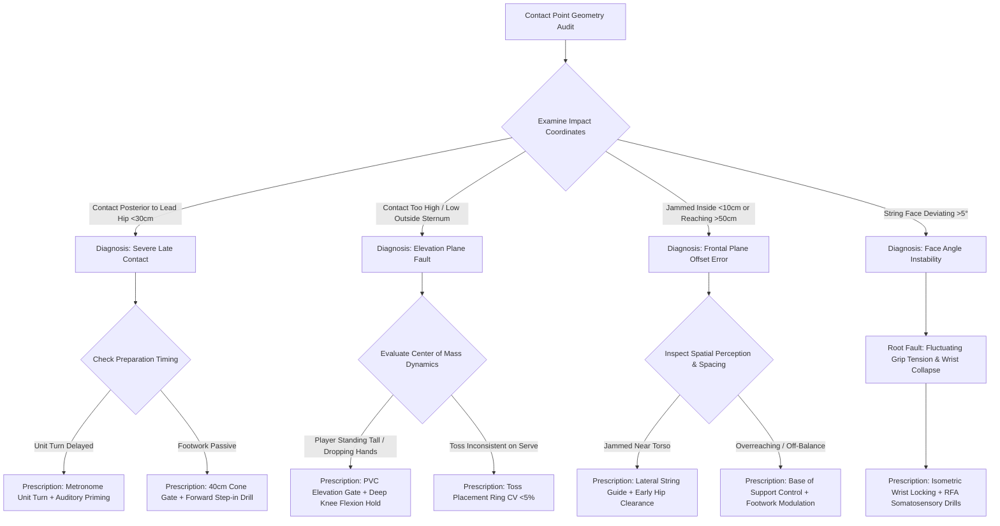

# Article 082: Contact Point Geometry: Protecting the Hips and Shoulders

> **PRO CUE:** Contact point geometry is not an arbitrary zone "somewhere in front"—it is a **spatially rigorous coordinate 40 cm anterior to the lead hip, at sternum height, with the string bed perpendicular to the incoming velocity vector**. Late contact unleashes destructive shear forces across the glenoid labrum and hip acetabular rim. Early overreaching bleeds kinetic power. Biomechanical geometry equals athletic longevity.

## 1. Executive Summary & Athletic Intent

**Contact Point Geometry** represents the three-dimensional spatial parameters that dictate the coordinates of the racket head's center of percussion during the micro-window of impact (approximately 3–4 ms). In the modern forehand, the benchmark geometry is **40 cm anterior to the lead hip at sternum height, with the string face perpendicular ($\pm 3^\circ$) to the target ball vector**. In the backhand, it is calibrated to **30–35 cm anterior to the lead hip**. On the serve, it requires **maximum vertical extension at the 1:00–2:00 o'clock position**. Volleys demand contact **20–30 cm in front of the visual plane**. Deviating from these spatial boundaries generates acute **rotational shear stresses** across the hip joint (femoroacetabular impingement [FAI], labral tearing) and the glenohumeral joint (rotator cuff tendinopathy, internal impingement). This article establishes the **3D Contact Geometry Matrix**, delineates safe kinematic thresholds, and details the **"Forward Contact Gate"** training architecture.

Athletic intent is threefold: First, transform the **contact point from an abstract sensory feeling into an objectively quantifiable metric with a spatial tolerance of $\pm 5\text{ cm}$**. Second, mathematically demonstrate how **late contact induces acute joint shear loads**—the primary biomechanical etiology of chronic overuse trauma. Third, implement the **"Geometry Gate" protocol** to condition players to dynamically move their personal contact geometry to the ball rather than adapting arm mechanics to unpredictable ball trajectories.

## 2. Biomechanical & Neurological Foundation

### 2.1 3D Contact Geometry Matrix

| Spatial Parameter | Forehand Groundstroke | Backhand (1HBH / 2HBH) | First Serve | Volley (FH / BH) |
|---|---|---|---|---|
| **Horizontal Distance (Anterior to Lead Hip)** | **$40\text{ cm}$** | $30\text{–}35\text{ cm}$ | N/A (Toss displacement) | $20\text{–}30\text{ cm}$ in front of chest |
| **Vertical Height (Elevation)** | **Sternum / Mid-Chest** | Mid-chest to shoulder | **Maximum anatomical reach (1:00–2:00)** | Eye to chest level |
| **Lateral Offset (Frontal Plane)** | Lead hip $+ 10\text{ cm}$ | Lead hip $+ 5\text{ cm}$ | Body longitudinal midline | Inter-shoulder midpoint |
| **Racket Face Angle** | Perpendicular to path ($\pm 3^\circ$) | Perpendicular ($\pm 3^\circ$) | Tilt calibrated to spin | Firm, minimal deviation |
| **Shaft Angle** | $10\text{–}15^\circ$ upward (brush) | $5\text{–}10^\circ$ upward | Near vertical | Near vertical ($75\text{–}85^\circ$) |
| **Safe Spatial Tolerance** | **$\pm 5\text{ cm}$ across all axes** | **$\pm 5\text{ cm}$ across all axes** | **$\pm 3\text{ cm}$** | **$\pm 3\text{ cm}$** |

### 2.2 Shear Force Dynamics & Joint Loading

**Late Contact Geometry (Posterior to Lead Hip / Midline Plane):**
```
Late Contact → Racket abruptly decelerates → Kinetic chain disrupted → Reverse torque on joints
     │
     ├──► GLENOHUMERAL JOINT:
     │         • Internal impingement (Supraspinatus compressed against posterior labrum)
     │         • Long head of biceps tendon acute shear tension
     │         • Posterior capsule micro-tearing and hyper-stretch
     │
     └──► HIP / ACETABULAR JOINT:
               • Anterior femoral head shear translation (elevated FAI risk)
               • Anterosuperior labral tearing under uncontrolled torque
               • Iliofemoral and capsular ligament hyper-stress
```

**Forward Contact Geometry ($40\text{ cm}$ Anterior to Lead Hip):**
```
Forward Contact → Racket accelerates THROUGH impact → Natural proximal-to-distal deceleration
     │
     ├──► GLENOHUMERAL JOINT:
     │         • Centripetal acceleration seats humeral head firmly within glenoid fossa
     │         • Dynamic rotator cuff co-contraction provides stabilizing joint compression
     │         • Biceps long head remains slack with zero pathological shear
     │
     └──► HIP / ACETABULAR JOINT:
               • Pelvic rotation completes prior to impact window
               • Femoral head remains anatomically centered in acetabulum
               • Gluteus maximus and rotators absorb loads via controlled eccentric braking
```

### 2.3 Biomechanical Safety Thresholds

| Kinematic Metric | Safe Zone (Green) | Caution Zone (Yellow) | Pathological Danger (Red) |
|---|---|---|---|
| **Forehand Contact Distance** | $35\text{–}45\text{ cm}$ ahead of hip | $25\text{–}35\text{ cm}$ or $45\text{–}55\text{ cm}$ | $<25\text{ cm}$ (Late) or $>55\text{ cm}$ (Overreaching) |
| **Contact Height** | Sternum $\pm 5\text{ cm}$ | Shoulder or hip level $\pm 5\text{ cm}$ | Above shoulder or below knee plane |
| **Racket Face Deviation** | $\pm 3^\circ$ from orthogonal | $\pm 5\text{–}8^\circ$ | $>10^\circ$ (Framing / shank hazard) |
| **Hip Rotation at Impact** | Fully locked ($45^\circ$ open) | $20\text{–}45^\circ$ | $<20^\circ$ (Chest squared prematurely) |
| **Shoulder Abduction Angle** | $90\text{–}100^\circ$ | $80\text{–}90^\circ$ or $100\text{–}110^\circ$ | $>110^\circ$ (Subacromial impingement) |

## 3. Step-by-Step Technical Execution

### Phase 1: Spatial Geometry Calibration & Proprioceptive Mapping

**Drill 1: "Contact Point Grid Mapping"**
- Using chalk or athletic tape, construct a $10\text{ cm} \times 10\text{ cm}$ grid on the court surface positioned around the forehand and backhand impact zones.
- The player executes unloaded shadow swings, **freezing instantaneously at ball impact**. Mark the exact position of the racket sweet spot relative to the grid.
- Contrast against the **Ideal 3D Geometry Matrix** ($40\text{ cm}$ anterior to lead hip, sternum level).
- Protocol: 20 repetitions per wing. KPI: $\ge 90\%$ of holds land within the $\pm 5\text{ cm}$ target perimeter.

**Drill 2: "High-Speed Video Geometry Audit"**
- Record kinematic trials at 240 FPS from lateral (sagittal plane) and rear (frontal plane) perspectives.
- Digital overlay analysis: Measure horizontal distance from lead toe, vertical height relative to sternum, string face tilt, and pelvic orientation.
- Tag and flag any repetitive joint violation zones.

### Phase 2: Forward Contact Gate Conditioning

**Drill 3: "Forward Contact Gate – Cone Drill"**
- Place a coaching cone **$40\text{ cm}$ anterior to the lead toe marker** for the forehand ($30\text{ cm}$ for the backhand).
- Core rule: **The racket face must initiate impact anterior to the cone gate line**.
- Coach hand-feeds medium-paced balls into the strike zone. 30 balls per wing.
- Striking behind the gate or contacting the marker is flagged as a technical fault.
- KPI: $\ge 90\%$ forward contact success rate.

**Drill 4: "PVC Elevation Gate Drill"**
- Suspend a horizontal lightweight PVC pipe at the athlete's **sternum height** (forehand/backhand) or **shoulder-overhead reach line** (serve).
- The player drives through the stroke: The racket head **MUST clear above the plane of the pipe at impact**.
- Prevents dropped-elbow scooping and erratic low-to-high collapse.
- Protocol: 20 reps per side.

**Drill 5: "Frontal Plane Lateral Offset Alignment"**
- Run an elastic guide string from the lead hip parallel to the baseline.
- Impact coordinates must strictly maintain a **$10\text{ cm}$ lateral clearance outside the string line** (forehand) or **$5\text{ cm}$ clearance** (backhand).
- Neutralizes jammed elbow mechanics and over-extended reaching.
- Protocol: 20 reps.

### Phase 3: Dynamic Geometry Under High Tactical Load

**Drill 6: "Random Feed Geometry Challenge"**
- Ball machine or coach distributes randomized feeds: deep, short, wide, body-jamming, heavy topspin, and low skid balls.
- Athlete mandate: **Adjust footwork so that every ball is struck within the optimal Geometry Gate**.
- The cognitive cue: *"Do not adjust your swing to the ball—transport your contact geometry to the ball."*
- Dosage: 40 randomized balls. KPI: Spatial compliance $>85\%$.

**Drill 7: "Two-Ball Transition Sequence"**
- High-tempo feeding with a 1.5-second interval between shots.
- Shot 1: Forehand cross-court $\to$ Rapid directional recovery $\to$ Shot 2: Backhand down-the-line.
- Both strokes must register within their respective forward gates ($40\text{ cm}$ and $30\text{ cm}$).
- 10 sequences. Evaluates geometry stabilization during rapid multi-directional transitions.

**Drill 8: "Fatigued Geometry Resilience Test"**
- Execute a 4-minute high-intensity interval protocol driving blood lactate $>8.0\text{ mmol/L}$.
- Immediately engage in the Forward Contact Gate Drill (20 balls).
- Contrast fatigued compliance against fresh baseline telemetry.
- Target: Spatial compliance degradation $<15\%$.

### Phase 4: Serve & Volley Spatial Alignment

**Drill 9: "Serve Toss-Contact Alignment"**
- Suspend a spatial target ring at maximal vertical extension in the 1:00 o'clock quadrant.
- Focus: Ball toss placement must perfectly intersect the vertical kinetic extension window.
- KPI: Toss location coefficient of variation ($\text{CV}\%) < 5\%$, full elbow/shoulder extension, target accuracy $>70\%$.
- 30 serves.

**Drill 10: "Volley Spatial Box"**
- Rapid-fire feeds from 3 meters away at the net.
- Impact geometry: **$20\text{–}30\text{ cm}$ in front of the visual plane, between the shoulders, racket shaft at $80\text{–}85^\circ$**.
- Prohibit any contact trailing behind the eye plane or broken wrist angles.
- Dosage: 30 volleys (alternating forehand/backhand). KPI: $90\%$ compliance.

## 4. Performance Metrics & Training Dosage

| Performance Metric | Developing | Proficient | Advanced | Elite (ATP / WTA) |
|---|---|---|---|---|
| **Forehand Contact Distance** | $<30\text{ cm}$ or $>50\text{ cm}$ | 30–40 cm | 35–45 cm | **$40\text{ cm} \pm 3\text{ cm}$** |
| **Backhand Contact Distance** | $<25\text{ cm}$ or $>45\text{ cm}$ | 25–35 cm | 30–35 cm | **$30\text{–}35\text{ cm} \pm 3\text{ cm}$** |
| **Contact Height Accuracy** | $>10\text{ cm}$ error | 5–10 cm error | 3–5 cm error | **$\pm 3\text{ cm}$ of sternum** |
| **Racket Face Angle at Impact** | $>10^\circ$ deviation | 5–10° deviation | 3–5° deviation | **$\pm 3^\circ$ orthogonal** |
| **Fresh Geometry Compliance** | $<70\%$ | 70–85% | 85–95% | **$>95\%$** |
| **Fatigued Geometry Compliance** | $<50\%$ | 50–70% | 70–85% | **$>85\%$** |
| **Rally Late Contact Rate** | $>20\%$ | 10–20% | 5–10% | **$<3\%$** |

### Weekly Periodized Training Dosage

- **Spatial Geometry Mapping:** $1\times/\text{week}$, 15 minutes (Baseline kinematic tracking).
- **Gate Conditioning (Cone/PVC):** $3\times/\text{week}$, 20 minutes (Drills 3–5).
- **Dynamic Pressure Challenges:** $2\times/\text{week}$, 20 minutes (Drills 6–7).
- **Fatigued Geometry Testing:** $1\times/\text{every 2 weeks}$, 10 minutes (Drill 8).
- **Serve & Volley Spatial Calibration:** $2\times/\text{week}$, 15 minutes (Drills 9–10).
- **High-Speed Video Audit:** $1\times/\text{week}$, 10 minutes.
- **Total Volume:** $\sim 90\text{ minutes/week}$ of isolated contact geometry training.

## 5. Errors, Causes & Correction Protocols

| Observable Technical Defect | Biomechanical Root Cause | Prescriptive Correction Protocol |
|---|---|---|
| **"Chronic late contact trailing behind the lead hip"** | Delayed unit turn initiation; failure to step forward into the ball; absent pelvic brake | 40cm Forward Contact Gate drill; Aggressive forward transfer step; Pelvic braking integration (Article 081) |
| **"Low scooped contact below the waist line"** | Insufficient knee flexion; dropping racket head late without lowering Center of Mass (CoM) | PVC Elevation Gate Drill; Deep knee flex cue: *"Sit into the strike zone; lower hips, not hands"* |
| **"High, uncontrolled contact at ear/head level"** | Erratic toss placement on serve; overly steep low-to-high swing trajectory on groundstrokes | Toss placement calibration target; Swing plane flattening drills; Early takeback discipline |
| **"Racket face erratic open/closed at impact"** | Fluctuating grip pressure; wrist instability; absent isometric forearm firmness | Calibrate grip tension to 3/10; Somatosensory RFA awareness drills (Article 073); Isometric wrist holds |
| **"Body-jammed contact too close to torso"** | Deficient footwork micro-adjustments; delayed depth affordance perception | Frontal Plane Lateral Offset Drill; Affordance visual calibration (Article 067); Early hip spacing |
| **"Overreaching with excessive arm extension"** | Over-striding forward; premature lunge compromising balance and rotational axis | Controlled step-in boundary drill; Dynamic balance focus: *"Bring your core to the strike zone"* |
| **"Severe geometry breakdown under match fatigue"** | Pelvic decelerators fatigue; trunk leans backward; rotational chain delays | Inter-point parasympathetic reset (Article 061); Lactate-JPS conditioning (Article 058) |

## 6. Diagnostic Diagram & Decision Flow



## 7. Video Demonstration & Technical Analysis

<div class="video-container" style="position:relative;padding-bottom:56.25%;height:0;overflow:hidden;border-radius:12px;">
  <iframe src="https://www.youtube-nocookie.com/embed/VIDEO_ID_PLACEHOLDER"
          style="position:absolute;top:0;left:0;width:100%;height:100%;border:0;"
          allow="accelerometer; autoplay; clipboard-write; encrypted-media; gyroscope; picture-in-picture"
          allowfullscreen
          title="Contact Point Geometry: Protecting the Hips and Shoulders — Technical Analysis"></iframe>
</div>

*Recommended high-speed video analysis protocols: 3D multi-camera optical motion capture isolating the center of percussion at impact; Finite-element simulation contrasting glenohumeral shear forces during late contact vs. forward contact; Forward contact gate demonstration; Pro player contact point spatial heatmaps across match play (Roger Federer, Rafael Nadal, Novak Djokovic, Carlos Alcaraz).*

## 8. Cross-Domain Synergy & Multi-Pillar Integration

- **With Modern Forehand 5-Phase Model (Article 081):** Phase 4 represents the **spatial execution of contact geometry**. Phases 1 to 3 exist solely to place the racket head into this precise coordinate window.
- **With Split Step Activation (Article 083):** Split step timing and gravity drop directly govern the player's **ability to step in early and secure the 40 cm out-front contact point**. A delayed split step invariably produces late contact.
- **With Serving Kinetic Chain (Article 084):** Serve contact dictates **maximal long-axis extension geometry**. Toss precision governs whether impact occurs in the safe anatomical quadrant or over-strains the lumbar spine.
- **With One-Handed and Two-Handed Backhands (Articles 085, 086):** Backhand contact is geometrically calibrated closer to the body line ($30\text{–}35\text{ cm}$) due to closed-stance pelvic constraints. Chest-locking on the 1HBH stabilizes this plane.
- **With Racket Face Angle Awareness (Article 073):** String bed angle at contact is the **single most critical geometric variable governing ball flight depth and trajectory control**.
- **With Joint Position Sense & Proprioception (Article 058):** Proprioceptive drift under high blood lactate degrades contact geometry. Targeted JPS conditioning preserves millimeter spatial precision.
- **With Orthopedic Injury Prevention (Articles 196, 197):** Late contact is the **primary mechanical trigger for anterior labral tears, rotator cuff impingement, FAI, and Glenohumeral Internal Rotation Deficit (GIRD)**. Geometry compliance is orthopedic preservation.

## 9. Self-Assessment Rubric

| Diagnostic Checkpoint | Level 1 (Geometry Chaos) | Level 2 (Inconsistent) | Level 3 (Functional Geometry) | Level 4 (Geometry Mastery) |
|---|---|---|---|---|
| **Forehand Strike Distance** | $<30\text{ cm}$ or $>50\text{ cm}$ | 30–40 cm | 35–45 cm | **$40\text{ cm} \pm 3\text{ cm}$** |
| **Contact Height Plane** | $>10\text{ cm}$ off-target | 5–10 cm error | 3–5 cm error | **$\pm 3\text{ cm}$ of sternum** |
| **Face Angle Precision** | $>10^\circ$ deviation | 5–10° deviation | 3–5° deviation | **$\pm 3^\circ$ orthogonal** |
| **Fresh Spatial Compliance** | $<70\%$ | 70–85% | 85–95% | **$>95\%$** |
| **Fatigued Resilience** | $<50\%$ | 50–70% | 70–85% | **$>85\%$** |
| **Rally Late Contact Rate** | $>20\%$ | 10–20% | 5–10% | **$<3\%$** |

**Diagnostic Scoring Key:**
- **6–10 Points:** Critical geometric failure; immediate orthopedic injury risk; return to static gate training.
- **11–15 Points:** Significant spatial leakage; frequent late jammed contact under baseline pace.
- **16–20 Points:** Solid functional geometry; stable strike zone under routine rally conditions.
- **21–24 Points:** Elite spatial mastery; millimeter strike precision across varied spin, depth, and fatigue profiles.

## 10. Printable Practice Card (Pocket Drill Card)

```
┌────────────────────────────────────────────────────────────────────────┐
│           POCKET DRILL CARD: CONTACT POINT GEOMETRY MATRIX             │
│  Target: Fresh Compliance >95%, Fatigued >85%, Late Contact Rate <3%   │
├────────────────────────────────────────────────────────────────────────┤
│ BLOCK A: Spatial Mapping & Visual Calibration (5 Min)                  │
│ • Contact Grid Mapping: 20 reps (Forehand & Backhand)                  │
│ • Video Geometry Overlay check                                         │
│ • Focus Cue: "Map the matrix — Know your numbers (40cm out front)"     │
├────────────────────────────────────────────────────────────────────────┤
│ BLOCK B: Forward Gate Conditioning (20 Min)                            │
│ • 40cm Cone Gate Drill: 30 live balls                                  │
│ • PVC Elevation Gate Drill: 20 reps (Sternum level)                    │
│ • Frontal Plane Lateral Offset Drill: 20 reps                          │
│ • Focus Cue: "In front of the cone — Above the pipe — 10cm from cord"  │
├────────────────────────────────────────────────────────────────────────┤
│ BLOCK C: Dynamic Pressure & Transition Transfer (15 Min)               │
│ • Randomized Feed Challenge: 40 balls (Deep/Short/Wide/Body)           │
│ • Two-Ball Transition Sequence: 10 sequences (FH Gate to BH Gate)      │
│ • Focus Cue: "Transport your geometry to the ball — Never reach"       │
├────────────────────────────────────────────────────────────────────────┤
│ BLOCK D: High-Fatigue Kinematic Audit (5 Min)                          │
│ • Fatigued Geometry Test (Post-HIIT): 20 balls                         │
│ • Telemetry Log: Contact distance, elevation, face angle, late %       │
│ • Focus Cue: "Lock the core — Refuse backward lean — Meet it early"    │
├────────────────────────────────────────────────────────────────────────┤
│ FREQUENCY: 3×/week | GATE: 3 consecutive weeks with Fresh Compliance   │
│ >95%, Fatigued Compliance >85%, and Late Contact Rate <3%.             │
└────────────────────────────────────────────────────────────────────────┘
```

---

*Cross-References: Articles 058, 067, 073, 081, 083, 084, 085, 086, 196, 197. Pillar III: Stroke Mechanics & Ball Striking — TennisKB 200 Articles.*
