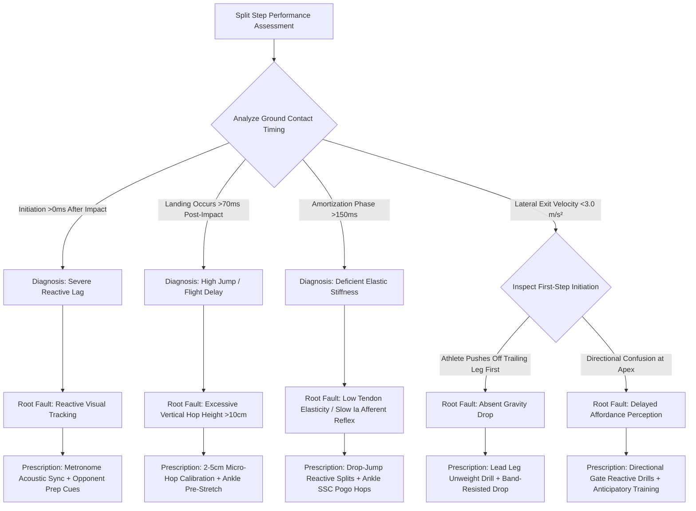

# Article 083: The Split Step: Neural Activation and Timing

> **PRO CUE:** The split step is not a casual jump—it is an **elastic neuromuscular preload**. Initiate the upward hop $-30\text{ ms}$ before opponent impact $\to$ Reach apex at $+15\text{ ms}$ (reading initial trajectory) $\to$ Land at $+45\text{ ms}$ (instantaneous elastic slingshot). A $50\text{ ms}$ timing error surrenders $1\text{–}2\text{ meters}$ of lateral court coverage. Calibrating neural timing yields the highest rate of return on court movement.

## 1. Executive Summary & Athletic Intent

The **Split Step** is a low-amplitude vertical hop ($2\text{–}5\text{ cm}$) synchronized precisely with the opponent's contact moment. Its athletic purpose is to **pre-stretch the gastrocnemius, soleus, Achilles tendon complex, and plantar fascia** via the **Stretch-Shortening Cycle (SSC)**. Optimal timing follows a strict temporal sequence: **Hop initiation at $t = -30\text{ ms}$** (prior to opponent contact) $\to$ **Flight apex at $t = +15\text{ ms}$** (decoding ball trajectory and visual cues) $\to$ **Ground contact at $t = +45\text{ ms}$** (initiating an explosive elastic rebound). This article details the **$\pm 10\text{ ms}$ Split Step Timing Window**, deconstructs the **Gravity Drop (unweighting)** mechanism, provides the **"Reactive Split-Step Training" protocol**, and establishes a diagnostic decision framework for common footwork failure modes.

Athletic intent centers on three objectives: First, define the **split step as a neural timing skill rather than general physical conditioning**. Second, explain the **Gravity Drop mechanism**: Elite movers do not initiate change of direction by pushing off the trailing leg; instead, they immediately relax the lead hip abductors to unweight the lead leg, allowing gravity to accelerate their Center of Mass (CoM) laterally at $9.81\text{ m/s}^2$. Third, deliver a comprehensive **"Neural Timing + Gravity Drop" drill progression** to drive first-step acceleration beyond $4.0\text{ m/s}^2$.

## 2. Biomechanical & Neurological Foundation

### 2.1 Split Step Exact Temporal Window

```
OPPONENT RACKET IMPACTS BALL ══════════════════════════════════════► t = 0 ms
       │
       ├──► PLAYER INITIATES UPWARD HOP  ──────► t = -30 ms (Airborne prior to ball strike)
       │
       ├──► PLAYER CoM REACHES FLIGHT APEX ────► t = +15 ms (Visual trajectory decoding)
       │
       ├──► PLAYER LANDS ON FOREFOOT PADS ─────► t = +45 ms (Achilles tendon elastic stretch)
       │
       └──► FIRST-STEP EXPLOSIVE DRIVE ────────► t = +60–80 ms (Directional propulsion)
```

**Temporal Milestones and Tolerances:**
| Kinematic Event | Optimal Timestamp | Acceptable Tolerance | Performance Consequences of Error |
|---|---|---|---|
| **Hop Initiation** | **$-30\text{ ms}$** | $\pm 10\text{ ms}$ | $-50\text{ ms}$: Premature landing before ball read; $+10\text{ ms}$: Delayed landing, flat-footed |
| **Apex (Trajectory Read)** | **$+15\text{ ms}$** | $\pm 5\text{ ms}$ | Too early: Zero flight data available; Too late: Directional reaction delayed |
| **Landing & Rebound** | **$+45\text{ ms}$** | $\pm 10\text{ ms}$ | $>60\text{ ms}$: Elastic energy lost as heat; $<30\text{ ms}$: Inadequate pre-stretch |
| **First-Step Propulsion** | **$+75\text{ ms}$** | $\pm 15\text{ ms}$ | $>100\text{ ms}$: Loss of $1\text{–}2\text{ meters}$ defensive perimeter coverage |

### 2.2 Gravity Drop (Unweighting) Mechanism

**Amateur Pattern (Active Push-Off):**
```
High CoM (Stiff Base) ──► Attempt to push off trailing leg ──► Delayed lateral reaction (>200 ms)
```

**Elite Pattern (Gravity Drop – Alcaraz, de Minaur, Djokovic):**
```
[Inhibit / Relax Lead Hip Abductors] ──► Gravity accelerates CoM laterally at 9.81 m/s²
       │
       ├──► Torso instantly drops into a lateral tilt angle (15–25°)
       │
       └──► Trailing leg drives into court ──► Instant explosive lateral propulsion (<150 ms)
```

**Key Biomechanical Insight:** Do not attempt to push off first. Instead, **remove ground support from the lead leg (unweighting)**. Gravity initiates lateral displacement without muscular lag, accelerating the athlete significantly faster than voluntary neural drive alone.

### 2.3 SSC Dynamics & Neural Activation

| Phase of Movement | Active Musculotendinous Units | Duration | Neurological Drive Characteristics |
|---|---|---|---|
| **Pre-Hop (Airborne)** | Relaxed flexors / muscle slack release | $-30\text{ ms} \to +15\text{ ms}$ | Low motor unit firing; anticipatory posturing |
| **Landing (Eccentric)** | Rapid stretch of gastrocnemius, soleus, plantar fascia | $+45\text{ ms}$ | **Ia afferent sensory burst** triggering spinal myotatic stretch reflex |
| **Amortization** | Eccentric-to-concentric transition | $+45\text{ ms} \to +55\text{ ms}$ | **$<100\text{ ms}$ critical window**; preserves elastic strain energy |
| **Concentric Drive** | Explosive plantarflexion + triple extension | $+55\text{ ms} \to +150\text{ ms}$ | **Maximal $\alpha$-motor neuron recruitment**; rate of force development peak |

**SSC Efficiency Metric:** An amortization phase duration $<100\text{ ms}$ indicates high elastic storage efficiency. Values $>150\text{ ms}$ represent energy dissipation as metabolic heat.

## 3. Step-by-Step Technical Execution

### Phase 1: Temporal Calibration & Auditory Synchronization

**Drill 1: "Metronome Split Sync"**
- Set an acoustic metronome to 60 BPM ($1.0\text{ Hz} = 1000\text{ ms}$ period). The downbeat simulates opponent ball impact ($t = 0\text{ ms}$).
- The player conditions hop initiation on the off-beat subdivision preceding the tone (approximately $30\text{ ms}$ equivalent lead).
- Visual cue: Coach claps hands precisely on $t = 0$. The athlete must hit flight apex at the clap.
- Protocol: 20 reps. KPI: Ground contact confirmed within $\pm 10\text{ ms}$ of $t = +45\text{ ms}$.

**Drill 2: "High-Speed Video Timing Audit"**
- Record baseline rallies at 240 FPS.
- Frame-by-frame diagnostic check: Measure hop initiation, apex, landing, and first ground push.
- Cross-reference against the **Ideal Temporal Window**. Flag all early or delayed deviations.

**Drill 3: "Live Ball Vocal Callout Drill"**
- Cross-court rally. The athlete vocally calls: **"HOP"** (initiation), **"APEX"** (top of flight), and **"LAND"** (impact).
- Real-time coaching feedback: *"20 ms early"*, *"10 ms late"*, or *"Synchronized"*.
- Calibrates internal proprioceptive time-estimation circuits.

### Phase 2: Gravity Drop Mastery & Lead Leg Unweighting

**Drill 4: "Lead Leg Unweight Drill"**
- The athlete holds an athletic ready stance. On the coach's auditory cue "DROP", the athlete **instantly releases lead leg support** by relaxing the ipsilateral hip abductors.
- Center of Mass drops laterally via gravity. The trailing leg automatically braces and propels.
- Strictly prohibit pre-stepping or pushing off the lead foot first.
- Protocol: 20 reps per side. Pro cue: *"Drop the lead foot $\to$ Gravity pulls $\to$ Trailing leg fires."*

**Drill 5: "Band-Resisted Gravity Drop"**
- Fasten a resistance band around the athlete's waist, applying moderate lateral tension.
- Athlete resists the band. On "DROP", instantly unweight the inside leg $\to$ Band accelerates lateral displacement, exaggerating the unweighting sensation.
- Dosage: 15 reps per side. Progression: Progress from light to heavy resistance bands.

**Drill 6: "Drop-Jump Reactive Split"**
- Step off a $20\text{ cm}$ plyometric box $\to$ **Immediately rebound into a split step upon ground contact** $\to$ React to an external visual laser or coach signal.
- Primary adaptation: Minimized amortization duration ($<100\text{ ms}$) from landing to directional push-off.
- Dosage: 3 sets $\times$ 8 reps. KPI: Ground contact time $<180\text{ ms}$.

### Phase 3: Explosive First-Step Propulsion

**Drill 7: "Directional First-Step Gate"**
- Place 4 cone gates at lateral and diagonal perimeters: Forehand Cross, Forehand DTL, Backhand Cross, Backhand DTL.
- Coach delivers a randomized visual or auditory directional signal.
- Athlete executes split step $\to$ **First propulsive step must cross the designated gate cleanly**.
- Telemetry: First-step displacement distance, elapsed time to gate, and angular deviation.
- Protocol: 30 reps. KPI: First step $>1.5\text{ m}$, angular error $<10^\circ$, reaction time $<150\text{ ms}$.

**Drill 8: "Band-Resisted First Step"**
- Waist band providing resistance opposite to the direction of travel.
- Split step $\to$ Drive explosively against band tension into maximal first-step extension.
- Conditions horizontal Ground Reaction Force generation from the very first stride.
- Dosage: 3 sets $\times$ 6 reps per direction.

**Drill 9: "Crossover vs. Shuffle Decision Drill"**
- Distribute varied depth feeds: Deep corner balls (mandating an explosive crossover step) vs. shallow balls (requiring an immediate lateral shuffle).
- Athlete must execute: **Split step $\to$ Rapid cognitive classification $\to$ Correct movement pattern selection**.
- Dosage: 20 repetitions per movement category.

### Phase 4: Hard-Court Deceleration & Slide Control

**Drill 10: "Controlled Hard-Court Slide"**
- Sprint to wide court target $\to$ **Plant outer shoe at $45^\circ$ to direction of travel** $\to$ Execute a controlled $1.0\text{–}1.5\text{ m}$ slide.
- Maintain knee flexion at $110^\circ$, with Center of Mass stabilized directly over the shoe midpoint.
- Strike the ball at the apex of the slide $\to$ Dynamic push-back recovery.
- Dosage: 10 reps each side. KPI: Slide distance $1.0\text{–}1.5\text{ m}$; stable torso posture throughout.

**Drill 11: "Deceleration Line Freeze"**
- Execute a 10-meter maximal sprint $\to$ **Instant single-step hard-court freeze** upon crossing the line.
- Knee flexes eccentrically to absorb $\approx 3.0\times\text{BW}$ stopping force without forward stumbling.
- Dosage: 8 reps. KPI: Full stop within one stride length.

### Phase 5: Fatigued & Dual-Task Integration

**Drill 12: "Fatigued Split Step Test"**
- Conclude a 4-minute HIIT interval protocol (elevating blood lactate $>8.0\text{ mmol/L}$).
- Immediately execute 20 reactive split steps responding to randomized visual stimulus.
- Measure: Timing drift, first-step velocity, amortization time relative to baseline.
- Target: Timing deviation $<20\text{ ms}$, velocity reduction $<15\%$.

**Drill 13: "Dual-Task Cognitive Split Step"**
- Baseline rally coupled with an active working memory cognitive load (serial subtraction of 7 from 100).
- Athlete must maintain **flawless split-step synchronization** while articulating correct mathematical outputs.
- Trains automated subcortical neural timing under prefrontal cortex competition.
- Dosage: 30 point simulations.

## 4. Performance Metrics & Training Dosage

| Performance Metric | Developing | Proficient | Advanced | Elite (ATP / WTA) |
|---|---|---|---|---|
| **Hop Initiation Accuracy** | $>\pm 30\text{ ms}$ error | $\pm 20\text{ ms}$ | $\pm 15\text{ ms}$ | **$\pm 10\text{ ms}$ of $-30\text{ ms}$** |
| **Ground Landing Accuracy** | $>\pm 20\text{ ms}$ error | $\pm 15\text{ ms}$ | $\pm 10\text{ ms}$ | **$\pm 10\text{ ms}$ of $+45\text{ ms}$** |
| **Amortization Duration** | $>150\text{ ms}$ (Energy leak) | 100–150 ms | 80–100 ms | **$<80\text{ ms}$ (High elasticity)** |
| **First-Step Acceleration** | $<3.0\text{ m/s}^2$ | 3.0–3.5 m/s² | 3.5–4.0 m/s² | **$>4.0\text{ m/s}^2$** |
| **Gravity Drop Execution** | $<30\%$ of trials | 30–50% | 50–70% | **$>80\%$ of trials** |
| **Directional Heading Precision** | $>20^\circ$ angular error | 10–20° | 5–10° | **$<5^\circ$ error** |
| **Fatigued Timing Drift** | $>50\text{ ms}$ drift | 30–50 ms | 20–30 ms | **$<20\text{ ms}$ drift** |
| **Deceleration Freeze (10m)** | $>2$ strides to halt | 2 strides | 1.5 strides | **1 stride clean freeze** |

### Weekly Periodized Training Dosage

- **Timing Calibration Blocks:** $3\times/\text{week}$, 10 minutes (Drills 1–3).
- **Gravity Drop & Unweighting:** $3\times/\text{week}$, 15 minutes (Drills 4–6).
- **First-Step Propulsion:** $2\times/\text{week}$, 15 minutes (Drills 7–9).
- **Deceleration & Sliding:** $1\times/\text{week}$, 15 minutes (Drills 10–11).
- **Fatigued / Dual-Task Sessions:** $1\times/\text{week}$, 15 minutes (Drills 12–13).
- **Total Volume:** $\sim 70\text{ minutes/week}$ dedicated split-step conditioning.

## 5. Errors, Causes & Correction Protocols

| Observable Technical Defect | Biomechanical Root Cause | Prescriptive Correction Protocol |
|---|---|---|
| **"Late split step initiated after opponent ball impact"** | Delayed visual saccade; reactive rather than predictive timing strategy | Metronome sync drill; Track opponent shoulder/toss cues; Cue: *"Hop before hit"* |
| **"Excessive jump height ($>10\text{ cm}$) with stiff landing"** | Misunderstanding preload mechanics; voluntary vertical leap over-effort | Limit hop to $2\text{–}5\text{ cm}$; Drop-jump reactive drills; Cue: *"Stay low; soft ankles, heavy hips"* |
| **"Absent gravity drop; rigid push-off on lead leg"** | Learned push-off habit; inability to inhibit lead hip abductors dynamically | Lead Leg Unweight Drill; Lateral band-assisted drop; Cue: *"Drop the lead hip; unweight"* |
| **"Prolonged amortization ($>200\text{ ms}$) at landing"** | Low Achilles tendon stiffness; deficient eccentric stretch-reflex activation | Drop-jump reactive training; Plyometric SSC ankle hops; Dynamic isometric stiffness work |
| **"Delayed first step with poor directional heading"** | Off-target flight apex posture; late cognitive decision processing | Directional Gate Drill; Acoustic priming integration (Article 071); Affordance training |
| **"Stumbling or ankle instability during hard-court stops"** | Inadequate knee flexion; poor shoe-surface friction modulation | Controlled Slide Drill; Deceleration Line Freeze; Surface-specific traction adaptation |
| **"Complete timing breakdown under late-match fatigue"** | Central nervous system fatigue; peripheral NMJ acetylcholine depletion | Inter-point recovery breathing (Article 061); Lactate resilience training (Article 058) |

## 6. Diagnostic Diagram & Decision Flow



## 7. Video Demonstration & Technical Analysis

<div class="video-container" style="position:relative;padding-bottom:56.25%;height:0;overflow:hidden;border-radius:12px;">
  <iframe src="https://www.youtube-nocookie.com/embed/VIDEO_ID_PLACEHOLDER"
          style="position:absolute;top:0;left:0;width:100%;height:100%;border:0;"
          allow="accelerometer; autoplay; clipboard-write; encrypted-media; gyroscope; picture-in-picture"
          allowfullscreen
          title="The Split Step: Neural Activation and Timing — Technical Analysis"></iframe>
</div>

*Recommended high-speed video analysis protocols: 240 FPS sagittal and frontal perspective tracking the 4 timing milestones ($-30\text{ ms}, +15\text{ ms}, +45\text{ ms}, +75\text{ ms}$); Dual force-plate Ground Reaction Force (GRF) temporal mapping; Center of Mass 3D kinematic trajectory during gravity unweighting; Side-by-side elite baseline movement comparison (Carlos Alcaraz, Novak Djokovic); Fatigued movement degradation telemetry.*

## 8. Cross-Domain Synergy & Multi-Pillar Integration

- **With Modern Forehand 5-Phase Model (Article 081):** Split step ground landing acts as the **temporal trigger for the unit turn**. Synchronization: Opponent impact $\to$ Split hop $\to$ Unit turn locked upon landing before incoming ball crosses the net.
- **With Contact Point Geometry (Article 082):** Split step quality directly dictates the player's **ability to step in early and secure the 40 cm out-front contact point**. A late split step guarantees late, jammed contact.
- **With Serving Kinetic Chain & Return Mechanics (Article 084):** Facing 120–140 MPH serves allows only 400–500 ms total reaction time. Millisecond split-step precision is a fundamental survival mechanism.
- **With Auditory Priming (Article 071):** The acoustic "pop" of the ball on strings functions as an **auditory trigger accelerating motor initiation via brainstem pathways** 40 ms faster than visual processing.
- **With Affordance Perception (Article 067):** The flight apex ($+15\text{ ms}$) represents the primary **affordance reading window** during which the central nervous system selects tactical response modes.
- **With Neuromuscular Junction Efficiency (Article 078):** Stretch-shortening cycle efficiency depends entirely on **acetylcholine release kinetics and high-velocity motor recruitment**.
- **With Cognitive Flexibility (Article 076):** The split step represents the critical pivot between **global court spatial scanning and focused ball tracking**.

## 9. Self-Assessment Rubric

| Diagnostic Checkpoint | Level 1 (Static / No Split) | Level 2 (Delayed / High Hop) | Level 3 (Functional Timing) | Level 4 (Elite Neural Timing) |
|---|---|---|---|---|
| **Hop Initiation** | $>+10\text{ ms}$ (After contact) | $-10\text{ to }+10\text{ ms}$ | $-20\text{ to }-10\text{ ms}$ | **$-30\text{ ms} \pm 10\text{ ms}$** |
| **Ground Landing** | $>+70\text{ ms}$ | $+50\text{–}70\text{ ms}$ | $+35\text{–}50\text{ ms}$ | **$+45\text{ ms} \pm 10\text{ ms}$** |
| **Amortization Duration** | $>200\text{ ms}$ (Energy loss) | 150–200 ms | 100–150 ms | **$<80\text{ ms}$ (Spring action)** |
| **Gravity Drop Execution** | $<30\%$ of trials | 30–50% | 50–70% | **$>80\%$ of trials** |
| **First-Step Velocity** | $<3.0\text{ m/s}^2$ | 3.0–3.5 m/s² | 3.5–4.0 m/s² | **$>4.0\text{ m/s}^2$** |
| **Fatigued Timing Drift** | $>50\text{ ms}$ shift | 30–50 ms | 20–30 ms | **$<20\text{ ms}$ shift** |

**Diagnostic Scoring Key:**
- **6–10 Points:** Inadequate split step; chronic defensive positioning; immediate timing rebuild required.
- **11–15 Points:** Timing leakage; excessive vertical displacement; vulnerable to fast-paced baseline exchanges.
- **16–20 Points:** Solid functional timing; reliable first-step acceleration under routine rally tempo.
- **21–24 Points:** Elite neural timing mastery; rapid lateral court coverage matching modern ATP benchmarks.

## 10. Printable Practice Card (Pocket Drill Card)

```
┌────────────────────────────────────────────────────────────────────────┐
│             POCKET DRILL CARD: SPLIT STEP NEURAL TIMING                │
│  Target: Hop -30ms, Landing +45ms, Amortization <80ms, Accel >4.0m/s² │
├────────────────────────────────────────────────────────────────────────┤
│ BLOCK A: Rhythmic Synchronization (5 Min)                              │
│ • Metronome Split Sync: 20 reps (Initiate on off-beat subdivision)     │
│ • Video audit check for hop apex alignment                             │
│ • Focus Cue: "Hop before the hit — Apex to read — Land like a spring"  │
├────────────────────────────────────────────────────────────────────────┤
│ BLOCK B: Gravity Unweighting & Elastic Stretch (15 Min)                │
│ • Lead Leg Unweight Drill: 20 reps per side                            │
│ • Band-Resisted Gravity Drop: 15 reps per side                         │
│ • Drop-Jump Reactive Splits: 3 sets × 8 reps                           │
│ • Focus Cue: "Release lead hip — Let gravity pull — Trailing leg fires"│
├────────────────────────────────────────────────────────────────────────┤
│ BLOCK C: Directional First-Step Acceleration (15 Min)                  │
│ • Directional First-Step Gate: 30 reps (4 gate layout)                 │
│ • Crossover vs. Shuffle Decision Drills: 20 reps                       │
│ • Controlled Hard-Court Slide: 10 reps per side                        │
│ • Focus Cue: "Land $\to$ Instant decision $\to$ Drive through the gate"│
├────────────────────────────────────────────────────────────────────────┤
│ BLOCK D: High-Fatigue Telemetry Audit (5 Min)                          │
│ • Fatigued Split Step Test (Post-HIIT): 20 reactive reps               │
│ • Diagnostic Log: Hop initiation latency, amortization, first step m/s │
│ • Focus Cue: "Maintain timing under lactic burn — Zero jumping tall"   │
├────────────────────────────────────────────────────────────────────────┤
│ FREQUENCY: 3×/week | GATE: 3 consecutive weeks with Initiation -30ms,  │
│ Amortization <100ms, Gravity Drop >70%, and First-Step >4.0 m/s².      │
└────────────────────────────────────────────────────────────────────────┘
```

---

*Cross-References: Articles 054, 058, 061, 067, 071, 078, 081, 082, 084. Pillar III: Stroke Mechanics & Ball Striking — TennisKB 200 Articles.*
