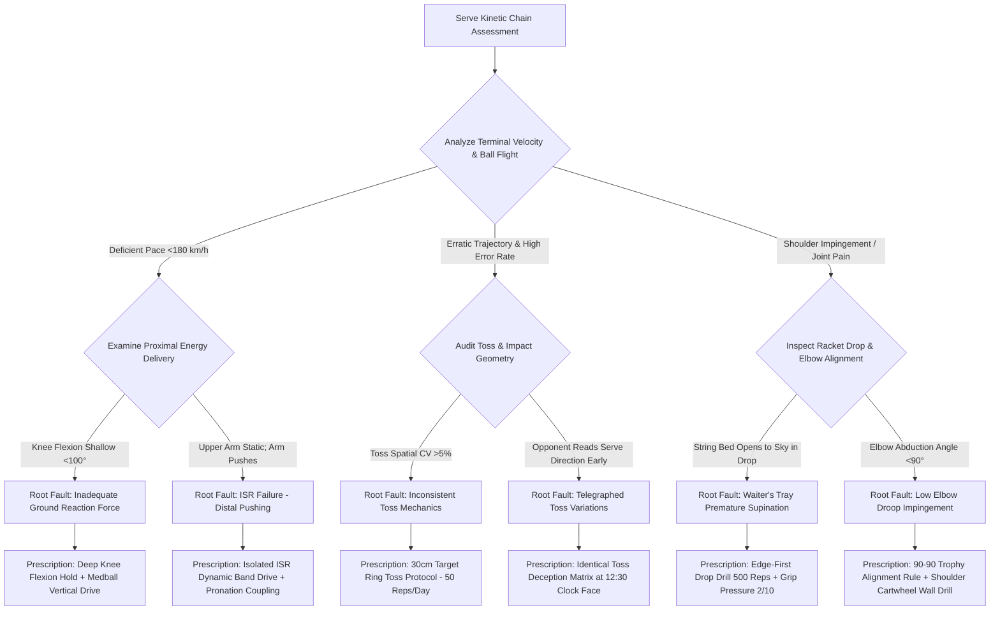

# Article 084: Serving Kinetic Chain: From Leg Drive to Pronation

> **PRO CUE:** Serve = **Energy Transfer Engine** from ground → Racket. GRF → Knee → Hip → Trunk → Shoulder Cartwheel → ISR (54%) → Pronation (15%) → Wrist (10%). Any energy leakage = lost terminal velocity and joint overload. Train "Energy Transfer Efficiency" = build an unreturnable serve weapon.

## 1. Executive Summary & Athletic Intent

The serve represents the **sole closed-skill execution** in tennis—the athlete retains absolute, uninhibited control over initiation tempo, toss spatial trajectory, and kinetic chain sequencing. The modern ATP/WTA professional serve generates **racket head velocities of 200–240+ km/h**, demanding an ultra-precise, **multi-phase proximal-to-distal kinetic chain** capable of channeling **>2,000 Watts** of peak mechanical power within a delivery window of less than 300 ms. This article outlines the comprehensive **8-Stage Serve Biomechanical Model** (grounded in Kovacs & Ellenbecker clinical frameworks and biotensegrity dynamics): (1) Stance & Loading, (2) Trophy Pose & Lateral Pelvic Tilt, (3) Deep Knee Flexion & Leg Drive (Ground Reaction Forces / GRF), (4) Racket Drop & Maximal External Rotation (MER ~170°), (5) Shoulder-Over-Shoulder Cartwheel, (6) Terminal Internal Shoulder Rotation (ISR) & Forearm Pronation (with ISR driving 54% of terminal velocity), (7) The 4 ms Impact Window, and (8) Dynamic Deceleration Landing.

Athletic intent centers upon three uncompromising mechanical imperatives: First, redefine the **serve strictly as an elastic energy transfer chain** originating from ground reaction forces—never an isolated arm-pulling or "ball-pushing" motion. Second, substantiate through kinematic research that **Internal Shoulder Rotation (ISR) contributes 54% of terminal racket speed**, operating as the master engine rather than voluntary forearm pushing or active wrist flicking. Third, deliver an exhaustive **"8-Stage Serve Engine" training curriculum** engineered to systematically link ground reaction force generation to whip-like pronation release with clinical orthopedic safety.

## 2. Biomechanical & Neurological Foundation

### 2.1 8-Stage Serve Biomechanical Model

| Stage | Designation | Primary Biomechanics | Power Contribution | Temporal Window |
|---|---|---|---|---|
| **1** | **Starting Stance & Loading** | Platform vs. Pinpoint stance; Ground anchor; Rotational coiling | Potential energy setup | $T-3000\text{ ms}$ |
| **2** | **Trophy Pose & Pelvic Tilt** | Shoulder line tilt 25–35°; Lateral pelvic tilt; Scapular retraction/loading | Elastic pre-stretch | $T-1500\text{ ms}$ |
| **3** | **Leg Drive & GRF** | Knee flexion 105–120°; Vertical GRF 2.5–3.5×BW | **21%** racket velocity | $T-500\text{ ms} \to T-200\text{ ms}$ |
| **4** | **Racket Drop & MER** | Maximal External Rotation (MER) 170°; Passive arm relaxation | Elastic strain energy storage | $T-200\text{ ms} \to T-100\text{ ms}$ |
| **5** | **Shoulder Cartwheel** | Shoulder-over-shoulder vertical axis rotation | Rotational torque transfer | $T-100\text{ ms} \to T-50\text{ ms}$ |
| **6** | **ISR & Forearm Pronation** | ISR peak 2,400°/s (54%); Pronation (15%); Wrist snap (10%) | **69% combined** | $T-50\text{ ms} \to \text{Impact}$ |
| **7** | **4ms Impact Window** | Triple-joint extension; Contact geometry; Magnus topspin/slice brush | Terminal kinetic delivery | $t = 0 \pm 2\text{ ms}$ |
| **8** | **Dynamic Deceleration** | Balanced unipedal/bipedal landing; Multi-planar eccentric loading | Joint preservation & injury prevention | Post-impact |

### 2.2 Power Contribution Breakdown

```
TERMINAL RACKET VELOCITY EQUATION:
ω_racket = ω_torso + ω_cartwheel + ω_ISR + ω_pronation + ω_wrist

SEGMENTAL CONTRIBUTION (Kovacs 2011, Elliott 2003, Cross 2011):
├── Ground Reaction Forces & Leg Drive  → 21%  (Foundational Base)
├── Shoulder Cartwheel (Vertical Axis)  → Transfer Node (Elastic conduit)
├── Internal Shoulder Rotation (ISR)   → 54%  ⭐ PRIMARY VELOCITY DRIVER
├── Forearm Pronation (Radioulnar)      → 15%  (Secondary Acceleration)
├── Wrist Flexion / Ulnar Deviation     → 10%  (Terminal Calibration)
└── Residual Segmental Acceleration     → Trace
```

**Biomechanical Energy Formulations:**
- **Vertical Ground Reaction Force:** $F_z = m(g + a_z)$ (Target: $2.5\text{–}3.5 \times BW$)
- **Kinetic Energy Propagation:** $E_k = \frac{1}{2} I_{\text{segment}} \omega_{\text{segment}}^2$ transferred proximally to distally
- **Angular Velocity Summation:** $\omega_{\text{impact}} = \sum_{i=1}^n \omega_i$
- **Aerodynamic Trajectory Vector:** Magnus force $\vec{F}_M = S(\vec{\omega} \times \vec{v})$ governing kick serve trajectory bounce deflection

**Key Insight:** The wrist and forearm **DO NOT PUSH** the ball. They act as the terminal tip of a whip, catapulted into space by intense Internal Shoulder Rotation (ISR) followed by natural forearm pronation. Conscious pushing bleeds velocity, disrupts the kinetic sequence, and dramatically elevates the risk of rotator cuff impingement and ulnar collateral ligament sprains.

### 2.3 Platform vs. Pinpoint Stance Biomechanics

| Biomechanical Variable | Platform Stance (Federer, Djokovic, Sampras) | Pinpoint Stance (Shelton, Isner, Roddick) |
|---|---|---|
| **Foot Alignment** | Feet remain static, shoulder-width apart | Rear foot slides forward adjacent to lead foot |
| **Base Stability** | High (superior rotational stability & balance) | Lower (narrower instantaneous base of support) |
| **Vertical GRF ($F_z$)** | 2.5–3.0×BW | **3.5–4.5×BW** (greater vertical jump height) |
| **Horizontal / Rotational Drive ($F_y$)** | Superior rotational hip coiling & drive | Lower horizontal rotational torque |
| **Pelvic Separation Angle** | Easily achieves 45–55° separation | Harder to separate with narrow feet |
| **Toss Disguise Consistency** | Exceptional (identical toss location across all serves) | More variable (complex balance shifts) |
| **Peak Serve Velocity** | 200–220 km/h | **220–240+ km/h** |
| **Landing Impact Shock** | 2.5×BW smooth eccentric dispersion | 3.5–4.5×BW (heightened knee/ankle load) |

## 3. Step-by-Step Technical Execution

### Phase 1: Stance, Loading & Trophy Pose (Stages 1–2)

**Drill 1: "Stance Geometry Lock"**
- **Platform Stance:** Position feet shoulder-width apart, lead foot angled at 45° relative to the baseline, rear foot parallel to the baseline.
- **Pinpoint Stance:** Feet begin shoulder-width apart; upon toss initiation, the rear foot slides forward until the rear toe seats against the lead heel.
- **Weight Distribution:** Shift mass 60/40 (rear/lead) at rest, transitioning smoothly to 50/50 balance during the trophy coil.
- **Dosage:** 20 reps per stance variation. KPI: Hold static trophy balance for 3.0 seconds with zero postural sway.

**Drill 2: "Trophy Pose Alignment Rules"**
- **Shoulder Line Tilt:** Ensure the hitting shoulder drops significantly below the tossing shoulder, producing an upward shoulder tilt angle of 25–35°.
- **Lateral Pelvic Tilt:** Drive the lead hip forward over the baseline while dropping the rear hip, stretching the abdominal wall and psoas complex.
- **Hitting Arm 90-90 Rule:** Maintain 90° of glenohumeral abduction paired with 90° of elbow flexion. The racket face tilts slightly downward toward the court.
- **Tossing Arm Anchor:** Extend the tossing arm vertically along the toss vector without elbow buckling, holding until ball release.
- **Dosage:** 10 isometric holds (5 seconds each) before a full-length mirror. KPI: Verification of 25–35° shoulder tilt and 90-90 elbow geometry via video review.

**Drill 3: "Toss-Placement Consistency Protocol"**
- Place a 30 cm diameter target ring on the court surface positioned 30–45 cm inside the baseline and directly in line with the lead shoulder.
- Release 30 consecutive tosses without striking the ball, letting them rebound on the court surface.
- **Dosage:** 3 sets $\times$ 10 tosses. KPI: Coefficient of Variation ($CV\%$) of landing placement $<5\%$.

### Phase 2: Leg Drive & GRF Generation (Stage 3)

**Drill 4: "Deep Knee Flexion Hold & Explode"**
- From the trophy stance, sink into deep bilateral knee flexion of **105–120°** (120° for Platform stance, 105° for Pinpoint stance).
- Hold the eccentric loading phase at the bottom for an isometric count of 3 seconds to potentiate stretch-reflex mechanisms.
- Drive explosively upward into triple extension (ankle plantarflexion, knee extension, hip thrust).
- **Dosage:** 3 sets $\times$ 8 reps. Pro cue: *"Sink deep — Store the coil — Explode skyward."*

**Drill 5: "Vertical Jump Serve Transfer (Unloaded)"**
- Execute the full serve loading sequence without a racket in hand.
- From deep knee flexion, channel maximum vertical Ground Reaction Force ($F_z$), driving the body straight up into the air.
- Emphasize vertical displacement over forward leaping; maintain core stability and land softly in athletic balance.
- **Dosage:** 3 sets $\times$ 6 reps. KPI: Vertical jump height of 35–45 cm (Platform) or 50–65 cm (Pinpoint).

**Drill 6: "Medball Vertical Serve Drive"**
- Hold a 3 kg medicine ball with both hands overhead in the trophy coil position.
- Sink into deep knee flexion and violently push off the court, projecting the medball upward and forward into a high backstop or practice net.
- **Dosage:** 3 sets $\times$ 8 reps. KPI: Smooth kinematic coupling of knee extension and anterior hip thrust.

### Phase 3: Racket Drop, MER & Cartwheel (Stages 4–5)

**Drill 7: "Edge-First Drop Drill (Eliminating the Waiter's Tray)"**
- From the trophy position, lower the racket into the drop slot leading **strictly with the top edge of the racket frame**.
- The string bed must remain facing the sideline or back fence; do not allow the strings to open toward the sky.
- Forearm pronation and string face square-up must occur **exclusively after passing the lowest point of the drop**.
- **Dosage:** 20 deliberate slow-motion reps. Pro cue: *"Edge leads down — Arm stays relaxed — Snap occurs up."*

**Drill 8: "Maximal External Rotation (MER 170°) Dynamic Feel"**
- From the trophy posture, execute an aggressive vertical leg drive while deliberately keeping the hitting arm completely unweighted and passive.
- As the trunk ascends, the inertia of the racket forces the shoulder into **Maximal External Rotation ($\ge 160\text{–}170^\circ$)**, stretching the subscapularis and pectoralis major.
- **Dosage:** 15 reps. KPI: High-speed video confirmation of racket tip pointing straight down with MER $\ge 160^\circ$.

**Drill 9: "Shoulder-Over-Shoulder Cartwheel Wall Drill"**
- Stand laterally adjacent to a wall with the hitting arm raised and lead shoulder tilted upward.
- Initiate the upward strike by pulling the tossing shoulder down toward the ribs while driving the hitting shoulder vertically over it.
- Reinforces thoracic lateral flexion and scapular upward rotation along a vertical cartwheel plane.
- **Dosage:** 15 reps per side.

### Phase 4: ISR & Forearm Pronation - The 69% Engine (Stage 6)

**Drill 10: "Isolated ISR Dynamic Band Drive"**
- Anchor a resistance band at hip height. Grasp the handle in a 90-90 shoulder orientation replicating the racket drop slot.
- Keep the wrist and elbow locked in place; **rotate the humerus internally (ISR) with maximal acceleration**.
- **Dosage:** 3 sets $\times$ 15 reps at peak velocity. KPI: Peak angular speed targeting 2,400°/s; electromyographic firing of the subscapularis and pectoralis major.

**Drill 11: "Forearm Pronation Isolation Snap"**
- Fix the upper arm statically overhead. Transition the forearm from neutral alignment into **abrupt, explosive pronation** (palm turning rapidly from inward to outward).
- Eliminate any active wrist flexion or pulling down of the elbow.
- **Dosage:** 3 sets $\times$ 20 reps. Pro cue: *"Rotate the forearm radius — Keep the wrist joint quiet."*

**Drill 12: "ISR + Pronation Kinematic Coupling"**
- Shadow swing from the full MER drop slot into terminal contact.
- Sequence the delivery strictly: **ISR initiates and drives the upper arm upward; forearm pronation unwinds immediately afterward** through the contact zone.
- Finish high with the racket face pointing toward the lateral back fence.
- **Dosage:** 30 reps. High-speed video confirmation: ISR peak angular velocity precedes peak pronation velocity by 15–20 ms.

### Phase 5: The 4 ms Impact Window & Deceleration (Stages 7–8)

**Drill 13: "4ms Impact Window Contact Calibration"**
- Execute live serves into designated 1x1 meter target zones within the service box.
- Calibrate the string face angle at the precise instant of impact ($t = 0 \pm 2\text{ ms}$):
  - **Flat Serve:** Racket face orthogonal ($90^\circ$) to the target line, pronating straight through.
  - **Slice Serve:** Racket face angled 10–15° laterally, brushing around the right quadrant (3 o'clock).
  - **Kick Serve:** Racket face angled 5–10° downward, brushing from 7 o'clock to 1 o'clock upward and outward.
- **Dosage:** 30 serves (10 Flat, 10 Slice, 10 Kick). KPI: Target accuracy $\ge 70\%$ at match pace.

**Drill 14: "Dynamic Deceleration Landing Protocol"**
- Following ball departure, dissipate kinetic energy through controlled, balanced landing mechanics.
- **Platform Stance:** Lead foot lands inside the baseline first, flexing the knee eccentrically to absorb $2.5\times BW$ while the rear leg kicks back as a counterbalance.
- **Pinpoint Stance:** Both feet absorb ground reaction forces in tight succession with deeper knee flexion.
- **Dosage:** 20 live serves. KPI: 100% stable landings without forward stumbling or lateral ankle roll.

### Phase 6: Serve Variety Integration & Tactical Pairing

**Drill 15: "Identical Toss Deception Matrix"**
- Deliver Flat, Slice, and Kick serves from an **identical toss spatial coordinate window** (12:30–1:00 clock face position).
- Variations are generated exclusively via swing path vectors and pronation angles at contact, denying the returner pre-impact visual cues.
- **Dosage:** 45 serves (15 of each variety randomized). KPI: Opponent return visual prediction error rate $>80\%$.

**Drill 16: "Serve +1 Tactical Integration"**
- **Pattern A (Wide Serve):** Serve Wide to Deuce court $\to$ Forehand inside-out drive into open court.
- **Pattern B (T-Serve):** Serve down the "T" $\to$ Forehand inside-in blast or penetrating approach shot.
- **Pattern C (Body Jam):** Heavy body serve $\to$ Mid-court swinging volley or drive punch.
- **Dosage:** 20 sets of Serve +1 combinations. KPI: Pattern execution success rate $>80\%$.

## 4. Performance Metrics & Training Dosage

| Performance Metric | Developing | Proficient | Advanced | Elite (ATP / WTA Tour) |
|---|---|---|---|---|
| **1st Serve Peak Velocity** | $<160\text{ km/h}$ | 160–190 km/h | 190–220 km/h | **220–240+ km/h** |
| **1st Serve In-Percentage** | $<50\%$ | 50–60% | 60–70% | **$>70\%$** |
| **ISR Peak Angular Velocity** | $<1,500^\circ/\text{s}$ | 1,500–2,000°/s | 2,000–2,400°/s | **$>2,400^\circ/\text{s}$** |
| **Max External Rotation (MER)** | $<140^\circ$ | 140–160° | 160–170° | **$170^\circ$** |
| **Leg Drive Vertical GRF ($F_z$)** | $<2.0\times\text{BW}$ | 2.0–2.5×BW | 2.5–3.0×BW | **$3.0\text{–}4.0\times\text{BW}$** |
| **Toss Placement CV%** | $>10\%$ | 5–10% | 3–5% | **$<3\%$** |
| **Identical Toss Deception** | $<50\%$ unread | 50–70% | 70–85% | **$>85\%$ unread** |
| **Serve +1 Pattern Conversion** | $<50\%$ | 50–65% | 65–80% | **$>80\%$** |
| **Dynamic Landing Balance Rate**| $<80\%$ | 80–90% | 90–95% | **$100\%$ perfect balance** |

### Weekly Periodized Training Dosage

- **Stance Geometry & Trophy Alignment:** $3\times/\text{week}$, 15 minutes (Drills 1–3).
- **Leg Drive & Vertical GRF Generation:** $2\times/\text{week}$, 15 minutes (Drills 4–6).
- **Racket Drop, MER & Cartwheel Dynamics:** $3\times/\text{week}$, 20 minutes (Drills 7–9).
- **ISR & Pronation Velocity Engine:** $3\times/\text{week}$, 20 minutes (Drills 10–12).
- **Impact Window Geometry & Deceleration:** $2\times/\text{week}$, 15 minutes (Drills 13–14).
- **Serve Varieties & Tactical +1 Patterns:** $2\times/\text{week}$, 20 minutes (Drills 15–16).
- **Total Dedicated Volume:** $\sim 105\text{ minutes/week}$ of serve-specific kinetic chain conditioning.

## 5. Errors, Causes & Correction Protocols

| Observable Technical Defect | Biomechanical Root Cause | Prescriptive Correction Protocol |
|---|---|---|
| **"Waiter's Tray Syndrome" (String bed opens skyward early)** | Premature forearm supination during backswing; active arm lifting | Edge-First Drop Drill (500+ reps); Cue: *"Lead with the frame edge down, uncoil up"* |
| **"Premature toss before knee coiling; low vertical jump"** | Faulty kinetic timing sequence; rushing the arm motion | Hold-and-Drop Drill: Coil knees fully $\to$ Pause 1.0 s $\to$ Release toss $\to$ Explode upward |
| **"Hitting elbow drops below shoulder plane (<90°)"** | Deficient scapular upward rotation; weak serratus anterior/rotator cuff | 90-90 Elbow Alignment Check; Verify shoulder line tilt; Anchor arm on high shelf during trophy |
| **"Weak serve velocity; player pushes with forearm and wrist"** | Absence of ISR; athlete relies on voluntary distal arm contraction | Isolated ISR Band Drive; Cue: *"Whip the upper arm internally — Never push with the hand"* |
| **"Early pronation occurring prior to peak ISR"** | Inverted proximal-to-distal sequencing; forearm outruns shoulder rotation | ISR + Pronation Coupling Drill; High-speed video sequencing audit |
| **"High toss variance ($CV\% > 10\%$)"** | Releasing ball from flicking fingers or collapsing wrist joint | Toss-only target practice (50 balls/day); Straight-arm release from the shoulder; 30 cm ground target |
| **"Telegraphed serve varieties (Distinct toss locations)"** | Adjusting toss position instead of modulating swing path and face angle | Identical Toss Deception Matrix; Lock toss at 12:30 clock position for flat, slice, and kick |
| **"Stumbling forward or lateral knee collapse upon landing"** | Uncontrolled kinetic dissipation; insufficient eccentric quad braking | Dynamic Deceleration Landing Drill; Unilateral eccentric single-leg drop landings off a 20 cm box |

## 6. Diagnostic Diagram & Decision Flow



## 7. Video Demonstration & Technical Analysis

<div class="video-container" style="position:relative;padding-bottom:56.25%;height:0;overflow:hidden;border-radius:12px;">
  <iframe src="https://www.youtube-nocookie.com/embed/VIDEO_ID_PLACEHOLDER"
          style="position:absolute;top:0;left:0;width:100%;height:100%;border:0;"
          allow="accelerometer; autoplay; clipboard-write; encrypted-media; gyroscope; picture-in-picture"
          allowfullscreen
          title="Serving Kinetic Chain: From Leg Drive to Pronation — Technical Biomechanical Analysis"></iframe>
</div>

*Recommended high-speed video analysis protocols: 1,000 FPS ultra-high-speed capture isolating the 15 ms transition from Maximal External Rotation (MER) through impact to forearm pronation; Force plate kinetic analysis contrasting Platform vs. Pinpoint vertical Ground Reaction Forces ($F_z$); Biomechanical overlay tracking the 90-90 trophy angle and 25–35° shoulder tilt; Pro kinetic comparison (Ben Shelton vs. Roger Federer vs. Novak Djokovic); Kinetic energy transfer modeling visualizing energy flow from ground contact to racket tip.*

## 8. Cross-Domain Synergy & Multi-Pillar Integration

- **With Split Step Activation & Return Dynamics (Article 083):** When facing an elite 120+ mph serve, the returner has under 400 ms total flight time. Precise split-step landing synchronization is the foundational survival prerequisite for neutralizing big serves.
- **With Contact Point Geometry (Article 082):** The serve represents the ultimate expression of **maximal long-axis extension geometry**. Millimeter toss placement dictates whether contact occurs within the anatomically safe impact corridor or generates dangerous lumbar hyperextension.
- **With Modern Forehand 5-Phase Model (Article 081):** Both engines share identical **Proximal-to-Distal Sequencing principles**. The abrupt pelvic brake on the forehand mirrors the rapid thoracic arrest and shoulder cartwheel transfer on the serve.
- **With One-Handed Backhand Mechanics (Article 085):** The rotational shoulder coiling on the 1HBH directly mirrors the vertical cartwheel alignment on the serve, both requiring uncompromising scapular stabilization.
- **With Neural Drive Synchronization (Article 069):** Stages 3 through 6 constitute a **maximal motor unit rate coding window**. Transitioning from leg drive into ISR within 150 ms requires intense central nervous system motor unit recruitment.
- **With Neuromuscular Junction Efficiency (Article 078):** Generating an ISR velocity of 2,400°/s is an extreme test of acetylcholine clearance and neuromuscular junction fidelity. NMJ fatigue directly precipitates velocity loss in late sets.
- **With Fatigue & Recovery Dynamics (Articles 054, 061):** Severe serve velocity drops in sets 3, 4, and 5 reflect **kinetic chain fatigue leaks**. Structured inter-point autonomic resets preserve kinetic sequencing integrity under high systemic fatigue.

## 9. Self-Assessment Rubric

| Diagnostic Checkpoint | Level 1 (Arm Pusher) | Level 2 (Partial Kinetic Chain) | Level 3 (Functional Chain) | Level 4 (ATP Kinetic Mastery) |
|---|---|---|---|---|
| **1st Serve Velocity** | $<160\text{ km/h}$ | 160–190 km/h | 190–220 km/h | **220–240+ km/h** |
| **Peak ISR Angular Velocity** | $<1,500^\circ/\text{s}$ | 1,500–2,000°/s | 2,000–2,400°/s | **$>2,400^\circ/\text{s}$** |
| **Leg Drive Vertical GRF** | $<2.0\times\text{BW}$ | 2.0–2.5×BW | 2.5–3.0×BW | **$3.0\text{–}4.0\times\text{BW}$** |
| **Toss Consistency (CV%)** | $>10\%$ | 5–10% | 3–5% | **$<3\%$** |
| **Max External Rotation (MER)**| $<140^\circ$ | 140–160° | 160–170° | **$170^\circ$** |
| **Kinetic Sequence Order** | Pronation precedes ISR | Simultaneous/Mixed | ISR leads majority | **ISR strictly leads pronation** |
| **Serve Variety Deception** | $<50\%$ unread | 50–70% | 70–85% | **$>85\%$ unread** |
| **Dynamic Landing Balance** | $<80\%$ | 80–90% | 90–95% | **$100\%$ balanced recovery** |

**Diagnostic Scoring Key:**
- **8–14 Points:** Critical kinetic chain failure; dominant arm pushing; elevated orthopedic risk for rotator cuff and labral pathology.
- **15–20 Points:** Partial kinetic flow with substantial energy leaks; inconsistent leg drive and premature pronation.
- **21–26 Points:** Functional kinetic chain; solid velocity and spin generation; minor mechanical breakdown under competitive stress.
- **27–32 Points:** Tour-level ATP biomechanical mastery; seamless proximal-to-distal power transfer and exceptional disguise.

## 10. Printable Practice Card (Pocket Drill Card)

```
┌────────────────────────────────────────────────────────────────────────┐
│            POCKET DRILL CARD: SERVING KINETIC CHAIN ENGINE             │
│   Target: 1st Serve >200 km/h, ISR >2,000°/s, Toss CV <5%, GRF >2.5×BW │
├────────────────────────────────────────────────────────────────────────┤
│ BLOCK A: Dynamic Activation & Spatial Calibration (5 Min)              │
│ • Trophy Pose Mirror Holds: 10 reps (5s hold; check 90-90 & 25-35° tilt)│
│ • Toss Consistency Calibration: 15 tosses into 30cm ring target        │
│ • Focus Cue: "Trophy locked — Pinpoint toss — Foundation established"  │
├────────────────────────────────────────────────────────────────────────┤
│ BLOCK B: Ground Reaction Force & Elastic Loading (20 Min)              │
│ • Deep Knee Flexion Hold & Explode: 3 sets × 8 reps (105-120° flex)    │
│ • Medball Vertical Serve Drive: 3 sets × 8 reps                        │
│ • Edge-First Drop Drill: 20 reps (Neutralize Waiter's Tray)            │
│ • Maximal External Rotation (MER) Feel: 15 reps (MER ≥160°)            │
│ • Focus Cue: "Sink deep — Explode upward — Frame edge leads down"      │
├────────────────────────────────────────────────────────────────────────┤
│ BLOCK C: Rotational Acceleration & Whip Release (20 Min)               │
│ • Isolated ISR Band Drive: 3 sets × 15 reps (Peak velocity)            │
│ • Forearm Pronation Isolation Snap: 3 sets × 20 reps                   │
│ • ISR + Pronation Kinematic Coupling: 30 reps                          │
│ • Shoulder Cartwheel Wall Drill: 15 reps per side                      │
│ • Focus Cue: "ISR leads — Forearm follows — Cartwheel over shoulder"   │
├────────────────────────────────────────────────────────────────────────┤
│ BLOCK D: Live Target Delivery & Tactical Pairing (15 Min)              │
│ • 4ms Impact Window Delivery: 30 serves (10 Flat / 10 Slice / 10 Kick) │
│ • Identical Toss Deception Challenge: 45 serves (Randomized delivery)  │
│ • Serve +1 Pattern Execution: 20 repetitions                           │
│ • Focus Cue: "Identical toss — Variable path — Dynamic landing balance"│
├────────────────────────────────────────────────────────────────────────┤
│ FREQUENCY: 4×/week | GATE: 3 consecutive weeks with personal best      │
│ velocity, ISR >2,000°/s, Toss CV <5%, and Deception Rate >70%.         │
└────────────────────────────────────────────────────────────────────────┘
```

---

*Cross-References: Articles 054, 061, 069, 073, 078, 081, 082, 083, 085. Pillar III: Stroke Mechanics & Ball Striking — TennisKB 200 Articles.*
