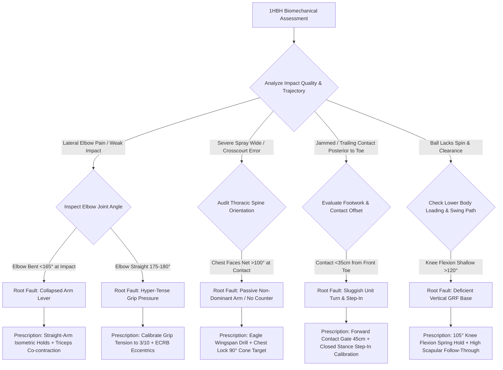

# Article 085: One-Handed Backhand: The Saber Extension and Shoulder Lock

> **PRO CUE:** 1HBH = **The Saber Extension** (Straight-Arm Lever). Lock shoulders 90° to the side fence → Hitting arm transforms into a rigid column → Firm wrist → Opposite arm counter-extension (wingspan counterbalance). Never buckle the elbow at impact. Train the "Saber Extension" = effortless velocity + laser precision + lifelong elbow health.

## 1. Executive Summary & Athletic Intent

The one-handed backhand (1HBH) represents tennis's most refined "mirror kinetic chain," requiring extraordinary segmental discipline: **Extreme shoulder-hip separation ($110^\circ+$) $\to$ Dynamic closed-stance step-in $\to$ Deep knee flexion spring ($105^\circ$) $\to$ Chest-locked impact geometry (thoracic spine $90^\circ$ to the side fence) $\to$ Straight-arm rigid lever whip $\to$ High scapular wrap follow-through**. Champions such as Stan Wawrinka and Roger Federer have demonstrated that an optimized 1HBH generates **ball velocities exceeding 160 km/h (100 mph) and spin rates surpassing 3,400 RPM** through pure rotational torque conversion. This article details the **1HBH 5-Phase Biomechanical Model**, the **Straight-Arm Lever Principle**, **Chest-Locked Impact Geometry**, and the complete **"Saber Extension Training Protocol"**.

Athletic intent is anchored across three technical objectives: First, define the **1HBH as a Straight-Arm Rigid Column** rather than a loose distal arm swing—locking the elbow at impact ensures a 100% efficient transfer of momentum from the torso to the racket head. Second, establish the vital role of the **non-dominant arm (Eagle Wingspan) as an active counter-balance** that anchors the thoracic spine and prevents premature chest opening (which pulls the ball wide). Third, provide the **"Saber Extension" drill progression** to systematically forge a repeatable, bulletproof straight-arm lever from coiling preparation through terminal deceleration.

## 2. Biomechanical & Neurological Foundation

### 2.1 1HBH 5-Phase Biomechanical Model

| Phase | Technical Designation | Primary Biomechanics | KPI |
|---|---|---|---|
| **1** | **Deep Shoulder Coil (Preparation)** | Shoulders rotate 110–115° relative to pelvis at 40° $\to$ **X-Factor Separation 70–75°**; Scapular retraction anchor | Separation $\ge 70^\circ$ |
| **2** | **Closed Stance Step-In** | Lead foot strides across the body line; 100% dynamic weight transfer onto the front foot | Step-in distance $\ge 50\text{ cm}$ |
| **3** | **Deep Knee Flexion Spring** | Lead knee flexes deeply to **$105^\circ$** (Wawrinka standard); Vertical GRF of 2.8×BW generated | Lead knee flexion $\le 105^\circ$ |
| **4** | **Chest-Locked Impact** | Thoracic spine locked **$90^\circ$ to side fence**; Straight arm column positioned 45 cm anterior to lead hip | Thoracic angle $90^\circ \pm 5^\circ$; Contact offset 45 cm |
| **5** | **High Scapular Follow-Through** | Scapular protraction and elevation; Opposite arm full posterior counter-extension; Racket finishes above shoulder | Finish elevated above eye level |

### 2.2 Straight-Arm Lever Principle

```
STRAIGHT-ARM RIGID COLUMN:
┌─────────────────────────────────────────────────────────────────────────┐
│  Shoulder (Fulcrum) ──► Straight Arm (Rigid Lever) ──► Racket Head (Load)│
│       │                                                                 │
│       ├──► Elbow Fully Extended (175–180°) — ZERO BEND AT IMPACT        │
│       ├──► Triceps 100% Co-contraction 100 ms PRE-IMPACT                │
│       ├──► Wrist Extended 10–15° (Firm, stabilized, no active flick)    │
│       └──► Forearm Pronation Minimal (Orthogonal string bed delivery)   │
└─────────────────────────────────────────────────────────────────────────┘

KINETIC MOMENTUM PROPAGATION:
Torso Uncoiling Torque ──► Rigid Straight Arm ──► Racket Head Linear Speed
     │
     ├──► IF ELBOW COLLAPSES (Bent): Energy bleeds into joint capsule ──► 30–40% Power Loss
     └──► STRAIGHT ARM: 100% Torque transmission ──► Maximal Kinetic Efficiency
```

**Mechanical Consequences of Elbow Angle at Impact:**

| Elbow Angle at Impact | Kinetic Transfer Efficiency | Orthopedic Shear / Injury Risk |
|---|---|---|
| **175–180° (Straight Saber)** | **100%** | Low (Force distributed across large muscle groups) |
| **150–170° (Slight Flexion)** | 85–90% | Moderate (Micro-tears in Extensor Carpi Radialis Brevis / ECRB) |
| **120–150° (Pronounced Bend)** | 60–75% | **High (Lateral Epicondylalgia / Tennis Elbow)** |
| **<120° (Collapsed Joint)** | <50% | **Critical (Acute elbow shear and joint capsule degradation)** |

### 2.3 Chest-Locked Impact Geometry

```
IMPACT ZONE GEOMETRY (Wawrinka / Federer Standard):
┌─────────────────────────────────────────────────────────────────────────┐
│  Thoracic Spine: Aligned 90° to the side fence (Chest faces sideline)   │
│  Contact Point: 45 cm in front of the lead toe                          │
│  Racket Face: Perpendicular to incoming ball trajectory (±3°)           │
│  Opposite Arm: Full posterior horizontal abduction (Eagle Wingspan)     │
│  Lead Hip: Cleared at 45° toward the net                                │
│  Lead Knee: 105° deep eccentric compression                             │
└─────────────────────────────────────────────────────────────────────────┘

CORE AXIOM: "The chest remains locked so the arm can whip independently."
     │
     ├──► Premature Chest Opening: Racket drags behind ──► Severe cross-court spray / framing
     ├──► Chest Locked at 90°: Torso serves as rigid anchor ──► Laser-guided directionality
     └──► Opposite Arm Wingspan: Symmetrical rearward extension stabilizes shoulder girdle
```

## 3. Step-by-Step Technical Execution

### Phase 1: Deep Shoulder Coil & Scapular Anchor (Phase 1)

**Drill 1: "110° Separation Wall Drill"**
- Stand with your back lightly contacting a wall in a closed stance with the lead leg crossed over.
- Rotate the shoulder girdle through **110–115°** while firmly restricting pelvic rotation to 40° (keep the rear knee anchored without collapsing inward).
- Actively squeeze the rear scapula into **intense scapular retraction and depression**.
- **Dosage:** 10 reps with a 3.0-second isometric hold. KPI: Goniometer or video audit confirming $\ge 70^\circ$ separation angle.

**Drill 2: "Scapular Anchor Resistance Band"**
- Anchor a resistance band at chest level out in front. Grasp the handles with both hands.
- Initiate the 1HBH takeback exclusively through **scapular retraction and thoracic rotation**, resisting any isolated elbow pulling.
- Somatosensory target: Distinct engagement of the rhomboids, lower trapezius, and latissimus dorsi.
- **Dosage:** 3 sets $\times$ 15 reps. Pro cue: *"Retract the shoulder blade $\to$ Drop the anchor $\to$ Coil deep."*

**Drill 3: "Shadow Coil Metronome Drill"**
- Set a metronome to 1.0 Hz (60 BPM). On Beat 1: Establish ready position and initiate cross-step. On Beat 2: Lock the complete 110° shoulder coil.
- Form checkpoints: Shoulders $\ge 110^\circ$, Hips $\le 40^\circ$, Scapula retracted, Head completely static behind the shoulder line.
- Progression: Advance metronome pacing from 1.0 Hz $\to$ 1.5 Hz $\to$ 2.0 Hz.

### Phase 2: Closed Stance Step-In & Knee Spring (Phases 2–3)

**Drill 4: "Closed Stance Step-In Distance Calibration"**
- Execute 1HBH shadow footwork along a marked baseline grid.
- Step the lead foot aggressively across the sagittal plane by **$\ge 50\text{ cm}$** into an unmistakable closed stance.
- Transition **100% of body weight onto the lead foot** at the instant of planting, allowing the lead hip to rotate open to 45°.
- **Dosage:** 20 reps. KPI: Step-in cross distance $\ge 50\text{ cm}$ with instantaneous unipedal stability.

**Drill 5: "105° Knee Flexion Spring Hold"**
- At the moment of lead foot planting, sink into a deep lead knee flexion of **$105^\circ$** (replicating the extreme low-center-of-gravity loading of Wawrinka).
- Hold the bottom position for an isometric count of 2.0 seconds, then drive upward explosively into vertical extension.
- Conditions the quadriceps to deliver **2.8×BW vertical Ground Reaction Forces (GRF)** into the uncoiling stroke.
- **Dosage:** 3 sets $\times$ 8 reps. Pro cue: *"Drop to 105° — Absorb and store — Explode vertically."*

**Drill 6: "Medball 1HBH Rotational Drive"**
- Grasp a 3 kg medicine ball with both hands in the closed-stance 1HBH preparation posture with extended arms.
- Coil to 110° $\to$ Step in $\ge 50\text{ cm}$ $\to$ Drop into 105° knee flexion $\to$ Catapult the medball down the line.
- Integrates the entire lower-to-upper body kinetic chain.
- **Dosage:** 3 sets $\times$ 8 reps per side.

### Phase 3: Straight-Arm Lever & Chest Lock (Phase 4)

**Drill 7: "Straight-Arm Lock Isometric Hold"**
- Hold a racket or light dumbbell out in front at the designated impact location (45 cm anterior to the lead hip).
- Contract the triceps at 100% voluntary effort to **fully lock the elbow joint to 175–180°**.
- Maintain the wrist in 10–15° of extension; resist flexion or supination.
- **Dosage:** 5 sets $\times$ 10-second isometric holds. Sensory target: The hitting arm feels like an unyielding steel column.

**Drill 8: "Forward Contact Gate 45cm"**
- Place a marker cone exactly **45 cm anterior to the lead toe** along the ball flight path.
- During hand-fed and live feeds, the player must strike the ball **STRICTLY IN FRONT of the marker cone**.
- Trains the athlete to step in decisively and eradicate the common amateur flaw of trailing, jammed contact.
- **Dosage:** 30 balls. KPI: $\ge 90\%$ of contact events confirmed anterior to the marker gate via video audit.

**Drill 9: "Chest Lock 90° - Target Cone Drill"**
- Place a visual marker directly facing the side fence ($90^\circ$ perpendicular to the baseline).
- Through the entire impact zone, the athlete's **sternum must remain pointing squarely at this side marker**.
- Prohibit any premature thoracic uncoiling toward the net prior to ball departure.
- **Dosage:** 20 reps. Pro cue: *"Chest locked to the fence — Arm whips freely down the line."*

**Drill 10: "Eagle Wingspan - Opposite Arm Counter-Extension"**
- At the exact moment of ball impact, drive the non-dominant arm backward into maximal horizontal abduction and extension.
- Creates an exact symmetrical mirror: While the hitting arm whips forward and upward, the non-dominant arm drives rearward and downward.
- **Dosage:** 20 reps. KPI: High-speed video confirmation of simultaneous opposing arm extension stabilizing the thoracic spine.

### Phase 4: High Scapular Follow-Through (Phase 5)

**Drill 11: "High Finish Scapular Protraction"**
- Following ball departure, continue the upward-and-forward swing path into pronounced **scapular elevation and upward rotation**.
- The racket head must finish elevated well above eye level with the edge leading, while the hitting shoulder blade glides smoothly around the ribcage.
- Neutralizes the old classical flat wrap around the waist.
- **Dosage:** 20 shadow repetitions.

**Drill 12: "Straight-Arm Wall Press & Release"**
- Stand 45 cm from a solid wall in the contact position with the arm fully locked.
- Press the string bed into the wall isometrically using hip and shoulder torque for 3.0 seconds, then immediately release the pressure and sweep up into the high finish.
- Reinforces the neurological sensation of structural rigidity through contact.
- **Dosage:** 15 reps.

### Phase 5: Live Ball Integration & Varieties

**Drill 13: "1HBH Randomized Feed - Geometry Compliance"**
- Coach delivers randomized feeds across deep, short, wide, high, and low trajectories.
- The player must execute every stroke while satisfying the mandatory geometric constraints: contact 45 cm forward, chest locked at 90°, elbow fully extended (175–180°).
- **Dosage:** 40 balls. KPI: Mechanical compliance score $>85\%$.

**Drill 14: "1HBH Knife Slice Mechanics"**
- Transition to Continental grip in a deep closed stance.
- Elevate the contact point slightly above topspin height; open the racket face 10–15°.
- Carve high-to-low while maintaining a straight hitting arm and full rearward wingspan counter-extension.
- **Dosage:** 20 slice repetitions. Target: Low skidding trajectory clearing the net by $<30\text{ cm}$.

**Drill 15: "High Ball 1HBH Counter-Drive"**
- Feed heavy topspin balls that bounce to shoulder and head height.
- Adjust vertical footwork by executing an aggressive hop or jumping off the lead leg to preserve the straight-arm lever at an elevated contact window.
- **Dosage:** 20 reps. KPI: Zero elbow breakdown (angle remains $\ge 165^\circ$) on high contacts.

## 4. Performance Metrics & Training Dosage

| Performance Metric | Developing | Proficient | Advanced | Elite (ATP Tour 1HBH) |
|---|---|---|---|---|
| **Shoulder-Hip Separation Angle** | $<50^\circ$ | 50–65° | 65–70° | **70–75° (110°+ shoulder coil)** |
| **Elbow Angle at Impact** | $<150^\circ$ (Bent) | 150–165° | 165–175° | **175–180° (Straight Saber)** |
| **Thoracic Chest Lock Angle** | $>110^\circ$ (Chest opens) | 95–110° | 90–95° | **90° $\pm 3^\circ$ (Locked to fence)** |
| **Contact Distance Ahead of Hip** | $<35\text{ cm}$ (Late) | 35–42 cm | 42–45 cm | **$45\text{ cm} \pm 3\text{ cm}$** |
| **Lead Knee Flexion Depth** | $>120^\circ$ (Stiff) | 110–120° | 105–110° | **$105^\circ$ (Wawrinka standard)** |
| **Opposite Arm Counter-Extension**| Passive / Dangling | Inconsistent | Full extension | **Synchronous Eagle Wingspan** |
| **Follow-Through Elevation** | Waist level | Shoulder level | Chin level | **Elevated high above head** |
| **Fresh Geometry Compliance** | $<60\%$ | 60–80% | 80–90% | **$>95\%$** |
| **Topspin Drive Spin Rate** | $<2,000\text{ RPM}$ | 2,000–2,500 RPM | 2,500–3,000 RPM | **3,000–3,500+ RPM** |

### Weekly Periodized Training Dosage

- **Shoulder Coil & Scapular Anchoring:** $3\times/\text{week}$, 15 minutes (Drills 1–3).
- **Closed-Stance Step-In & Knee Spring:** $2\times/\text{week}$, 15 minutes (Drills 4–6).
- **Straight-Arm Lever & Chest Lock Conditioning:** $3\times/\text{week}$, 20 minutes (Drills 7–10).
- **High Follow-Through & Deceleration:** $2\times/\text{week}$, 10 minutes (Drills 11–12).
- **Live Ball Integration & High-Ball Counters:** $2\times/\text{week}$, 30 minutes (Drills 13–15).
- **Total Dedicated Volume:** $\sim 90\text{ minutes/week}$ of 1HBH-specific mechanical conditioning.

## 5. Errors, Causes & Correction Protocols

| Observable Technical Defect | Biomechanical Root Cause | Prescriptive Correction Protocol |
|---|---|---|
| **"Elbow collapses / bends at impact (<150°)"** | Weak triceps co-contraction; misconception that arm must "swing" independently | Straight-Arm Lock Isometric (500+ reps); Triceps eccentric overload; Pro cue: *"Lock the elbow like a steel sword"* |
| **"Chest uncoils prematurely toward the net"** | Passive non-dominant arm; absent posterior scapular counter-balance | Eagle Wingspan Counter-Extension Drill; Band-resisted rearward drive; Pro cue: *"Chest locked to fence"* |
| **"Chronically late contact trailing the body"** | Delayed unit turn; sluggish cross-over step; passive footwork | Forward Contact Gate 45cm Drill; Closed-Stance Step-In Distance Calibration; Metronome preparation |
| **"Flat trajectory with weak topspin (<2,000 RPM)"** | Flattened swing path; failure to drop racket head below the ball plane | Deep knee flexion spring ($105^\circ$); Brush upward from 6 to 12 o'clock; High scapular wrap finish |
| **"Non-dominant arm hangs passively at the hip"** | Neurological omission of bilateral counter-balancing mechanisms | Eagle Wingspan Drills with weighted ball in non-dominant hand; Pro cue: *"Opposite arm is your anchor"* |
| **"Low, flat finish around the waist (Classical flaw)"** | Obsolete mechanical habit; deficient scapular upward rotation | High Finish Scapular Protraction Drill; Target finish above eye level; Video audit |
| **"Lateral elbow pain (Tennis Elbow / ECRB strain)"** | Contacting the ball with a bent elbow, forcing the forearm extensor tendons to absorb impact shock | Restore 175–180° straight-arm geometry; Calibrate grip tension to 3/10; Eccentric wrist extensor loading |
| **"Complete technical collapse on high kick bounces"** | Failure to adjust contact elevation; attempting to bend the elbow to reach high balls | High Ball 1HBH Counter Drill; Dynamic hopping step-in to elevate strike zone; Scissor-hop transfer |

## 6. Diagnostic Diagram & Decision Flow



## 7. Video Demonstration & Technical Analysis

<div class="video-container" style="position:relative;padding-bottom:56.25%;height:0;overflow:hidden;border-radius:12px;">
  <iframe src="https://www.youtube-nocookie.com/embed/VIDEO_ID_PLACEHOLDER"
          style="position:absolute;top:0;left:0;width:100%;height:100%;border:0;"
          allow="accelerometer; autoplay; clipboard-write; encrypted-media; gyroscope; picture-in-picture"
          allowfullscreen
          title="One-Handed Backhand: The Saber Extension and Shoulder Lock — Technical Analysis"></iframe>
</div>

*Recommended high-speed video analysis protocols: 500 FPS capture perpendicular to the baseline verifying 175–180° elbow extension at impact; 3D multi-camera angle measuring thoracic orientation ($90^\circ \pm 3^\circ$) and non-dominant arm counter-extension; Finite-element modeling comparing ECRB tendon strain in bent-elbow vs. straight-elbow impacts; Elite benchmark comparison (Stan Wawrinka vs. Roger Federer vs. Richard Gasquet).*

## 8. Cross-Domain Synergy & Multi-Pillar Integration

- **With Modern Forehand 5-Phase Model (Article 081):** The 1HBH requires an even greater preparatory coil ($110^\circ$ vs. $95^\circ$) due to the mechanical constraints of the closed stance. Both strokes adhere to the uncompromising **straight-arm lever principle** at terminal impact.
- **With Contact Point Geometry (Article 082):** While the open-stance forehand demands an impact point 40 cm in front of the lead hip, the closed-stance 1HBH requires contact **45 cm in front of the lead toe**. Chest-locking serves as the non-negotiable stabilizer of this coordinate plane.
- **With Split Step Activation & Timing (Article 083):** Because the 1HBH demands greater preparatory coil and travel time into a closed stance, **split-step timing must be exceptionally crisp**, landing instantaneously as the opponent initiates forward racket acceleration.
- **With Serving Kinetic Chain (Article 084):** The vertical thoracic mobility required for the serve cartwheel directly mirrors the thoracic rotational isolation needed for the 1HBH chest lock.
- **With Two-Handed Backhand Mechanics (Article 086):** The non-dominant drive on the 2HBH represents the mirror kinematic equivalent of the 1HBH dominant arm extension, sharing identical scapular loading mechanics.
- **With Racket Face Angle Awareness (Article 073):** Stabilizing the string bed on the 1HBH is impossible if the elbow flexes. The straight-arm column is the prerequisite structural foundation for precise somatosensory racket face awareness.
- **With Orthopedic Injury Prevention & ECRB Health (Articles 196, 197):** Hitting a 1HBH with a bent elbow is the **single greatest mechanical etiology of lateral epicondylalgia (Tennis Elbow)**. Maintaining a 175–180° straight arm disperses impact shock into the large core and thoracic musculature, totally sparing the extensor tendons.

## 9. Self-Assessment Rubric

| Diagnostic Checkpoint | Level 1 (Bent-Elbow Amateur) | Level 2 (Transitional) | Level 3 (Functional Saber) | Level 4 (Tour Saber Mastery) |
|---|---|---|---|---|
| **Elbow Angle at Impact** | $<150^\circ$ (Severe bend) | 150–165° | 165–175° | **175–180° (Rigid Saber)** |
| **Shoulder-Hip Separation** | $<50^\circ$ | 50–65° | 65–70° | **70–75° ($110^\circ+$ coil)** |
| **Thoracic Chest Lock** | $>110^\circ$ (Chest open) | 95–110° | 90–95° | **$90^\circ \pm 3^\circ$ (Locked to fence)** |
| **Contact Distance Ahead** | $<35\text{ cm}$ (Late) | 35–42 cm | 42–45 cm | **$45\text{ cm} \pm 3\text{ cm}$** |
| **Opposite Arm Wingspan** | Passive / Dangling | Inconsistent | Near full extension | **Full synchronous counter-extension** |
| **Lead Knee Flexion Depth** | $>120^\circ$ (Erect) | 110–120° | 105–110° | **$105^\circ$ (Deep Wawrinka spring)** |
| **Geometry Compliance Rate** | $<60\%$ | 60–80% | 80–90% | **$>95\%$ across all feeds** |

**Diagnostic Scoring Key:**
- **7–13 Points:** Critical mechanical breakdown; high lateral elbow shear force; immediate transition to static straight-arm wall drills required.
- **14–19 Points:** Significant kinetic leakage; intermittent elbow flexion and premature chest rotation under heavy ball pace.
- **20–25 Points:** Functional Saber mechanics; solid penetrating drive; minor kinematic drift under high fatigue.
- **26–28 Points:** Tour-level 1HBH technical mastery; devastating penetration, explosive topspin, and clinical orthopedic safety.

## 10. Printable Practice Card (Pocket Drill Card)

```
┌────────────────────────────────────────────────────────────────────────┐
│            POCKET DRILL CARD: 1HBH SABER EXTENSION ENGINE              │
│ Target: Elbow 175-180°, Coil ≥70°, Chest Lock 90°, Contact 45cm Ahead  │
├────────────────────────────────────────────────────────────────────────┤
│ BLOCK A: Coiling & Scapular Anchoring (5 Min)                          │
│ • 110° Separation Wall Drill: 10 reps (3s hold; check 70°+ separation) │
│ • Scapular Anchor Resistance Band: 15 reps                             │
│ • Focus Cue: "Coil deep 110° — Pin the shoulder blade — Sword loaded"  │
├────────────────────────────────────────────────────────────────────────┤
│ BLOCK B: Stance Step-In & Knee Loading (20 Min)                        │
│ • Closed Stance Step-In (≥50cm cross): 20 reps                         │
│ • 105° Knee Flexion Spring Hold: 3 sets × 8 reps                       │
│ • Straight-Arm Lock Isometric Hold: 5 sets × 10s (Triceps 100%)        │
│ • Focus Cue: "Cross-over step — Sink to 105° — Steel-rigid arm column" │
├────────────────────────────────────────────────────────────────────────┤
│ BLOCK C: Kinetic Delivery & Chest Lock Stabilization (20 Min)          │
│ • Chest Lock 90° Cone Target: 20 reps                                  │
│ • Eagle Wingspan Opposite Arm Counter-Extension: 20 reps               │
│ • Forward Contact Gate 45cm: 30 live feeds                             │
│ • Focus Cue: "Lock chest to the fence — Wingspan anchor — Meet at 45cm"│
├────────────────────────────────────────────────────────────────────────┤
│ BLOCK D: High-Trajectory Finish & Dynamic Integration (15 Min)         │
│ • High Finish Scapular Protraction: 15 shadow swings                   │
│ • Straight-Arm Wall Press & Release: 15 reps                           │
│ • Randomized Feed Geometry Compliance: 40 balls (Target: >85%)         │
│ • Focus Cue: "Independent whip — Finish high above eyes — Pure saber"  │
├────────────────────────────────────────────────────────────────────────┤
│ FREQUENCY: 3×/week | GATE: 3 consecutive weeks with Elbow Angle        │
│ ≥175°, Separation ≥70°, Chest Lock 90°, and Compliance >90%.           │
└────────────────────────────────────────────────────────────────────────┘
```

---

*Cross-References: Articles 073, 081, 082, 083, 084, 086, 196, 197. Pillar III: Stroke Mechanics & Ball Striking — TennisKB 200 Articles.*
