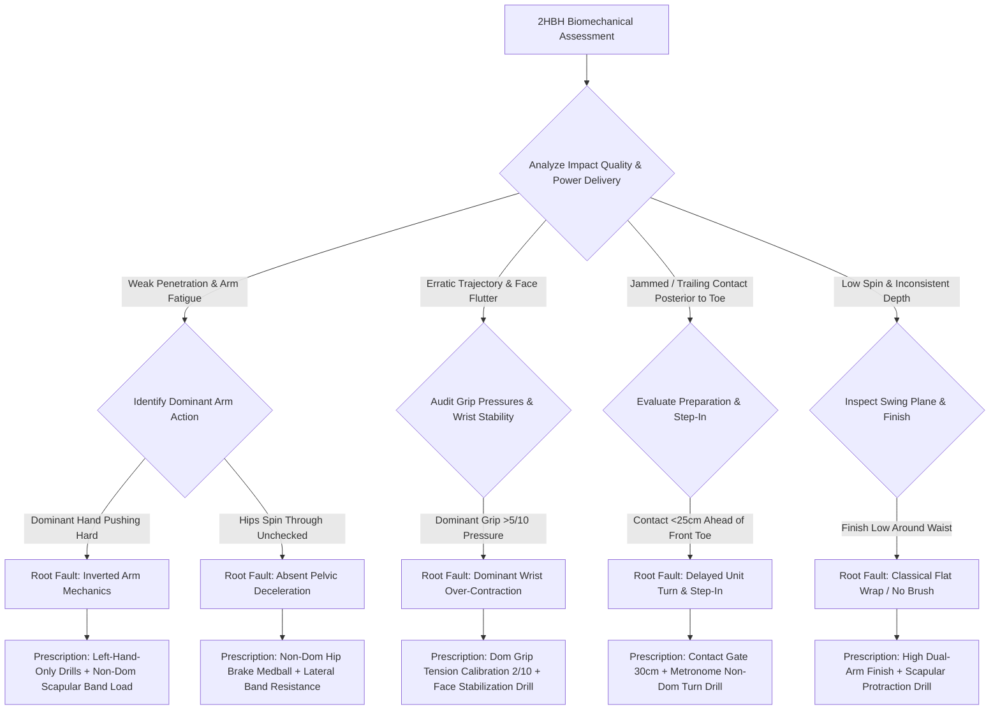

# Article 086: Two-Handed Backhand: Non-Dominant Drive Mechanics

> **PRO CUE:** 2HBH = **Non-Dominant Arm Drive** (Left arm leads for right-handed players). Dominant arm = **Stabilizer & spatial guide**. Non-dominant arm = **The primary motor engine**. Train the "Left Hand Lead" = explosive kinetic power + repeatable precision + bilateral shoulder preservation. The backhand dynasties of Djokovic, Nadal, Alcaraz, and Sinner are built on non-dominant drive mastery.

## 1. Executive Summary & Athletic Intent

The modern two-handed backhand (2HBH) is emphatically **NOT** an awkward "off-hand forehand with the dominant hand pushing along." Rigorous kinematic data proves the contrary: **The non-dominant arm (left arm for a right-handed player) acts as the PRIMARY MOTOR DRIVER**, generating 60–70% of total racket head velocity, while the dominant arm functions purely as a stabilizer, steering guide, and face-angle regulator. This article establishes the **2HBH 5-Phase Non-Dominant Drive Model**: (1) **Non-Dom Unit Turn & Scapular Load** (scapular retraction/protraction loading with 45–55° separation), (2) **Non-Dom Gravitational Lag Drop & Forward Pull**, (3) **Non-Dom Hip Brake & Torso Rotation** (abrupt pelvic arrest transferring torque into the non-dominant shoulder), (4) **Non-Dom Forward Drive & Contact Geometry** (violent pull through an impact window 30–35 cm ahead of the lead toe), and (5) **Dual-Arm High Finish Integration**. The accompanying **"Left Hand Lead" training curriculum** is engineered to systematically rewire the non-dominant arm into an independent power plant.

Athletic intent focuses on three foundational paradigms: First, invert conventional amateur coaching dogma: **The dominant hand DOES NOT push the stroke**—the non-dominant arm pulls and catapults the lever. Second, demonstrate that **non-dominant scapular loading on the backhand is the biomechanical twin of the dominant forehand unit turn**, governed by identical X-Factor stretch-shortening mechanics. Third, deliver the **"Non-Dominant Engine" drill progression** to eradicate passive arm-pushing, protect the dominant wrist/elbow from chronic shear, and unlock tour-level ball penetration and spin.

## 2. Biomechanical & Neurological Foundation

### 2.1 2HBH 5-Phase Non-Dominant Drive Model

| Phase | Technical Designation | Non-Dominant Arm (Engine) | Dominant Arm (Stabilizer) | KPI |
|---|---|---|---|---|
| **1** | **Non-Dom Unit Turn & Scapular Load** | Scapular protraction/retraction coil 90–100°; Elastic stretch | Passive follow-through; Guides racket takeback | X-Factor separation 45–55° |
| **2** | **Non-Dom Lag Drop & Pull** | Passive gravitational drop $\to$ **Violent forward pull initiation** | Relaxed grip; Wrist neutral; Racket slot guidance | Lag angle $>90^\circ$ |
| **3** | **Non-Dom Hip Brake & Torso Rotation** | Pelvic brake $\to$ Core uncoiling DRIVES non-dom shoulder | Stabilizes racket path along swing plane | Pelvic deceleration $>80\%$ in 40 ms |
| **4** | **Non-Dom Forward Drive & Contact** | **Aggressive forward drive** pulling racket through impact | Firm wrist; String bed face angle stabilization | Contact point 30–35 cm ahead |
| **5** | **Dual-Arm High Finish Integration** | High finish across contralateral shoulder; Scapular protraction | Gradual release; Follows non-dominant lead | High balanced wrap above chin |

### 2.2 Power Contribution Breakdown: Non-Dom vs. Dom

```
2HBH RACKET SPEED GENERATION ARCHITECTURE:
┌────────────────────────────────────────────────────────────────────────┐
│  NON-DOMINANT ARM (Left for Righty)  ──►  **60–70% TOTAL CONTRIBUTION**│
│  ├── Scapular Elastic Load (Phase 1)   ──► 20% (Fascial spring storage)│
│  ├── Torso Rotational Drive (Phase 3)  ──► 25% (Proximal kinetic base) │
│  ├── Forward Pull / Drive (Phase 4)    ──► 25% (Distal acceleration)   │
│  └── Finish Wrap Decel (Phase 5)       ──► Trace (Eccentric absorption)│
├────────────────────────────────────────────────────────────────────────┤
│  DOMINANT ARM (Right for Righty)       ──►  **30–40% TOTAL CONTRIBUTION**│
│  ├── Racket Face Angle Stability       ──► 15% (Trajectory calibration)│
│  ├── Wrist Firmness at Impact          ──► 10% (Center-of-percussion)  │
│  ├── Trajectory Steering / Guidance    ──► 10% (Directional control)   │
│  └── Terminal Grip Release             ──► Trace (Tendon protection)   │
└────────────────────────────────────────────────────────────────────────┘

BIOMECHANICAL IMPERATIVE:
Dominant Hand Pushes: Kinetic chain collapses ──► 40–50% Power Deficit + High Tennis Elbow Risk
Non-Dom Arm Pulls: Kinetic chain maximizes ──► Tour-Level Velocity + Complete Joint Longevity
```

### 2.3 Grip Configuration & Role Definition

| Grip Style | Non-Dominant Hand (Upper) | Dominant Hand (Lower) | Biomechanical Dynamics |
|---|---|---|---|
| **Standard Modern 2HBH** | Eastern Forehand / Semi-Western | Continental / Eastern Backhand | **Non-dom = Pure Engine**; Generates heavy topspin pull |
| **Djokovic Heavy Drive** | Semi-Western Forehand | Continental | Extreme non-dom topspin penetration and linear drive |
| **Nadal Brush-Drive** | Full Western Forehand | Strong Eastern Backhand | Maximum non-dominant vertical brush and high RPM |
| **Agassi Classical Drive** | Eastern Forehand | Eastern Backhand | Flatter, more linear dual-arm stroke plane |

**Dynamic Grip Pressure Ratio:**
- **Non-Dominant Hand (Upper):** **4–5 / 10** (Firm, active, driving pressure).
- **Dominant Hand (Lower):** **2–3 / 10** (Light, relaxed, sensory steering pressure).

## 3. Step-by-Step Technical Execution

### Phase 1: Non-Dom Unit Turn & Scapular Load (Phase 1)

**Drill 1: "Left-Hand-Only Unit Turn"**
- Hold the racket **EXCLUSIVELY WITH THE NON-DOMINANT HAND** (upper grip position), letting the dominant arm hang passively by your side.
- Initiate the unit turn by coiling the non-dominant shoulder through **90–100°** while restricting pelvic rotation to $\le 45^\circ$.
- Somatosensory target: Intense eccentric stretch across the non-dominant latissimus dorsi, rhomboids, and contralateral external obliques.
- **Dosage:** 20 reps. KPI: Non-dominant shoulder turn $\ge 95^\circ$, Pelvic turn $\le 45^\circ$, X-Factor separation $\ge 50^\circ$.

**Drill 2: "Non-Dom Scapular Load Resistance Band"**
- Anchor a resistance band behind the player at chest height. Grasp the handle **WITH ONLY THE NON-DOMINANT HAND**.
- Execute the backhand coil: Retract the non-dominant scapula and pull the band across the torso using core and upper-back musculature.
- **Dosage:** 3 sets $\times$ 15 reps. Pro cue: *"Left shoulder blade pulls back $\to$ Load the non-dominant spring."*

**Drill 3: "Shadow Non-Dom Turn Metronome"**
- Set a metronome to 1.0 Hz (60 BPM). Beat 1: Athletic ready position. Beat 2: Instant completion of the full non-dominant unit turn.
- Video checkpoints: Non-dominant shoulder fully turned under the chin, racket head elevated above hands, dominant wrist soft.
- Progression: 1.0 Hz $\to$ 1.5 Hz $\to$ 2.0 Hz.

### Phase 2: Non-Dom Lag Drop & Pull Initiation (Phase 2)

**Drill 4: "Left-Hand Passive Gravitational Lag Drop"**
- Adopt the coiled takeback position with both hands on the grip.
- **Completely relax the dominant hand** (grip pressure 1/10); maintain non-dominant grip pressure at 3/10.
- Allow gravity and the forward hip shift to drop the racket head into the slot.
- **Do not actively cock the wrists**. Somatosensory target: The racket head drops freely behind the hip plane.
- **Dosage:** 20 reps. Pro cue: *"Release dominant hand $\to$ Left hand drops loose $\to$ Let gravity work."*

**Drill 5: "Non-Dom Active Pull Initiation Drill"**
- From the bottom of the lag drop slot, **THE NON-DOMINANT ARM INITIATES THE FORWARD SWING BY PULLING AGGRESSIVELY FORWARD**.
- The dominant arm remains completely passive, acting strictly as a loose hinge.
- High-speed video criteria: The non-dominant shoulder girdle and elbow move forward 15–20 ms before the dominant hand applies any force.
- **Dosage:** 20 reps. Pro cue: *"Left arm pulls $\to$ Right arm steers."*

### Phase 3: Non-Dom Hip Brake & Torso Drive (Phase 3)

**Drill 6: "Non-Dom Hip Brake Medicine Ball Throw"**
- Grasp a 3 kg medicine ball **WITH THE NON-DOMINANT HAND**, using the dominant hand solely as an unweighted platform underneath.
- Execute unit turn $\to$ Drive off the rear leg $\to$ **Violently brake the lead hip at 45°**.
- Channeled angular momentum catapults through the torso to drive the medicine ball forward into a net or partner.
- **Dosage:** 3 sets $\times$ 8 reps. KPI: Pelvic deceleration $>80\%$ reduction within 40 ms; non-dominant shoulder angular velocity peaks instantaneously.

**Drill 7: "Band-Resisted Non-Dom Torso Rotation"**
- Anchor a resistance band laterally at waist height. Grasp the band handle **ONLY WITH THE NON-DOMINANT HAND** in a 2HBH stance.
- Plant the lead foot, arrest pelvic rotation, and dynamically uncoil the thoracic spine and non-dominant arm against band resistance.
- **Dosage:** 3 sets $\times$ 12 reps. Pro cue: *"Brake the hip $\to$ Catapult the left side."*

### Phase 4: Non-Dom Forward Drive & Contact (Phase 4)

**Drill 8: "Contact Gate 30cm - Non-Dom Lead"**
- Position a marker cone **30–35 cm anterior to the lead toe** (the 2HBH contact window is calibrated 5–10 cm closer to the body than the 1HBH due to dual-arm bio-geometry).
- Coach feeds live balls. **THE NON-DOMINANT ARM MUST PULL THE RACKET SQUARELY THROUGH THE GATE BEFORE IMPACT**.
- The dominant hand maintains light, firm isometric stability (3/10 pressure), keeping the racket face perpendicular to the target.
- **Dosage:** 30 feeds. KPI: $\ge 90\%$ of contact events confirmed anterior to the gate with obvious non-dominant lead.

**Drill 9: "Racket Face Stabilization - Dominant Hand Role"**
- Coach delivers heavy, skidding balls into the backhand corner.
- The player executes the stroke with the non-dominant arm pulling through at full speed, while the **dominant hand maintains an uncompromising isometric lock on the racket face angle** ($\pm 3^\circ$ orthogonal).
- Reinforces the functional division of labor: Non-dom = Power; Dom = Precision.
- **Dosage:** 20 reps. Video check: Zero face fluttering through the 4 ms impact window.

**Drill 10: "Non-Dom Drive Resistance Band Stroke"**
- Anchor a resistance band behind the player. Grip the racket with both hands, looping the band handle around the non-dominant wrist.
- Strike through impact against band tension. The resistance forces the non-dominant arm to drive through the strike zone with maximal motor recruitment.
- **Dosage:** 3 sets $\times$ 10 reps. Pro cue: *"Rip through the band with your left arm — Right arm is just along for the ride."*

### Phase 5: Dual-Arm High Finish Integration (Phase 5)

**Drill 11: "Modern High Dual-Arm Wrap"**
- From contact, extend both arms forward along the target line before wrapping up and over the dominant shoulder.
- At the finish: Non-dominant elbow points directly at the opponent's court; non-dominant scapula is fully protracted; torso is upright.
- Eliminates the flat, low, across-the-chest finish of previous eras.
- **Dosage:** 20 reps. Video check: Both elbows elevated above chest level at terminal deceleration.

**Drill 12: "Non-Dom Dynamic Release Drill"**
- Execute a full-speed 2HBH drive. At the exact termination of the follow-through, **release the non-dominant hand completely from the grip**, allowing the racket to settle in the dominant hand.
- Neurological objective: Confirms the non-dominant arm fully discharged all kinetic energy into the strike and is not retaining residual shoulder tension.
- **Dosage:** 15 reps. Pro cue: *"Left arm drives through $\to$ Releases at the top $\to$ Zero residual tension."*

### Phase 6: Varieties & Live Ball Integration

**Drill 13: "2HBH Counter-Slice Mechanics"**
- Adopt a Continental grip with both hands (or Continental dominant / Eastern non-dominant).
- Carve high-to-low through the ball using the non-dominant arm to brush downward and through, while the dominant hand stabilizes the open face (10–15°).
- **Dosage:** 20 slice repetitions. Target: Low, biting skid clearing the net by $<30\text{ cm}$.

**Drill 14: "High Ball 2HBH Non-Dom Elevation Drive"**
- Feed high bouncing topspin balls to shoulder height.
- The player loads the non-dominant shoulder higher, drops into an open/semi-open stance, and drives the non-dominant arm up and through the high contact point.
- **Dosage:** 20 reps. KPI: Non-dominant pull maintained without collapsing the dominant elbow.

**Drill 15: "Rally Non-Dom Lead Compliance"**
- Cross-court baseline rally. Every 2HBH is evaluated by a coach or telemetry system on a 5-point scale:
  1. Non-dom unit turn separation $\ge 45^\circ$?
  2. Passive lag drop executed?
  3. Lead hip deceleration verified?
  4. Non-dom arm pulls through contact 30–35 cm ahead?
  5. High dual-arm finish established?
- Target: Average score $\ge 4.2 / 5.0$ across 30 consecutive rally balls.

## 4. Performance Metrics & Training Dosage

| Performance Metric | Developing | Proficient | Advanced | Elite (Djokovic / Alcaraz) |
|---|---|---|---|---|
| **Non-Dom Scapular Turn** | $<70^\circ$ | 70–85° | 85–95° | **95–100°** |
| **X-Factor Separation Angle** | $<35^\circ$ | 35–45° | 45–50° | **45–55°** |
| **Non-Dom Impact Contribution** | Dominant pushes | 50/50 split | Non-dom leads | **Non-dom drives 65–70%+** |
| **Contact Distance Ahead of Toe** | $<25\text{ cm}$ (Jammed) | 25–30 cm | 30–35 cm | **$30\text{–}35\text{ cm}$** |
| **Lead Hip Deceleration Rate** | $<50\%$ in 40 ms | 50–70% | 70–85% | **$>80\%$ in 40 ms** |
| **Racket Face Angular Variance** | $>10^\circ$ deviation | 5–10° deviation | 3–5° deviation | **$\pm 3^\circ$ orthogonal** |
| **Follow-Through Finish Elevation**| Below chest level | Shoulder level | Chin level | **High wrap above chin** |
| **5-Phase Rally Compliance** | $<40\%$ | 40–60% | 60–80% | **$>90\%$** |
| **Topspin Drive Spin Rate** | $<2,000\text{ RPM}$ | 2,000–2,500 RPM | 2,500–3,000 RPM | **3,000–3,500+ RPM** |

### Weekly Periodized Training Dosage

- **Non-Dom Unit Turn & Scapular Loading:** $3\times/\text{week}$, 15 minutes (Drills 1–3).
- **Lag Drop & Active Pull Initiation:** $3\times/\text{week}$, 15 minutes (Drills 4–5).
- **Pelvic Deceleration & Torso Drive:** $2\times/\text{week}$, 15 minutes (Drills 6–7).
- **Forward Drive & Contact Calibration:** $3\times/\text{week}$, 20 minutes (Drills 8–10).
- **High Finish & Live Rally Integration:** $2\times/\text{week}$, 20 minutes (Drills 11–15).
- **Total Dedicated Volume:** $\sim 85\text{ minutes/week}$ of 2HBH non-dominant motor re-patterning.

## 5. Errors, Causes & Correction Protocols

| Observable Technical Defect | Biomechanical Root Cause | Prescriptive Correction Protocol |
|---|---|---|
| **"Dominant arm pushes through ball; weak penetration"** | Motor control flaw; athlete treats 2HBH as a dominant arm push | Left-Hand-Only Unit Turn & Hit drills (500+ reps); Pro cue: *"Left hand pulls — Right hand steers"* |
| **"Non-dominant arm remains limp, trailing behind"** | Deficient neuromuscular recruitment in non-dominant upper quadrant | Non-Dom Scapular Band Load; Isolated non-dom medball throws; Grip pressure adjustment (4/10 non-dom) |
| **"No lag drop; stiff chopping swing directly at ball"** | Premature voluntary muscle contraction; failure to exploit gravity | Passive Gravitational Lag Drop Drill; Soften dominant grip to 1/10; Pro cue: *"Let the racket head fall"* |
| **"Hips spin continuously through impact with no brake"** | Failure of lead hip eccentric decelerators (gluteus medius/internal rotators) | Non-Dom Hip Brake Medball Throws; Band-Resisted Torso Rotation; Pro cue: *"Brake hip to fire the left arm"* |
| **"Jammed contact trailing behind the lead hip line"** | Late unit turn initiation; failure to step forward into the strike window | Contact Gate 30cm Drill; Early forward transfer step; Metronome shadow turn training |
| **"Racket face flutters open/closed through impact zone"** | Dominant hand squeezing too tightly or trying to actively steer the ball | Calibrate dominant grip tension to 2/10; Racket Face Stabilization drills; Firm isometric wrist setting |
| **"Low, flat finish around the waist (Hunched posture)"** | Obsolete classical stroke pattern; lack of non-dominant scapular elevation | High Dual-Arm Finish Drill; Target high elbow wrap; Dynamic thoracic extension cues |
| **"Non-dominant anterior shoulder pain / impingement"** | Pulling violently with an abducted arm without proper scapular upward rotation | Scapular stability protocol (Y-T-W-L); Adjust grip to Semi-Western; Load management |

## 6. Diagnostic Diagram & Decision Flow



## 7. Video Demonstration & Technical Analysis

<div class="video-container" style="position:relative;padding-bottom:56.25%;height:0;overflow:hidden;border-radius:12px;">
  <iframe src="https://www.youtube-nocookie.com/embed/VIDEO_ID_PLACEHOLDER"
          style="position:absolute;top:0;left:0;width:100%;height:100%;border:0;"
          allow="accelerometer; autoplay; clipboard-write; encrypted-media; gyroscope; picture-in-picture"
          allowfullscreen
          title="Two-Handed Backhand: Non-Dominant Drive Mechanics — Technical Analysis"></iframe>
</div>

*Recommended high-speed video analysis protocols: 500 FPS capture perpendicular to the baseline comparing non-dominant vs. dominant shoulder angular acceleration curves; Dual-channel surface electromyography (sEMG) contrasting left latissimus dorsi/pectoralis activation against right forearm flexor activity; High-speed sensor tracking of bilateral grip pressure differential; Elite tour benchmarks (Novak Djokovic, Carlos Alcaraz, Jannik Sinner).*

## 8. Cross-Domain Synergy & Multi-Pillar Integration

- **With Modern Forehand 5-Phase Model (Article 081):** The 2HBH non-dominant drive is the **exact kinematic mirror of the dominant forehand**. Non-dominant scapular coiling equals forehand unit turn; non-dominant arm pulling through contact equals forehand hip brake and segmental catapult.
- **With Contact Point Geometry (Article 082):** The 2HBH impact zone is geometrically calibrated **30–35 cm anterior to the lead toe** (slightly closer to the torso than the 40 cm forehand gate due to the bio-geometry of holding the racket with two hands).
- **With Split Step Activation & Timing (Article 083):** Because 2HBH preparation requires balanced dual-arm takeback, **bilateral split-step landing symmetry is critical** to prevent asymmetrical hip loading.
- **With Serving Kinetic Chain (Article 084):** Both strokes demand uncompromising adherence to **Proximal-to-Distal Sequencing**—the hip brake on the backhand performs the identical kinetic energy funneling role as the thoracic cartwheel on the serve.
- **With One-Handed Backhand Mechanics (Article 085):** While the 1HBH utilizes opposite-arm counter-extension for thoracic anchoring, the 2HBH utilizes the dominant arm on the handle as an active stabilizer and directional compass.
- **With Racket Face Angle Awareness (Article 073):** Stabilizing the 2HBH string face demands a **precise grip pressure ratio (4/10 non-dom vs. 2/10 dom)**. A dominant hand that grips too tightly inevitably overrides and twists the racket face.
- **With Orthopedic Injury Prevention (Articles 196, 197):** Pushing with the dominant hand on a 2HBH is a major cause of dominant wrist tenosynovitis (ECU tendonitis) and medial epicondylitis. Transitioning to a non-dominant drive completely spares the dominant wrist and elbow.

## 9. Self-Assessment Rubric

| Diagnostic Checkpoint | Level 1 (Dominant Pusher) | Level 2 (Mixed Mechanics) | Level 3 (Functional Non-Dom) | Level 4 (Tour Non-Dom Mastery) |
|---|---|---|---|---|
| **Non-Dom Scapular Turn** | $<70^\circ$ | 70–85° | 85–95° | **95–100°** |
| **Non-Dom Lead at Impact** | Dominant arm pushes | 50/50 shared push | Clear non-dom lead | **Non-dom drives 65–70%+** |
| **Passive Gravitational Drop** | Absent (Muscle-driven) | Inconsistent | Functional lag drop | **Consistent $>90^\circ$ slot** |
| **Lead Hip Deceleration Rate** | Absent ($<50\%$) | Moderate (50–70%) | Strong (70–85%) | **Abrupt arrest ($>80\%$ in 40 ms)**|
| **Racket Face Angular Stability**| $>10^\circ$ variance | 5–10° variance | 3–5° variance | **$\pm 3^\circ$ rock-solid** |
| **Finish Height & Posture** | Low / Classical waist wrap | Shoulder level | Chin level | **High wrap; elbows elevated** |
| **5-Phase Rally Compliance** | $<40\%$ across 30 balls | 40–60% | 60–80% | **$>90\%$ across 30 balls** |

**Diagnostic Scoring Key:**
- **7–13 Points:** Critical kinetic defect; dominant arm pushing creates chronic wrist shear; mandatory return to left-hand-only drills.
- **14–19 Points:** Mixed mechanical output; inconsistent non-dominant drive under baseline pace; variable depth.
- **20–25 Points:** Functional non-dominant mechanics; solid heavy ball penetration; minor breakdowns under wide defensive stretching.
- **26–28 Points:** Tour-caliber non-dominant mastery; impenetrable baseline weapon capable of offensive redirection from any court position.

## 10. Printable Practice Card (Pocket Drill Card)

```
┌────────────────────────────────────────────────────────────────────────┐
│            POCKET DRILL CARD: 2HBH NON-DOMINANT DRIVE ENGINE           │
│ Target: Non-Dom Load ≥90°, Non-Dom Lead >70%, Hip Decel >80%, Gate 30cm│
├────────────────────────────────────────────────────────────────────────┤
│ BLOCK A: Non-Dominant Activation & Coiling (5 Min)                     │
│ • Left-Hand-Only Unit Turn: 20 reps (Check 95°+ non-dom shoulder coil) │
│ • Non-Dom Scapular Load Resistance Band: 15 reps                       │
│ • Focus Cue: "Left hand only — Retract the scapula — Load the spring"  │
├────────────────────────────────────────────────────────────────────────┤
│ BLOCK B: Gravitational Slot & Hip Brake Integration (20 Min)           │
│ • Left-Hand Passive Lag Drop: 20 reps (Dom grip 1/10, Non-dom 3/10)   │
│ • Non-Dom Active Pull Initiation Drill: 20 reps                        │
│ • Non-Dom Hip Brake Medball Throws: 3 sets × 8 reps                    │
│ • Focus Cue: "Soften right hand — Left hand pulls — Violent hip brake" │
├────────────────────────────────────────────────────────────────────────┤
│ BLOCK C: Kinetic Delivery & Face Stabilization (20 Min)                │
│ • Contact Gate 30cm Drill: 30 live balls (Non-dom pulls through gate)  │
│ • Racket Face Stabilization (Dom Hand Check): 20 reps (Face ±3°)       │
│ • Non-Dom Drive Resistance Band Stroke: 3 sets × 10 reps               │
│ • Focus Cue: "Left hand drives power — Right hand keeps face locked"   │
├────────────────────────────────────────────────────────────────────────┤
│ BLOCK D: High Finish & Rally Compliance (15 Min)                       │
│ • Modern High Dual-Arm Wrap: 15 reps (Elbows elevated above chin)      │
│ • Non-Dom Dynamic Release Drill: 15 reps                               │
│ • 5-Phase Rally Compliance Scoring: 30 cross-court balls (Target: ≥4.2)│
│ • Focus Cue: "High finish wrap — Complete non-dom release — Tour whip" │
├────────────────────────────────────────────────────────────────────────┤
│ FREQUENCY: 3×/week | GATE: 3 consecutive weeks with Non-Dom Scapular   │
│ ≥90°, Non-Dom Lead >70%, Hip Brake >80%, and Rally Compliance >85%.    │
└────────────────────────────────────────────────────────────────────────┘
```

---

*Cross-References: Articles 073, 081, 082, 083, 084, 085, 196, 197. Pillar III: Stroke Mechanics & Ball Striking — TennisKB 200 Articles.*
