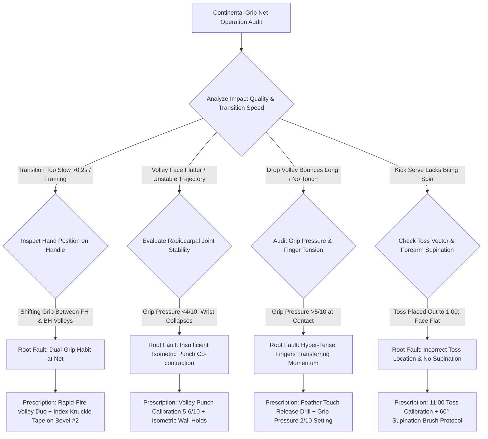

# Article 087: Continental Grip Mechanics across All Net Operations

> **PRO CUE:** The Continental Grip = **The Master Key** to all forward-court play. Serve, Forehand Volley, Backhand Volley, Overhead Smash, Drop Shot, Knife Slice, Block Return — ALL EXECUTED FROM ONE IDENTICAL GRIP. Zero grip shifting = **Zero transition latency**. Train "Universal Continental Mastery" = build an impenetrable, lightning-fast net arsenal.

## 1. Executive Summary & Athletic Intent

The Continental grip (Bevel #2, universally referenced as the "hammer grip") represents tennis's **sole omni-functional grip configuration**, empowering an athlete to execute **every net stroke and serve variation without shifting hands on the handle**: Flat, Slice, and Kick Serves, Forehand Volleys, Backhand Volleys, Overhead Smashes, Drop Volleys, Half-Volleys, Block Returns, Slice Approaches, and Feather Drop Shots. This article outlines the **Biomechanical Universality of the Continental Grip**: an anatomically neutral foundation that unlocks **180° of uninhibited radioulnar rotation (90° pronation + 90° supination)**, full-range wrist flexion/extension (40°/40°), and balanced radial/ulnar deviation (20°/30°) to accommodate every conceivable trajectory and spin vector. The accompanying **"Universal Continental Mastery" curriculum** systematically conditions proprioceptive grip automaticity, eliminates grip transition latency, and cultivates 11+ shot modalities from a static hand alignment.

Athletic intent is structured across three core imperatives: First, prove that the **Continental grip is an optimal biomechanical compromise**—not a crude "jack-of-all-trades," but an indispensable operational system engineered for rapid forward-court intercept dynamics. Second, demonstrate that **Zero Grip Transition = A Massive Temporal Advantage**; at the net, where reaction windows compress below 250 ms, a 0.1-second grip switch invariably causes missed contact and frame errors. Third, provide the **"One Grip, All Shots" training progression** to automate instantaneous modulation of grip pressure, wrist stiffness, and swing planes without ever shifting the index knuckle off Bevel #2.

## 2. Biomechanical & Neurological Foundation

### 2.1 Continental Grip Geometry & Degrees of Freedom

```
CONTINENTAL GRIP BIO-GEOMETRY (Bevel #2 Reference):
┌────────────────────────────────────────────────────────────────────────┐
│  Base Index Knuckle (MCP Joint) ──► Bevel #2 (Right-slanted bevel)    │
│  Hypothenar Heel Pad            ──► Bevel #2                           │
│  Thumb-Index "V" Anatomical Line ──► Points toward 11:00–12:00 clock   │
│                                                                        │
│  Racket Face at Neutral Wrist:   Orthogonal / Vertical (90° to court) │
│                                                                        │
│  AVAILABLE RADIOCARPAL & POLLEX RANGES OF MOTION:                     │
│  ├── Forearm Pronation:    90° (Face Down ──► Flat Serve, Drive Volley)│
│  ├── Forearm Supination:   90° (Face Up   ──► Slice, BH Volley, Kick)  │
│  ├── Wrist Extension:      40° (Face Open ──► Defensive Lob, Drop Shot)│
│  ├── Wrist Flexion:        40° (Face Down ──► Topspin Overhead Snap)   │
│  ├── Radial Deviation:     20° (Anterior ──► Inside-Out Push Angle)    │
│  └── Ulnar Deviation:      30° (Posterior ──► Cross-Court Carve/Angle) │
└────────────────────────────────────────────────────────────────────────┘
```

### 2.2 Shot-to-Grip Mapping Across 11 Specialized Operations

| Shot Modality | Grip Mandate | Continental Compatibility | Primary Biomechanical Mechanism |
|---|---|---|---|
| **Flat First Serve** | Continental | ✅ Native | Forearm pronation 90° $\to$ String bed squares orthogonally at impact |
| **Slice Serve** | Continental | ✅ Native | Forearm supination 30–45° $\to$ Lateral tangential brush around 3 o'clock |
| **Kick / Twist Serve** | Continental | ✅ Native | Supination 60° + Wrist extension $\to$ Vertical upward brush 7 to 1 o'clock |
| **Forehand Volley** | Continental | ✅ Native | Slight pronation; Isometric wrist extension; Linear shoulder punch |
| **Backhand Volley** | Continental | ✅ Native | Slight supination; Firm wrist; Scapular retraction block |
| **Overhead Smash** | Continental | ✅ Native | Pronation 90° + Rapid wrist flexion; Whip-like downward trajectory |
| **Drop Volley** | Continental | ✅ Native | Wrist extension 20–30° + Micro finger flexor release; Touch damping |
| **Half-Volley Pickup**| Continental | ✅ Native | Neutral wrist lock; Ultra-short lever block at shoelace level |
| **Pace-Absorbing Block**| Continental | ✅ Native | Isometric wrist co-contraction; Rigid planar wall redirecting pace |
| **Knife Slice Approach**| Continental | ✅ Native | Supination 20° + Linear extension; Backspin hydrodynamic skid |
| **Feather Drop Shot** | Continental | ✅ Native | Extension 30° + Deceleration finger release; High backspin damping |

**Kinematic Insight:** The Continental grip provides **180° total rotational range** across the long radioulnar axis. No other grip geometry allows a player to seamlessly transition between aggressive downward pronation (flat serve) and high-tilt supination (kick serve or backhand volley) without micro-adjusting the hand on the octagonal bevels.

### 2.3 Dynamic Grip Pressure & Finger Configuration

| Shot Modality | Grip Pressure (1–10 Scale) | Active Finger Focus | Neuromechanical Function |
|---|---|---|---|
| **Flat Serve (Velocity)** | **4–5 / 10** | Uniform 4-finger wrap | Proximal-to-distal kinetic chain whip transfer |
| **Punch Volley (Baseline Drive)**| **5–6 / 10** | Thumb + Index trigger lock | Firm radiocarpal stability; Prevents racket flutter |
| **Touch / Drop Volley** | **2–3 / 10** | Ring + Pinky feather touch | Kinetic damping; Finger flexors absorb ball momentum |
| **Overhead Smash** | **4–5 / 10** | Full wrap with thumb anchor | Rapid internal rotation and pronation snap |
| **Heavy Block Return** | **6–7 / 10** | High isometric squeeze | Solid deflection wall neutralizing 120+ mph serves |
| **Carving Knife Slice** | **3–4 / 10** | Index finger ridge pressure | Precision cutting path and underspin calibration |

## 3. Step-by-Step Technical Execution

### Phase 1: Grip Acquisition & Proprioceptive Awareness (Phase 1)

**Drill 1: "Continental Grip Lock - Mirror Protocol"**
- Hold the racket in front of a mirror with the base index knuckle and hypothenar heel pad anchored strictly on Bevel #2.
- Confirm the "V" between thumb and index finger points at 11:30 (for right-handers). At neutral wrist alignment, the racket face must hang perpendicular ($90^\circ$) to the court.
- **Acquisition Routine:** Drop the racket to the court $\to$ Pick it up $\to$ Instantly seat the hand into Continental alignment $\to$ Verify under 2.0 seconds.
- **Dosage:** 50 repetitions. KPI: 100% correct placement confirmed via visual check within $<2.0\text{ seconds}$.

**Drill 2: "Blind Grip Tactile Identification"**
- The athlete closes their eyes. The coach places a racket into the athlete's hand in a randomized grip (Eastern, Semi-Western, Continental, Western).
- Using purely somatosensory tactile feedback from the bevel edges, the athlete must declare within 1.0 second whether the grip is Continental and adjust if necessary.
- **Dosage:** 20 randomized trials. KPI: 100% identification accuracy.

**Drill 3: "Dynamic Grip Pressure Calibration"**
- Grasp the handle equipped with a pressure sensor or tactile biofeedback cue.
- Transition through pressure commands on coach vocal cues: *"Serve (4/10) $\to$ Punch Volley (6/10) $\to$ Drop Volley (2/10) $\to$ Block (7/10)"*.
- **The hand does not shift position; only muscular tension modulates**.
- **Dosage:** 10 cycles. KPI: Grip tension accuracy within $\pm 0.5$ on a 1–10 scale.

### Phase 2: Universal Shot Execution (Phase 2)

**Drill 4: "Serve Trilogy - One Grip Protocol"**
- Deliver 45 consecutive serves using **EXCLUSIVELY A CONTINENTAL GRIP**:
  - **15 Flat Serves:** Toss at 12:30; 90° pronation through the back of the ball.
  - **15 Slice Serves:** Toss at 1:00; 30° supination brushing around the right hemisphere.
  - **15 Kick Serves:** Toss at 11:00; 60° supination brushing 7 to 1 o'clock upward.
- Prohibit any hand shifting between variations. All spin variations are produced through toss location and racket delivery path.
- **Dosage:** 45 serves. KPI: Opponent return visual disguise rate $>80\%$.

**Drill 5: "Rapid-Fire Volley Duo (FH/BH Zero-Transition)"**
- Coach or ball machine fires alternating rapid-fire feeds to forehand and backhand net wings.
- The athlete executes alternating volleys: Forehand punch $\to$ Backhand punch $\to$ Forehand punch $\to$ Backhand punch.
- **Zero grip change is permitted**. Trajectory modulation is controlled entirely through shoulder turn and minor wrist supination/pronation.
- **Dosage:** 40 volleys (20 per side). KPI: Transition latency between shots $<0.1\text{ seconds}$; string face angular error $<\pm 3^\circ$.

**Drill 6: "Overhead Smash + Feather Drop Volley Combo"**
- Coach feeds a high defensive lob $\to$ Player jumps and smashes overhead (Grip pressure 5/10, explosive pronation snap).
- Coach immediately fires a knee-high drive $\to$ Player steps in and executes a feather drop volley (Grip pressure instantly drops to 2/10 with finger flexor release).
- **Dosage:** 10 sequences. KPI: Full terminal power on smash, followed by drop volley bouncing twice inside the service box.

**Drill 7: "The All-Court Trifecta: Block Return $\to$ Slice Approach $\to$ Drop Shot"**
- Sequence: Neutralize a 115+ mph serve with a **Continental Block Return** (Pressure 7/10, rigid isometric wall).
- Advance into mid-court to carve a **Knife Slice Approach** (Pressure 3/10, high-to-low trajectory skidding deep).
- Close to the net and execute a **Feather Drop Shot** off the weak floater (Pressure 2/10, soft touch release).
- **Dosage:** 10 full sequences. KPI: Successful 3-shot execution rate $>80\%$.

### Phase 3: Transition Latency, Speed & Pressure (Phase 3)

**Drill 8: "Rapid-Fire 10-Shots-Per-Minute Crucible"**
- High-intensity net gauntlet: Coach fires 10 randomized balls per minute encompassing Forehand Volleys, Backhand Volleys, High Smashes, Low Half-Volleys, and Jammed Body Blocks.
- Mandatory constraint: **Continental grip locked for all 50 balls**. The player reacts, sets the racket face, and recovers.
- **Dosage:** 5-minute continuous set (50 balls). KPI: Zero instances of grip shifting; shot quality score $>7.0 / 10$ average.

**Drill 9: "Pressure Tiebreak Net Simulation"**
- Play live 10-point tiebreaks where **every single point requires an immediate serve-and-volley or return-and-approach pattern**.
- Every net touch must be audited for Continental compliance under match stress and competitive adrenaline.
- **Dosage:** 2 full tiebreaks. KPI: Zero grip errors; first volley win rate $>65\%$.

**Drill 10: "High-Fatigue Grip Integrity Protocol"**
- Perform a 4-minute high-intensity interval protocol (shuttle sprints and court jumps) to drive blood lactate $>8.0\text{ mmol/L}$.
- Immediately grab the racket and execute the Blind Grip ID Test followed by a 20-shot rapid-fire net sequence.
- Evaluates whether central nervous system fatigue causes the player to default to an amateur pan-cake / Eastern grip.
- **Dosage:** 1 post-exhaustion audit set. KPI: Accuracy degradation $<5\%$ compared to resting baseline.

## 4. Performance Metrics & Training Dosage

| Performance Metric | Developing | Proficient | Advanced | Elite (Tour Net Specialist) |
|---|---|---|---|---|
| **Grip Acquisition Latency** | $>3.0\text{ s}$ | 2.0–3.0 s | 1.0–2.0 s | **$<1.0\text{ s (Automatic)}$** |
| **Blind Tactile ID Accuracy** | $<80\%$ | 80–90% | 90–95% | **$100\%$ perfect recognition** |
| **Dynamic Pressure Precision** | $\pm 1.5 / 10$ | $\pm 1.0 / 10$ | $\pm 0.5 / 10$ | **$\pm 0.3 / 10$ target** |
| **Serve 3-Type Deception** | $<50\%$ | 50–70% | 70–85% | **$>85\%$ unread** |
| **FH/BH Volley Switch Latency** | $>0.30\text{ s}$ | 0.20–0.30 s | 0.10–0.20 s | **$<0.10\text{ s (Zero shift)}$** |
| **Multi-Shot Execution Count** | $<5\text{ shots}$ | 5–7 shots | 7–9 shots | **$10+\text{ distinct shots}$** |
| **Fatigue Grip Integrity Drop** | $>20\%$ decay | 10–20% decay | 5–10% decay | **$<5\text{ ms / } <5\%\text{ decay}$** |
| **Practice Net Point Win Rate** | $<40\%$ | 40–55% | 55–70% | **$>70\%$ net win rate** |

### Weekly Periodized Training Dosage

- **Grip Acquisition & Proprioceptive Mapping:** $3\times/\text{week}$, 10 minutes (Drills 1–3).
- **Universal Multi-Shot Combinations:** $3\times/\text{week}$, 25 minutes (Drills 4–7).
- **Rapid-Fire Transition & Pressure Scenarios:** $2\times/\text{week}$, 20 minutes (Drills 8–10).
- **Total Dedicated Volume:** $\sim 55\text{ minutes/week}$ of Continental-specific neuromuscular conditioning.

## 5. Errors, Causes & Correction Protocols

| Observable Technical Defect | Biomechanical Root Cause | Prescriptive Correction Protocol |
|---|---|---|
| **"Shifting to Eastern grip for forehand volleys"** | Deep-seated habit; fear of open face; lack of understanding of pronation | Rapid-Fire Volley Duo Drill; Tape an index marker to Bevel #2; Pro cue: *"Punch with the edge, tilt with the wrist"* |
| **"Kick serve lacks spin with Continental grip"** | Faulty toss placement; failure to exploit supination and wrist extension | Kick Serve 11:00 Toss Drill; Isolated supination/brush tracking; Video review of 7-to-1 upward brush |
| **"Racket face flutters / dumps into net on volleys"** | Grip tension too loose ($<3/10$); collapsing radiocarpal joint | Increase punch grip tension to 5–6/10; Isometric wrist extensor holds; Cue: *"Firm wrist = stone wall"* |
| **"Drop shots and drop volleys bounce long (No touch)"** | Over-squeezing the handle ($>6/10$); rigid forearm transferring rebound energy | Finger Flexor Release Drill; Soften grip to 2/10; Cue: *"Release fingers upon contact; catch the egg"* |
| **"Block return pushed backward on heavy serves"** | Inadequate isometric forearm co-contraction; loose grip at impact | Calibrate block pressure to 6–7/10; Heavy ball deflection drills; Cue: *"Unmovable granite wall"* |
| **"Handle slips in hand during overhead smashes"** | Insufficient grip pressure; sweat degrading traction; loose thumb anchor | Wrap high-traction tacky overgrip; Squeeze 4–5/10 with secure thumb wrap; Chalk/rosin routine |
| **"Grip drifts to semi-western under competitive fatigue"** | Central nervous fatigue; sensory proprioceptive degradation | Post-HIIT Fatigue Grip Integrity Test weekly; Micro-recovery routines between points (Article 061) |

## 6. Diagnostic Diagram & Decision Flow



## 7. Video Demonstration & Technical Analysis

<div class="video-container" style="position:relative;padding-bottom:56.25%;height:0;overflow:hidden;border-radius:12px;">
  <iframe src="https://www.youtube-nocookie.com/embed/VIDEO_ID_PLACEHOLDER"
          style="position:absolute;top:0;left:0;width:100%;height:100%;border:0;"
          allow="accelerometer; autoplay; clipboard-write; encrypted-media; gyroscope; picture-in-picture"
          allowfullscreen
          title="Continental Grip Mechanics across All Net Operations — Technical Analysis"></iframe>
</div>

*Recommended high-speed video analysis protocols: 500 FPS capture isolating hand alignment during the transition from serve into first volley; High-speed camera close-up of finger flexor relaxation during drop volleys; 3D bio-motion capture comparing forearm pronation/supination ranges across 10 distinct shot types; Elite tour benchmark analysis (Roger Federer, Stefan Edberg, John McEnroe, Patrick Rafter).*

## 8. Cross-Domain Synergy & Multi-Pillar Integration

- **With Serving Kinetic Chain (Article 084):** The Continental grip is the **non-negotiable foundation of the serve**. Modulating the toss coordinate while maintaining Bevel #2 is the fundamental mechanism that generates unreadable flat, slice, and kick delivery profiles.
- **With Split Step Activation & Return Dynamics (Article 083):** Upon landing from the split step at the net, the racket must already be preset in the Continental grip. **Zero grip transition time preserves crucial hundredths of a second**, enabling clinical first volleys.
- **With One-Handed Backhand Mechanics (Article 085):** The 1HBH slice approach, drop shot, and block return operate natively from the Continental grip, establishing immediate structural continuity with forward-court net play.
- **With Two-Handed Backhand Transitions (Article 086):** Players who utilize a semi-western non-dominant hand must condition rapid grip sliding with the dominant hand to establish an instantaneous Continental grip when stepping forward into mid-court transitions.
- **With Racket Face Angle Awareness (Article 073):** The Continental grip represents the **absolute neurological reference zero-point** for racket face spatial orientation. All dynamic string angle modulations are referenced relative to this anatomical baseline.
- **With Action Capabilities & Affordance Perception (Article 067):** Locking in the Continental grip at the net expands the athlete's **affordance landscape to its theoretical maximum**—every shot option (punch, drop, angle, lob) is physically executable without motor delay.
- **With Neural Drive Synchronization (Article 069):** Eradicating grip shifts frees up critical cortical bandwidth in the motor cortex, redirecting neurological resources toward visual tracking and tactical trajectory prediction.

## 9. Self-Assessment Rubric

| Diagnostic Checkpoint | Level 1 (Multi-Grip Chaos) | Level 2 (Partial Continental) | Level 3 (Functional Universal) | Level 4 (Universal Tour Mastery) |
|---|---|---|---|---|
| **Grip Acquisition Speed** | $>3.0\text{ s}$ | 2.0–3.0 s | 1.0–2.0 s | **$<1.0\text{ s (Instantaneous)}$** |
| **Blind Tactile Recognition** | $<80\%$ | 80–90% | 90–95% | **$100\%$ accuracy** |
| **Serve 3-Type Deception** | $<50\%$ unread | 50–70% | 70–85% | **$>85\%$ unread** |
| **FH/BH Volley Transition** | $>0.30\text{ s}$ (Shifts grip) | 0.20–0.30 s | 0.10–0.20 s | **$<0.10\text{ s (Zero shift)}$** |
| **Distinct Shot Modalities** | $<5\text{ shots}$ | 5–7 shots | 7–9 shots | **$10+\text{ shot variations}$** |
| **Dynamic Pressure Accuracy** | Uncontrolled | Variable ($\pm 1.0$) | Reliable ($\pm 0.5$) | **Precision calibrated ($\pm 0.3$)**|
| **Fatigue Integrity Retention** | $>20\%$ degradation | 10–20% degradation | 5–10% degradation | **$<5\%$ degradation** |

**Diagnostic Scoring Key:**
- **7–13 Points:** Severe grip switching pathology; high transition latency; return to static grip acquisition and mirror checks.
- **14–19 Points:** Partial Continental adoption; shifts grips under baseline pace or wide defensive stretches.
- **20–25 Points:** Functional universal execution; seamless net transitions; minor pressure calibration errors on delicate touch shots.
- **26–28 Points:** Tour-caliber Continental mastery; lightning-fast net reflexes, devastating disguise, and impenetrable court coverage.

## 10. Printable Practice Card (Pocket Drill Card)

```
┌────────────────────────────────────────────────────────────────────────┐
│           POCKET DRILL CARD: UNIVERSAL CONTINENTAL NET ENGINE          │
│ Target: Auto-Grip <1s, Transition Latency <0.1s, 10+ Shots, Decept >80%│
├────────────────────────────────────────────────────────────────────────┤
│ BLOCK A: Proprioceptive Grip Calibration (5 Min)                       │
│ • Continental Grip Lock Mirror Check: 20 reps (Under 2s acquisition)  │
│ • Blind Grip Tactile Identification: 10 reps (100% accuracy)           │
│ • Dynamic Pressure Calibration: 10 cycles (Serve 4 → Punch 6 → Drop 2) │
│ • Focus Cue: "Bevel #2 locked — V-shape 11:30 — Modulate pressure only"│
├────────────────────────────────────────────────────────────────────────┤
│ BLOCK B: Multi-Shot Pattern Execution (20 Min)                         │
│ • Serve Trilogy: 45 serves (15 Flat / 15 Slice / 15 Kick — One grip)  │
│ • Rapid-Fire Volley Duo: 40 alternating volleys (Zero grip change)     │
│ • Overhead Smash + Feather Drop Volley Combo: 10 sequences             │
│ • The All-Court Trifecta: 10 sequences (Block → Slice Approach → Drop) │
│ • Focus Cue: "One grip — Three serves — Punch hard — Feather touch"    │
├────────────────────────────────────────────────────────────────────────┤
│ BLOCK C: High-Speed Reaction & Match Pressure (15 Min)                 │
│ • Rapid-Fire 10-Shots-Per-Minute Crucible: 5-minute set (50 balls)     │
│ • Pressure Tiebreak Net Simulation: 2 sets (Serve-and-volley points)   │
│ • Focus Cue: "Continental on all touches — Zero shift — Instant react" │
├────────────────────────────────────────────────────────────────────────┤
│ BLOCK D: High-Fatigue Integrity Audit (5 Min)                          │
│ • Post-HIIT Fatigue Grip Integrity Test: Blind ID + 20-shot sequence   │
│ • Audit Log: Grip precision, face stability, transition latency        │
│ • Focus Cue: "Retain Bevel #2 under max lactate — Refuse pancake grip" │
├────────────────────────────────────────────────────────────────────────┤
│ FREQUENCY: 3×/week | GATE: 3 consecutive weeks with Auto-Grip <1s,     │
│ Volley Transition <0.1s, Serve Deception >80%, and Fatigue Drop <5%.   │
└────────────────────────────────────────────────────────────────────────┘
```

---

*Cross-References: Articles 067, 069, 073, 083, 084, 085, 086, 088. Pillar III: Stroke Mechanics & Ball Striking — TennisKB 200 Articles.*
