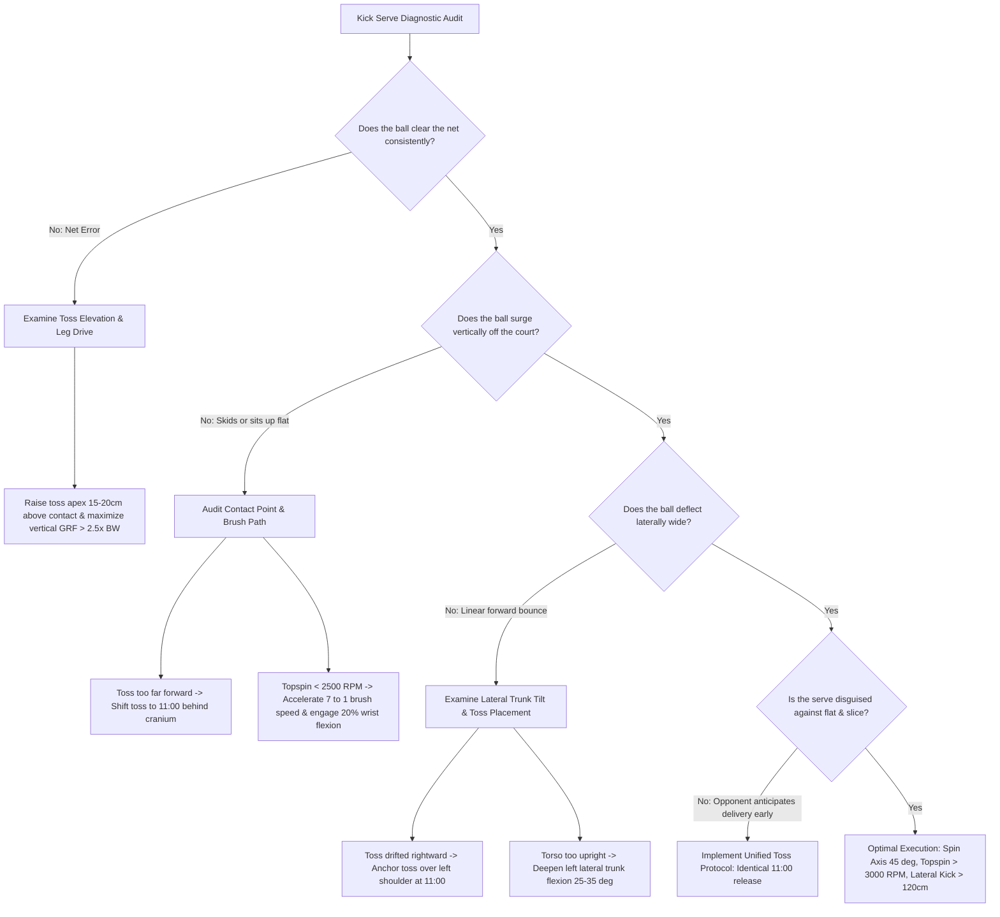

# ART-089: Kick Serve Toss Angles and Spin Production Vectors

> **PRO CUE:** Kick Serve = **11 O'Clock Toss (Righty) + 7→1 Brush + Arched Trajectory**. Toss placement dictates 80% of spin quality. Continental grip + Supination + Extension + Leg drive = **Topspin + Sidespin combination**. Training "Kick Serve Geometry" creates a reliable 2nd-serve weapon and a devastating 1st-serve tactical variation.

---

## 1. Executive Summary & Athletic Intent

The kick serve (topspin serve) is simultaneously the **safest delivery** in tennis due to its high net clearance margin and one of the **most challenging to return** because of its aggressive upward bounce and lateral kick-out deviation. This article defines the comprehensive **Kick Serve Biomechanical Model**:
1. **Toss Placement Geometry**: 11 o'clock clock-face position, slightly behind the cranium, calibrated to a lower release height.
2. **Spin Production Vector**: 7-to-1 o'clock brush vector generating a combined topspin and sidespin profile.
3. **Contact Point Geometry**: Located behind the vertex of the head, lower than a flat serve contact window, with the racket face pre-closed $5^\circ\text{–}10^\circ$.
4. **Trajectory Architecture**: Parabolic flight path featuring an apex $>3\text{ m}$, steep descent angle, and explosive lateral/vertical kick upon court impact.

The **"Kick Serve Vector Engineering"** protocol computes exact toss coordinates, contact dynamics, and 3D swing paths to lock in the optimal $45^\circ$ spin axis.

The athletic intent encompasses three domains:
* **Toss = Spin DNA**: Demonstrating that a 1 cm spatial toss variance causes upwards of a 200+ RPM loss in rotational energy.
* **The 7→1 Spin Vector**: Establishing that elite kick serves do not rely on a crude vertical brush, but rather on a $45^\circ$ diagonal brush path that produces a dual-axis angular momentum.
* **Kick Serve Precision Suite**: Providing a progressive neuro-mechanical curriculum spanning ball-toss calibration to high-pressure situational execution.

---

## 2. Biomechanical & Neurological Foundation

### 2.1 Kick Serve Spin Axis & Vector Dynamics

```
KICK SERVE SPIN AXIS (Right-Handed Server):
┌─────────────────────────────────────────────────────────────────────┐
│  SPIN AXIS ORIENTATION: 45° Tilted (Topspin + Sidespin Combined)   │
│                                                                     │
│  Ball Rotation Profile:                                             │
│  ├── Topspin Component: Forward rotation (↑ upward bounce surge)    │
│  │   Axis: Horizontal, lateral (Left-Right)                         │
│  │   Magnitude: 2,500–3,500 RPM                                     │
│  │                                                                  │
│  ├── Sidespin Component: Clockwise rotation (→ lateral deflection)  │
│  │   Axis: Vertical (Superior-Inferior)                             │
│  │   Magnitude: 1,000–2,000 RPM                                     │
│  │                                                                  │
│  └── RESULTANT SPIN AXIS: Tilted 45° from horizontal plane          │
│      │                                                              │
│      ├──► Magnus Force: UPWARD + OUTWARD                            │
│      ├──► Trajectory: High parabolic arc (>3 m apex clearance)     │
│      ├──► Surface Collision: Kicks UP into chest + Kicks WIDE       │
│      └──► Returner Strike Window: Above shoulder/head, off-center   │
└─────────────────────────────────────────────────────────────────────┘

BRUSH VECTOR CLOCK-FACE (7 → 1 O'Clock):
         12 (Top)
          │
     11   │   1     ← TOSS PLACEMENT (11:00 position)
      \   │   /
       \  │  /
   10   ← ● →  2    ← CONTACT POINT (Behind cranium, lower apex)
        /  │  \
       /   │   \
      /    │    \
     9     │     3
          │
         6 (Bottom)

BRUSH VECTOR: 7:00 → 1:00 (Diagonal Low-Left to High-Right)
     │
     ├──► Racket Face: Closed 5°–10° at ball impact
     ├──► Swing Trajectory: Low-to-High + Left-to-Right diagonal vector
     ├──► String Bed Friction: Brushes across ball 7 o'clock to 1 o'clock
     └──► Resultant Spin Axis: 45° oblique tilt
```

### 2.2 Toss Placement Geometry

| Parameter | Flat Serve | Slice Serve | **Kick Serve** |
| :--- | :--- | :--- | :--- |
| **Horizontal Position (Clock)** | 12:00–1:00 | 12:30–1:30 | **11:00 (Left of midline)** |
| **Vertical Apex (Height)** | Peak $\sim 30\text{ cm}$ above contact | Peak $\sim 30\text{ cm}$ above contact | **Lower: $15\text{–}20\text{ cm}$ above contact** |
| **Depth (Anterior-Posterior)** | $10\text{–}20\text{ cm}$ in front of baseline | $5\text{–}15\text{ cm}$ in front | **$0\text{–}10\text{ cm}$ behind crown of head** |
| **Lateral Position** | Midline / Right eye | Over right shoulder | **Over left shoulder (righty)** |
| **Toss Consistency ($CV\%$)** | $<3\%$ | $<3\%$ | **$<2\%$ (Hyper-Critical)** |

#### Toss Error Sensitivity Analysis:

| Spatial Toss Deviation | Spin RPM Deficit | Trajectory Alteration | Returner Tactical Impact |
| :--- | :--- | :--- | :--- |
| **5 cm Forward** | $-500\text{ RPM}$ | Flatter arc, diminished kick height | Facilitates aggressive forward drive |
| **5 cm Backward** | $-300\text{ RPM}$ | Exaggerated arc, excessive deceleration | Inconsistent depth, increased fault rate |
| **5 cm Right** | $-800\text{ RPM}$ | Loss of sidespin and kick-out angle | **Severe tactical compromise** |
| **5 cm Left** | $+200\text{ RPM}$ | Increased sidespin, excessive lateral kick | Extreme frame clipping risk |
| **5 cm Lower** | $-400\text{ RPM}$ | Low contact, incomplete kinetic extension | Depressed service velocity |
| **5 cm Higher** | $-600\text{ RPM}$ | Kinetic timing desynchronization | Ball drops into dead-fall zone |

### 2.3 Kick Serve Kinetic Chain Architecture

```
KICK SERVE 8-STAGE KINETIC CHAIN:
┌─────────────────────────────────────────────────────────────────────┐
│  1. STANCE: Platform stance prioritized (optimal balance & base)    │
│     Pinpoint stance acceptable but complicates 45° axis control     │
│       │                                                             │
│  2. TROPHY POSITION: Shoulder tilt 25°–35°, Hip tilt, Toss arm 11h  │
│       │                                                             │
│  3. LEG DRIVE: Deep knee flexion 110°–120°, Vertical GRF 2.5–3.5×BW │
│       │   (Pure vertical propulsion supplies brush upward kinetic energy)
│       │                                                             │
│  4. RACKET DROP & MER: Maximum External Rotation (MER) ~170°        │
│       │   Racket face PRE-CLOSED via forearm supination preset      │
│       │                                                             │
│  5. CARTWHEEL ROTATION: Shoulder-over-shoulder vertical orientation  │
│       │   Lateral trunk flexion to the LEFT facilitates 7→1 path    │
│       │                                                             │
│  6. ISR + PRONATION + ACTIVE WRIST FLEXION:                         │
│       │   ISR 54% + Pronation 15% + Wrist Flexion 20% (Kick-specific)
│       │   Wrist flexion represents the primary mechanical differentiator
│       │                                                             │
│  7. BALL IMPACT: Behind head, lower plane, Face closed 5°–10°       │
│       │   Impact duration 4–5 ms, Brush ratio >1.5                  │
│       │                                                             │
│  8. LANDING & DECOUPLING: Front foot lands inside baseline, dynamic │
│       │   neutralization facing the return trajectory               │
└─────────────────────────────────────────────────────────────────────┘
```

---

## 3. Step-by-Step Technical Execution

### Phase 1: Toss Precision Engineering

#### Drill 1: 11 O'Clock Target — Laser Precision Calibration
* **Objective:** Establish spatial toss repeatability within an ultra-strict boundary.
* **Setup:** Place a $20\text{ cm}$ diameter chalk circle or hoop on the court surface aligned directly under the 11:00 coordinate relative to the server's stance.
* **Execution:** For a right-handed server, launch the ball over the left shoulder, tracking an apex barely $15\text{–}20\text{ cm}$ above maximal reach.
* **Volume:** 50 repetitions with high-speed video capture.
* **KPI:** $CV\% < 2\%$ across the $X, Y, Z$ planes; $90\%+$ landing accuracy inside the target disk.

#### Drill 2: Elevation Ceiling Calibration
* **Objective:** Eliminate excessively high tosses that degrade temporal synchronization.
* **Setup:** Suspend an elastic cord horizontally at exactly contact point $+ 15\text{ cm}$.
* **Execution:** Execute tosses that brush or peak within a tight $10\text{ cm}$ window above the cord without soaring past.
* **Volume:** 30 repetitions.
* **KPI:** Peak toss vertical variance $<3\text{ cm}$.

#### Drill 3: Blind Toss Proprioceptive Mapping
* **Objective:** Solidify the internal motor program without relying on visual corrections mid-ascent.
* **Execution:** Close both eyes, initiate the tossing ritual targeting the 11 o'clock pocket, and open eyes upon apex completion to evaluate spatial error.
* **Volume:** 20 repetitions.
* **KPI:** Toss deviation $\le 5\text{ cm}$ from the target zone across 16 of 20 attempts.

---

### Phase 2: Contact Geometry & Brush Vector

#### Drill 4: Contact Point Spatial Mapping
* **Objective:** Condition muscle memory to contact the ball posterior to the cranium.
* **Setup:** Suspend a tennis ball on a tether or have a coach position a ball at the exact contact coordinate: $5\text{–}10\text{ cm}$ behind the crown, $10\text{–}15\text{ cm}$ lower than flat contact.
* **Execution:** Execute slow-motion kinetic swings locking in the racket face pre-closure angle of $5^\circ\text{–}10^\circ$ via supination preset.
* **Volume:** 30 controlled contacts (15 static, 15 live feeds).
* **KPI:** Contact spatial consistency within $\pm 3\text{ cm}$.

#### Drill 5: 7→1 Brush Path Groove
* **Objective:** Establish the oblique diagonal string-bed vector.
* **Execution:** Place tactile or visual markers on the ball at 7:00 (lower-left quadrant) and 1:00 (upper-right quadrant). Trace the racket head diagonally across the markers.
* **Progression:** Dry shadows $\rightarrow$ Slow feed $\rightarrow$ Full velocity.
* **Volume:** 30 repetitions.
* **KPI:** String-bed trajectory verified at $45^\circ \pm 5^\circ$ relative to horizontal, face closed $5^\circ\text{–}10^\circ$.

#### Drill 6: Wrist Flexion Isolation Drill
* **Objective:** Train the specialized wrist flexor activation unique to the kick serve.
* **Execution:** Anchor the upper arm statically against a wall or pad. Practice snapping through the contact window utilizing a pure $20\%$ contribution from wrist flexion.
* **Volume:** 3 sets $\times$ 15 repetitions against light resistance tubing.
* **KPI:** Pure flexor carpi radialis recruitment without uncontrolled forearm flailing.

---

### Phase 3: Spin Production & Trajectory Control

#### Drill 7: Spin-Axis Telemetry Tracking
* **Objective:** Quantify and stabilize spin-axis tilt and rotational velocity using TrackMan or SpinSight sensors.
* **Target Parameters:** Spin-axis tilt $40^\circ\text{–}50^\circ$, Topspin $2,500\text{–}3,500\text{ RPM}$, Sidespin $1,000\text{–}2,000\text{ RPM}$.
* **Execution:** Hit 20 full-intensity kick serves while receiving immediate telemetry feedback.
* **KPI:** Average spin axis at $45^\circ \pm 3^\circ$; RPM thresholds achieved on $80\%+$ of deliveries.

#### Drill 8: Trajectory Apex Gate
* **Objective:** Enforce the parabolic trajectory required for maximum net clearance and downward drop.
* **Setup:** Mount a horizontal crossbar or PVC gate $3.0\text{ m}$ high, positioned $4\text{ m}$ in front of the net.
* **Execution:** Direct kick serves over the apex gate, forcing the ball to plummet sharply into the service box.
* **Volume:** 20 deliveries.
* **KPI:** $90\%+$ trajectory compliance over the gate with visible upward kick bounce.

#### Drill 9: Tri-Zone Tactical Directional Series
* **Objective:** Command directional control (Wide, Body, T) on both Ad and Deuce courts via micro-adjustments in toss and trunk tilt.
* **Volume:** 15 serves targeted to Wide, 15 to Body, 15 to T (45 total deliveries).
* **KPI:** Target zone accuracy $>70\%$ with certified lateral jump clearance.

---

### Phase 4: Disguise & Situational Pressure

#### Drill 10: Unified Toss Deception Protocol
* **Objective:** Eliminate visual cues between Flat, Slice, and Kick deliveries.
* **Execution:** Execute all three serve variations from an identical 11:00 toss position.
  * *Flat:* Drive forward through the ball via full internal shoulder rotation.
  * *Slice:* Carve through the 3 o'clock perimeter.
  * *Kick:* Arch back, brush 7→1, and snap through wrist flexion.
* **Testing:** Coach or returner attempts to identify the serve type prior to racket impact.
* **KPI:** Returner prediction rate $<20\%$ across 30 deliveries.

#### Drill 11: High-Stress Second-Serve Crucible
* **Objective:** Reinforce technical mechanics during critical game states (30-30, 15-40, Break Point).
* **Execution:** Server plays 20 sudden-death second-serve points where double faults incur physical conditioning penalties.
* **KPI:** First-attempt success rate $>65\%$; Double fault rate $<5\%$.

#### Drill 12: High-Lactate Structural Audit
* **Objective:** Validate spin integrity and toss spatial accuracy under severe metabolic fatigue.
* **Protocol:** Administer a 4-minute High-Intensity Interval Training (HIIT) sprint circuit, followed immediately by 20 full-power kick serves.
* **KPI:** Toss $CV\% < 3\%$; RPM degradation $<15\%$; Spin-axis deviation maintained within $\pm 5^\circ$.

---

## 4. Performance Metrics & Training Dosage

### Biomechanical Progression Framework

| Metric | Developing | Competent | Advanced | Elite (Tour Level) |
| :--- | :--- | :--- | :--- | :--- |
| **Toss $CV\%$ (3D Spatial Dispersion)** | $>5\%$ | $3\%\text{–}5\%$ | $2\%\text{–}3\%$ | **$<2\%$** |
| **Toss Coordinate Precision** | $>10\text{ cm}$ variance | $5\text{–}10\text{ cm}$ | $3\text{–}5\text{ cm}$ | **$<3\text{ cm}$** |
| **Spin-Axis Tilt Angle** | $<30^\circ$ or $>60^\circ$ | $35^\circ\text{–}45^\circ$ | $42^\circ\text{–}48^\circ$ | **$45^\circ \pm 2^\circ$** |
| **Topspin Output (RPM)** | $<1,500$ | $1,500\text{–}2,500$ | $2,500\text{–}3,200$ | **$3,000\text{–}4,000$** |
| **Sidespin Output (RPM)** | $<500$ | $500\text{–}1,200$ | $1,200\text{–}1,800$ | **$1,500\text{–}2,500$** |
| **String Brush Ratio** | $<1.2$ | $1.2\text{–}1.4$ | $1.4\text{–}1.6$ | **$>1.6$** |
| **Trajectory Apex Height** | $<2.5\text{ m}$ | $2.5\text{–}3.0\text{ m}$ | $3.0\text{–}3.5\text{ m}$ | **$>3.5\text{ m}$** |
| **Post-Bounce Lateral Displacement** | $<50\text{ cm}$ | $50\text{–}80\text{ cm}$ | $80\text{–}120\text{ cm}$ | **$>120\text{ cm}$** |
| **Visual Disguise Index** | $<50\%$ | $50\%\text{–}70\%$ | $70\%\text{–}85\%$ | **$>85\%$** |
| **Pressure 2nd Serve In-Play $\%$** | $<50\%$ | $50\%\text{–}60\%$ | $60\%\text{–}70\%$ | **$>70\%$** |

### Weekly Periodization Dosage

* **Toss Precision Engineering:** $4\times/\text{week}$, $15\text{ min}$ (Drills 1–3) — Minimum 50 tosses daily.
* **Contact & Brush Vector Mechanics:** $3\times/\text{week}$, $20\text{ min}$ (Drills 4–6).
* **Spin Axis & Trajectory Calibration:** $2\times/\text{week}$, $20\text{ min}$ (Drills 7–9).
* **Deception & Situational Pressure:** $2\times/\text{week}$, $15\text{ min}$ (Drills 10–12).
* **Total Weekly Dedication:** $\sim 70\text{ minutes}$ of isolated kick-serve technical development.

---

## 5. Errors, Causes & Correction Protocols

| Visual Failure Mode | Root Biomechanical Etiology | Technical Correction Protocol |
| :--- | :--- | :--- |
| **Absence of Vertical Bounce Surge ("No Kick")** | Low topspin RPM ($<1,500$); Contact window positioned too far anteriorly. | Shift toss to 11:00 behind cranium; enforce active wrist flexion; isolate 7→1 brush path; Cue: *"Brush 7 to 1 — Snap the wrist."* |
| **Absence of Lateral Deflection ("No Kick-Out")** | Toss drifts rightward ($12:00\text{–}1:00$); Vertical brush path without diagonal vector. | Enforce 11:00 toss pocket; verify leftward lateral trunk flexion; execute diagonal 7→1 brushing line. |
| **Spatial Toss Dispersion ($CV\% > 5\%$)** | Variable elbow hinge; visual over-dependency; premature ball release. | Execute 500 blind toss repetitions; utilize $20\text{ cm}$ ground target; lock tossing arm elbow straight. |
| **Net Fault Collisions** | Apex arc too low ($<2.5\text{ m}$); Dropping contact height; insufficient vertical leg drive. | Implement the $3.0\text{ m}$ trajectory apex gate; recalibrate toss height; drive vertical GRF through legs. |
| **Long Baseline Faults** | Excessive trajectory arc ($>4.0\text{ m}$); Insufficient topspin pull; contact point too far posterior. | Moderate upward swing path; accelerate string brushing speed; calibrate contact window to $5\text{–}10\text{ cm}$ behind head. |
| **Wrist Extensor / TFCC Pain** | Uncontrolled wrist extension collapse; over-gripping ($>6/10$). | Practice isolated wrist flexion drills; relax grip pressure to $3\text{–}4/10$; condition forearm flexor chain. |
| **Telegraphed Toss Location** | Server uses visibly distinct toss trajectories for flat vs. slice vs. kick. | Perform 1,000 unified toss drills; hit flat, slice, and kick from identical 11:00 coordinate. |
| **Fatigue-Induced Spin Collapse** | Diminishing vertical GRF from legs reduces upward racket acceleration. | Emphasize plyometric lower-body conditioning; implement micro-recovery breathing rituals. |

---

## 6. Diagnostic Diagram & Decision Flow



---

## 7. Video Demonstration & Technical Analysis

<div class="video-container" style="position:relative;padding-bottom:56.25%;height:0;overflow:hidden;border-radius:12px;">
  <iframe src="https://www.youtube-nocookie.com/embed/VIDEO_ID_PLACEHOLDER"
          style="position:absolute;top:0;left:0;width:100%;height:100%;border:0;"
          allow="accelerometer; autoplay; clipboard-write; encrypted-media; gyroscope; picture-in-picture"
          allowfullscreen
          title="Kick Serve Toss Angles and Spin Production Vectors — Technical Demonstration"></iframe>
</div>

*Recommended Technical Video Inclusions:*
* High-speed 3D spin-axis rendering showing the $45^\circ$ oblique tilt profile.
* Pressure-mat toss heatmap contrasting 11:00 (kick) with 12:30 (flat/slice).
* Ultra-slow-motion (1,000 FPS) macro close-up of string-bed impact across the 7→1 o'clock vector.
* Visual trajectory overlay comparing apex clearance across flat, slice, and heavy kick deliveries.
* Kinematic sequence comparison featuring tour kick serve models (Nadal, Kyrgios, Swiatek, Alcaraz).
* Telemetry breakdown documenting spin-rate stability across fresh versus fatigued sets.

---

## 8. Cross-Domain Synergy & Multi-Pillar Integration

* **Serving Kinetic Chain (ART-084):** Modifies stages 4–6 of the kinetic chain: incorporates a pre-closed racket face, lateral trunk tilt, and a $20\%$ wrist flexion contribution while maintaining fundamental sequencing.
* **Continental Grip Mechanics (ART-087):** The kick serve demands a strict Continental grip (bevel #2). The grip remains identical to flat/slice deliveries; only the wrist path alters from pure pronation to combined flexion-pronation.
* **Slice Family Trajectories (ART-088):** Slice mechanics utilize a 2→10 o'clock high-to-low vector, whereas kick mechanics utilize an opposing 7→1 o'clock low-to-high vector.
* **Split Step Dynamics (ART-083):** Returning high-kicking serves requires adjusting split step timing to account for late, elevated contact windows outside the comfort zone.
* **Contact Point Geometry (ART-082):** Kick serve contact occurs behind the head on a lower plane than flat drives, demanding specific shoulder stabilization to mitigate joint strain.
* **Tactical Patterns (ART-125, ART-130):** Establishes the kick serve as the primary second-serve anchor and a lethal wide-ad delivery that sets up the plus-one forehand.
* **Surface Adaptations (ART-126):** Red clay amplifies vertical bounce; grass reduces kick height while skidding laterally. The spin-axis tilt must be calibrated to court friction.
* **Injury Prevention & Longevity (ART-196, ART-197):** Demonstrates lower internal shoulder rotation velocity compared to flat serves, but stresses lumbar spine hyperextension, necessitating robust core stabilization.

---

## 9. Self-Assessment Rubric

| Performance Parameter | Level 1: Flat Only | Level 2: Inconsistent Kick | Level 3: Functional Kick | Level 4: Tour-Level Mastery |
| :--- | :--- | :--- | :--- | :--- |
| **Toss Spatial $CV\%$** | $>5\%$ | $3\%\text{–}5\%$ | $2\%\text{–}3\%$ | **$<2\%$** |
| **Spin-Axis Tilt** | $<30^\circ$ or $>60^\circ$ | $35^\circ\text{–}45^\circ$ | $42^\circ\text{–}48^\circ$ | **$45^\circ \pm 2^\circ$** |
| **Topspin Velocity (RPM)** | $<1,500$ | $1,500\text{–}2,500$ | $2,500\text{–}3,200$ | **$3,000\text{–}4,000$** |
| **Sidespin Velocity (RPM)** | $<500$ | $500\text{–}1,200$ | $1,200\text{–}1,800$ | **$1,500\text{–}2,500$** |
| **Trajectory Apex** | $<2.5\text{ m}$ | $2.5\text{–}3.0\text{ m}$ | $3.0\text{–}3.5\text{ m}$ | **$>3.5\text{ m}$** |
| **Lateral Bounce Kick** | $<50\text{ cm}$ | $50\text{–}80\text{ cm}$ | $80\text{–}120\text{ cm}$ | **$>120\text{ cm}$** |
| **Visual Disguise Index** | $<50\%$ | $50\%\text{–}70\%$ | $70\%\text{–}85\%$ | **$>85\%$** |
| **Pressure 2nd Serve In $\%$**| $<50\%$ | $50\%\text{–}60\%$ | $60\%\text{–}70\%$ | **$>70\%$** |

*Scoring Interpretation:*
* **8–16 Points:** Fundamental kick audit failure; delivery lacks rotational stability.
* **17–23 Points:** Inconsistent kick; mechanical leaks under match pressure.
* **24–29 Points:** Functional competitive weapon; dependable second serve.
* **30–32 Points:** Tour-level mastery; elite disguise and heavy spin deflection.

---

## 10. Printable Practice Card (Pocket Drill Card)

```
┌────────────────────────────────────────────────────────────────────────────┐
│                    KICK SERVE VECTOR TRAINING CARD                         │
│ Session Goals: Toss CV% <2%, Axis 45°±3°, Spin >3000 RPM, Kick >120cm      │
├────────────────────────────────────────────────────────────────────────────┤
│ BLOCK A: Warm-Up & Calibration (5 Min)                                    │
│ • 11:00 Toss Target Calibration: 20 reps to 20cm target disk               │
│ • Apex Height Gate: 15 reps within 15-20cm above contact reach             │
│ • Blind Toss Proprioceptive Series: 10 reps with eyes closed               │
│ Cue: "11 O'Clock — Low 15cm — Internal Map"                                │
├────────────────────────────────────────────────────────────────────────────┤
│ BLOCK B: Pattern & Contact Dynamics (20 Min)                               │
│ • Behind-Head Contact Spatial Mapping: 15 reps static/slow feeds           │
│ • 7→1 Diagonal Brush Path Groove: 20 reps tracing stringbed vector        │
│ • Isolated Wrist Flexion Snap: 3 sets x 15 reps against elastic resistance │
│ Cue: "Behind Head — Brush 7 to 1 — Flexion Snap"                           │
├────────────────────────────────────────────────────────────────────────────┤
│ BLOCK C: Trajectory & Target Transfer (20 Min)                             │
│ • Spin-Axis Telemetry Tracking: 20 live serves (Target: 45° tilt)          │
│ • 3.0m Trajectory Apex Gate: 20 serves driving ball over crossbar          │
│ • Tri-Zone Directional Targeting: 45 serves (15 Wide, 15 Body, 15 T)       │
│ Cue: "45° Axis — 3.5m Apex — Wide / Body / T Precision"                   │
├────────────────────────────────────────────────────────────────────────────┤
│ BLOCK D: Integration & Competitive Pressure (15 Min)                       │
│ • Unified Toss Deception Protocol: 30 serves (10 Flat, 10 Slice, 10 Kick)   │
│ • High-Stress Second Serve Crucible: 20 match-simulation points            │
│ Cue: "One Toss — Three Serves — Lethal Weapon Under Fire"                  │
├────────────────────────────────────────────────────────────────────────────┤
│ Weekly Cadence: 3 sessions/week | Progression Gateway: 3 consecutive       │
│ sessions with Toss CV% <2%, Spin >3000 RPM, and In-Play % >65%.            │
└────────────────────────────────────────────────────────────────────────────┘
```

---

*Cross-References: ART-082, ART-084, ART-087, ART-088, ART-125, ART-126, ART-130, ART-196, ART-197. Pillar III: Stroke Mechanics & Ball Striking — TennisKB 200.*
