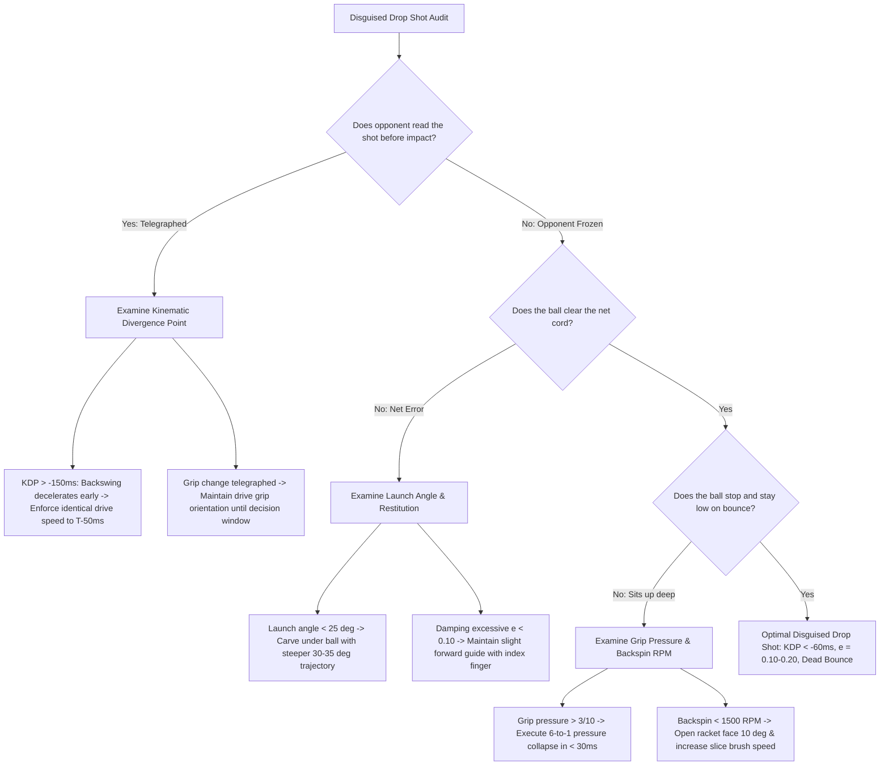

# ART-090: Drop Shot Disguise and Soft-Tissue Impact Damping

> **PRO CUE:** Drop Shot = **Psychological Weapon + Soft-Tissue Mechanics**. Disguise: Setup identical to a topspin drive → Soften hands only at the final millisecond. Impact: Finger release + Wrist absorption = **Coefficient of Restitution $e \approx 0.1\text{–}0.2$** (versus $0.8$ on drives). Training the "Invisible Drop" freezes opponents on the baseline.

---

## 1. Executive Summary & Athletic Intent

The drop shot is a high-finesse, backspin-dominant stroke executed to land softly and terminate just beyond the net, forcing deep-court opponents into a desperate forward sprint. Its decisive tactical value hinges on two biomechanical pillars:
1. **Kinematic Disguise**: Maintaining a preparation and swing profile indistinguishable from an aggressive topspin drive until $50\text{ ms}$ prior to ball impact.
2. **Soft-Tissue Impact Damping**: Rapidly de-tensioning the finger flexors and permitting controlled wrist compliance, thereby collapsing the string-ball Coefficient of Restitution ($e$) from $\sim 0.80$ down to $0.10\text{–}0.20$.

This article details the comprehensive **Drop Shot Deception Model**:
* **Identical Setup Kinematics**: Mirroring unit turn, scapular loading, and forward racket acceleration.
* **Late Decision Window**: Preserving the stroke selection fork until the final $50\text{–}100\text{ ms}$ pre-impact threshold.
* **Finger-Wrist Damping Mechanics**: Transitioning from a locked kinematic chain into an active viscoelastic damper.
* **Backspin Hydrodynamics**: Exploiting upward Magnus force to achieve a steep descent trajectory and deadening post-bounce velocity.

The **"Invisible Drop Shot Protocol"** trains players to manipulate opponent affordance perception by masking intention until mechanical deceleration is unavoidable.

---

## 2. Biomechanical & Neurological Foundation

### 2.1 Drop Shot Deception Kinematics

```
DROP SHOT vs. TOPSPIN DRIVE: KINEMATIC TIMELINE
┌─────────────────────────────────────────────────────────────────────────────┐
│  TIMING (ms)   │  TOPSPIN DRIVE              │  DISGUISED DROP SHOT         │
├────────────────┼─────────────────────────────┼──────────────────────────────┤
│  T-500 to T-100│  Unit Turn, Scapular Load,  │  IDENTICAL                   │
│                │  Forward Drive Initiation   │  (Same joint angles & speeds)│
├────────────────┼─────────────────────────────┼──────────────────────────────┤
│  T-100 to T-50 │  Forward Acceleration       │  IDENTICAL                   │
│                │  Racket velocity ascending  │  (Indistinguishable profile) │
├────────────────┼─────────────────────────────┼──────────────────────────────┤
│  T-50 to T-0   │  CONTINUED ACCELERATION     │  DECELERATION + YIELD        │
│  (Decision)    │  → Impact at peak velocity  │  Finger release, Wrist yield │
│                │                             │  Racket speed drops 70–80%   │
├────────────────┼─────────────────────────────┼──────────────────────────────┤
│  T = 0         │  e ≈ 0.75–0.85 (Elastic)    │  e ≈ 0.10–0.25 (Plastic)     │
│  (Impact)      │  Topspin 3,000+ RPM         │  Backspin 1,500–2,500 RPM    │
├────────────────┼─────────────────────────────┼──────────────────────────────┤
│  Post-Impact   │  Full extension, high finish│  COMPACT FOLLOW-THROUGH      │
│                │  across opposite shoulder   │  Terminates at waist height  │
└────────────────┴─────────────────────────────┴──────────────────────────────┘

KEY METRIC: Kinematic Divergence Point (KDP)
Definition: The temporal point where drop shot kinematics deviate from drive kinematics.
• Elite Pro Standard: KDP = -50 ms to -80 ms (Unreadable to human visual latency).
• Club Standard: KDP = -200 ms or earlier (Visually telegraphed; opponent breaks early).
```

### 2.2 Soft-Tissue Impact Damping Mechanics

```
IMPACT PHYSICS: COEFFICIENT OF RESTITUTION (e)
┌─────────────────────────────────────────────────────────────────────────────┐
│  e = v_separation / v_approach                                              │
│                                                                             │
│  TOPSPIN DRIVE (Elastic Collision):                                         │
│  ├── String Bed: Dynamic stiff response (Polyester, 22–26 kg tension)       │
│  ├── Grip Pressure: 5–6 / 10 (Firm isometric hold)                          │
│  ├── Wrist Complex: Rigid, braced against impact shear                      │
│  ├── Fingers: Flexed, locked around pallet                                  │
│  └── e ≈ 0.75–0.85 → Ball exits retaining 75–85% relative approach speed   │
│                                                                             │
│  DISGUISED DROP SHOT (Damped Collision):                                    │
│  ├── String Bed: Same polyester setup                                       │
│  ├── Grip Pressure: 1–2 / 10 at impact (Immediate release)                  │
│  ├── Wrist Complex: Yielding (Controlled 10°–15° eccentric compliance)      │
│  ├── Fingers: Index, middle, and ring flexors relax dynamically             │
│  └── e ≈ 0.10–0.25 → Ball exits at only 10–25% approach speed               │
│                                                                             │
│  ENERGY DISSIPATION FORMULA:                                                │
│  ΔE = 0.5 × m_ball × (v_approach² - v_separation²)                         │
│  The disguised drop shot dissipates 90–95% of incoming kinetic energy       │
│  via viscoelastic damping across the athlete's distal upper limb.           │
└─────────────────────────────────────────────────────────────────────────────┘

BIOMECHANICAL DAMPING PATHWAY:
     Ball Impact Shock
          │
          ├──► Finger Flexors: Rapid eccentric lengthening dissipates kinetic impulse
          │       (Flexor digitorum superficialis/profundus release tension)
          │
          ├──► Wrist Flexor/Extensor Complex: Yielding co-contraction
          │       (Controlled 10°–15° displacement converts kinetic energy to thermal energy)
          │
          └──► Forearm Musculature: Pre-tuned reactive compliance
                  (Pre-activation stiffens to support alignment, then releases at impact threshold)
```

### 2.3 Backspin Stop Hydrodynamics

| Parameter | Topspin Groundstroke Drive | Disguised Backspin Drop Shot |
| :--- | :--- | :--- |
| **Rotational Spin Rate** | $+3,000\text{ RPM}$ (Forward) | **$-1,500\text{ to }-2,500\text{ RPM}$ (Underspin)** |
| **Launch Angle** | $5^\circ\text{–}15^\circ$ upward | **$25^\circ\text{–}35^\circ$ steep ascent** |
| **Trajectory Apex** | $2.0\text{–}3.0\text{ m}$ clearance | **$3.0\text{–}4.5\text{ m}$ floating apex** |
| **Descent Impact Angle** | $10^\circ\text{–}20^\circ$ shallow forward dive | **$45^\circ\text{–}60^\circ$ steep vertical plunge** |
| **Post-Bounce Height Ratio** | $60\%\text{–}80\%$ of drop height | **$5\%\text{–}15\%$ of drop height (Dead bounce)** |
| **Post-Bounce Behavior** | Explosive forward trajectory | **Skids, arrests, or reverses toward net** |
| **Magnus Force Vector** | Downward (Pulls ball into court) | **Upward (Extends float time, steepens drop)** |

---

## 3. Step-by-Step Technical Execution

### Phase 1: Kinematic Identity & Identical Setup

#### Drill 1: Shadow Twin — Drive vs. Drop Calibration
* **Objective:** Ensure visual setup kinematics remain indistinguishable between drives and drop shots.
* **Execution:** Perform a full-speed topspin drive shadow swing, freezing at $T-50\text{ ms}$ pre-impact. Immediately replicate the exact sequence into a drop shot setup, freezing at the identical coordinate.
* **Evaluation:** Capture high-speed multi-angle video to measure joint angles and racket head coordinates at $T-100\text{ ms}$ and $T-50\text{ ms}$.
* **KPI:** Joint angular variance $<5^\circ$; Racket spatial coordinate discrepancy $<5\text{ cm}$.

#### Drill 2: Acceleration Curve Overlay Matching
* **Objective:** Synchronize the acceleration profiles of the drive and drop shot using racket-mounted IMU telemetry.
* **Execution:** Hit 15 aggressive topspin drives to establish the baseline forward acceleration curve ($a$ vs. $t$). Execute disguised drop shots matching the acceleration gradient identically until $T-50\text{ ms}$, followed by an abrupt braking impulse.
* **KPI:** Acceleration curve overlap $>90\%$ across the $T-500\text{ ms}$ to $T-50\text{ ms}$ timeline.

#### Drill 3: Late Decision Reaction Crucible (50 ms Window)
* **Objective:** Train the prefrontal cortex and motor strip to inhibit a committed drive in favor of a soft drop shot.
* **Setup:** Feeder launches mid-court short balls. The player prepares with full drive intensity.
* **Stimulus:** At $T-100\text{ ms}$ prior to impact, an acoustic buzzer or visual LED signals either **"DRIVE"** or **"DROP"**.
* **Volume:** 30 trials with randomized 50/50 distribution.
* **KPI:** Kinematic divergence point sustained within $KDP \le -60\text{ ms}$; execution success $>85\%$.

---

### Phase 2: Finger-Wrist Damping Mastery

#### Drill 4: 6-to-1 Dynamic Grip Pressure Collapse
* **Objective:** Automate instant de-tensioning of the grip from firm drive pressure down to velvet damping.
* **Execution:** Swing forward holding the racket handle at a firm $6/10$ pressure. At $T-50\text{ ms}$ entering the strike zone, collapse grip pressure to $1/10$ within a $30\text{ ms}$ interval. The index finger and thumb maintain alignment while the remaining fingers relax.
* **Volume:** 30 repetitions tracked with pressure-sensor overgrips.
* **KPI:** Pressure drop verified from $6/10$ to $1/10$ in $<35\text{ ms}$.

#### Drill 5: Isometric Wrist Yielding Resistance
* **Objective:** Condition the eccentric strength of the wrist flexors and extensors to prevent joint collapse while allowing controlled absorption.
* **Setup:** A partner or coach applies steady manual resistance against the racket head.
* **Execution:** Player exerts forward pressure, then deliberately yields $10^\circ\text{–}15^\circ$ under eccentric control upon command.
* **Volume:** 3 sets $\times$ 10 repetitions per direction (flexion and extension).
* **KPI:** Controlled $10^\circ\text{–}15^\circ$ angular excursion without wrist buckling.

#### Drill 6: Reflexive Finger Extension Release
* **Objective:** Disengage the digital flexors at contact to kill ball rebound velocity.
* **Execution:** Face soft feeds. Upon string-ball contact, visually release and extend the middle, ring, and pinky fingers away from the grip, maintaining contact solely via the thumb and index finger cradle.
* **Volume:** 30 live repetitions.
* **KPI:** Clear digital extension verified on high-speed video frames during the impact window.

#### Drill 7: Coefficient of Restitution Target Calibration
* **Objective:** Calibrate upper-limb compliance to achieve target $e$ values.
* **Execution:** Feed balls at a calibrated inbound velocity ($v_{\text{approach}} = 20\text{ m/s}$). Measure exit velocity ($v_{\text{separation}}$) via high-speed tracking to calculate $e$.
* **Target:** $e = 0.15 \pm 0.05$.
* **Volume:** 20 controlled trials.
* **KPI:** $e$ consistency maintained within $\pm 0.03$ across 15 of 20 trials.

---

### Phase 3: Backspin & Trajectory Engineering

#### Drill 8: High-Apex Descent Gate
* **Objective:** Master the parabolic flight path that drops vertically inside the service box.
* **Setup:** Position target cones $0.5\text{ m}$, $1.0\text{ m}$, and $1.5\text{ m}$ past the net cord.
* **Execution:** Launch drop shots with an initial upward angle of $30^\circ\text{–}35^\circ$, achieving a $3.0\text{–}4.0\text{ m}$ apex with heavy backspin ($-2,000\text{ RPM}$).
* **Volume:** 20 repetitions.
* **KPI:** Landing zone accuracy $>80\%$ inside the $1.5\text{ m}$ target zone with steep downward descent.

#### Drill 9: Backspin Arrest Verification
* **Objective:** Ensure backspin RPM is sufficient to arrest forward roll post-impact.
* **Execution:** Execute drop shots and assess secondary bounce dynamics on a hard court surface.
* **KPI:** Secondary bounce height $<15\%$ of drop height; ball remains stationary or rolls backward toward the net.

---

### Phase 4: Tactical Integration & Competitive Pressure

#### Drill 10: Drive-Drop Alternation Rally
* **Objective:** Integrate disguised drop shots into realistic live-ball baseline exchanges.
* **Setup:** Cross-court baseline rally. Every 3–4 balls, the player must execute a fully disguised drop shot off an incoming neutral ball.
* **Execution:** The rally partner must hold their baseline position until ball impact, reacting only after visual cues emerge.
* **Volume:** 20 drop shot attempts within live rallies.
* **KPI:** Partner caught flat-footed or wrong-footed on $>70\%$ of drop attempts.

#### Drill 11: High-Stakes Pressure Drops
* **Objective:** Preserve disguise and soft hands under severe psychological arousal.
* **Setup:** Simulated high-leverage points (30-30, 40-30, Break Point).
* **Rule:** The player must conclude the point using a baseline disguised drop shot.
* **Volume:** 10 simulated high-pressure points.
* **KPI:** Successful technical execution score $>7/10$; Point conversion rate $>50\%$.

#### Drill 12: High-Lactate Disguise Integrity Test
* **Objective:** Audit $KDP$ and energy absorption under metabolic distress.
* **Protocol:** Complete a 4-minute anaerobic sprint circuit, followed immediately by 10 live-rally disguised drop shots.
* **KPI:** $KDP \le -70\text{ ms}$; $e < 0.22$; Target landing accuracy degradation $<15\%$ compared to rested baseline.

---

## 4. Performance Metrics & Training Dosage

### Biomechanical Progression Framework

| Metric | Developing | Competent | Advanced | Elite (Drop Master) |
| :--- | :--- | :--- | :--- | :--- |
| **Kinematic Divergence Point ($KDP$)** | $<-200\text{ ms}$ | $-100\text{ to }-150\text{ ms}$ | $-60\text{ to }-100\text{ ms}$ | **$-50\text{ to }-80\text{ ms}$** |
| **Acceleration Curve Overlay Match** | $<70\%$ | $70\%\text{–}85\%$ | $85\%\text{–}95\%$ | **$>95\%$ to $T-50\text{ ms}$** |
| **Coefficient of Restitution ($e$)** | $>0.40$ | $0.25\text{–}0.40$ | $0.15\text{–}0.25$ | **$0.10\text{–}0.20$** |
| **Grip Pressure Collapse Speed** | $>100\text{ ms}$ | $50\text{–}100\text{ ms}$ | $30\text{–}50\text{ ms}$ | **$<30\text{ ms}$ ($6\rightarrow 1$)** |
| **Wrist Compliance Displacement** | Uncontrolled collapse | $15^\circ\text{–}20^\circ$ | $10^\circ\text{–}15^\circ$ | **$8^\circ\text{–}12^\circ$ (Controlled yield)** |
| **Target Landing Accuracy ($<1.5\text{ m}$)** | $<50\%$ | $50\%\text{–}70\%$ | $70\%\text{–}85\%$ | **$>85\%$** |
| **Backspin Rotational Output** | $>-800\text{ RPM}$ | $-800\text{ to }-1,500$ | $-1,500\text{ to }-2,200$ | **$-2,000\text{ to }-3,000\text{ RPM}$** |
| **Post-Bounce Height Ratio** | $>30\%$ | $20\%\text{–}30\%$ | $10\%\text{–}20\%$ | **$<10\%$** |
| **Opponent Freeze Ratio** | $<40\%$ | $40\%\text{–}60\%$ | $60\%\text{–}75\%$ | **$>75\%$ wrong-footed** |
| **Pressure Situational Conversion** | $<40\%$ | $40\%\text{–}55\%$ | $55\%\text{–}70\%$ | **$>70\%$** |

### Weekly Periodization Dosage

* **Kinematic Identity & Shadow Calibration:** $3\times/\text{week}$, $15\text{ min}$ (Drills 1–3).
* **Distal Damping & Grip De-tensioning:** $3\times/\text{week}$, $15\text{ min}$ (Drills 4–7).
* **Trajectory Control & Spin Calibration:** $2\times/\text{week}$, $15\text{ min}$ (Drills 8–9).
* **Tactical Integration & Match Pressure:** $2\times/\text{week}$, $15\text{ min}$ (Drills 10–12).
* **Total Weekly Dedication:** $\sim 60\text{ minutes}$ of dedicated drop shot technical development.

---

## 5. Errors, Causes & Correction Protocols

| Visual Failure Mode | Root Biomechanical Etiology | Technical Correction Protocol |
| :--- | :--- | :--- |
| **Telegraphed Execution (Read Early)** | Early Kinematic Divergence ($KDP > -150\text{ ms}$); Player visibly decelerates backswing or changes preparation posture. | Shadow Twin protocol (500+ reps); late-decision signal drill; Cue: *"Drive until the final inch — Drop at the last breath."* |
| **Excessive Bounce Height (Sits Up)** | Insufficient backspin; elevated restitution ($e > 0.30$); string-bed pushing rather than carving. | Dynamic finger release drill; open racket face $10^\circ$; increase brush-to-exit ratio to $>1.5$. |
| **Net Cord Collisions** | Insufficient launch angle ($<25^\circ$); Excessive damping ($e < 0.10$); hitting flat rather than lofting. | Implement the $3.0\text{ m}$ apex gate; elevate trajectory over net cord; Cue: *"High over the tape — Plunge down."* |
| **Deep Landing Errors** | Over-gripping at impact ($>4/10$); Ineffective wrist yielding; ball retains approach momentum. | 6-to-1 grip pressure collapse; enforce eccentric wrist compliance; establish tactile finger release. |
| **Wrist Pain or Strain** | Muscular bracing against impact; wrist collapses into unbuffered extension. | Isometric wrist yielding drill; forearm flexor strengthening; relax baseline grip tension to $2/10$. |
| **Disguise Breakdown Under Pressure** | Sympathetic arousal induces premature motor commitment and early deceleration. | High-pressure situational drills; tactical diaphragmatic breathing; structured pre-shot motor routine. |
| **Inability to Impart Backspin** | Closed racket face orientation; incorrect swing plane trajectory. | Adopt Continental grip (ART-087); implement high-to-low slice carving mechanics (ART-088). |

---

## 6. Diagnostic Diagram & Decision Flow



---

## 7. Video Demonstration & Technical Analysis

<div class="video-container" style="position:relative;padding-bottom:56.25%;height:0;overflow:hidden;border-radius:12px;">
  <iframe src="https://www.youtube-nocookie.com/embed/VIDEO_ID_PLACEHOLDER"
          style="position:absolute;top:0;left:0;width:100%;height:100%;border:0;"
          allow="accelerometer; autoplay; clipboard-write; encrypted-media; gyroscope; picture-in-picture"
          allowfullscreen
          title="Drop Shot Disguise and Soft-Tissue Impact Damping — Technical Demonstration"></iframe>
</div>

*Recommended Technical Video Inclusions:*
* High-speed kinematic overlay comparing an aggressive drive versus a disguised drop shot, demonstrating identical joint angles until $T-50\text{ ms}$.
* 2,000 FPS macro capture of distal finger relaxation and wrist compliance during string-ball collision.
* Comparative ball tracking contrasting energy dissipation and rebound velocity ($e = 0.82$ vs. $e = 0.14$).
* Stroboscopic bounce-trail rendering depicting backspin arrest versus forward topspin roll.
* Tactical match footage analyzing deceptive drop shot executions from tour icons (Federer, Djokovic, Alcaraz, Jabeur).
* Telemetry comparison showing motor execution stability under resting versus elevated heart rate conditions.

---

## 8. Cross-Domain Synergy & Multi-Pillar Integration

* **Continental Grip Mechanics (ART-087):** The disguised drop shot relies fundamentally on the Continental grip or an Eastern variant that permits rapid transition into a soft carving angle without telegraphing.
* **Slice Family Mechanics (ART-088):** Operates as a specialized, low-velocity branch of the slice family, utilizing equivalent underspin physics while truncating the kinetic follow-through.
* **Forehand 5-Phase Model (ART-081):** Phases 1–3 of the drop shot (unit turn, lag drop, hip initiation) must remain identical to the baseline drive to preserve tactical deception.
* **One-Handed Backhand Extension (ART-085):** For one-handed backhand drop shots, maintaining a straight-arm lockout with an active non-dominant counter-extension anchors the shoulder girdle during impact absorption.
* **Affordance Perception (ART-067):** Exploits the opponent’s predictive neural heuristics by simulating a deep drive affordance, freezing their split-step initiation.
* **Inhibitory Motor Control (ART-069):** Demands late neural inhibition via prefrontal-basal ganglia pathways to interrupt a ballistic motor program within a $50\text{ ms}$ window.
* **Tactical Heuristics (ART-123, ART-129):** Serves as an essential pattern disruptor, breaking cross-court baseline attrition rallies when the opponent retreats behind the baseline.
* **Joint Protection & Injury Prevention (ART-196):** Soft-tissue viscoelastic damping absorbs $90\%\text{–}95\%$ of impact shock, shielding the elbow and shoulder from high vibrational loads.

---

## 9. Self-Assessment Rubric

| Evaluation Parameter | Level 1: Telegraphed Push | Level 2: Partial Disguise | Level 3: Functional Ghost | Level 4: Invisible Mastery |
| :--- | :--- | :--- | :--- | :--- |
| **Kinematic Divergence ($KDP$)** | $<-200\text{ ms}$ | $-100\text{ to }-150\text{ ms}$ | $-60\text{ to }-100\text{ ms}$ | **$-50\text{ to }-80\text{ ms}$** |
| **Acceleration Match** | $<70\%$ | $70\%\text{–}85\%$ | $85\%\text{–}95\%$ | **$>95\%$ to $T-50\text{ ms}$** |
| **Restitution Index ($e$)** | $>0.40$ | $0.25\text{–}0.40$ | $0.15\text{–}0.25$ | **$0.10\text{–}0.20$** |
| **Grip Pressure Speed** | $>100\text{ ms}$ | $50\text{–}100\text{ ms}$ | $30\text{–}50\text{ ms}$ | **$<30\text{ ms}$** |
| **Wrist Compliance** | Collapse | $15^\circ\text{–}20^\circ$ | $10^\circ\text{–}15^\circ$ | **$8^\circ\text{–}12^\circ$ (Controlled)** |
| **Target Zone Precision** | $<50\%$ | $50\%\text{–}70\%$ | $70\%\text{–}85\%$ | **$>85\%$** |
| **Backspin Arrest Effect** | Forward roll | Partial skid | Visible arrest | **Reverses toward net** |
| **High-Pressure Success** | $<40\%$ | $40\%\text{–}55\%$ | $55\%\text{–}70\%$ | **$>70\%$** |

*Scoring Interpretation:*
* **8–16 Points:** Severe execution leak; drop shot is visually broadcast and easily punished.
* **17–23 Points:** Developing touch; inconsistent disguise against alert competitors.
* **24–29 Points:** Reliable competitive asset; produces consistent baseline freezes.
* **30–32 Points:** Tour-level mastery; flawless deception with deadening backspin absorption.

---

## 10. Printable Practice Card (Pocket Drill Card)

```
┌────────────────────────────────────────────────────────────────────────────┐
│                    DISGUISED DROP SHOT PRACTICE CARD                       │
│ Session Goals: KDP -50 to -80ms, e = 0.10-0.20, Landing >85%, Backspin Stop│
├────────────────────────────────────────────────────────────────────────────┤
│ BLOCK A: Warm-Up & Kinematic Mirroring (5 Min)                             │
│ • Shadow Twin Series: 10 pairs (Drive freeze vs. Drop freeze)              │
│ • Acceleration Gradient Matching: 10 repetitions matching drive telemetry  │
│ • Late Decision Reaction Drill: 15 randomized auditory/visual trials       │
│ Cue: "Identical to 50ms — Freeze the Opponent — Absorb on Contact"        │
├────────────────────────────────────────────────────────────────────────────┤
│ BLOCK B: Distal Damping & Energy Absorption (20 Min)                       │
│ • 6-to-1 Dynamic Grip Pressure Collapse: 30 reps (Drop to 1/10 in <30ms)   │
│ • Isometric Wrist Yielding Resistance: 30 controlled eccentric reps        │
│ • Reflexive Finger Extension Release: 30 live-contact drops                │
│ • Restitution Target Calibration: 20 feeds (Target: e = 0.15 ± 0.05)       │
│ Cue: "6-to-1 in 30ms — Wrist Yields — Fingers Open — Dead Ball"            │
├────────────────────────────────────────────────────────────────────────────┤
│ BLOCK C: Trajectory & Surface Arrest (15 Min)                              │
│ • 3.5m Apex Parabolic Gate: 20 drops over cord landing inside 1.5m         │
│ • Backspin Surface Arrest Verification: Verify zero forward roll           │
│ • Drive-Drop Live Baseline Alternation: 20 attempts within live rallies    │
│ Cue: "High Apex — Steep Plunge — Backspin Bite — Zero Roll"                │
├────────────────────────────────────────────────────────────────────────────┤
│ BLOCK D: High-Stress Integration (10 Min)                                  │
│ • High-Stakes Pressure Drops: 10 match-simulation sudden death points      │
│ • Post-Sprint High-Lactate Audit: 10 drops following 4-min HIIT sprint     │
│ Cue: "Composed Mind — Soft Hands Under Fire — Complete Deception"          │
├────────────────────────────────────────────────────────────────────────────┤
│ Weekly Cadence: 2 sessions/week | Progression Gateway: 3 consecutive       │
│ sessions with KDP < -70ms, e < 0.20, and Landing Accuracy > 85%.           │
└────────────────────────────────────────────────────────────────────────────┘
```

---

*Cross-References: ART-067, ART-069, ART-073, ART-081, ART-085, ART-087, ART-088, ART-123, ART-129, ART-196. Pillar III: Stroke Mechanics & Ball Striking — TennisKB 200.*
