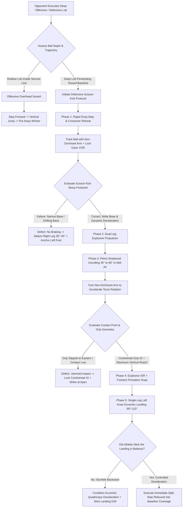

# ART-092: Defensive Overhead Scissor-Kick Mechanics

> **PRO CUE:** Defensive Overhead = **Not a "Jump Smash"**. The scissor-kick is an airborne kinetic brake: **Outside leg abducts outward 30°–45°, Inside leg plants and brakes backward momentum, Pelvis explosive rotation opens 45°→90°, Kinetic energy channels from ground reaction forces $\to$ hips $\to$ thoracic catapult $\to$ racket snap**. Strict Continental grip, Maximum reachable contact height, Explosive forearm pronation. Train the "Scissor Overhead" to transform desperate retreat into an aggressive counter-attacking weapon.

---

## 1. Executive Summary & Athletic Intent

The defensive overhead occurs when an opponent executes a high, penetrating lob that forces the player to **rapidly retreat backward, become airborne, and strike an overhead from a suboptimal, receding baseline position**. Unlike an offensive overhead—where the ball is short and momentum drives forward into the court—the defensive overhead requires the specialized recruitment of **Scissor-Kick Biomechanics**:
1. **Outside Leg Abduction**: The outside leg (right leg for a right-handed player) **abducts laterally $30^\circ\text{–}45^\circ$**, establishing an expansive airborne base of support.
2. **Inside Leg Linear Deceleration**: The inside leg (left leg) **plants and brakes**, arresting backward linear inertia.
3. **Pelvic Rotation Engine**: The pelvis explosively uncoils from $45^\circ$ to $90^\circ$ open toward the net, transferring rotational torque vertically into the shoulder girdle.

This article defines the comprehensive **Defensive Overhead 5-Phase Model**:
1. **Retreat & Read Phase**: High-speed drop-step/backpedal with cranium stabilization and optical non-dominant tracking.
2. **Scissor-Kick Setup Phase**: Outside leg abduction coupled with inside leg eccentric plant.
3. **Airborne Jump & Pelvic Rotation Phase**: Coordinated dual-leg propulsion driving $45^\circ \to 90^\circ$ pelvic uncoiling.
4. **Contact & Pronation Snap Phase**: Striking at the absolute apex of reach with a Continental grip, internal shoulder rotation (ISR), and rapid forearm pronation.
5. **Eccentric Landing & Recovery Phase**: Lead inside leg absorbing landing forces at $90^\circ\text{–}110^\circ$ knee flexion followed immediately by a recovery split-step.

The athletic intent encompasses three primary objectives:
* **Airborne Kinetic Foundation**: Reframing the scissor-kick not as an aesthetic jump for vertical height, but as an airborne braking mechanism that constructs a stable foundation in mid-air.
* **Pelvic Torque Domination**: Demonstrating that defensive overhead pace and directional control originate from **pelvic rotational torque**, completely bypassing arm strain and rotator cuff overload.
* **Elimination of "Let-Bounce" Hesitation**: Equipping competitive athletes with the technical security to attack deep lobs out of the air rather than retreating into compromised baseline scramble positions.

---

## 2. Biomechanical & Neurological Foundation

### 2.1 Scissor-Kick Biomechanical Architecture

```
DEFENSIVE OVERHEAD SCISSOR-KICK SEQUENCE (Right-Handed Player):
┌─────────────────────────────────────────────────────────────────────────────┐
│  PHASE 1: RETREAT & GAZE STABILIZATION                                      │
│  ├── Immediate drop-step into crossover / backpedal strides                 │
│  ├── Cranium stabilized in space; Vestibulo-Ocular Reflex (VOR) locked      │
│  ├── Non-dominant arm tracks upward toward the incoming ball                │
│  └── Kinetic center loaded on the balls of the feet                         │
│                                                                             │
│  PHASE 2: SCISSOR-KICK DYNAMIC SETUP (Critical Link)                        │
│  ├── Outside Leg (Right): ABDUCTS laterally 30°–45° → Creates wide base     │
│  ├── Inside Leg (Left): PLANTS & BRAKES → Arrests backward linear inertia   │
│  ├── Pelvis PRE-COILS at 45° angle relative to baseline                     │
│  ├── Trunk exhibits lateral flexion tilt away from the ball plane          │
│  └── Racket drops behind thoracic spine (Continental grip #2, edge-first)   │
│                                                                             │
│  PHASE 3: AIRBORNE JUMP & PELVIC ROTATION                                   │
│  ├── Explosive push-off from BOTH limbs (Right abduction + Left brake push) │
│  ├── Pelvic rotation fires violently: 45° → 90° open toward net             │
│  ├── Trunk un-tilts rapidly from lateral flexion → Converts torque upward   │
│  └── Non-dominant arm tucks tightly to ribcage (Conservation of AM)        │
│                                                                             │
│  PHASE 4: CONTACT POINT & PRONATION SNAP                                    │
│  ├── Impact elevation: Absolute highest reachable vertical apex             │
│  ├── Continental grip held firm (6/10 at impact)                            │
│  ├── Explosive Internal Shoulder Rotation (ISR) + Forearm Pronation Snap    │
│  ├── Micro wrist flexion (10°–15°) drives downward trajectory into court    │
│  └── Target: Deep center baseline or extreme cross-court angle             │
│                                                                             │
│  PHASE 5: SINGLE-LEG LANDING & RECOVERY                                     │
│  ├── Left (Inside) leg lands FIRST, absorbing kinetic descent               │
│  ├── Knee flexion: 90°–110° eccentric quadriceps deceleration               │
│  ├── Right (Outside) leg trails back for counter-balance stabilization      │
│  └── Immediate rebound split-step: Transition into next defensive coverage  │
└─────────────────────────────────────────────────────────────────────────────┘
```

### 2.2 Defensive vs. Offensive Overhead: Biomechanical Comparison

| Biomechanical Parameter | Offensive Overhead (Attack) | Defensive Scissor-Kick Overhead |
| :--- | :--- | :--- |
| **Incoming Ball Trajectory** | Short, floating, shallow depth | Deep, high, penetrating lob near baseline |
| **Athlete Momentum Vector** | Moving forward toward the net | **Moving rapidly BACKWARD away from net** |
| **Kinetic Base Architecture** | Compact, linear forward plant | **EXPANSIVE, abducted outside leg ($30^\circ\text{–}45^\circ$)** |
| **Pelvic Dynamics** | Minimal rotation; linear trunk flexion | **EXPLOSIVE rotational uncoiling ($45^\circ \to 90^\circ$)** |
| **Thoracic / Trunk Plane** | Upright spine, forward abdominal crunch | **Lateral flexion tilt $\to$ Explosive un-tilt** |
| **Contact Point Geometry** | Extended $30\text{ cm}$ in front of forehead | **Maximum vertical reach, slightly posterior to ideal** |
| **Primary Power Generator** | Vertical leg drive + Forward linear inertia | **Ground Reaction Force braking $\to$ Pelvic torque** |
| **Tactical Objective** | Direct point-ending winner | **Neutralization + Deep placement + Counter-attack** |
| **Recovery Requirement** | Close forward to the net | **Absorb landing $\to$ Immediate split-step at baseline** |

### 2.3 Energy Transfer Mechanics in the Scissor-Kick

```
ENERGY FLOW DYNAMICS: Scissor-Kick Overhead Engine
┌─────────────────────────────────────────────────────────────────────────────┐
│  GROUND REACTION FORCES (GRF):                                              │
│  ├── Right Leg (Abducted): Delivers horizontal + vertical vector            │
│  ├── Left Leg (Braking): Delivers violent horizontal linear arrest          │
│  └── Combined GRF vectors synthesize into HIGH PELVIC ROTATIONAL TORQUE     │
│                                                                             │
│  KINETIC CHAIN TRANSFER:                                                    │
│  Pelvic Rotation (45°→90°) → Lumbar Rotation → Thoracic Catapult            │
│       ↓                                                                      │
│  Scapular Protraction → Glenohumeral Horizontal Adduction                   │
│       ↓                                                                      │
│  Internal Shoulder Rotation (ISR) + Elbow Extension + Forearm Pronation     │
│       ↓                                                                      │
│  TERMINAL RACKET HEAD VELOCITY SNAP (>140 km/h)                             │
│                                                                             │
│  FUNDAMENTAL MECHANICAL DIVERGENCE:                                         │
│  Offensive: Vertical Leg Drive UP → Linear Trunk Flexion $\to$ Forward Ball │
│  Defensive: Dynamic GRF Braking $\to$ ROTATIONAL TORQUE $\to$ Downward Ball │
└─────────────────────────────────────────────────────────────────────────────┘
```

---

## 3. Step-by-Step Technical Execution

### Phase 1: Retreat & Scissor-Kick Setup Dynamics

#### Drill 1: Backpedal-to-Scissor Transition Decoupling
* **Biomechanical Objective:** Condition rapid arrest of backward linear momentum via outside leg abduction and inside leg braking.
* **Execution:** Starting at the service line, coach feeds a deep lob. Player executes 3–4 rapid crossover/backpedal strides. Upon reaching the drop zone, the outside (right) leg abducts $45^\circ$ laterally while the inside (left) leg plants firmly into the court surface. Hold the plant position for 3 seconds.
* **Checkpoints:** Wide base ($>1.5\times$ shoulder width), pelvis coiled at $45^\circ$, spine tilted laterally away from ball, racket slotted behind the upper back.
* **Volume:** 20 repetitions. Target setup time: $<2.2\text{ seconds}$ from coach contact.

#### Drill 2: Scissor-Kick Mirror Shadow Progression
* **Biomechanical Objective:** Groove the 5-phase kinetic chain in front of a feedback mirror without visual distraction from the ball.
* **Execution:** From ready position: Retreat 3 steps $\to$ Abduct right leg $\to$ Brake left leg $\to$ Coil hips $\to$ Tilt spine $\to$ Drop racket $\to$ Jump $\to$ Uncoil pelvis $90^\circ$ $\to$ Snap pronation at peak reach $\to$ Land left leg first.
* **Volume:** 15 slow-motion repetitions followed by 15 maximum-velocity repetitions. Video analysis audit.

#### Drill 3: Non-Dominant Arm Tracking & Tuck Protocol
* **Biomechanical Objective:** Harness the law of conservation of angular momentum via rapid non-dominant arm tucking.
* **Execution:** Player retreats tracking deep lob feeds with the non-dominant arm fully extended toward the ball. At the exact millisecond of two-leg push-off, the non-dominant arm aggressively tucks into the anterior ribcage.
* **Biomechanical Result:** Decreasing the radius of gyration immediately accelerates upper trunk and shoulder rotational velocity.
* **Volume:** 20 live feeds. KPI: $100\%$ tracking-to-tuck compliance.

---

### Phase 2: Jump, Pelvic Rotation & Contact Execution

#### Drill 4: Dual-Leg Explosive Push & Pelvic Uncoiling
* **Biomechanical Objective:** Maximize vertical and rotational impulse derived from simultaneous dual-leg ground reaction forces.
* **Execution:** From the stationary scissor-kick setup stance, push off violently from both limbs simultaneously. In mid-air, snap the pelvis open from $45^\circ$ to $90^\circ$ facing the net while the upper torso un-tilts vertically.
* **Volume:** 15 repetitions (dry swing). High-speed video analysis tracking pelvic rotational velocity.

#### Drill 5: 3 kg Medicine Ball Scissor Overhead Throw
* **Biomechanical Objective:** Integrate full-body kinetic sequencing under high-load resistance.
* **Execution:** Hold a $2\text{–}3\text{ kg}$ medicine ball with both hands overhead in the scissor setup stance. Jump, explosively uncoil the pelvis, and catapult the medicine ball upward and forward into a target wall.
* **Checkpoints:** Energy must surge from the lead hip brake into the thoracic wall; zero lumbar hyperextension strain.
* **Volume:** 3 sets $\times$ 8 repetitions.

#### Drill 6: Apex Contact Target & Continental Pronation Snap
* **Biomechanical Objective:** Train contact point elevation at maximum reachable vertical reach combined with full forearm pronation.
* **Execution:** Feed high lobs to mid-court/deep transition. Player executes scissor overhead, striking the ball at the absolute zenith of vertical reach using a strict Continental grip (Bevel #2) and snapping through internal shoulder rotation and forearm pronation.
* **Target:** Drive the ball deep into court corners ($>80\%$ depth accuracy).
* **Volume:** 30 overhead deliveries. KPI: Pronation snap visible on high-speed video; zero flat-face pushing.

---

### Phase 3: Deceleration, Landing & Dynamic Recovery

#### Drill 7: Single-Leg Stick Landing & Eccentric Absorption
* **Biomechanical Objective:** Protect knee patellofemoral and cruciate ligaments via controlled single-leg eccentric quadriceps deceleration.
* **Execution:** From mid-air scissor overhead execution, enforce landing **strictly on the left (inside) leg first**, absorbing ground collision forces through $90^\circ\text{–}110^\circ$ of knee flexion. The right leg trails behind to arrest backward momentum.
* **Target:** Silent, stable landing followed by an explosive rebound split-step within $<0.8\text{ seconds}$.
* **Volume:** 15 repetitions with force plate or balance auditing.

#### Drill 8: Elastic Resistance Band Perturbation Landing
* **Biomechanical Objective:** Build eccentric stabilization under disruptive lateral and posterior forces.
* **Execution:** Anchor a heavy resistance band around the player's waist pulling backward. Perform the full scissor overhead against band tension and stick the single-leg landing without stumbling.
* **Volume:** 12 repetitions. KPI: Zero loss of post-landing balance.

---

### Phase 4: Tactical Directional Variations & Competitive Pressure

#### Drill 9: Quad-Zone Tactical Placement Series
* **Biomechanical Objective:** Execute precise directional control across four distinct defensive tactical scenarios.
* **Execution:** Feeder delivers randomized deep lob trajectories:
  1. *Deep Center Lob:* Scissor overhead driven deep through the center baseline (Neutralizing shot).
  2. *Deep Wide Forehand Lob:* Scissor overhead angled cross-court with sharp sidespin (Counter-attacking angle).
  3. *Deep Backhand Over-the-Shoulder Lob:* Scissor overhead driven inside-out (Emergency repositioning).
  4. *Short Lob:* Transition into offensive smash drive (Put-away winner).
* **Volume:** 20 repetitions (5 per sector). KPI: Target accuracy $>80\%$.

#### Drill 10: The Lob-Overhead Siege Battle
* **Biomechanical Objective:** Eliminate psychological hesitation and eradicate the "let-it-bounce" failure pattern.
* **Execution:** Continuous competitive game to 11 points. Coach/partner only feeds offensive topspin and defensive lobs. The player is forbidden from letting any ball bounce inside the baseline; every ball must be attacked out of the air via scissor-kick overhead.
* **Volume:** 2 full games. KPI: Win rate $>60\%$; Zero let-bounce violations.

#### Drill 11: High-Leverage Pressure Crucible
* **Biomechanical Objective:** Preserve scissor-kick mechanics during critical match scorelines (15-30, 30-40, Break Point).
* **Execution:** Play simulated break-point scenarios initiated by a deep penetrating lob. Player must execute full routine: VOR lock $\to$ Scissor setup $\to$ Pelvic snap $\to$ Stick landing $\to$ Recovery.
* **Volume:** 10 pressure points. KPI: Technical mechanical score $\ge 8.0/10$; point conversion $>50\%$.

---

### Phase 5: High-Lactate Mechanical Integrity

#### Drill 12: High-Fatigue Scissor Overhead Structural Audit
* **Biomechanical Objective:** Ensure outside leg abduction, pelvic braking, and contact reach do not collapse under severe metabolic fatigue.
* **Execution:** Administer a 4-minute high-intensity sprint circuit (HIIT), followed immediately by 15 full-power defensive overhead deliveries against randomized deep lobs.
* **Target:** Setup latency variance $<+0.3\text{ seconds}$; pelvic rotational amplitude maintained $>80\%$ of fresh baseline; contact reach maintained $>90\%$; zero landing stumbles.
* **Volume:** 1 high-fatigue test bi-weekly.

---

## 4. Performance Metrics & Training Dosage

### Biomechanical Progression Framework

| Performance Parameter | Developing | Proficient | Advanced | Elite (Tour Overhead Master) |
| :--- | :--- | :--- | :--- | :--- |
| **Setup Time (Retreat to Plant)** | $>3.5\text{ s}$ | $2.5\text{–}3.5\text{ s}$ | $2.0\text{–}2.5\text{ s}$ | **$<2.0\text{ s}$** |
| **Outside Leg Abduction Angle** | $<20^\circ$ (Narrow) | $20^\circ\text{–}30^\circ$ | $30^\circ\text{–}40^\circ$ | **$35^\circ\text{–}45^\circ$** |
| **Pelvic Rotational Amplitude** | $<30^\circ$ (Arm dominated) | $30^\circ\text{–}45^\circ$ | $45^\circ\text{–}60^\circ$ | **$60^\circ\text{–}90^\circ$ explosive open** |
| **Contact Height (% Max Reach)** | $<80\%$ | $80\%\text{–}90\%$ | $90\%\text{–}95\%$ | **$95\%\text{–}100\%$ absolute apex** |
| **Pronation Snap Velocity** | Negligible / Push | Moderate | High velocity | **Explosive ISR + Forearm pronation ($>1,800^\circ/\text{s}$)** |
| **Target Placement Depth** | $<50\%$ inside zone | $50\%\text{–}70\%$ | $70\%\text{–}85\%$ | **$>85\%$ depth/corner precision** |
| **Landing Stability & Balance** | Stumble / Fall | Mild knee wobble | Controlled plant | **Solid stick landing + Split ready in $<0.8\text{ s}$** |
| **"No-Bounce" Tactical Decision** | $<70\%$ compliance | $70\%\text{–}85\%$ | $85\%\text{–}95\%$ | **$100\%$ airborne commitment** |
| **Competitive Pressure Conversion**| $<40\%$ | $40\%\text{–}55\%$ | $55\%\text{–}70\%$ | **$>70\%$ points won** |
| **Fatigue Mechanical Retention** | $<60\%$ | $60\%\text{–}75\%$ | $75\%\text{–}85\%$ | **$>85\%$ kinematic preservation** |

### Weekly Periodized Training Dosage

* **Retreat Footwork & Dynamic Setup:** $2\times/\text{week}$, 15 minutes (Drills 1–3).
* **Airborne Propulsion, Rotation & Contact:** $3\times/\text{week}$, 20 minutes (Drills 4–6).
* **Eccentric Landing & Joint Protection:** $2\times/\text{week}$, 10 minutes (Drills 7–8).
* **Tactical Placement & Pressure Siege:** $2\times/\text{week}$, 20 minutes (Drills 9–11).
* **High-Fatigue Structural Audit:** $1\times/\text{every 2 weeks}$, 10 minutes (Drill 12).
* **Total Volume:** $\sim 75\text{ minutes/week}$ of defensive overhead mechanical conditioning.

---

## 5. Errors, Causes & Correction Protocols

| Observable Technical Defect | Biomechanical Root Cause | Prescriptive Correction Protocol |
| :--- | :--- | :--- |
| **"Narrow outside leg; failure to abduct"** | Habitual straight backpedaling; lack of awareness of airborne lateral base requirements | Scissor-Kick Setup drill ($500+\text{ reps}$); Cognitive Cue: *"Kick right leg wide — Build a wide platform"*. |
| **"Inside leg fails to brake backward momentum"** | Player continues drifting backward through contact; linear momentum leaks upward force | Inside Leg Brake Plant drill; enforce aggressive foot stomp; Cue: *"Anchor the left foot — Slam the brakes"*. |
| **"Arm-dominant swipe with $<30^\circ$ hip turn"** | Cognitive misconception that overhead power is generated by shoulder flexion | Dual-Leg Explosive Jump drill; 3 kg Medball scissor throws; Cue: *"Hips drive the arm — Pelvis uncoils first"*. |
| **"Low, jammed contact point below maximum reach"** | Late retreat timing; premature jump before ball arrives; excessive lumbar hyperextension | Apex Contact Target drill; Non-dominant arm tracking drill; Cue: *"Track with left hand — Strike at the sky"*. |
| **"Ball pushed flat with no downward angle"** | Incorrect grip (Eastern forehand); absence of forearm pronation snap; no wrist flexion | Strict Continental Grip lock; Forearm pronation isolation against wall; Cue: *"Carve the ball down with the edge"*. |
| **"Stumbling or collapsing on landing"** | Deficient eccentric quadriceps strength; failing to land on inside leg first | Single-Leg Stick Landing drill; Band-resisted landing training; Bulgarian split squats. |
| **"Hesitation: Letting deep lobs bounce"** | Psychological fear of mistiming airborne strikes; deficient VOR gaze stabilization | Lob-Overhead Siege Battle ($1,000+\text{ reps}$); Absolute rule: *"Never let it bounce — Attack in mid-air"*. |
| **"Mechanical breakdown under match fatigue"** | Lower-limb fatigue compromises outside leg abduction and braking impulse | Lower-body plyometric conditioning; enforce rapid exhale during pelvic uncoiling; bi-weekly fatigue audits. |

---

## 6. Diagnostic Diagram & Decision Flow



---

## 7. Video Demonstration & Technical Analysis

<div class="video-container" style="position:relative;padding-bottom:56.25%;height:0;overflow:hidden;border-radius:12px;">
  <iframe src="https://www.youtube-nocookie.com/embed/VIDEO_ID_PLACEHOLDER"
          style="position:absolute;top:0;left:0;width:100%;height:100%;border:0;"
          allow="accelerometer; autoplay; clipboard-write; encrypted-media; gyroscope; picture-in-picture"
          allowfullscreen
          title="Defensive Overhead Scissor-Kick Mechanics — Technical Analysis"></iframe>
</div>

*Recommended Technical Video Inclusions:*
* High-speed 3D motion-capture rendering of the scissor-kick footwork, highlighting outside leg abduction ($35^\circ\text{–}45^\circ$) and inside leg braking vectors.
* Dual force plate graphical overlay detailing ground reaction force arrest of backward linear momentum.
* Slow-motion (1,000 FPS) breakdown of upper-body mechanics: non-dominant arm tracking and tucking, pelvic uncoiling from $45^\circ$ to $90^\circ$, and terminal forearm pronation snap.
* Comparative kinematic sequence: Offensive overhead (linear forward push) versus Defensive overhead (rotational scissor uncoiling).
* Tour-level mechanical case studies of defensive scissor-kick mastery (Novak Djokovic, Daniil Medvedev, Carlos Alcaraz, Pete Sampras).
* High-speed footage contrasting knee joint angles during flawed stiff landings versus optimal eccentric absorption ($90^\circ\text{–}110^\circ$).

---

## 8. Cross-Domain Synergy & Multi-Pillar Integration

* **Serving Kinetic Chain Architecture (ART-084):** The defensive overhead mirrors the serve kinetic chain in reverse. Both strokes share identical internal shoulder rotation (ISR), elbow extension, and forearm pronation dynamics.
* **Split-Step & First-Step Mechanics (ART-083):** Split-step landing serves as the neuro-muscular trigger for the instantaneous drop-step retreat required when reading an offensive lob.
* **Continental Grip Mastery (ART-087):** Strict adherence to Continental bevel #2 is non-negotiable. Using a forehand grip creates dangerous wrist extension shear and ruins downward angular control.
* **Backhand Preparation Architecture (ART-085, ART-086):** The initial drop-step and high racket takeback mirror the unit turn and thoracic coiling patterns used in backhand preparation.
* **Affordance Perception & Trajectory Reading (ART-067):** High, floating ball arcs afford an airborne scissor overhead attack rather than a passive baseline bounce retreat.
* **Vestibular Stabilization & Gaze Control (ART-042, ART-056):** Rapid backward movement demands superior Vestibulo-Ocular Reflex (VOR) function to prevent spatial disorientation while airborne.
* **Lower-Limb Injury Prevention & Deceleration (ART-196, ART-197):** Scissor-kick eccentric landing protocols protect the patellar tendon and ACL by distributing high vertical impact loads across the entire lower kinetic chain.

---

## 9. Self-Assessment Rubric

| Diagnostic Checkpoint | Level 1 (Let Bounce / Stumble) | Level 2 (Awkward Scissor) | Level 3 (Functional Scissor) | Level 4 (Tour-Level Mastery) |
| :--- | :--- | :--- | :--- | :--- |
| **Outside Leg Abduction** | $<20^\circ$ (Parallel stance) | $20^\circ\text{–}30^\circ$ | $30^\circ\text{–}40^\circ$ | **$35^\circ\text{–}45^\circ$ dynamic wide base** |
| **Inside Leg Linear Brake** | Absent (Drifts backward) | Weak deceleration | Functional arrest | **Violent linear arrest into vertical pop** |
| **Pelvic Rotational Torque** | $<30^\circ$ (Arm swipe) | $30^\circ\text{–}45^\circ$ | $45^\circ\text{–}60^\circ$ | **$60^\circ\text{–}90^\circ$ explosive mid-air uncoil** |
| **Contact Apex Reach** | $<80\%$ max reach | $80\%\text{–}90\%$ | $90\%\text{–}95\%$ | **$95\%\text{–}100\%$ absolute vertical reach** |
| **Pronation Snap** | None / Pushed flat | Inconsistent snap | Visible forearm roll | **Explosive ISR + Pronation ($>1,800^\circ/\text{s}$)** |
| **Target Placement Depth** | $<50\%$ inside zone | $50\%\text{–}70\%$ | $70\%\text{–}85\%$ | **$>85\%$ depth/corner accuracy** |
| **Deceleration Landing** | Falls / Severe stumble | Knee wobble | Stable landing | **Solid stick landing + Split in $<0.8\text{ s}$** |
| **Airborne Commitment** | $<70\%$ (Lets bounce) | $70\%\text{–}85\%$ | $85\%\text{–}95\%$ | **$100\%$ airborne attack commitment** |

**Diagnostic Scoring Key:**
* **8–16 Points:** Defensive Overhead Audit Failure. Severe retreat footwork defects; mandatory shadow footwork and balance retraining.
* **17–23 Points:** Transitional Scissor. Inconsistent leg braking and weak pelvic rotation; prone to defensive mishits under pressure.
* **24–29 Points:** Functional Scissor Competence. Reliable court neutralization; capable of converting defensive retreats into neutral rallies.
* **30–32 Points:** Tour-Level Scissor Mastery. Lethal mid-air counter-attacking weapon; explosive pelvic torque and flawless landing mechanics.

---

## 10. Printable Practice Card (Pocket Drill Card)

```
┌────────────────────────────────────────────────────────────────────────┐
│            POCKET DRILL CARD: DEFENSIVE SCISSOR-KICK ENGINE            │
│ Target: Setup <2.0s, Abduct 35-45°, Pelvic Turn 60-90°, Reach >95%     │
├────────────────────────────────────────────────────────────────────────┤
│ BLOCK A: Dynamic Setup & Kinetic Braking (5 Min)                       │
│ • Backpedal-to-Scissor Transition: 15 reps (Hold wide plant 3s)        │
│ • Scissor Mirror Shadow Progression: 10 slow / 10 maximum speed reps   │
│ • Non-Dominant Tracking & Tuck: 10 live feeds (Focus: Tuck on jump)    │
│ • Cue: "Retreat — Abduct right leg — Brake left foot — Hips coil 45°"  │
├────────────────────────────────────────────────────────────────────────┤
│ BLOCK B: Mid-Air Torque & Apex Contact (20 Min)                        │
│ • Dual-Leg Explosive Push: 15 mid-air uncoiling jumps (45° → 90°)      │
│ • 3kg Medicine Ball Scissor Throw: 3 sets × 8 reps                     │
│ • Apex Target & Continental Snap: 30 live lobs (Target: Deep baseline) │
│ • Cue: "Dual legs pop — Pelvis snaps open — Strike at apex skyward"    │
├────────────────────────────────────────────────────────────────────────┤
│ BLOCK C: Eccentric Landing & Directional Series (15 Min)               │
│ • Single-Leg Stick Landing: 15 reps (Left knee 90°-110° absorption)    │
│ • Elastic Band Perturbation Landing: 10 reps against backward pull     │
│ • Quad-Zone Tactical Placement: 20 overheads (Center, Cross, Inside-out)│
│ • Cue: "Left leg absorbs — Zero sound — Stick and split — Pick corner" │
├────────────────────────────────────────────────────────────────────────┤
│ BLOCK D: High-Stress Siege & Lactate Audit (10 Min)                    │
│ • Lob-Overhead Siege Battle: 1 game to 11 (Zero bounce rule)           │
│ • High-Leverage Pressure Crucible: 10 break-point scenarios            │
│ • High-Fatigue Mechanical Audit: 15 reps post-HIIT circuit             │
│ • Cue: "Zero hesitation — Never let it bounce — Retain pelvic uncoil"  │
├────────────────────────────────────────────────────────────────────────┤
│ FREQUENCY: 2×/week | GATE: 3 consecutive weeks with Setup <2.0s,       │
│ Pelvic Uncoil >60°, Contact >95% reach, Target >85%, Zero bounces.     │
└────────────────────────────────────────────────────────────────────────┘
```

---

*Cross-References: Articles 042, 056, 083, 084, 085, 086, 087, 196, 197. Pillar III: Stroke Mechanics & Ball Striking — TennisKB 200 Articles.*
