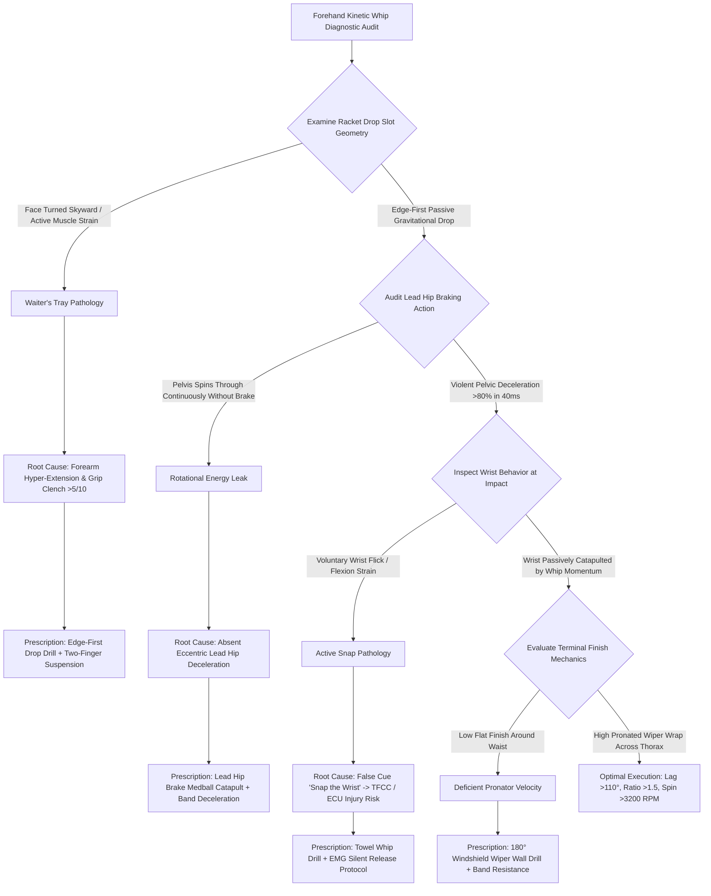

# ART-093: Forehand Lag and Snap: Dynamic Wrist Release Dynamics

> **PRO CUE:** Lag is not "pulling the racket down" — it is a **passive gravitational and inertial drop**. Snap is not "flicking the wrist" — it is the **elastic recoil of stretched tendons and fascial slings**. Passive Lag Drop + Lead Pelvic Deceleration (Hip Brake) $\to$ Elastic Recoil $\to$ Passive Wrist Release = **The Kinetic Whip Effect**. Train "Passive Lag, Elastic Release" to generate effortless tour-level racket head speed and explosive topspin.

---

## 1. Executive Summary & Athletic Intent

Modern elite forehands generate **$3,000\text{–}3,500+\text{ RPM}$** and ball speeds exceeding $130\text{ km/h}$ not through brute muscular arm force, but through the precise biomechanical synchronization of the **Lag-Snap Mechanism**:
1. **Passive Gravitational Lag Drop**: The wrist and forearm remain profoundly relaxed (grip pressure $2/10$), allowing gravitational acceleration and torso inertia to drop the racket head below the ball, achieving a lag angle $>90^\circ$ relative to the forearm.
2. **Pelvic Deceleration (Hip Brake) Trigger**: The lead hip arrests its forward rotation abruptly ($>80\%$ deceleration within $40\text{ ms}$), creating an immoveable proximal anchor that transfers rotational momentum upward into the thoracic cage and arm.
3. **Elastic Recoil**: Myofascial slings and stretched wrist tendons (extensor carpi ulnaris [ECU], flexor carpi radialis [FCR]) release their stored elastic strain energy.
4. **Passive Wrist Release ("Snap")**: The wrist does **not actively flex or flick**; rather, it is passively catapulted through the impact zone as the racket head overtakes the hand, followed immediately by an **active forearm pronation** windshield wiper finish.

This article formalizes the **Lag-Snap Biomechanical Model**, provides concrete scientific differentiation between **Passive Elastic Loading vs. Active Muscular Forcing**, and introduces the **"Kinetic Whip Forehand"** protocol to engineer effortless, injury-free ball striking.

The athletic intent focuses on three pillars:
* **Eradicating the Active-Flick Myth**: Demonstrating that voluntary wrist flexion ("wrist snap") causes catastrophic joint shear, tendon pathology, and severe trajectory inconsistency.
* **The Pelvic Brake as Master Catalyst**: Proving that without violent proximal deceleration at the lead hip, lag energy bleeds out laterally and cannot be transferred distally into terminal racket head velocity.
* **Neuromuscular De-Tensioning**: Training athletes to maintain minimal grip pressure ($2/10$) through the lag slot, unlocking true elastic recoil dynamics.

---

## 2. Biomechanical & Neurological Foundation

### 2.1 The Physics of the Lag-Snap Kinetic Sequence

```
THE 4-STAGE LAG-SNAP SEQUENCE (Modern Forehand Engine):
┌─────────────────────────────────────────────────────────────────────────────┐
│  STAGE 1: PASSIVE LAG DROP (T-300ms to T-150ms) — GRAVITATIONAL LOAD        │
│  ├── Unit Turn locked: X-Factor separation loaded at 45°–55°                │
│  ├── Grip pressure: 2/10 (Extremely soft; fingers relaxed on bevels)        │
│  ├── Wrist extensors/flexors: Profoundly silent on EMG                      │
│  ├── Racket head drops under GRAVITY + FORWARD TORSO INERTIA                │
│  ├── Lag angle (racket longitudinal shaft vs. forearm): >90° (up to 120°)   │
│  └── ELASTIC ENERGY ACCUMULATION: ECU/FCR tendon stretch + fascial loading  │
│                                                                             │
│  STAGE 2: PELVIC DECELERATION TRIGGER (T-150ms to T-50ms) — THE HIP BRAKE   │
│  ├── Lead hip arrests abruptly: >80% rotational deceleration in 40 ms       │
│  ├── Ground reaction force (GRF) drives up lead leg to block pelvis rotation│
│  ├── THIS IS THE TRIGGER: Catapults rotational torque into thoracic spine   │
│  └── ABSOLUTE LAW: NO HIP BRAKE = NO SNAP (Energy bleeds into over-spin)   │
│                                                                             │
│  STAGE 3: ELASTIC RECOIL & PASSIVE RELEASE (T-50ms to T+10ms) — THE WHIP    │
│  ├── Stored myofascial elastic strain releases explosively                  │
│  ├── Racket head accelerates at >1.5× the linear speed of the hand          │
│  ├── Wrist is PASSIVELY pulled through flexion/extension (Zero active push) │
│  ├── Lag angle closes violently: 90° → 30° → 0° (Aligned at contact)        │
│  └── Wrist release is an Inevitable Effect, NEVER a Voluntary Cause         │
│                                                                             │
│  STAGE 4: ACTIVE FOREARM PRONATION FINISH (T+10ms to T+100ms)               │
│  ├── Forearm pronator teres & quadratus fire: 180° Windshield Wiper wrap    │
│  ├── Racket face brushes up and through the back of the ball                │
│  ├── Scapula protracts fully across thoracic wall to decelerate lever       │
│  └── Active pronation enhances ball trajectory without loading wrist joint  │
└─────────────────────────────────────────────────────────────────────────────┘
```

### 2.2 Passive vs. Active: The Biomechanical Demarcation

| Mechanical Parameter | **PASSIVE LAG & RELEASE (Elite / Correct)** | **ACTIVE MUSCLE FORCING (Flawed / Destructive)** |
| :--- | :--- | :--- |
| **Lag Generation Mechanism** | Gravitational acceleration + Inertial trailing drop | Active wrist extension ("Pushing racket backward") |
| **Dynamic Grip Pressure** | **$2\text{–}3/10$ (Relaxed and fluid)** | $6\text{–}8/10$ (Stiff, tight clench) |
| **Kinesthetic Perception** | *"Heavy racket head falling freely into the slot"* | *"Forcing the racket down with forearm tension"* |
| **Forearm Muscle Activation** | Silent / Passively stretched (ECU, FCR elongated) | Hyper-contracted (Concentric extensor fatigue) |
| **Lead Pelvic Deceleration** | Mandatory catalyst triggering proximal transfer | Irrelevant (Arm and shoulder pull the stroke) |
| **Joint Pathology & Risk** | Low (Elastic strain safely buffered by tendons) | **Extreme (TFCC tears, ECU tendinitis, Tennis Elbow)**|
| **Spin Production Potential** | **$3,000\text{–}3,500+\text{ RPM}$** | $1,500\text{–}2,200\text{ RPM}$ (Hard ceiling) |
| **Stroke Replicability** | Hyper-consistent (Governed by invariant gravity) | Highly erratic (Vulnerable to fatigue and anxiety) |

### 2.3 Diagnostic Telemetry & Performance Metrics

| Kinetic Metric | Diagnostic Instrumentation | Developing | Competent | Advanced | Elite (Tour Master) |
| :--- | :--- | :--- | :--- | :--- | :--- |
| **Maximum Lag Angle ($\theta$)** | 240 FPS High-Speed Video | $<70^\circ$ | $70^\circ\text{–}90^\circ$ | $90^\circ\text{–}110^\circ$ | **$>110^\circ$** |
| **Lag Phase Frame Duration** | High-Speed Video (Slots to Impact) | $<3\text{ frames}$ | $3\text{–}5\text{ frames}$ | $5\text{–}8\text{ frames}$ | **$8\text{–}12\text{ frames}$** |
| **Pelvic Braking Rate** | 3D Motion Capture / Pelvic IMU | $<50\% / 40\text{ ms}$ | $50\%\text{–}70\%$ | $70\%\text{–}85\%$ | **$>80\% / 40\text{ ms}$** |
| **Racket-to-Hand Speed Ratio** | Dual High-Speed Radar / IMUs | $<1.10$ | $1.10\text{–}1.30$ | $1.30\text{–}1.50$ | **$>1.50$ (True Whip)**|
| **EMG Wrist Quiescence Ratio** | Surface EMG on FCR / ECU | $<50\%$ silent | $50\%\text{–}70\%$ | $70\%\text{–}85\%$ | **$>90\%$ silent release**|
| **Forearm Pronation Velocity** | Forearm IMU Angular Gyro | $<800^\circ/\text{s}$ | $800\text{–}1,200^\circ/\text{s}$ | $1,200\text{–}1,800^\circ/\text{s}$ | **$>2,000^\circ/\text{s}$** |
| **Ball Rotational Velocity** | TrackMan / SpinSight Radar | $<2,000\text{ RPM}$ | $2,000\text{–}2,500\text{ RPM}$ | $2,500\text{–}3,000\text{ RPM}$ | **$3,000\text{–}3,500+\text{ RPM}$**|

---

## 3. Step-by-Step Technical Execution

### Phase 1: Passive Gravitational Lag Drop Mastery

#### Drill 1: Eyes-Closed Gravitational Drop
* **Biomechanical Objective:** Eliminate visual over-control and isolate pure gravitational somatosensory awareness in the wrist.
* **Execution:** Assume the unit turn coil with racket elevated in the trophy slot. **Close both eyes**. Relax grip pressure to $2/10$. Allow the mass of the racket head to fall backward and downward purely under gravitational pull. Open eyes at the bottom slot to inspect the lag angle.
* **Target:** Achieve a lag angle $>90^\circ$ with verified zero muscular contraction in the forearm flexor/extensor compartments.
* **Volume:** 20 repetitions.

#### Drill 2: Edge-First Drop (Waiter's Tray Elimination)
* **Biomechanical Objective:** Prevent premature active forearm supination and open-face dragging.
* **Execution:** From the unit turn, drop the racket into the slot with the **leading edge of the frame strictly perpendicular to the court surface**. Maintain the leading edge until the racket reaches its lowest trajectory coordinate; only then allow the string face to brush upward.
* **Biomechanical Checkpoint:** Eradicates the pathological "Waiter's Tray" position where the string face turns flat toward the sky.
* **Volume:** 20 repetitions with mirror or video feedback.

#### Drill 3: Two-Finger Lag Suspension Drill
* **Biomechanical Objective:** Physically restrict the player's ability to squeeze the grip during the lag phase.
* **Execution:** Hold the racket handle using **only the thumb and index finger** (middle, ring, and pinky fingers completely off the grip). Execute the complete backswing and gravitational lag drop. Feel the racket freely suspended on the two-finger fulcrum.
* **Target:** Smooth drop arc; lag angle exceeding $100^\circ$.
* **Volume:** 15 repetitions.

---

### Phase 2: Pelvic Deceleration (Hip Brake) as the Master Trigger

#### Drill 4: Lead Hip Brake Medicine Ball Catapult
* **Biomechanical Objective:** Establish the physical sensation of an abrupt lead pelvic brake catapulting distal levers.
* **Execution:** Hold a $3\text{ kg}$ medicine ball at chest level in an open stance. Initiate aggressive pelvic rotation toward the target. At exactly $45^\circ$, **violently plant the lead foot and lock the lead hip joint**, completely arresting pelvic rotation. Allow the inertia to violently catapult the medicine ball forward.
* **Target:** $>80\%$ pelvic rotational deceleration within $40\text{ ms}$ verified via video or IMU.
* **Volume:** 3 sets $\times$ 8 repetitions.

#### Drill 5: Lateral Band-Resisted Pelvic Deceleration
* **Biomechanical Objective:** Overload eccentric hip stabilizers to increase braking power.
* **Execution:** Fix a heavy resistance band around the lead hip pulling laterally in the direction of rotation. Initiate rotation against band tension, then resist and decelerate against the band's pull, freezing the pelvis dead at $45^\circ$.
* **Cognitive Cue:** *"Slam the door with the hip — Let the arm fly through"*.
* **Volume:** 3 sets $\times$ 10 repetitions per side.

#### Drill 6: Auditory Hip Brake Trigger Timing
* **Biomechanical Objective:** Synchronize the neuromuscular firing pattern using an auditory pacemaker.
* **Execution:** Synchronize with a metronome or coach's clap:
  * *Beat 1:* Unit Turn coil and passive drop.
  * *Beat 2:* **VIOLENT HIP BRAKE** (Accompanied by an explosive vocalized exhale: *"HUP!"*).
  * *Beat 3:* Passive contact release and windshield wiper finish.
* **Volume:** 20 cycles. KPI: Hip brake firing within $\pm 10\text{ ms}$ of the auditory trigger.

---

### Phase 3: Elastic Recoil & Passive Wrist Release

#### Drill 7: Release the Brake Shadow Progression
* **Biomechanical Objective:** Feel the instantaneous distal acceleration of the racket head without ball collision interference.
* **Execution:** From the maximum passive lag position, execute the violent hip brake trigger. **The wrist does absolutely nothing**. The athlete consciously observes the racket head catapulting upward and forward purely as a consequence of proximal braking.
* **Volume:** 20 shadow repetitions. High-speed video confirmation that the racket head overtakes the hand.

#### Drill 8: Dynamic Towel Whip Drill
* **Biomechanical Objective:** Prove that a completely flexible implement can only achieve terminal velocity through proximal deceleration.
* **Execution:** Hold a heavy hand towel by one corner. Execute a forehand stroke. If the wrist flexes actively, the towel bunches up and stalls. If the player drops passively and executes a violent hip brake, the towel straightens with an audible, explosive snap at the contact zone.
* **Volume:** 20 repetitions. Target: Consistent audible snap occurring strictly in the forward contact window.

#### Drill 9: EMG-Validated Silent Wrist Release
* **Biomechanical Objective:** Train cortical inhibition of wrist flexors/extensors during the strike phase.
* **Execution:** If biofeedback EMG is available, place surface electrodes on the ECU and FCR. Player performs forehands aiming to keep EMG waveforms completely flat during the release interval ($T-50\text{ ms}$ to $T+10\text{ ms}$). Only the pronator teres should fire post-impact.
* **Sensory Alternative:** Focus on total sensory quiescence: *"Silent wrist — Explosive forearm"*.
* **Volume:** 25 repetitions.

---

### Phase 4: Active Pronation Windshield Wiper Finish

#### Drill 10: Windshield Wiper Wall Plane Drill
* **Biomechanical Objective:** Groove pure forearm pronation without wrist deviation.
* **Execution:** Stand facing a smooth wall with racket in hand. Place the racket face flat against the wall at chest height. Keeping the wrist joint locked in neutral, rotate the forearm $180^\circ$ so the opposite face of the racket contacts the wall.
* **Volume:** 20 repetitions. Cue: *"Rotate the forearm bones — Keep the wrist joint asleep"*.

#### Drill 11: Band-Resisted Forearm Pronation Isolation
* **Biomechanical Objective:** Strengthen the pronator teres and pronator quadratus to maximize terminal topspin brush velocity.
* **Execution:** Anchor an elastic band across the body. Hold the end in a Semi-Western grip with elbow stabilized at $90^\circ$. Execute rapid, explosive forearm pronations against band resistance.
* **Volume:** 3 sets $\times$ 15 repetitions. Target angular velocity: $>1,500^\circ/\text{s}$.

---

### Phase 5: Integrated Lag-Snap Sequence & High-Lactate Audit

#### Drill 12: Metronome-Paced Kinetic Compression
* **Biomechanical Objective:** Re-integrate the 4-stage sequence across escalating rhythmic cadences.
* **Execution:** Execute live groundstrokes fed to a metronome: start at 60 BPM, progressing to 80, 100, and 120 BPM.
* **Sequence:** Beat 1 = Passive Unit Turn & Drop; Beat 2 = Explosive Hip Brake & Release.
* **Volume:** 10 cycles per tempo bracket. KPI: Zero breakdown of passive lag mechanics at 120 BPM.

#### Drill 13: Live Ball Lag-Snap Compliance Audit
* **Biomechanical Objective:** Validate in-match mechanical fidelity across live cross-court rallies.
* **Execution:** 30 consecutive forehand rally balls scored on a 4-point compliance scale:
  1. *Passive Lag Drop:* Grip pressure $2/10$; edge-first entry ($1\text{ pt}$).
  2. *Violent Hip Brake:* Observable lead pelvic arrest ($1\text{ pt}$).
  3. *Passive Release:* Wrist silent; racket whips past hand ($1\text{ pt}$).
  4. *Active Pronation:* High windshield wiper wrap ($1\text{ pt}$).
* **Target:** Average score $\ge 3.6 / 4.0$ across 30 deliveries.

#### Drill 14: High-Fatigue Kinetic Integrity Test
* **Biomechanical Objective:** Prevent the fatal breakdown into active wrist compensation under severe metabolic distress.
* **Execution:** Administer a 4-minute anaerobic sprint circuit (HIIT), followed immediately by 20 maximum-power forehand drives.
* **Target:** Retain lag angle $>80^\circ$; lead pelvic deceleration $>70\%$; zero onset of active wrist flicking.
* **Volume:** 1 test bi-weekly.

---

## 4. Performance Metrics & Training Dosage

### Biomechanical Progression Framework

| Performance Parameter | Developing | Proficient | Advanced | Elite (Tour Whip Master) |
| :--- | :--- | :--- | :--- | :--- |
| **Max Lag Angle ($\theta$)** | $<70^\circ$ | $70^\circ\text{–}90^\circ$ | $90^\circ\text{–}110^\circ$ | **$>110^\circ$** |
| **Passive Lag Compliance Rate** | $<50\%$ of reps | $50\%\text{–}70\%$ | $70\%\text{–}85\%$ | **$>95\%$ certified passive reps** |
| **Lead Pelvic Braking Rate** | $<50\% / 40\text{ ms}$ | $50\%\text{–}70\%$ | $70\%\text{–}85\%$ | **$>80\% / 40\text{ ms}$** |
| **Hip Brake Coupling Fidelity** | Unlinked / Drift | Intermittent trigger | Reliable trigger | **Absolute invariant trigger** |
| **Passive Wrist Release Ratio** | $<50\%$ passive | $50\%\text{–}70\%$ | $70\%\text{–}85\%$ | **$>90\%$ silent wrist release** |
| **Racket-to-Hand Speed Ratio** | $<1.10$ | $1.10\text{–}1.30$ | $1.30\text{–}1.50$ | **$>1.50$** |
| **Active Pronation Velocity** | $<800^\circ/\text{s}$ | $800\text{–}1,200^\circ/\text{s}$ | $1,200\text{–}1,800^\circ/\text{s}$ | **$>2,000^\circ/\text{s}$** |
| **Topspin Output (RPM)** | $<2,000\text{ RPM}$ | $2,000\text{–}2,500\text{ RPM}$ | $2,500\text{–}3,000\text{ RPM}$ | **$3,000\text{–}3,500+\text{ RPM}$** |
| **Fatigue Lag Retention** | $<60^\circ$ (Stiff clench)| $60^\circ\text{–}80^\circ$ | $80^\circ\text{–}95^\circ$ | **$>90^\circ$ retained under fatigue**|

### Weekly Periodized Training Dosage

* **Passive Lag Drop & De-Tensioning:** $3\times/\text{week}$, 15 minutes (Drills 1–3).
* **Lead Hip Brake Trigger Engineering:** $3\times/\text{week}$, 15 minutes (Drills 4–6).
* **Elastic Recoil & Passive Release:** $3\times/\text{week}$, 15 minutes (Drills 7–9).
* **Active Pronation & Wiper Finish:** $2\times/\text{week}$, 10 minutes (Drills 10–11).
* **Integrated Live Sequencing & Fatigue:** $2\times/\text{week}$, 20 minutes (Drills 12–14).
* **Total Volume:** $\sim 75\text{ minutes/week}$ of isolated lag-snap dynamic development.

---

## 5. Errors, Causes & Correction Protocols

| Observable Technical Defect | Biomechanical Root Cause | Prescriptive Correction Protocol |
| :--- | :--- | :--- |
| **"Waiter's Tray (Active wrist extension in slot)"** | False assumption that lag must be forced; hyper-contracted forearm extensors | Edge-First Drop drill ($1,000+\text{ reps}$); Two-Finger Lag Suspension; Cognitive Cue: *"Let gravity drop the frame — Zero pushing"*. |
| **"Spinning hips; no whip effect"** | Failure of lead hip eccentric deceleration; rotational torque bleeds around baseline | Lead Hip Brake Medball Catapult ($500+\text{ reps}$); Band-Resisted Deceleration; Cue: *"Anchor the hip to release the racket"*. |
| **"Active wrist flick through impact ('Flicking')"** | Misunderstanding "snap" as voluntary wrist flexion; severe risk of TFCC pathology | Towel Whip drill; EMG-Validated Silent Release; Cue: *"Wrist stays asleep — Forearm rotates 180°"*. |
| **"Shallow lag angle ($<70^\circ$)"** | Grip clench $>5/10$; insufficient X-Factor coiling; failure to relax forearm | Eyes-Closed Gravitational Drop; Grip tension relaxation breathing; Two-Finger suspension. |
| **"Premature snap before hip brake"** | Reversed kinetic sequence; distal levers fire before proximal deceleration | Auditory Hip Brake Trigger Timing; Cue: *"Hips brake FIRST — Then elastic release"*. |
| **"Low, flat finish around waist"** | Weak pronator activation; athlete drags arm horizontally instead of wiping vertically | Windshield Wiper Wall Plane drill; Band-Resisted Pronation; Cue: *"Wipe the vertical pane upward"*. |
| **"Low spin ($<2,000\text{ RPM}$) despite violent swing"** | Active wrist forcing stalls the racket head; absence of passive whip ratio | Isolate passive release mechanics; achieve Racket-to-Hand Speed Ratio $>1.50$. |
| **"Mechanical breakdown under match fatigue"** | Central fatigue reduces neural inhibition, causing player to tighten grip and muscle ball | Enforce micro-recovery breathing between points; mandatory bi-weekly fatigue audits. |

---

## 6. Diagnostic Diagram & Decision Flow



---

## 7. Video Demonstration & Technical Analysis

<div class="video-container" style="position:relative;padding-bottom:56.25%;height:0;overflow:hidden;border-radius:12px;">
  <iframe src="https://www.youtube-nocookie.com/embed/VIDEO_ID_PLACEHOLDER"
          style="position:absolute;top:0;left:0;width:100%;height:100%;border:0;"
          allow="accelerometer; autoplay; clipboard-write; encrypted-media; gyroscope; picture-in-picture"
          allowfullscreen
          title="Forehand Lag & Snap: Dynamic Wrist Release Dynamics — Technical Analysis"></iframe>
</div>

*Recommended Technical Video Inclusions:*
* Ultra-slow-motion (1,000 FPS) macro capture of the passive lag drop, tracking the lag angle from trophy position to slot.
* Surface EMG graphic overlay comparing electrical activity in the ECU/FCR during passive release versus active muscular flicking.
* Dual force plate graphical tracking illustrating lead hip deceleration rates ($>80\%$ deceleration in $40\text{ ms}$) synchronized with terminal racket head velocity.
* High-speed visual comparison of the towel whip demonstration versus the modern tour forehand whip.
* Kinematic sequence analysis of elite forehand whip exponents (Rafael Nadal, Carlos Alcaraz, Jannik Sinner, Roger Federer).
* Telemetry breakdown documenting the degradation of lag angle and wrist quiescence under high-lactate conditions.

---

## 8. Cross-Domain Synergy & Multi-Pillar Integration

* **Modern Forehand Engine (ART-081):** Lag and snap represent the micro-mechanical core of Phases 2, 3, and 4 within the complete 5-phase kinetic chain.
* **Contact Point Geometry (ART-082):** A passive elastic release naturally aligns the racket face at the ideal contact point $40\text{ cm}$ anterior to the lead hip; active flicking inevitably leads to late, jammed contact.
* **Split-Step & Kinetic Loading (ART-083):** Ground reaction forces generated during split-step landing directly initiate the pelvic coil required for subsequent hip braking.
* **Serving Kinetic Chain (ART-084):** The internal shoulder rotation (ISR) and forearm pronation observed in the forehand wiper finish share identical neuromuscular pathways with the service pronation snap.
* **One-Handed Backhand Saber Extension (ART-085):** Contrasts with the forehand: the 1HBH requires an extended elbow lock and isometric wrist stabilization rather than high-amplitude passive lag.
* **Racket Face Angle Awareness (ART-073):** Passive lag preserves consistent racket face orientation, whereas active wrist manipulation causes erratic angle variance.
* **Neuromuscular Junction Efficiency (ART-078):** Passive release velocity serves as a direct indicator of neuromuscular transmission speed and central nervous system freshness.
* **Upper-Limb Injury Prevention (ART-196):** Eradicating active wrist extension and flexion is the single most effective intervention for preventing lateral epicondylitis (tennis elbow) and TFCC tears.

---

## 9. Self-Assessment Rubric

| Diagnostic Checkpoint | Level 1 (Active Muscular Clench) | Level 2 (Transitional / Mixed) | Level 3 (Functional Elastic Whip) | Level 4 (Tour-Level Mastery) |
| :--- | :--- | :--- | :--- | :--- |
| **Max Lag Angle** | $<70^\circ$ (Racket held tight) | $70^\circ\text{–}90^\circ$ | $90^\circ\text{–}110^\circ$ | **$>110^\circ$ pure passive drop** |
| **Passive Lag Compliance** | $<50\%$ of repetitions | $50\%\text{–}70\%$ | $70\%\text{–}85\%$ | **$>95\%$ certified passive drop** |
| **Lead Pelvic Deceleration** | $<50\%$ braking rate | $50\%\text{–}70\%$ | $70\%\text{–}85\%$ | **$>80\% / 40\text{ ms}$ violent arrest** |
| **Hip Brake as Trigger** | Completely decoupled | Intermittent coupling | Consistent trigger | **Invariant kinetic catalyst** |
| **Wrist Quiescence (EMG)** | Active contraction ($<50\%$)| $50\%\text{–}70\%$ silent | $70\%\text{–}85\%$ silent | **$>90\%$ silent passive release** |
| **Racket-to-Hand Ratio** | $<1.10$ (Arm dragging) | $1.10\text{–}1.30$ | $1.30\text{–}1.50$ | **$>1.50$ explosive catapult** |
| **Pronation Velocity** | $<800^\circ/\text{s}$ | $800\text{–}1,200^\circ/\text{s}$ | $1,200\text{–}1,800^\circ/\text{s}$ | **$>2,000^\circ/\text{s}$ windshield wiper** |
| **Topspin Output** | $<2,000\text{ RPM}$ | $2,000\text{–}2,500\text{ RPM}$ | $2,500\text{–}3,000\text{ RPM}$ | **$3,000\text{–}3,500+\text{ RPM}$** |

**Diagnostic Scoring Key:**
* **8–16 Points:** Lag-Snap Audit Failure. High injury risk; severe active arming; mandatory foundational de-tensioning protocols.
* **17–23 Points:** Transitional Phase. Inconsistent pelvic braking; intermittent active wrist flicking under competitive pressure.
* **24–29 Points:** Functional Elastic Whip. Reliable passive drop and hip braking; consistent topspin depth.
* **30–32 Points:** Tour-Level Whip Mastery. Flawless elastic transfer; effortless power generation and peak joint longevity.

---

## 10. Printable Practice Card (Pocket Drill Card)

```
┌────────────────────────────────────────────────────────────────────────┐
│             POCKET DRILL CARD: FOREHAND LAG-SNAP ENGINE                │
│ Target: Lag >110°, Hip Brake >80%, Silent Wrist >90%, Spin >3000 RPM   │
├────────────────────────────────────────────────────────────────────────┤
│ BLOCK A: Gravitational Drop & De-Tensioning (5 Min)                    │
│ • Eyes-Closed Gravitational Drop: 15 reps (Grip tension 2/10)          │
│ • Edge-First Drop Drill: 15 reps (Zero Waiter's Tray supination)       │
│ • Two-Finger Lag Suspension: 10 reps (Thumb + index only)              │
│ • Cue: "Eyes closed — Soft hands — Let gravity drop the racket frame"  │
├────────────────────────────────────────────────────────────────────────┤
│ BLOCK B: Pelvic Deceleration (Hip Brake) Trigger (20 Min)              │
│ • Lead Hip Brake Medball Catapult: 3 sets × 8 reps                     │
│ • Lateral Band-Resisted Deceleration: 3 sets × 10 reps                 │
│ • Auditory Hip Brake Trigger Timing: 20 reps (Exhale 'HUP!' at brake)  │
│ • Cue: "Anchor the lead hip — Violent brake — Catapult the shoulder"   │
├────────────────────────────────────────────────────────────────────────┤
│ BLOCK C: Elastic Recoil & Forearm Pronation (15 Min)                   │
│ • Release the Brake Shadow Drill: 20 reps (Watch racket whip past hand)│
│ • Dynamic Towel Whip Drill: 20 reps (Audible snap at contact window)   │
│ • Windshield Wiper Wall Drill: 20 reps (180° pure forearm roll)        │
│ • Band-Resisted Pronation Isolation: 3 sets × 15 reps                  │
│ • Cue: "Wrist stays asleep — Whip the towel — Forearm rotates 180°"    │
├────────────────────────────────────────────────────────────────────────┤
│ BLOCK D: High-Speed Sequencing & Lactate Audit (15 Min)                │
│ • Metronome Rhythmic Sequence: 40 cycles (60 → 120 BPM)                │
│ • Live Rally Compliance Audit: 30 forehands (Target: Score ≥3.6/4.0)   │
│ • High-Fatigue Kinetic Integrity Test: 20 reps post-HIIT circuit       │
│ • Cue: "Beat 1: Drop — Beat 2: Brake & Snap — Retain loose hands"      │
├────────────────────────────────────────────────────────────────────────┤
│ FREQUENCY: 3×/week | GATE: 3 consecutive weeks with Lag >110°,         │
│ Hip Brake >80%, Passive Release >90%, Topspin >3,000 RPM.              │
└────────────────────────────────────────────────────────────────────────┘
```

---

*Cross-References: Articles 073, 078, 081, 082, 083, 084, 085, 196. Pillar III: Stroke Mechanics & Ball Striking — TennisKB 200 Articles.*
