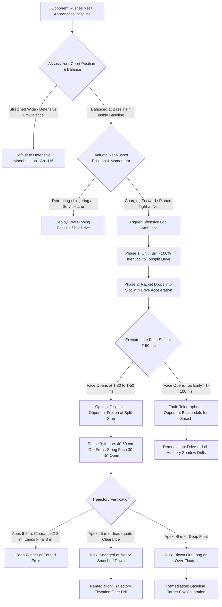

# Article 117: Offensive Lob Mechanics: Disguise and Tactical Deployment

> **PRO CUE:** Offensive Lob = **Surprise Ambush Weapon with an Identical Drive Setup**. Core Determinants: **Disguise = Indistinguishable from a Topspin Drive**, Racket face opens only at $T-50\text{ ms}$, Apex height $6\text{–}8\text{ m}$, Significantly faster flight time than defensive lobs. Train the "Offensive Lob Weapon" = Deceive the net rusher, Terminate the point cleanly.

## 1. Executive Summary & Athletic Intent

An offensive lob is executed from an offensive baseline or mid-court position with the explicit objective of **terminating the rally or producing an outright winner**—a stroke fundamentally distinct from the high defensive moonball (Article 116). The absolute cornerstone of an offensive lob is **DISGUISE**: the setup must mirror an aggressive topspin drive in every kinematic parameter, delaying string face orientation changes until the final milliseconds before impact.

This article formalizes the **Offensive Lob Deception Model**:
1. **Identical Drive Setup**: Unit turn, low-to-high swing path, shoulder-pelvis co-activation, and forward contact point geometry remain indistinguishable from a heavy drive.
2. **Late Face Adjustment**: The racket face rotates open by $30\text{–}45^\circ$ strictly within the $T-50\text{ ms}$ pre-impact window, inside the human visual-motor latency reaction threshold ($\sim 150\text{ ms}$).
3. **Trajectory Optimization**: Trajectory apex calibrated to $6\text{–}8\text{ m}$ with a net clearance of $2\text{–}3\text{ m}$, sustaining a brisk flight duration ($2\text{–}3\text{ s}$) that dips steeply inside the opponent's baseline.
4. **Tactical Deployment**: Contextual decision triggers based on opponent approach velocity, lateral net pinching, court geometry, and score-state pressure.

The **"Offensive Lob Ambush"** curriculum converts a conventional retrieval stroke into an aggressive neuro-tactical weapon that breaks the net rusher's forward momentum.

Athletic intent centers on three imperatives:
- Establish that **an offensive lob is deception-first, mechanics-second**. A technically sound lob that is telegraphed early surrenders an easy overhead smash and immediately concedes the point.
- Prove that the **kinetic preparation is 100% identical to a topspin drive**—sharing the same unit turn, forward weight transfer, and kinetic acceleration profile until $T-50\text{ ms}$.
- Provide a systematic four-phase practice protocol to condition deceptive motor timing under match conditions.

## 2. Biomechanical & Neurological Foundation

### 2.1 Offensive vs. Defensive Lob Comparison

```
OFFENSIVE vs. DEFENSIVE LOB:
┌─────────────────────────────────────────────────────────────────────────────┐
│  DISGUISE — THE CORE KINEMATIC DISTINCTION:                                 │
│  ├── Offensive Lob: Setup IDENTICAL to Topspin Drive                        │
│  │   ├── Unit turn 30–40°, racket drawn into drop slot, forward contact     │
│  │   ├── Low-to-high acceleration path maintained through T-50 ms           │
│  │   ├── T-50 ms: RACKET FACE ROTATES OPEN 30–45° (Late Adjustment)         │
│  │   ├── Opponent braces for heavy drive → Weight pinned, wrong-footed      │
│  │   └── Psychological Impact: Hesitation on subsequent net approaches      │
│  │                                                                         │
│  ├── Defensive Lob: Setup IMMEDIATELY TELEGRAPHED                            │
│  │   ├── Racket face open early, steep upward scoop from backswing          │
│  │   ├── Opponent reads ball trajectory immediately → Retreats for smash    │
│  │   └── Zero deception value; purely a survival mechanism                  │
│  │                                                                         │
│  TRAJECTORY DYNAMICS:                                                       │
│  ├── Offensive: Peak 6–8 m, net clearance 2–3 m, flight duration 2–3 s     │
│  ├── Defensive: Peak 8–10 m, net clearance 3–5 m, flight duration 3–5 s    │
│  └── Offensive Profile: Flatter arc, high linear velocity, rapid dip        │
│                                                                             │
│  CONTACT POINT GEOMETRY (Shared until T-50 ms):                             │
│  ├── Contact: 40–50 cm anterior to lead hip (Identical to Drive)            │
│  ├── Weight Transfer: Forward into the court (Identical to Drive)           │
│  ├── Non-Dominant Arm: Scapular counter-rotation (Identical to Drive)       │
│  └── DIVERGENCE POINT: Final dynamic string face tilt + high follow-through │
└─────────────────────────────────────────────────────────────────────────────┘
```

### 2.2 Offensive Lob Disguise Timeline

```
OFFENSIVE LOB DECEPTION TIMELINE:
┌─────────────────────────────────────────────────────────────────────────────┐
│  T-300 ms: UNIT TURN — IDENTICAL TO TOPSPIN DRIVE                            │
│  ├── Torso coil 30–40°, racket head above wrist level, non-dominant hand    │
│  │   stabilizing the racket throat.                                         │
│  ├── Opponent visual cortex detects: "Heavy topspin drive incoming"         │
│  └── Opponent motor response: Sinks weight, prepares reaction block/volley   │
│                                                                             │
│  T-200 ms: FORWARD ACCELERATION INITIATION — IDENTICAL TO DRIVE              │
│  ├── Pelvic uncoiling, forward center of mass translation                    │
│  ├── Racket drops into the slot along standard low-to-high pathway          │
│  └── Opponent commits: Commits feet to defend incoming linear drive         │
│                                                                             │
│  T-100 ms: STRIKE ZONE APPROACH — IDENTICAL TO DRIVE                         │
│  ├── Racket accelerates upward and forward; strike point 40–50 cm anterior  │
│  └── Opponent's visuomotor prediction fully locked on drive return           │
│                                                                             │
│  T-50 ms: CRITICAL DIVERGENCE WINDOW — RACKET FACE OPENS 30–45°              │
│  ├── Grip pressure relaxes slightly (5/10 → 3/10)                            │
│  ├── Wrist joint subtly cups (extension), tilting string bed upward 30–45°   │
│  └── Opponent is unable to reprogram motor response (Latency: ~150 ms)      │
│                                                                             │
│  T = 0: IMPACT — DRIVE PATHWAY WITH LOB STRING BED ORIENTATION               │
│  ├── Forward swing speed drives ball over net while open face lofts arc      │
│  └── Trajectory peaks at 6–8 m, clears net rusher by 1.5–2 m, lands deep    │
│                                                                             │
│  T+100 ms: FOLLOW-THROUGH — HIGH VERTICAL EXTENSION                          │
│  └── Visual signature: High vertical finish rather than torso wrap           │
└─────────────────────────────────────────────────────────────────────────────┘
```

### 2.3 Tactical Deployment Matrix

| Tactical Situation | Offensive Lob Viability | Target Zone | Primary Disguise Cue |
|---|---|---|---|
| **Opponent at net, player balanced at baseline, neutral rally** | ✅ Recommended (High Surprise) | Deep baseline corner, targeting backhand overhead | Identical drive coil, late string face tilt |
| **Opponent aggressively poaches / leans crosscourt** | ✅ Recommended (Geometric Exploit) | Down-the-line trajectory or deep center | Inside-out drive disguise |
| **Opponent charges net behind weak approach** | ✅ Recommended (Immediate Penalty) | Directly over opponent's dominant shoulder | Aggressive approach-drive stance |
| **Heavy headwind conditions** | ✅ Recommended (Environmental Aid) | Deep three-quarter court (wind holds ball in) | Standard drive trajectory prep |
| **Opponent possesses defective backhand overhead** | ✅ Recommended (Psychological Target) | Deep backhand baseline corner | Drive posture targeting backhand corner |
| **Player stretched wide or out of position** | ❌ Contraindicated | Default to Defensive Lob (Article 116) | N/A |
| **Opponent camping behind baseline** | ❌ Contraindicated | Select Drive or Drop Shot | N/A |
| **High-leverage pressure point (Break Point)** | ⚠️ Situational | Deploy only if opponent has demonstrated forward creeping | High risk / high reward |

## 3. Step-by-Step Technical Execution

### Phase 1: Identical Drive Setup & Disguise Calibration

**Drill 1: "Drive vs. Offensive Lob – Shadow Comparison"**
- Execute full dry shadow strokes: standard topspin drive $\to$ freeze at $T-50\text{ ms}$; offensive lob $\to$ freeze at $T-50\text{ ms}$.
- Verify that unit turn, racket takeback slot, pelvic rotation, weight shift, and forward contact extension remain identical.
- The solitary point of divergence occurs at $T-50\text{ ms}$: perpendicular string face for the drive versus an open $30\text{–}45^\circ$ tilt for the lob.
- Volume: 20 alternating cycles in front of a high-speed video mirror. KPI: Indistinguishable setup confirmed by coaching staff.

**Drill 2: "Late Face Change – Auditory Trigger Transition"**
- Feeder delivers medium-pace rally balls. The player initiates a standard drive topspin swing path.
- At $T-50\text{ ms}$, the coach calls a random verbal cue ("LOB!" or "DRIVE!").
- On "LOB", open the racket face $30\text{–}45^\circ$ while sustaining full swing speed. On "DRIVE", strike through flat/topspin.
- Ratio: 3 Drives to 1 randomized Lob.
- Volume: 30 repetitions. KPI: String bed remains perpendicular until the final micro-window; zero premature deceleration.

**Drill 3: "Grip Pressure Modulation"**
- Calibrate grip pressure transitions: Topspin drive maintained at 5/10; offensive lob eases to 3/10 immediately prior to impact to permit fluid wrist cupping and upward face orientation.
- Alternate 10 drives and 10 lobs, focusing purely on tactile proprioception of grip relaxation without sacrificing racket head stability.
- Volume: 20 repetitions. KPI: Smooth reduction of hand tension without wrist collapse.

### Phase 2: Trajectory Optimization & Depth Calibration

**Drill 4: "Apex & Clearance Calibration Gate"**
- Suspend an alignment cord across the court at a height of $2.5\text{–}3.0\text{ m}$ directly above the net strap.
- Player executes offensive lobs that must clear above the cord while staying under an apex ceiling of $8\text{ m}$.
- Emphasize: Maintain aggressive forward racket acceleration; do not scoop with a slow, passive swing.
- Volume: 20 repetitions. KPI: $\ge 85\%$ of balls clear between $2.5\text{ m}$ and $3.5\text{ m}$ above the net with a $6\text{–}8\text{ m}$ apex.

**Drill 5: "Deep Baseline Target Box"**
- Mark a target zone extending across the final $3\text{ m}$ inside the opponent's baseline.
- Player hits offensive lobs off live baseline feeds, driving balls into the target zone.
- Regulate depth via swing speed and micro-adjustments to the $30\text{–}45^\circ$ string angle rather than decelerating the swing.
- Volume: 25 repetitions. KPI: $\ge 85\%$ landing within the $3\text{ m}$ baseline zone.

**Drill 6: "Flight Time Comparison: Offensive vs. Defensive"**
- Alternate between 1 Offensive Lob and 1 Defensive Moonball Lob. Measure flight time via digital stopwatch.
- Baseline parameters: Offensive lob flight duration must register $2.0\text{–}3.0\text{ s}$; defensive lob must float for $3.5\text{–}5.0\text{ s}$.
- Volume: 10 pairs. KPI: Offensive lobs consistently $1.0\text{–}1.5\text{ s}$ faster than defensive counterparts.

### Phase 3: Tactical Deployment & Opponent Trigger Recognition

**Drill 7: "Net Player Position Recognition"**
- Partner stands at the net adopting randomized postures: camping tight, crowding the center, leaning crosscourt, or covering down-the-line.
- Baseline feeder delivers a neutral ball. Player must visually scan the net player's center of mass during unit turn:
  - Leaning crosscourt $\to$ Offensive lob down-the-line.
  - Leaning down-the-line $\to$ Offensive lob crosscourt.
  - Hugging the net strap $\to$ Offensive lob directly over the non-dominant shoulder.
- Volume: 20 live balls. KPI: Correct tactical targeting $\ge 85\%$, disguise fully preserved.

**Drill 8: "Approach Shot Counter Ambush"**
- Feeder strikes an aggressive approach shot and rushes the net.
- Player sets up as if executing a dipping passing shot drive, holding the disguise until $T-50\text{ ms}$, then lofts the offensive lob over the opponent.
- Volume: 15 sequences. KPI: Disguise provokes forward split-step freezing by the net rusher; clean winner or weak overhead error forced.

**Drill 9: "Rally Buildup to Sudden Ambush"**
- Engage in an extended 6-to-8 shot baseline-to-baseline exchange.
- On a ball received inside the baseline, partner executes an unannounced net rush. The player instantly transitions into an offensive lob ambush.
- Volume: 15 live points. KPI: Flawless mechanical transfer from drive rhythm to late-release offensive lob.

### Phase 4: Pressure & High-Fatigue Competition

**Drill 10: "Deception Scoring Target Challenge"**
- Live game played to 11 points. Partner begins every point approaching the net.
- Scoring system:
  - Offensive lob clean winner: 3 points.
  - Offensive lob forcing weak overhead/volley error: 2 points.
  - Standard passing shot drive winner: 1 point.
  - Defensive lob hit: 0 points (point replayed).
- Volume: 3 games to 11. KPI: Demonstrates tactical conviction in deploying deceptive lobs under competitive scoring.

**Drill 11: "Clutch Point Pressure Execution"**
- Simulated pressure states: 30-40, 40-30, Deuce, or Match Point.
- Coach positions at the net. Player must execute the offensive lob only if situational cues warrant, committing fully to the identical drive disguise.
- Volume: 10 pressure points. KPI: $\ge 70\%$ success rate without mechanical hesitation.

**Drill 12: "Post-HIIT Fatigued Disguise Audit"**
- Perform a 4-minute high-intensity sprint or shuttle block, elevating heart rate above 85% $\text{HR}_{\max}$.
- Immediately face 15 randomized decision feeds (drive vs. offensive lob).
- Evaluate whether late string face change and forward contact geometry degrade under metabolic distress.
- Volume: 15 reps. KPI: Disguise fidelity and depth accuracy maintained within 90% of fresh baseline performance.

## 4. Performance Metrics & Training Dosage

| Performance Parameter | Developing | Competent | Advanced | Elite (Offensive Lob Assassin) |
|---|---|---|---|---|
| **Drive Setup Match** | Visibly telegraphed | Minor postural cues | Subtly divergent | **100% Indistinguishable** |
| **Late Face Adjustment Window** | Early ($>T-100\text{ ms}$) | $T-50\text{ to }T-100\text{ ms}$ | $T-30\text{ to }T-50\text{ ms}$ | **$T-30\text{ ms}$ Precision** |
| **Grip Pressure at Impact** | Clenched ($>5/10$) | $4/10$ | $3/10$ | **$2\text{–}3/10$ Relaxed** |
| **Net Clearance** | $<1.5\text{ m}$ or $>4.0\text{ m}$ | $1.5\text{–}2.5\text{ m}$ | $2.0\text{–}3.0\text{ m}$ | **$2.0\text{–}2.5\text{ m}$ Controlled** |
| **Apex Trajectory Height** | $<5.0\text{ m}$ or $>9.0\text{ m}$ | $5.0\text{–}7.0\text{ m}$ | $6.0\text{–}8.0\text{ m}$ | **$6.0\text{–}7.5\text{ m}$ Steep Dip** |
| **Flight Duration** | $>3.5\text{ s}$ (Too slow) | $3.0\text{–}3.5\text{ s}$ | $2.3\text{–}3.0\text{ s}$ | **$2.0\text{–}2.5\text{ s}$ Penetrating** |
| **Baseline Depth (Final 3 m)** | $<60\%$ | $60\text{–}75\%$ | $75\text{–}85\%$ | **$>90\%$** |
| **Net Player Visual Scan** | Blind execution | Reactive reading | Proactive positioning | **Predictive Anticipation** |
| **Pressure State Disguise** | Collapses into scoop | Inconsistent | Reliable | **Clutch Ambush Execution** |
| **Fatigue Degradation** | $>25\%$ accuracy loss | $10\text{–}20\%$ loss | $5\text{–}10\%$ loss | **$<5\%$ Variance** |

### Weekly Training Dosage

- **Drive Setup Disguise & Shadow Audits:** $3\times/\text{week}$, 15 minutes (Drills 1–3).
- **Trajectory & Apex Calibration:** $2\times/\text{week}$, 15 minutes (Drills 4–6).
- **Tactical Ambush & Live Triggers:** $2\times/\text{week}$, 20 minutes (Drills 7–9).
- **Competitive Pressure & Fatigue Integration:** $2\times/\text{week}$, 15 minutes (Drills 10–12).
- **Total Dedicated Volume:** $\sim 65\text{ minutes/week}$ of offensive lob technical conditioning.

## 5. Errors, Causes & Correction Protocols

| Observable Technical Defect | Biomechanical Root Cause | Prescriptive Correction Protocol |
|---|---|---|
| **"Opponent reads the lob instantly and retreats"** | Open face shown during backswing; slowed racket acceleration; altered unit turn stance | High-speed video shadow drill: enforce identical topspin drive backswing; delay string bed opening to $T-30\text{ ms}$; maintain drive swing speed |
| **"Ball floats high and soft like a defensive moonball"** | Swing path directed too steeply upward from the slot; excessive string tilt ($>50^\circ$) | Drive path correction: swing low-to-high across drive trajectory; restrict face angle to $30\text{–}45^\circ$; target $2\text{–}3\text{ s}$ flight duration |
| **"Lob lands short inside no-man's land, feeding an easy smash"** | Decelerating racket into impact; insufficient forward weight transfer; fear of hitting long | Target zone conditioning: drive through the ball into the final $3\text{ m}$ box; let string tilt govern trajectory height, not swing deceleration |
| **"Lob driven directly into the net tape"** | Insufficient string tilt ($<25^\circ$); face opened too late or jammed close to the torso | Elevation gate drill: calibrate string angle to $35^\circ$; ensure forward contact $40\text{–}50\text{ cm}$ anterior to lead hip; clear $2\text{ m}$ net line |
| **"Inappropriate tactical selection against baseline opponent"** | Absence of tactical visual scanning; unforced tactical error | Tactical decision flowchart: enforce rule—offensive lob is restricted exclusively to net-rusher scenarios; drive neutral baseline balls |
| **"Disguise collapses under break point pressure"** | Sympathetic hyper-arousal causing neuromuscular stiffness and shortened swing | Pre-point somatic reset: exhalation trigger; commit mentally to drive mechanics; loose grip (3/10) through impact |
| **"Late contact trailing the lead hip ($<20\text{ cm}$)"** | Hesitation during footwork positioning; waiting for ball rather than stepping forward | Forward contact gate drill: contact must occur $40\text{–}50\text{ cm}$ in front of lead hip; transfer body weight forward into court |
| **"Loss of trajectory control during late-match fatigue"** | Core rotators and forearm pronators fatiguing, leading to sloppy open-face scooping | Simplify tactics under severe exhaustion: default to baseline drive depth unless opponent is glued to the net strap |

## 6. Diagnostic Diagram & Decision Flow



## 7. Video Demonstration & Technical Analysis

<div class="video-container" style="position:relative;padding-bottom:56.25%;height:0;overflow:hidden;border-radius:12px;">
  <iframe src="https://www.youtube-nocookie.com/embed/VIDEO_ID_PLACEHOLDER"
          style="position:absolute;top:0;left:0;width:100%;height:100%;border:0;"
          allow="accelerometer; autoplay; clipboard-write; encrypted-media; gyroscope; picture-in-picture"
          allowfullscreen
          title="Offensive Lob Mechanics: Disguise and Tactical Deployment — Technical Analysis"></iframe>
</div>

*Recommended high-speed cinematography and biomechanical video protocols:*
1. **Side-by-Side Kinematic Overlay:** 1,000 FPS footage aligning a full ATP topspin drive directly over an offensive lob, tracking pelvic angle, shoulder line, and racket head velocity from $T-300\text{ ms}$ through $T-50\text{ ms}$ to verify visual identity.
2. **String Bed High-Speed Close-Up:** Macro capture of the wrist cupping and $30\text{–}45^\circ$ late face tilt occurring within the 50 ms window preceding ball impact.
3. **Opponent Reaction POV:** Split-screen camera stationed at the net documenting the net rusher's deceleration and foot-freeze latency when exposed to an identical drive disguise.
4. **Tour Archive Case Studies:** Slow-motion breakdown of elite offensive lob practitioners (Roger Federer, Novak Djokovic, Rafael Nadal, Carlos Alcaraz) targeting vulnerable backhand overhead zones under championship pressure.

## 8. Cross-Domain Synergy & Multi-Pillar Integration

- **With Defensive Lob Mechanics (Article 116):** Shares fundamental vertical loft mechanics, but diverges totally in intent, setup, and kinematics. Defensive lobs prioritize maximum hang time ($3.5\text{–}5.0\text{ s}$) and court recovery; offensive lobs prioritize deception, penetration speed ($2.0\text{–}2.5\text{ s}$), and terminal winners.
- **With Modern Topspin Forehand & Backhand Drives (Articles 081, 085):** The offensive lob is built entirely on the kinetic scaffolding of the topspin drive. Unit turn, hip drive, and arm sequencing must be identical up to the final 50 ms.
- **With Passing Shot Tactical Triad (Article 115):** The offensive lob constitutes the critical third arm of passing shot tactical geometry (Crosscourt Angle, Down-the-Line Drive, Offensive Over-the-Head Lob). Without a credible offensive lob, net rushers can cheat forward with impunity.
- **With Approach Shot Exploitation (Articles 101, 114):** When an opponent rushes the net behind a shallow approach, the offensive lob serves as an immediate geometric punisher.
- **With Quantitative Match Charting & Video Analytics (Article 120, 128):** Tracking opponent visual reaction latency, net rush success rates, and lob landing depths provides concrete empirical data for tactical refinement.
- **With Perceptual Affordance & Deception Psychology (Articles 061, 067):** The offensive lob is an advanced demonstration of motor affordance manipulation—falsifying kinematic cues to trick the opponent's anticipatory neurological framework.

## 9. Self-Assessment Rubric

| Diagnostic Checkpoint | Level 1 (No Disguise) | Level 2 (Telegraphed) | Level 3 (Functional Deceiver) | Level 4 (Offensive Lob Assassin) |
|---|---|---|---|---|
| **Drive Setup Match** | Completely divergent | Obvious postural cues | Minor tells | **100% Indistinguishable** |
| **Late Face Adjustment** | Opened early ($>T-100\text{ ms}$) | $T-50\text{ to }T-100\text{ ms}$ | $T-30\text{ to }T-50\text{ ms}$ | **$T-30\text{ ms}$ Sub-Threshold** |
| **Grip Tension at Impact** | Rigid ($>5/10$) | $4/10$ | $3/10$ | **$2\text{–}3/10$ Optimal Touch** |
| **Net Clearance** | Erratic ($<1\text{ m}$ or $>4\text{ m}$) | $1.5\text{–}2.5\text{ m}$ | $2.0\text{–}3.0\text{ m}$ | **$2.0\text{–}2.5\text{ m}$ Paced** |
| **Apex Trajectory** | Scooped ($>9\text{ m}$) | $5.0\text{–}7.0\text{ m}$ | $6.0\text{–}8.0\text{ m}$ | **$6.0\text{–}7.5\text{ m}$ Sharp Dip** |
| **Flight Time** | Floating ($>3.5\text{ s}$) | $3.0\text{–}3.5\text{ s}$ | $2.3\text{–}3.0\text{ s}$ | **$2.0\text{–}2.5\text{ s}$ Penetrating** |
| **Baseline Depth (Final 3 m)** | $<60\%$ | $60\text{–}75\%$ | $75\text{–}85\%$ | **$>90\%$ Accuracy** |
| **Opponent Net Read** | Pre-determined | Reactive | Proactive scan | **Anticipatory Trap** |
| **Tactical Discipline** | Random / Baseline misuse | Occasional | Solid selection | **Strategic Mastery** |
| **Pressure Execution** | Immediate mechanical break | Hesitant / Decelerated | Reliable | **Clutch Ambush Winner** |
| **Fatigued Consistency** | Degrades $>25\%$ | Degrades $10\text{–}20\%$ | Degrades $<10\%$ | **Zero Motor Decay** |

**Diagnostic Scoring Key:**
- **11–22 Points:** Deception absent; immediate overhead vulnerability. Rebuild identical drive shadow mechanics.
- **23–32 Points:** Telegraphed execution; opponent reads face opening. Emphasize late $T-50\text{ ms}$ divergence drills.
- **33–43 Points:** Functional offensive weapon; effective against regional competitors.
- **44–55 Points:** Elite offensive lob mastery; lethal tactical asset under professional pressure.

## 10. Printable Practice Card (Pocket Drill Card)

```
┌────────────────────────────────────────────────────────────────────────┐
│             POCKET DRILL CARD: OFFENSIVE LOB AMBUSH                    │
│  Target: Disguise Match 100%, Late Face T-30ms, Baseline Depth >90%    │
├────────────────────────────────────────────────────────────────────────┤
│ BLOCK A: Drive Disguise & Late Face Divergence (5 Min)                 │
│ • Drive vs. Lob Shadow Comparison: 20 reps (Freeze at T-50 ms)         │
│ • Late Face Change with Auditory Trigger: 20 reps                      │
│ • Grip Pressure Modulation Drill (5/10 → 3/10): 20 reps                │
│ • Focus Cue: "Setup drive — Open at T-30ms — Maintain swing speed"     │
├────────────────────────────────────────────────────────────────────────┤
│ BLOCK B: Trajectory & Baseline Depth Calibration (15 Min)              │
│ • Apex & Clearance Gate (2.5m Net Cord): 20 reps                      │
│ • Deep Baseline 3m Target Box: 25 live feeds                           │
│ • Flight Time Stopwatch Audit (Target: 2.0–2.5 s): 10 pairs            │
│ • Focus Cue: "Clear 2.5m — Peak 7m — Drive into the deep 3m box"      │
├────────────────────────────────────────────────────────────────────────┤
│ BLOCK C: Tactical Opponent Reading & Counter-Ambush (20 Min)           │
│ • Net Player Positioning Response: 20 reps (Cross/Line/Overhead)       │
│ • Approach Shot Counter Ambush: 15 live sequences                      │
│ • Baseline Rally Transition into Surprise Lob: 15 points               │
│ • Focus Cue: "Opponent cheats forward = Lob over the non-dom shoulder" │
├────────────────────────────────────────────────────────────────────────┤
│ BLOCK D: Pressure Scoring & High-Fatigue Audit (10 Min)                │
│ • Deception Target Game to 11 (Lob Winner = 3 pts): 3 games            │
│ • Clutch Pressure Simulations (Break points): 10 points                │
│ • Post-HIIT Fatigued Disguise Challenge: 15 reps                       │
│ • Focus Cue: "Breathe — Trust drive mechanics — Ambush decisively"     │
├────────────────────────────────────────────────────────────────────────┤
│ FREQUENCY: 3×/week | GATE: 3 consecutive weeks with Setup Match 100%,  │
│ Late Face T-30ms, Depth >90%, and Pressure Success Rate >70%.          │
└────────────────────────────────────────────────────────────────────────┘
```

---

*Cross-References: Article 081, Article 085, Article 114, Article 115, Article 116, Article 120, Article 128, Article 061, Article 067. Pillar III: Stroke Mechanics & Kinematics — TennisKB 200 Series.*
